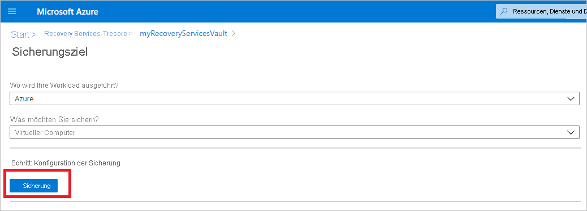
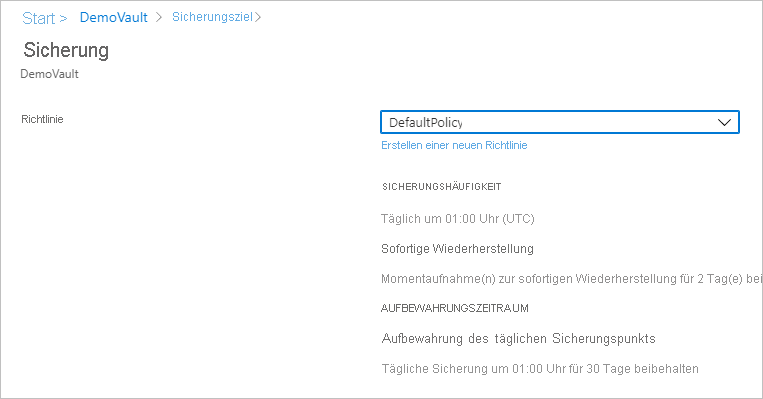
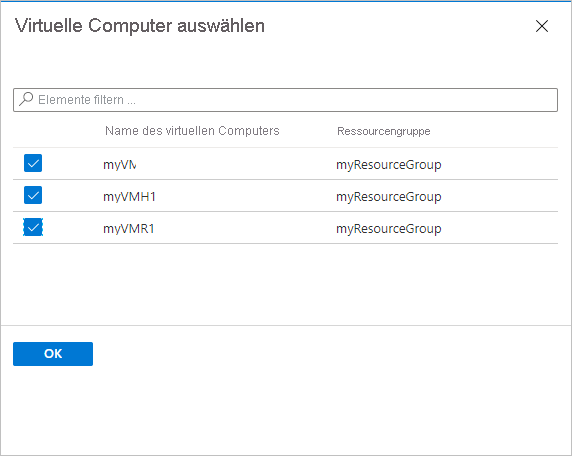
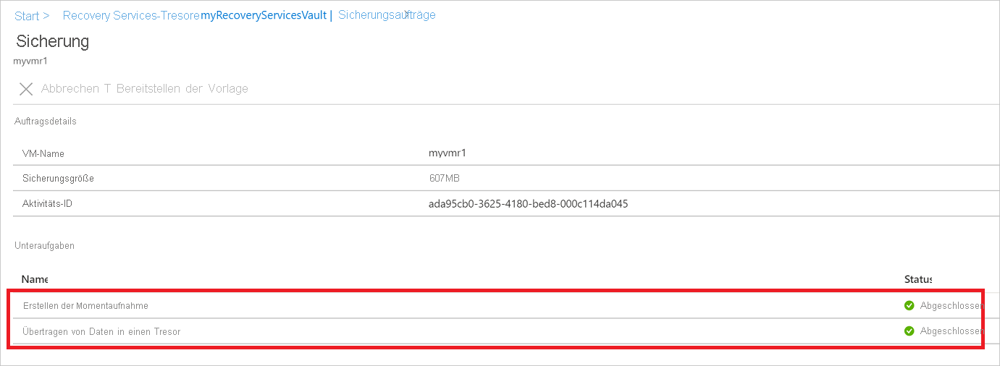

# Sichern virtueller Azure-Computer in einem Recovery Services-Tresor

In diesem Artikel wird beschrieben, wie virtuelle Azure-Computer mit dem [Azure Backup](backup-overview.md)-Dienst in einem Recovery Services-Tresor gesichert werden.

In diesem Artikel werden folgende Vorgehensweisen behandelt:

> [!div class="checklist"]
>
> * Vorbereiten von Azure-VMs
> * Erstellen eines Tresors.
> * Ermitteln Sie VMs, und konfigurieren Sie eine Sicherungsrichtlinie.
> * Aktivieren Sie die Sicherung für Azure-VMs.
> * Führen Sie die erste Sicherung durch.

> [!NOTE]
> In diesem Artikel wird beschrieben, wie Sie einen Tresor einrichten und zu sichernde VMs auswählen. Dies ist hilfreich, wenn Sie mehrere VMs sichern möchten. Alternativ können Sie [eine einzelne Azure-VM](backup-azure-vms-first-look-arm.md) direkt aus den VM-Einstellungen heraus sichern.

## Vorbereitung

* [Überprüfen Sie](backup-architecture.md#architecture-built-in-azure-vm-backup) die Architektur für die Azure-VM-Sicherung.
* [Erfahren Sie mehr](backup-azure-vms-introduction.md) über die Azure-VM-Sicherung und die Sicherungserweiterung.
* [Überprüfen Sie die Supportmatrix](backup-support-matrix-iaas.md), bevor Sie die Sicherung konfigurieren.

Darüber hinaus gibt es einige Schritte, die Sie in bestimmten Fällen möglicherweise ausführen müssen:

* **Installieren des VM-Agents auf dem virtuellen Computer:** Azure Backup sichert Azure-VMs durch die Installation einer Erweiterung für den Azure-VM-Agent auf dem Computer. Wenn Ihre VM aus einem Azure Marketplace-Image erstellt wurde, ist der Agent installiert und aktiv. Wenn Sie eine benutzerdefinierte VM erstellen oder einen lokalen Computer migrieren, müssen Sie möglicherweise [den Agent manuell installieren](#install-the-vm-agent).

[!INCLUDE [How to create a Recovery Services vault](../../includes/backup-create-rs-vault.md)]

### Ändern der Speicherreplikation

Tresore verwenden standardmäßig den [georedundanten Speicher (GRS)](../storage/common/storage-redundancy.md).

* Wenn der Tresor Ihr Hauptmechanismus für Sicherungen ist, empfehlen wir die Verwendung von GRS.
* Sie können als kostengünstigere Option [Lokal redundanter Speicher (LRS)](../storage/common/storage-redundancy.md?toc=/azure/storage/blobs/toc.json) verwenden.

Passen Sie die Speicherreplikationstyp wie folgt an:

1. Wählen Sie im neuen Tresor im Abschnitt **Einstellungen** die Option **Eigenschaften** aus.
2. Wählen Sie in **Eigenschaften** unter **Sicherungskonfiguration** die Option **Aktualisieren** aus.
3. Wählen Sie den Speicherreplikationstyp und dann **Speichern** aus.

      

> [!NOTE]
   > Sie können den Speichertyp für die Replikation nicht mehr ändern, nachdem der Tresor eingerichtet wurde und Sicherungselemente enthält. Dazu müssen Sie den Tresor neu erstellen.

## Anwenden einer Sicherungsrichtlinie

Konfigurieren Sie eine Sicherungsrichtlinie für den Tresor.

1. Wählen Sie im Tresor im Abschnitt **Übersicht** die Option **+ Sichern** aus.

   

1. Wählen Sie unter **Sicherungsziel** > **Wo wird Ihre Workload ausgeführt?** die Option **Azure** aus. Wählen Sie für **Was möchten Sie sichern?** die Option **Virtueller Computer** >  **OK** aus. Dadurch wird die VM-Erweiterung im Tresor registriert.

   

1. Wählen Sie unter **Sicherungsrichtlinie** die Richtlinie aus, die dem Tresor zugeordnet werden soll.
    * Die Standardrichtlinie sichert den virtuellen Computer einmal täglich. Die täglichen Sicherungen werden 30 Tage lang aufbewahrt. Momentaufnahmen für die sofortige Wiederherstellung werden zwei Tage lang aufbewahrt.

      

    * Wenn Sie nicht die Standardrichtlinie verwenden möchten, wählen Sie **Neu erstellen** aus, und erstellen Sie eine benutzerdefinierte Richtlinie, wie im nächsten Verfahren beschrieben.

1. Wählen Sie in unter **Virtuelle Computer** die Option **Hinzufügen** aus.

      

1. Der Bereich **Virtuelle Computer auswählen** wird geöffnet. Wählen Sie die VMs aus, die Sie mithilfe der Richtlinie sichern möchten. Klicken Sie anschließend auf **OK**.

   * Die ausgewählten VMs werden überprüft.
   * Sie können nur VMs auswählen, die sich in der gleichen Region wie der Tresor befinden.
   * VMs können nur in einem Tresor gesichert werden.

     

    >[!NOTE]
    > Alle virtuellen Computer in derselben Region und demselben Abonnement wie der Tresor sind zum Konfigurieren der Sicherung verfügbar. Beim Konfigurieren der Sicherung können Sie nach dem Namen des virtuellen Computers und dessen Ressourcengruppe suchen, auch wenn Sie nicht über die erforderliche Berechtigung für diese VMs verfügen. Wenn sich Ihre VM im vorläufig gelöschten Zustand befindet, wird sie in dieser Liste nicht angezeigt. Wenn Sie die VM erneut schützen müssen, müssen Sie warten, bis der Zeitraum für das vorläufige Löschen abgelaufen ist, oder die VM aus der Liste der vorläufig gelöschten Elemente wiederherstellen. Weitere Informationen finden Sie im [Artikel zu vorläufigem Löschen für virtuelle Computer](soft-delete-virtual-machines.md#soft-delete-for-vms-using-azure-portal).

1. Klicken Sie unter **Sicherung** auf **Sicherung aktivieren**. Damit wird die Richtlinie für den Tresor und die VMs bereitgestellt, und die Sicherungserweiterung wird auf dem VM-Agent auf der Azure-VM installiert.

Nach dem Aktivieren der Sicherung:

* Die Sicherungserweiterung wird vom Sicherungsdienst unabhängig davon installiert, ob der virtuelle Computer ausgeführt wird oder nicht.
* Eine erste Sicherung wird gemäß Ihrem Sicherungszeitplan ausgeführt.
* Beachten Sie während der Ausführung von Sicherungen Folgendes:
  * Ein ausgeführter virtueller Computer bietet die größte Chance zum Erfassen eines anwendungskonsistenten Wiederherstellungspunkts.
  * Selbst wenn der virtuelle Computer ausgeschaltet ist, erfolgt jedoch eine Sicherung. Eine derartige VM wird als Offline-VM bezeichnet. In diesem Fall ist der Wiederherstellungspunkt absturzkonsistent.
* Eine explizite ausgehende Verbindung ist nicht erforderlich, um eine Sicherung virtueller Azure-Computer zu ermöglichen.

### Erstellen einer benutzerdefinierten Richtlinie

Wenn Sie ausgewählt haben, eine neue Sicherungsrichtlinie zu erstellen, geben Sie die Richtlinieneinstellungen an.

1. Geben Sie unter **Richtlinienname** einen aussagekräftigen Namen an.
2. Geben Sie unter **Sicherungszeitplan** an, wann Sicherungen erstellt werden sollen. Sie können tägliche oder wöchentliche Sicherungen für Azure-VMs erstellen.
3. Geben Sie unter **Sofortige Wiederherstellung** an, wie lange die Momentaufnahmen lokal für eine sofortige Wiederherstellung beibehalten werden sollen.
    * Bei der Wiederherstellung werden gesicherte Datenträger von virtuellen Computern aus dem Speicher über das Netzwerk an den Speicherort für die Wiederherstellung kopiert. Bei einer sofortigen Wiederherstellung können Sie lokal gespeicherte Momentaufnahmen, die bei einem Sicherungsauftrag erstellt wurden, nutzen, ohne warten zu müssen, bis die Sicherungsdaten in den Tresor übertragen werden.
    * Sie können Momentaufnahmen für die sofortige Wiederherstellung bis zu fünf Tage lang beibehalten. Die Standardeinstellung beträgt zwei Tage.
4. Geben Sie unter **Beibehaltungsdauer** an, wie lange die täglichen oder wöchentlichen Sicherungspunkte beibehalten werden sollen.
5. Geben Sie unter **Aufbewahrung für monatlichen Sicherungspunkt** und **Aufbewahrung für jährlichen Sicherungspunkt** an, ob eine monatliche oder jährliche Sicherung Ihrer täglichen oder wöchentlichen Sicherungen beibehalten werden soll.
6. Wählen Sie **OK** aus, um die Richtlinie zu speichern.

    

> [!NOTE]
   > Azure Backup unterstützt keine automatische Uhrzeitanpassung an die Sommerzeit für die Sicherungen von Azure-VMs. Sicherungsrichtlinien können bei Bedarf – beispielsweise wenn zeitliche Änderungen auftreten – angepasst werden.

## Auslösen der ersten Sicherung

Die erste Sicherung wird entsprechend dem festgelegten Zeitplan ausgeführt; Sie können sie aber auch mit den folgenden Schritten sofort ausführen:

1. Wählen Sie im Tresormenü die Option **Sicherungselemente** aus.
2. Wählen Sie unter **Sicherungselemente** die Option **Virtueller Azure-Computer** aus.
3. Wählen Sie in der Liste **Sicherungselemente** das Auslassungszeichen (...) aus.
4. Wählen Sie **Jetzt sichern** aus.
5. Verwenden Sie unter **Jetzt sichern** den Kalender, um den letzten Tag zur Beibehaltung des Wiederherstellungspunkts auszuwählen. Klicken Sie anschließend auf **OK**.
6. Überwachen Sie die Portalbenachrichtigungen. Sie können den Auftragsstatus im Dashboard des Tresors unter **Sicherungsaufträge** > **In Bearbeitung** überwachen. Je nach Größe Ihrer VM kann das Erstellen der ersten Sicherung einige Zeit dauern.

## Überprüfen des Status des Sicherungsauftrags

Die Sicherungsauftragsdetails jeder VM-Sicherung umfassen zwei Phasen: die Phase **Momentaufnahme** und die Phase **Daten in Tresor übertragen**. 
Die Momentaufnahmephase stellt sicher, dass ein Wiederherstellungspunkt vorhanden ist, der zusammen mit den Datenträgern für die **sofortige Wiederherstellung** gespeichert wird und maximal fünf Tage lang verfügbar ist (abhängig von der vom Benutzer konfigurierten Aufbewahrungsdauer für Momentaufnahmen). In der Phase „Daten in Tresor übertragen“ wird zur langfristigen Aufbewahrung ein Wiederherstellungspunkt im Tresor erstellt. Die Übertragung von Daten in den Tresor beginnt erst nach Abschluss der Momentaufnahmephase.

  

Im Back-End werden zwei **Teilvorgänge** ausgeführt – einer davon für den Front-End-Sicherungsauftrag. Dieser kann im Detailbereich für den **Sicherungsauftrag** überprüft werden, wie hier zu sehen:

  

Die Phase **Daten in Tresor übertragen** kann je nach Datenträgergröße, Änderungen pro Datenträger und verschiedenen anderen Faktoren mehrere Tage dauern.

Der Auftragsstatus kann abhängig von den folgenden Szenarien variieren:

**Momentaufnahme** | **Daten in Tresor übertragen** | **Auftragsstatus**
--- | --- | ---
Abgeschlossen | In Bearbeitung | In Bearbeitung
Abgeschlossen | Ausgelassen | Abgeschlossen
Abgeschlossen | Abgeschlossen | Abgeschlossen
Abgeschlossen | Fehler | Mit Warnung abgeschlossen
Fehler | Fehler | Fehler

Mit dieser Funktion können nun zwei Sicherungen parallel für den gleichen virtuellen Computer ausgeführt werden. In jeder Phase („Momentaufnahme“ und „Daten in Tresor übertragen“) kann jedoch immer nur ein einzelner Teilvorgang ausgeführt werden. Durch diese Entkoppelung werden nun also Szenarien vermieden, in denen ein aktiver Sicherungsauftrag dazu führte, dass die Sicherung des Folgetags nicht erfolgreich war. Bei Sicherungen des Folgetags kann eine Momentaufnahme erstellt und **Daten in Tresor übertragen** übersprungen werden, falls ein Sicherungsauftrag des Vortags aktiv ist.
Der inkrementelle, im Tresor erstellte Wiederherstellungspunkt erfasst sämtliche Änderungen seit dem jüngsten Wiederherstellungspunkt, der im Tresor erstellt wurde. Dies hat keine Auswirkungen auf die Kosten des Benutzers.

## Optionale Schritte

### Installieren des VM-Agents

Azure Backup sichert Azure-VMs durch die Installation einer Erweiterung für den Azure-VM-Agent auf dem Computer. Wenn Ihre VM aus einem Azure Marketplace-Image erstellt wurde, ist der Agent installiert und aktiv. Wenn Sie eine benutzerdefinierte VM erstellen oder einen lokalen Computer migrieren, müssen Sie den Agent möglicherweise manuell installieren, wie in der Tabelle veranschaulicht.

**VM** | **Details**
--- | ---
**Windows** | 1. [Laden Sie die Agent-MSI-Datei herunter, und installieren Sie sie](https://go.microsoft.com/fwlink/?LinkID=394789&clcid=0x409).   2. Für die Installation benötigen Sie Administratorberechtigungen auf dem Computer.   3. Überprüfen Sie die Installation. Klicken Sie auf der VM in *C:\WindowsAzure\Packages* mit der rechten Maustaste auf **WaAppAgent.exe** > **Eigenschaften**. Auf der Registerkarte **Details** sollte mindestens die **Produktversion** 2.6.1198.718 angegeben sein.   Wenn Sie den Agent aktualisieren, stellen Sie sicher, dass keine Sicherungsvorgänge ausgeführt werden, und [installieren Sie den Agent erneut](https://go.microsoft.com/fwlink/?LinkID=394789&clcid=0x409).
**Linux** | Führen Sie die Installation mit einem RPM- oder DEB-Paket aus dem Paketrepository der Distribution durch. Dies ist die bevorzugte Methode zum Installieren und Aktualisieren des Azure Linux-Agents. Das Azure Linux-Agent-Paket wird von allen [unterstützten Distributionsanbietern](../virtual-machines/linux/endorsed-distros.md) in ihre jeweiligen Images und Repositorys integriert. Der Agent steht auf [GitHub](https://github.com/Azure/WALinuxAgent) zur Verfügung, jedoch wird die Installation über GitHub nicht empfohlen.   Wenn Sie den Agent aktualisieren, stellen Sie sicher, dass keine Sicherungsvorgänge ausgeführt werden, und aktualisieren Sie die Binärdateien.

## Nächste Schritte

* Beheben von Problemen mit [Azure-VM-Agents](backup-azure-troubleshoot-vm-backup-fails-snapshot-timeout.md) oder [Azure-VM-Sicherungen](backup-azure-vms-troubleshoot.md).
* [Wiederherstellen](backup-azure-arm-restore-vms.md) virtueller Azure-Computer.
