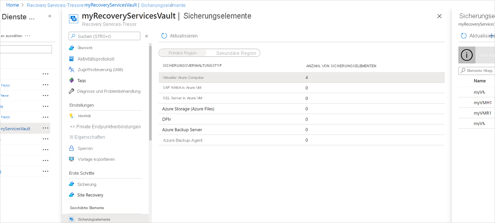
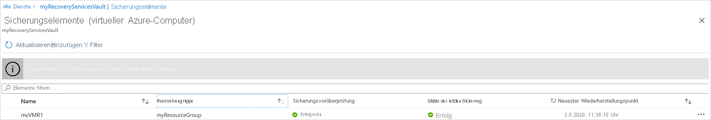
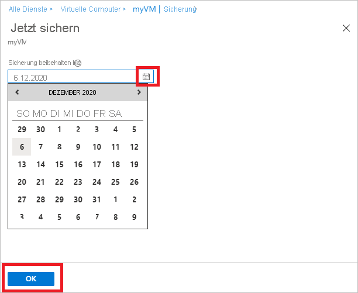

# Verwalten von Azure-VM-Sicherungen mit dem Azure Backup-Dienst

In diesem Artikel erfahren Sie mehr über die Verwaltung von Azure-VMs, die mit dem [Azure Backup-Dienst](backup-overview.md) gesichert wurden. Außerdem werden in diesem Artikel die Sicherungsinformationen auf dem Tresordashboard zusammengefasst.

Im Azure-Portal ermöglicht das Dashboard für den Recovery Services-Tresor den Zugriff auf Informationen zum Tresor, z. B.:

* Die letzte Sicherung, die gleichzeitig der letzte Wiederherstellungspunkt ist.
* Die Sicherungsrichtlinie.
* Die Gesamtgröße aller Sicherungsmomentaufnahmen.
* Die Anzahl von virtuellen Computern, die für die Sicherung aktiviert sind.

Sie können Backups über das Dashboard und durch ein Drilldown auf einzelne virtuelle Computer verwalten. Öffnen Sie den Tresor über das Dashboard, um mit dem Sichern von virtuellen Computern zu beginnen.

## Anzeigen von virtuellen Computern auf dem Dashboard

So zeigen Sie virtuelle Computer auf dem Tresordashboard an:

1. Melden Sie sich beim [Azure-Portal](https://portal.azure.com/) an.
1. Wählen Sie im Menü links **Alle Dienste** aus.

    

1. Geben Sie im Dialogfeld **Alle Dienste** *Recovery Services* ein. Die Liste der Ressourcen wird Ihrer Eingabe entsprechend gefiltert. Wählen Sie in der Liste der Ressourcen **Recovery Services-Tresore** aus.

    

    Die Liste mit den Recovery Services-Tresoren im Abonnement wird angezeigt.

1. Zur einfacheren Handhabung wählen Sie das Symbol „Anheften“ neben Ihrem Tresornamen und dann **An Dashboard anheften** aus.
1. Öffnen Sie das Dashboard des Tresors.

    

1. Wählen Sie auf der Kachel **Sicherungselemente** die Option **Virtueller Azure-Computer** aus.

    

1. Im Bereich **Sicherungselemente** können Sie die Liste der geschützten virtuellen Computer anzeigen. In diesem Beispiel schützt der Tresor einen virtuellen Computer: *myVMR1*.  

    

1. Im Dashboard für Tresorobjekte können Sie Sicherungsrichtlinien ändern, eine On-Demand-Sicherung durchführen, den Schutz von virtuellen Computern beenden und wieder aufnehmen, Sicherungsdaten löschen, Wiederherstellungspunkte anzeigen und eine Wiederherstellung durchführen.

    

## Verwalten der Sicherungsrichtlinie für einen virtuellen Computer

### Ändern der Sicherungsrichtlinie

So ändern Sie eine vorhandene Sicherungsrichtlinie

1. Melden Sie sich beim [Azure-Portal](https://portal.azure.com/) an. Öffnen Sie das Dashboard des Tresors.
2. Wählen Sie unter **Verwalten > Sicherungsrichtlinien** die Sicherungsrichtlinie für den Typ **Virtueller Azure-Computer** aus.
3. Wählen Sie **Ändern** aus, und ändern Sie die Einstellungen.

### Wechseln der Sicherungsrichtlinie

So verwalten Sie eine Sicherungsrichtlinie:

1. Melden Sie sich beim [Azure-Portal](https://portal.azure.com/) an. Öffnen Sie das Dashboard des Tresors.
2. Wählen Sie auf der Kachel **Sicherungselemente** die Option **Virtueller Azure-Computer** aus.

    

3. Im Bereich **Sicherungselemente** können Sie die Liste der geschützten virtuellen Computer und den Status der letzten Sicherung mit der Zeit des letzten Wiederherstellungspunkts anzeigen.

    

4. Auf dem Dashboard für Tresorelemente können Sie eine Sicherungsrichtlinie auswählen.

   * Wählen Sie zum Ändern von Richtlinien eine andere Richtlinie und dann **Speichern** aus. Die neue Richtlinie wird sofort auf den Tresor angewendet.

     

## Ausführen einer On-Demand-Sicherung

Sie können eine On-Demand-Sicherung eines virtuellen Computers ausführen, nachdem Sie dessen Schutz konfiguriert haben. Beachten Sie dabei Folgendes:

* Wenn die erste Sicherung ansteht, erstellt die On-Demand-Sicherung eine vollständige Kopie des virtuellen Computers im Recovery Services-Tresor.
* Nachdem die erste Sicherung durchgeführt wurde, werden bei einer On-Demand-Sicherung nur Änderungen der vorherigen Momentaufnahme an den Recovery Services-Tresor gesendet. Spätere Sicherungen erfolgen also immer inkrementell.
* Die Aufbewahrungsdauer für eine On-Demand Sicherung ist der Aufbewahrungswert, den Sie beim Auslösen des Sicherungsvorgangs festlegen.

> [!NOTE]
> Der Azure Backup-Dienst unterstützt bis zu neun bedarfsgesteuerte Sicherungen pro Tag. Microsoft empfiehlt jedoch nicht mehr als vier bedarfsgesteuerte Sicherungen pro Tag, um eine optimale Leistung zu gewährleisten.

So lösen Sie eine On-Demand-Sicherung aus:

1. Wählen Sie auf dem[Dashboard für die Tresorelemente](#view-vms-on-the-dashboard) unter **Geschütztes Element** die Option **Sicherungselement** aus.

    

2. Wählen Sie unter **Sicherungsverwaltungstyp** die Option **Virtueller Azure-Computer** aus. Der Bereich **Sicherungselemente (Virtueller Azure-Computer)** wird angezeigt.
3. Wählen Sie einen virtuellen Computer und dann **Jetzt sichern** aus, um eine On-Demand-Sicherung zu erstellen. Der Bereich **Jetzt sichern** wird angezeigt.
4. Geben Sie im Feld **Sicherung beibehalten bis** ein Datum ein, bis zu dem die Sicherung beibehalten werden soll.

    

5. Wählen Sie **OK** aus, um die Sicherung auszuführen.

Wählen Sie auf dem Tresordashboard die Kachel **Sicherungsaufträge** aus, um den Auftragsstatus nachzuverfolgen.

## Beenden des Schutzes für eine VM

Sie haben zwei Möglichkeiten, den Schutz einer virtuellen Maschine zu beenden:

* **Schutz beenden und Sicherungsdaten beibehalten**. Mit dieser Option wird der Schutz Ihres virtuellen Computers durch alle zukünftigen Sicherungsaufträge beendet. Der Azure Backup-Dienst behält die bereits gesicherten Wiederherstellungspunkte jedoch bei.  Die Aufbewahrung der Wiederherstellungspunkte im Tresor wird Ihnen in Rechnung gestellt (Einzelheiten finden Sie unter [Azure Backup – Preise](https://azure.microsoft.com/pricing/details/backup/)). Sie können den virtuellen Computer bei Bedarf wiederherstellen. Mit der Option *Sicherung fortsetzen* können Sie bei Bedarf den VM-Schutz fortsetzen.
* **Schutz beenden und Sicherungsdaten löschen**. Mit dieser Option werden alle zukünftigen Sicherungsaufträge zum Schutz Ihres virtuellen Computers beendet und alle Wiederherstellungspunkte gelöscht. Sie können den virtuellen Computer nicht wiederherstellen und auch nicht die Option *Sicherung fortsetzen* verwenden.

>[!NOTE]
>Wenn Sie eine Datenquelle löschen, ohne die Sicherungen zu beenden, treten bei neuen Sicherungen Fehler auf. Alte Wiederherstellungspunkte laufen gemäß der Richtlinie ab. Ein letzter Wiederherstellungspunkt wird jedoch immer beibehalten, bis Sie die Sicherungen beenden und die Daten löschen.
>

### Schutz beenden und Sicherungsdaten beibehalten

So beenden Sie den Schutz eines virtuellen Computers und behalten die Sicherungsdaten bei

1. Wählen Sie auf dem [Dashboard für die Tresorelemente](#view-vms-on-the-dashboard) die Option **Sicherung beenden** aus.
2. Wählen Sie **Sicherungsdaten beibehalten** aus, und bestätigen Sie Ihre Auswahl bei Bedarf. Geben Sie bei Bedarf einen Kommentar ein. Falls Sie den Namen des Elements nicht kennen, zeigen Sie mit dem Cursor auf das Ausrufezeichen, um den Namen anzuzeigen.

    

Sie erhalten einer Benachrichtigung, wenn die Sicherungsaufträge beendet wurden.

### Schutz beenden und Sicherungsdaten löschen

So beenden Sie den Schutz eines virtuellen Computers und löschen die Daten

1. Wählen Sie auf dem [Dashboard für die Tresorelemente](#view-vms-on-the-dashboard) die Option **Sicherung beenden** aus.
2. Wählen Sie **Sicherungsdaten löschen** aus, und bestätigen Sie Ihre Auswahl bei Bedarf. Geben Sie den Namen des Sicherungselements ein, und fügen Sie gegebenenfalls einen Kommentar hinzu.

    

> [!NOTE]
> Nach Abschluss des Löschvorgangs werden die gesicherten Daten 14 Tage lang mit dem [Status „Vorläufig gelöscht“](./soft-delete-virtual-machines.md) aufbewahrt.  Zusätzlich können Sie das [vorläufige Löschen auch aktivieren oder deaktivieren](./backup-azure-security-feature-cloud.md#enabling-and-disabling-soft-delete).

## Fortsetzen des Schutzes einer VM

Wenn Sie beim Beenden des Schutzes des virtuellen Computers die Option [Schutz beenden und Sicherungsdaten beibehalten](#stop-protection-and-retain-backup-data) ausgewählt hatten, können Sie anschließend die Option **Sicherung fortsetzen** verwenden. Diese Option ist nicht verfügbar, wenn Sie [Schutz beenden und Sicherungsdaten löschen](#stop-protection-and-delete-backup-data) oder [Sicherungsdaten löschen](#delete-backup-data) ausgewählt haben.

So setzen Sie den Schutz für einen virtuellen Computer fort:

1. Wählen Sie auf dem [Dashboard für die Tresorelemente](#view-vms-on-the-dashboard) die Option **Sicherung fortsetzen** aus.

2. Führen Sie die Schritte unter [Verwalten von Sicherungsrichtlinien](#manage-backup-policy-for-a-vm) aus, um die Richtlinie für den virtuellen Computer zuzuweisen. Sie müssen nicht die ursprüngliche Schutzrichtlinie des virtuellen Computers auswählen.
3. Wenn Sie die Sicherungsrichtlinie auf dem virtuellen Computer angewendet haben, wird die folgende Meldung angezeigt:

    

## Löschen von Sicherungsdaten

Es gibt zwei Möglichkeiten, die Sicherungsdaten eines virtuellen Computers zu löschen:

* Wählen Sie auf dem Dashboard für die Tresorelemente „Sicherung beenden“ aus, und befolgen Sie die für die Option [Schutz beenden und Sicherungsdaten löschen](#stop-protection-and-delete-backup-data) beschriebenen Anweisungen.

  

* Wählen Sie auf dem Dashboard für die Tresorelemente „Sicherungsdaten löschen“ aus. Diese Option ist aktiviert, wenn Sie beim Beenden des Schutzes des virtuellen Computers die Option [Schutz beenden und Sicherungsdaten beibehalten](#stop-protection-and-retain-backup-data) ausgewählt hatten.

  

  * Wählen Sie auf dem [Dashboard für die Tresorelemente](#view-vms-on-the-dashboard) die Option **Sicherungsdaten löschen** aus.
  * Geben Sie den Namen des Sicherungselements ein, um zu bestätigen, dass Sie die Wiederherstellungspunkte löschen möchten.

    

  * Wählen Sie **Löschen** aus, um die Sicherungsdaten des Elements zu löschen. Sie erhalten einer Benachrichtigung, dass die Sicherungsdaten gelöscht wurden.

Zum Schutz Ihrer Daten bietet Azure Backup ein Feature für vorläufiges Löschen. Beim vorläufigen Löschen werden die Sicherungsdaten auch nach dem Löschen der Sicherung (alle Wiederherstellungspunkte) eines virtuellen Computers 14 weitere Tage lang aufbewahrt. Weitere Informationen finden Sie in der [Dokumentation zum vorläufigen Löschen](./backup-azure-security-feature-cloud.md).

  > [!NOTE]
  > Wenn Sie die Sicherungsdaten löschen, werden alle zugehörigen Wiederherstellungspunkte gelöscht. Sie können keine bestimmten Wiederherstellungspunkte zum Löschen auswählen.

### Sichern eines Elements, bei dem die primäre Datenquelle nicht mehr vorhanden ist

* Wenn für Azure Backup konfigurierte Azure-VMs entweder gelöscht oder verschoben werden, ohne den Schutz zu beenden, schlagen geplante Sicherungsaufträge und bedarfsgesteuerte (Ad-hoc-) Sicherungsaufträge mit dem Fehler „UserErrorVmNotFoundV2“ fehl. Die Vorüberprüfung der Sicherung wird nur bei fehlgeschlagenen bedarfsgesteuerten Sicherungsaufträgen als kritisch angezeigt (fehlerhafte geplante Aufträge werden nicht angezeigt).
* Diese Sicherungselemente bleiben in dem System aktiv, das die vom Benutzer festgelegte Sicherungs-und Aufbewahrungsrichtlinie einhält. Die gesicherten Daten für diese Azure-VMs werden gemäß der Aufbewahrungsrichtlinie beibehalten. Die abgelaufenen Wiederherstellungspunkte (mit Ausnahme des letzten Wiederherstellungspunkts) werden gemäß der Aufbewahrungsdauer bereinigt, die in der Sicherungsrichtlinie festgelegt wurde.
* Benutzern wird empfohlen, Sicherungselemente zu löschen, bei denen die primäre Datenquelle nicht mehr vorhanden ist. Auf diese Weise werden zusätzliche Kosten vermieden, wenn das Sicherungselement oder die Daten für die Löschressourcen nicht mehr benötigt werden, da der letzte Wiederherstellungspunkt dauerhaft beibehalten und dem Benutzer gemäß den geltenden Preisen für die Sicherung eine Gebühr berechnet wird.

## Nächste Schritte

* Erfahren Sie mehr über das [Sichern einer Azure-VM über die VM-Einstellungen](backup-azure-vms-first-look-arm.md).
* Erfahren Sie mehr über das [Wiederherstellen virtueller Azure-Computer](backup-azure-arm-restore-vms.md).
* Erfahren Sie mehr über das [Überwachen von Azure-VM-Sicherungen](./backup-azure-monitoring-built-in-monitor.md).
