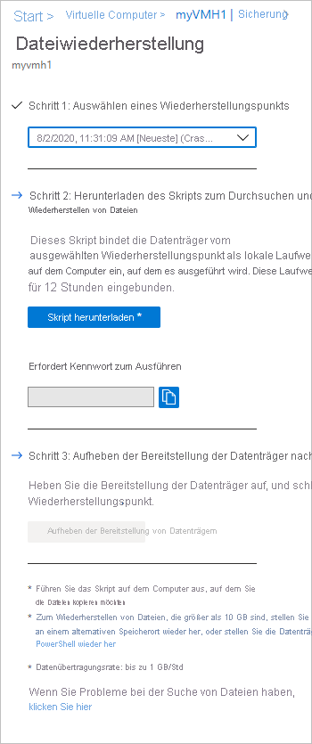

# <a name="recover-files-from-azure-virtual-machine-backup"></a>Wiederherstellen von Dateien aus einer Sicherung von virtuellen Azure-Computern

Azure Backup bietet die Möglichkeit zum Wiederherstellen von [virtuellen Azure-Computern und Datenträgern](./backup-azure-arm-restore-vms.md) aus Azure-VM-Sicherungen, die auch als „Wiederherstellungspunkte“ bezeichnet werden. In diesem Artikel wird die Wiederherstellung von Dateien und Ordnern aus einer Azure-VM-Sicherung erläutert. Das Wiederherstellen von Dateien und Ordnern ist nur für virtuelle Azure-Computer möglich, die mit dem Resource Manager-Modell bereitgestellt wurden und durch einen Recovery Services-Tresor geschützt werden.


> [!NOTE]
> Dies ist für Azure-VMs möglich, die mit dem Resource Manager-Modell bereitgestellt wurden und durch einen Recovery Services-Tresor geschützt werden.
> Die Dateiwiederherstellung aus einer verschlüsselten VM-Sicherung wird nicht unterstützt.
>


## <a name="step-1-generate-and-download-script-to-browse-and-recover-files"></a>Schritt 1: Generieren und Herunterladen des Skripts zum Durchsuchen und Wiederherstellen von Dateien

Zum Wiederherstellen von Dateien oder Ordnern aus dem Wiederherstellungspunkt wechseln Sie zum virtuellen Computer und führen die folgenden Schritte aus:

1. Melden Sie sich am [Azure-Portal](https://portal.Azure.com) an, und wählen Sie im linken Bereich **Virtuelle Computer** aus. Wählen Sie in der Liste der virtuellen Computer den gewünschten virtuellen Computer aus, um sein Dashboard zu öffnen.

2. Wählen Sie im Menü des virtuellen Computers **Sicherung** aus, um das Sicherungsdashboard zu öffnen.

    

3. Wählen Sie im Menü des Sicherungsdashboards **Dateiwiederherstellung** aus.

    

    Das Menü **Dateiwiederherstellung** wird geöffnet.

    

4. Wählen Sie im Dropdownmenü **Wiederherstellungspunkt auswählen** den Wiederherstellungspunkt mit den gewünschten Dateien aus. Standardmäßig ist der letzte Wiederherstellungspunkt bereits ausgewählt.

5. Wählen Sie **Ausführbare Datei herunterladen** (bei virtuellen Microsoft Azure-Computern) oder **Skript herunterladen** (bei virtuellen Linux-Azure-Computern) aus, um die Software zum Kopieren von Dateien aus dem Wiederherstellungspunkt herunterzuladen.

    

    Azure lädt die ausführbare Datei bzw. das Skript auf den lokalen Computer herunter.

    

    Für die Ausführung der ausführbaren Datei oder des Skripts als Administrator wird empfohlen, die heruntergeladene Datei auf Ihrem Computer zu speichern.

6. Die ausführbare Datei bzw. das Skript ist kennwortgeschützt und erfordert ein Kennwort. Wählen Sie im Menü **Dateiwiederherstellung** die Schaltfläche „Kopieren“ aus, um das Kennwort in der Zwischenablage zu speichern.

    


## <a name="step-2-ensure-the-machine-meets-the-requirements-before-executing-the-script"></a>Schritt 2: Sicherstellen, dass der Computer die Anforderungen erfüllt, bevor das Skript ausgeführt wird

Nachdem das Skript erfolgreich heruntergeladen wurde, stellen Sie sicher, dass Sie über den richtigen Computer zum Ausführen dieses Skripts verfügen. Die VM, auf der Sie das Skript ausführen möchten, sollte keine der folgenden nicht unterstützten Konfigurationen aufweisen. Falls doch, wählen Sie einen alternativen Computer aus, vorzugsweise aus derselben Region, der die Anforderungen erfüllt.  

### <a name="dynamic-disks"></a>Dynamische Datenträger

Sie können das ausführbare Skript nicht auf einem virtuellen Computer mit einer der folgenden Eigenschaften ausführen:

- Volumes, die mehrere Datenträger umfassen (übergreifende und Stripesetvolumes).
- Fehlertolerante Volumes (gespiegelte und RAID-5-Volumes) auf dynamischen Datenträgern.

### <a name="windows-storage-spaces"></a>Windows-Speicherplätze

Die heruntergeladene ausführbare Datei kann nicht auf einem virtuellen Computer ausgeführt werden, der für Windows-Speicherplätze konfiguriert ist.

### <a name="virtual-machine-backups-having-large-disks"></a>Sicherungen virtueller Computer mit großen Datenträgern

Wenn der gesicherte Computer über eine große Anzahl von Datenträgern (>16) oder große Datenträger (jeweils >4 TB) verfügt, wird das Ausführen des Skripts auf dem gleichen Computer für die Wiederherstellung nicht empfohlen, da dies erhebliche Auswirkungen auf den virtuellen Computer hat. Stattdessen wird empfohlen, einen separaten virtuellen Computer nur für die Dateiwiederherstellung (Azure VM D2v3-VMs) zu verwenden und ihn dann herunterzufahren, wenn er nicht erforderlich ist. 

## <a name="step-3-os-requirements-to-successfully-run-the-script"></a>Schritt 3: Betriebssystemanforderungen für die erfolgreiche Durchführung des Skripts

Die VM, auf der Sie das heruntergeladene Skript ausführen möchten, muss die folgenden Anforderungen erfüllen.

### <a name="for-windows-os"></a>Für Windows-Betriebssystem

Die folgende Tabelle zeigt die Kompatibilität zwischen Server- und Clientbetriebssystemen. Dateien können nicht in einem vorhergehenden oder künftigen Betriebssystem wiederhergestellt werden. Beispielsweise kann eine Datei von einem virtuellen Windows Server 2016-Computer nicht auf einem Windows Server 2012- oder Windows 8-Computer wiederhergestellt werden. Sie können Dateien von einem virtuellen Computer im gleichen Serverbetriebssystem oder im kompatiblen Clientbetriebssystem wiederherstellen.

|Serverbetriebssystem | Kompatibles Clientbetriebssystem  |
| --------------- | ---- |
| Windows Server 2019    | Windows 10 |
| Windows Server 2016    | Windows 10 |
| Windows Server 2012 R2 | Windows 8.1 |
| Windows Server 2012    | Windows 8  |
| Windows Server 2008 R2 | Windows 7   |

### <a name="for-linux-os"></a>Für Linux-Betriebssystem

Unter Linux muss das Betriebssystem des Computers zum Wiederherstellen von Dateien das Dateisystem des geschützten virtuellen Computers unterstützen. Achten Sie bei der Auswahl eines Computers zum Ausführen des Skripts darauf, dass der Computer über ein kompatibles Betriebssystem verfügt und eine der in folgenden Tabelle angegebenen Versionen verwendet:

|Linux-Betriebssystem | Versionen  |
| --------------- | ---- |
| Ubuntu | ab 12.04 |
| CentOS | ab 6.5  |
| RHEL | ab 6.7 |
| Debian | ab 7 |
| Oracle Linux | ab 6.4 |
| SLES | ab 12 |
| openSUSE | ab 42.2 |

> [!NOTE]
> Es wurden einige Probleme mit der Ausführung des Dateiwiederherstellungsskripts auf Computern mit dem Betriebssystem „SLES 12 SP4“ erkannt. Dies wird derzeit in Zusammenarbeit mit dem SLES-Team untersucht.
> Die Ausführung des Dateiwiederherstellungsskripts funktioniert derzeit auf Computern mit den Betriebssystemen SLES 12 SP2 und SP3.
>

Das Skript erfordert auch, dass Python- und Bash-Komponenten ausgeführt werden und eine sichere Verbindung mit dem Wiederherstellungspunkt herstellen.

|Komponente | Version  |
| --------------- | ---- |
| Bash | ab 4 |
| Python | ab 2.6.6  |
| .NET | 4.6.2 und höher |
| TLS | 1.2 muss unterstützt werden.  |

## <a name="step-4-access-requirements-to-successfully-run-the-script"></a>Schritt 4: Zugriffsanforderungen für die erfolgreiche Durchführung des Skripts

Wenn Sie das Skript auf einem Computer mit eingeschränktem Zugriff ausführen, stellen Sie sicher, dass Zugriff auf Folgendes besteht:

- `download.microsoft.com`
- Recovery Services-URLs („geo-name“ bezieht sich auf die Region, in der sich der Recovery Services-Tresor befindet)
  - `https://pod01-rec2.GEO-NAME.backup.windowsazure.com` (Für öffentliche Azure-Regionen)
  - `https://pod01-rec2.GEO-NAME.backup.windowsazure.cn` (Für Azure China 21Vianet)
  - `https://pod01-rec2.GEO-NAME.backup.windowsazure.us` (für Azure US Government)
  - `https://pod01-rec2.GEO-NAME.backup.windowsazure.de` (für Azure Deutschland)
- Ausgehende Ports 53 (DNS), 443, 3260

> [!NOTE]
>
> Im Namen der Skriptdatei, die Sie in Schritt 1 [weiter oben](#step-1-generate-and-download-script-to-browse-and-recover-files) heruntergeladen haben, ist der **geo-name** enthalten. Verwenden Sie diesen **geo-name** zum Ausfüllen der URL. Der Name des heruntergeladenen Skripts beginnt mit: \'VMname\'\_\'geoname\'_\'GUID\'.<br><br>
> Ein Beispiel: Wenn der Name der Skriptdatei *ContosoVM_wcus_12345678* lautet, ist **wcus** der *geo-name*, und die URL wäre:<br> <https://pod01-rec2.wcus.backup.windowsazure.com>
>

Für Linux benötigt das Skript zum Herstellen der Verbindung mit dem Wiederherstellungspunkt die Komponenten „open-iscsi“ und „lshw“. Wenn die Komponenten auf dem Computer, auf dem das Skript ausgeführt wird, nicht vorhanden sind, wird um die Erlaubnis zum Installieren der Komponenten gebeten. Geben Sie die Zustimmung zur Installation der erforderlichen Komponenten.

Der Zugriff auf `download.microsoft.com` ist erforderlich, um die Komponenten für das Herstellen eines sicheren Kanals zwischen dem Computer, auf dem das Skript ausgeführt wird, und den Daten am Wiederherstellungspunkt herunterzuladen.


## <a name="step-5-running-the-script-and-identifying-volumes"></a>Schritt 5: Ausführen des Skripts und Identifizieren von Volumes

### <a name="for-windows"></a>Für Windows

Nachdem Sie alle in Schritt 2, Schritt 3 und 4 aufgeführten Anforderungen erfüllt haben, kopieren Sie das Skript aus dem heruntergeladenen Speicherort (normalerweise der Ordner „Downloads“), klicken mit der rechten Maustaste auf die ausführbare Datei oder das Skript, und führen es mit Administrator-Anmeldeinformationen aus. Wenn Sie dazu aufgefordert werden, geben Sie das Kennwort ein oder fügen es aus der Zwischenablage ein, und drücken Sie die EINGABETASTE. Nach der Eingabe eines gültigen Kennworts stellt das Skript eine Verbindung mit dem Wiederherstellungspunkt her.

  


Wenn Sie die ausführbare Datei ausführen, stellt das Betriebssystem neue Volumes bereit, denen Laufwerkbuchstaben zugewiesen werden. Über den Windows-Explorer oder Datei-Explorer können Sie zu diesen Laufwerken navigieren. Die den Volumes zugewiesenen Laufwerkbuchstaben entsprechen gegebenenfalls nicht den Buchstaben der ursprünglichen VM. Der Volumename wird jedoch beibehalten. Beispiel: Wenn das Volume auf dem ursprünglichen virtuellen Computer den Namen „Data Disk (E:`\`)“ trug, kann dieses Volume auf dem lokalen Computer als „Data Disk (<Beliebiger Buchstabe>:`\`)“ angefügt werden. Durchsuchen Sie alle in der Skriptausgabe erwähnten Volumes, bis Sie Ihre Dateien oder Ordner gefunden haben.  

   

#### <a name="for-backed-up-vms-with-large-disks-windows"></a>Für gesicherte VMs mit großen Datenträgern (Windows)

Wenn die Dateiwiederherstellung nicht mehr reagiert, nachdem Sie das Skript zur Dateiwiederherstellung ausgeführt haben (wenn z. B. die Datenträger nicht eingebunden werden, oder sie werden eingebunden, aber die Volumes werden nicht angezeigt), führen Sie die folgenden Schritte aus:
  
1. Stellen Sie sicher, dass das Betriebssystem Windows Server 2012 oder höher ist.
2. Stellen Sie sicher, dass die Registrierungsschlüssel auf dem Wiederherstellungsserver wie unten vorgeschlagen festgelegt sind, und starten Sie den Server neu. Die Zahl neben der GUID kann zwischen 0001 und 0005 liegen. Im folgenden Beispiel lautet sie 0004. Navigieren Sie im Registrierungsschlüsselpfad zum Abschnitt mit den Parametern.

    

```registry
- HKEY_LOCAL_MACHINE\SYSTEM\CurrentControlSet\Services\Disk\TimeOutValue – change this from 60 to 1200
- HKEY_LOCAL_MACHINE\SYSTEM\ControlSet001\Control\Class\{4d36e97b-e325-11ce-bfc1-08002be10318}\0003\Parameters\SrbTimeoutDelta – change this from 15 to 1200
- HKEY_LOCAL_MACHINE\SYSTEM\ControlSet001\Control\Class\{4d36e97b-e325-11ce-bfc1-08002be10318}\0003\Parameters\EnableNOPOut – change this from 0 to 1
- HKEY_LOCAL_MACHINE\SYSTEM\ControlSet001\Control\Class\{4d36e97b-e325-11ce-bfc1-08002be10318}\0003\Parameters\MaxRequestHoldTime - change this from 60 to 1200
```

### <a name="for-linux"></a>Für Linux

Für Linux-Computer wird ein Python-Skript generiert. Laden Sie das Skript herunter, und kopieren Sie es auf den relevanten/kompatiblen Linux-Server. Für die Ausführung mit ```chmod +x <python file name>``` müssen möglicherweise die Berechtigungen geändert werden. Führen Sie die Python-Datei anschließend mit ```./<python file name>``` aus.


Unter Linux werden die Volumes des Wiederherstellungspunkts im Ordner bereitgestellt, in dem das Skript ausgeführt wird. Die angefügten Datenträger, Volumes und entsprechenden Bereitstellungspfade werden entsprechend angezeigt. Diese Bereitstellungspfade werden Benutzern mit der Berechtigung „root“ angezeigt. Durchsuchen Sie die Volumes in der Ausgabe des Skripts.

  


#### <a name="for-backed-up-vms-with-large-disks-linux"></a>Für gesicherte VMs mit großen Datenträgern (Linux)**

Wenn die Dateiwiederherstellung nicht mehr reagiert, nachdem Sie das Skript zur Dateiwiederherstellung ausgeführt haben (wenn z. B. die Datenträger nicht eingebunden werden, oder sie werden eingebunden, aber die Volumes werden nicht angezeigt), führen Sie die folgenden Schritte aus:

1. Ändern Sie in der Datei „/etc/iscsi/iscsid.conf“ die Einstellung:
    - `node.conn[0].timeo.noop_out_timeout = 5` in `node.conn[0].timeo.noop_out_timeout = 120`
2. Nachdem Sie die obigen Änderung vorgenommen haben, führen Sie das Skript erneut aus. Wenn vorübergehende Fehler auftreten, stellen Sie sicher, dass zwischen den erneuten Ausführungen eine Lücke von 20 bis 30 Minuten besteht, um aufeinander folgende Bursts von Anforderungen zu vermeiden, die die Zielvorbereitung beeinträchtigen. Dieses Intervall zwischen erneuten Ausführungen stellt sicher, dass das Ziel für die Verbindung mit dem Skript bereit ist.
3. Wechseln Sie nach der Dateiwiederherstellung unbedingt zurück zum Portal, und wählen Sie dort für die Wiederherstellungspunkte, bei denen Sie keine Volumes einbinden konnten, **Einbindung von Datenträgern aufheben** aus. Mit diesem Schritt werden alle vorhandenen Prozesse/Sitzungen bereinigt, und die Wahrscheinlichkeit für eine Wiederherstellung steigt.


#### <a name="lvmraid-arrays-for-linux-vms"></a>LVM/RAID-Arrays (für virtuelle Linux-Computer)

Unter Linux werden LVM- bzw. softwaregestützte RAID-Arrays (LVM: Logical Volume Manager) zum Verwalten logischer Volumes verwendet, die sich über mehrere Datenträger erstrecken. Wenn der geschützte virtuelle Linux-Computer mit LVM- bzw. RAID-Arrays arbeitet, kann das Skript nicht auf diesem virtuellen Computer ausgeführt werden.<br>
Führen Sie das Skript stattdessen auf einem anderen Computer mit kompatiblem Betriebssystem und Unterstützung des Dateisystems des geschützten Computers aus.<br>
Die folgende Ausgabe des Skripts zeigt die Datenträger und Volumes des LVM- bzw. RAID-Arrays samt Partitionstyp.

   

Führen Sie die Befehle in den folgenden Abschnitten aus, um diese Partitionen online zu schalten.

#### <a name="for-lvm-partitions"></a>Für LVM-Partitionen

Sobald das Skript ausgeführt wird, werden die LVM-Partitionen in die in der Skriptausgabe angegebenen physischen Volumes/Datenträger bereitgestellt. Der Vorgang besteht darin,

1. die eindeutigen Liste der Volumegruppennamen von den physischen Volumes oder Datenträgern abzurufen
2. anschließend die logischen Volumes in diesen Volumegruppen aufzulisten
3. Anschließend können Sie die logischen Volumes unter einem gewünschten Pfad bereitstellen.

##### <a name="listing-volume-group-names-from-physical-volumes"></a>Auflisten von Volumegruppennamen von physischen Volumes

So listen Sie die Volumegruppennamen auf

```bash
pvs -o +vguuid
```

Dieser Befehl listet alle physischen Volumes (einschließlich derjenigen, die vor der Ausführung des Skripts vorhanden waren), deren entsprechende Volumegruppennamen und die eindeutigen Benutzer-IDs (UUIDs) der Datenträgergruppe auf. Ein Beispiel für die Ausgabe des Befehls sehen Sie unten.

```bash
PV         VG        Fmt  Attr PSize   PFree    VG UUID

  /dev/sda4  rootvg    lvm2 a--  138.71g  113.71g EtBn0y-RlXA-pK8g-de2S-mq9K-9syx-B29OL6

  /dev/sdc   APPvg_new lvm2 a--  <75.00g   <7.50g njdUWm-6ytR-8oAm-8eN1-jiss-eQ3p-HRIhq5

  /dev/sde   APPvg_new lvm2 a--  <75.00g   <7.50g njdUWm-6ytR-8oAm-8eN1-jiss-eQ3p-HRIhq5

  /dev/sdf   datavg_db lvm2 a--   <1.50t <396.50g dhWL1i-lcZS-KPLI-o7qP-AN2n-y2f8-A1fWqN

  /dev/sdd   datavg_db lvm2 a--   <1.50t <396.50g dhWL1i-lcZS-KPLI-o7qP-AN2n-y2f8-A1fWqN
```

In der ersten Spalte (PV) wird das physische Volume angezeigt, in den folgenden Spalten die entsprechenden Volumengruppennamen, das Format, die Attribute, die Größe, den freien Speicherplatz und die eindeutige ID der Volumengruppe. Die Befehlsausgabe zeigt alle physischen Volumen an. Schauen Sie sich die Skriptausgabe an, und identifizieren Sie die im Zusammenhang mit der Sicherung verwendeten Volumes. Im obigen Beispiel würde die Skriptausgabe „/dev/sdf“ und „/dev/sdd“ anzeigen. Somit gehört die Volumegruppe *datavg_db* zu Skript und die Volumegruppe *Appvg_new* zum Computer. Letztlich besteht die Idee darin, sicherzustellen, dass ein eindeutiger Volumegruppenname eine eindeutige ID aufweist.

###### <a name="duplicate-volume-groups"></a>Doppelte Volumegruppen

Es gibt Szenarien, in denen Volumegruppennamen nach Ausführung des Skripts 2 UUIDs aufweisen können. Das bedeutet, dass die Volumegruppennamen im Computer, auf dem das Skript ausgeführt wird, und auf der gesicherten VM identisch sind. Dann müssen die gesicherten VM-Volumegruppen umbenannt werden. Betrachten Sie das Beispiel unten.

```bash
PV         VG        Fmt  Attr PSize   PFree    VG UUID

  /dev/sda4  rootvg    lvm2 a--  138.71g  113.71g EtBn0y-RlXA-pK8g-de2S-mq9K-9syx-B29OL6

  /dev/sdc   APPvg_new lvm2 a--  <75.00g   <7.50g njdUWm-6ytR-8oAm-8eN1-jiss-eQ3p-HRIhq5

  /dev/sde   APPvg_new lvm2 a--  <75.00g   <7.50g njdUWm-6ytR-8oAm-8eN1-jiss-eQ3p-HRIhq5

  /dev/sdg   APPvg_new lvm2 a--  <75.00g  508.00m lCAisz-wTeJ-eqdj-S4HY-108f-b8Xh-607IuC

  /dev/sdh   APPvg_new lvm2 a--  <75.00g  508.00m lCAisz-wTeJ-eqdj-S4HY-108f-b8Xh-607IuC

  /dev/sdm2  rootvg    lvm2 a--  194.57g  127.57g efohjX-KUGB-ETaH-4JKB-MieG-EGOc-XcfLCt
```

Die Skriptausgabe würde „/dev/sdg“, „/dev/sdh“, „/dev/sdm2“ als angefügt anzeigen. Folglich sind die entsprechenden Volumegruppenname „Appvg_new“ und „rootvg“. Die gleichen Namen sind aber auch in der Volumegruppenliste des Computers enthalten. Sie können überprüfen, ob ein Volumegruppenname zwei UUIDs aufweist.

Nun müssen Sie zum Beispiel Volumegruppennamen für skriptbasierte Volumes umbenennen: „/dev/sdg“, „/dev/sdh“, „/dev/sdm2“. Verwenden Sie den folgenden Befehl, um die Volumegruppe umzubenennen.

```bash
vgimportclone -n rootvg_new /dev/sdm2
vgimportclone -n APPVg_2 /dev/sdg /dev/sdh
```

Jetzt weisen alle Volumegruppennamen eindeutige IDs auf.

###### <a name="active-volume-groups"></a>Aktive Volumegruppen

Stellen Sie sicher, dass die Volumegruppen, die den Skriptvolumes entsprechen, aktiv sind. Mit dem folgenden Befehl können Sie aktive Volumegruppen anzeigen. Prüfen Sie, ob die zugehörigen Volumegruppen des Skripts in dieser Liste vorhanden sind.

```bash
vgdisplay -a
```  

Verwenden Sie andernfalls den folgenden Befehl, um die Volumegruppe zu aktivieren.

```bash
#!/bin/bash
vgchange –a y  <volume-group-name>
```

##### <a name="listing-logical-volumes-within-volume-groups"></a>Auflisten logischer Volumes in Volumegruppen

Sobald Sie die eindeutige, aktive Liste der mit dem Skript verbundenen Volumegruppen abgerufen haben, können Sie die in diesen Volumegruppen vorhandenen logischen Volumes mit dem folgenden Befehl auflisten.

```bash
#!/bin/bash
lvdisplay <volume-group-name>
```

Mit diesem Befehl wird der Pfad der einzelnen logischen Volumes als „LV Path“ angezeigt.

##### <a name="mounting-logical-volumes"></a>Bereitstellen logischer Volumes

Hiermit werden die logischen Volumes im Pfad Ihrer Wahl bereitgestellt:

```bash
#!/bin/bash
mount <LV path from the lvdisplay cmd results> </mountpath>
```

> [!WARNING]
> Verwenden Sie nicht „mount -a“. Mit diesem Befehl werden alle in „/etc/fstab“ beschriebenen Geräte bereitgestellt. Dies könnte bedeuten, dass doppelte Geräte bereitgestellt werden. Daten können auf per Skript erstellte Geräte umgeleitet werden, auf denen die Daten nicht persistent sind, sodass Datenverluste auftreten können.

#### <a name="for-raid-arrays"></a>Für RAID-Arrays

Mit dem folgenden Befehl werden Details zu allen RAID-Datenträgern angezeigt:

```bash
#!/bin/bash
mdadm –detail –scan
```

 Der entsprechende RAID-Datenträger wird als `/dev/mdm/<RAID array name in the protected VM>` angezeigt.

Verwenden Sie den Befehl „mount“, wenn der RAID-Datenträger physische Volumes hat:

```bash
#!/bin/bash
mount [RAID Disk Path] [/mountpath]
```

Wenn auf dem RAID-Laufwerk eine andere LVM konfiguriert ist, führen Sie das vorhergehende Verfahren für LVM-Partitionen durch, verwenden aber der Volumenamen anstelle des Namens des RAID-Datenträgers.

## <a name="step-6-closing-the-connection"></a>Schritt 6: Schließen der Verbindung

Nachdem die Dateien bestimmt und an den lokalen Speicherort kopiert wurden, können Sie die zusätzlichen Laufwerke entfernen (oder ihre Bereitstellung aufheben). Zum Aufheben der Bereitstellung der Laufwerke wählen Sie im Azure-Portal im Menü **Dateiwiederherstellung** die Option **Bereitstellung der Datenträger aufheben** aus.


Nachdem die Bereitstellung der Datenträger aufgehoben wurde, erhalten Sie eine Meldung. Die Aktualisierung der Verbindung kann einige Minuten dauern, sodass Sie die Datenträger entfernen können.

Nachdem unter Linux die Verbindung mit dem Wiederherstellungspunkt getrennt wurde, entfernt das Betriebssystem die entsprechenden Bereitstellungspfade nicht automatisch. Diese sind als „verwaiste“ Volumes vorhanden und sichtbar, lösen aber einen Fehler aus, wenn ein Zugriff bzw. Schreibzugriff auf die Dateien erfolgt. Sie können manuell entfernt werden. Das Skript ermittelt bei seiner Ausführung solche Volumes von vorherigen Wiederherstellungspunkten und bereinigt diese nach Zustimmung.

> [!NOTE]
> Stellen Sie sicher, dass die Verbindung geschlossen wird, nachdem die erforderlichen Dateien wiederhergestellt wurden. Das ist wichtig, insbesondere in dem Szenario, in dem der Computer, auf dem das Skript ausgeführt wird, auch für die Sicherung konfiguriert ist. Bleibt die Verbindung offen, kann bei der nachfolgenden Sicherung der Fehler „UserErrorUnableToOpenMount“ auftreten. Dies geschieht, da davon ausgegangen wird, dass die eingebundenen Laufwerke/Volumes verfügbar sind. Wenn auf sie zugegriffen wird, kann ein Fehler auftreten, da der zugrunde liegende Speicher, d. h. der iSCSI-Zielserver, möglicherweise nicht verfügbar ist. Wenn Sie die Verbindung bereinigen, werden diese Laufwerke/Volumes entfernt, sodass sie während der Sicherung nicht mehr verfügbar sind.

## <a name="security"></a>Sicherheit

In diesem Abschnitt werden die verschiedenen Sicherheitsmaßnahmen für die Implementierung der Dateiwiederherstellung aus Azure-VM-Sicherungen beschrieben.

### <a name="feature-flow"></a>Ablauf des Features

Dieses Feature wurde für den Zugriff auf VM-Daten in möglichst wenigen Schritten entwickelt, ohne die Wiederherstellung der gesamten VM oder der gesamten VM-Datenträger zu erfordern. Der Zugriff auf die VM-Daten wird mithilfe eines Skripts gewährt (das das Wiederherstellungsvolume wie im Folgenden veranschaulicht einbindet), und dies bildet den Eckpfeiler aller Sicherheitsimplementierungen:

  

### <a name="security-implementations"></a>Sicherheitsimplementierungen

#### <a name="select-recovery-point-who-can-generate-script"></a>Auswählen des Wiederherstellungspunkts (der Skripts generieren kann)

Das Skript stellt den Zugriff auf VM-Daten bereit. Deshalb ist es wichtig, zu regulieren, wer es überhaupt erstellen kann. Sie müssen sich mit einem [Azure RBAC-autorisierten](backup-rbac-rs-vault.md#mapping-backup-built-in-roles-to-backup-management-actions) Konto beim Azure-Portal anmelden, um das Skript zu generieren.

Für die Dateiwiederherstellung ist die gleiche Autorisierung erforderlich wie für die VM- und Datenträgerwiederherstellung. Das heißt, nur autorisierte Benutzer können die VM-Daten anzeigen und das Skript generieren.

Das generierte Skript wird mit dem offiziellen Microsoft-Zertifikat für den Azure Backup-Dienst signiert. Jede Manipulation des Skripts macht die Signatur ungültig und jeder Versuch, das Skript auszuführen, wird vom Betriebssystem als potenzielles Risiko gemeldet.

#### <a name="mount-recovery-volume-who-can-run-script"></a>Einbinden des Wiederherstellungsvolumes (Wer Skripts ausführen kann)

Nur Administratoren können das Skript ausführen. Es sollte im Modus mit erhöhten Rechten ausgeführt werden. Das Skript führt nur vorab generierte Schritte aus und akzeptiert keine Eingaben aus externen Quellen.

Zum Ausführen des Skripts ist ein Kennwort erforderlich, das nur dem autorisierten Benutzer angezeigt wird, wenn das Skript im Azure-Portal oder in PowerShell bzw. in der Befehlszeilenschnittstelle generiert wird. Hiermit wird sichergestellt, dass der autorisierte Benutzer, der das Skript herunterlädt, auch für das Ausführen des Skripts verantwortlich ist.

#### <a name="browse-files-and-folders"></a>Durchsuchen von Dateien und Ordnern

Zum Durchsuchen von Dateien und Ordnern verwendet das Skript den iSCSI-Initiator auf dem Computer und stellt eine Verbindung mit dem Wiederherstellungspunkt her, der als iSCSI-Ziel konfiguriert ist. Hier können Sie sich Szenarien vorstellen, in denen jemand versucht eine bzw. alle der Komponenten zu imitieren/fälschen.

Ein Mechanismus für eine gegenseitige CHAP-Authentifizierung wird verwendet, damit sich die Komponenten gegenseitig authentifizieren. Aus diesem Grund ist es sehr schwierig, eine Verbindung zwischen einem gefälschten Initiator und dem iSCSI-Ziel oder eine Verbindung zwischen einem gefälschten Ziel und dem Computer herzustellen, auf dem das Skript ausgeführt wird.

Der Datenfluss zwischen dem Wiederherstellungsdienst und dem Computer wird mithilfe eines sicheren TLS-Tunnels über TCP geschützt (auf dem Computer, auf dem das Skript ausgeführt wird, [sollte TLS 1.2 unterstützt werden](#step-3-os-requirements-to-successfully-run-the-script)).

Alle Zugriffssteuerungslisten (ACL) für Dateien, die auf der übergeordneten/gesicherten VM vorhanden sind, werden ebenfalls im eingebundenen Dateisystem gespeichert.

Das Skript erteilt einem Wiederherstellungspunkt schreibgeschützten Zugriff und ist 12 Stunden lang gültig. Wenn Sie den Zugriff früher entfernen möchten, müssen Sie sich beim Azure-Portal, bei PowerShell oder bei der Befehlszeilenschnittstelle anmelden und die **Einbindung von Datenträgern für diesen Wiederherstellungspunkt aufheben**. Daraufhin wird das Skript sofort ungültig.


## <a name="next-steps"></a>Nächste Schritte

- Erfahren Sie mehr über das [Wiederherstellen von Dateien mit PowerShell](./backup-azure-vms-automation.md#restore-files-from-an-azure-vm-backup).
- Erfahren Sie mehr über das [Wiederherstellen von Dateien mit Azure CLI](./tutorial-restore-files.md).
- Nachdem die VM wiederhergestellt wurde, lesen Sie, wie Sie [Sicherungen verwalten](./backup-azure-manage-vms.md).
