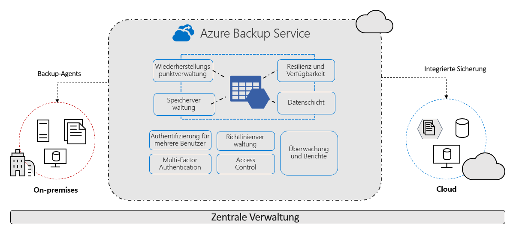

# Worum handelt es sich beim Azure Backup-Dienst?

Der Azure Backup-Dienst bietet einfache, sichere und kostengünstige Lösungen, um Ihre Daten zu sichern und aus der Microsoft Azure-Cloud wiederherzustellen.

> [!VIDEO https://www.youtube.com/embed/elODShatt-c]

## Was kann gesichert werden?

- **Lokal:** Sichern Sie Dateien, Ordner und den Systemstatus mit dem [Microsoft Azure Recovery Services-Agent (MARS](backup-support-matrix-mars-agent.md)). Alternativ können Sie den DPM- oder Azure Backup Server-Agent (MABS) verwenden, um lokale VMs ([Hyper-V](back-up-hyper-v-virtual-machines-mabs.md) und [VMware](backup-azure-backup-server-vmware.md)) und andere [lokale Workloads](backup-mabs-protection-matrix.md) zu schützen.
- **Azure-VMs** - [Sichern Sie vollständige Windows-/Linux-VMs](backup-azure-vms-introduction.md) (mit Sicherungserweiterungen) oder Dateien, Ordner und den Systemstatus mit dem [MARS-Agent](backup-azure-manage-mars.md).
- **Azure Files-Freigaben** - [Sichern Sie Azure Files-Freigaben in einem Speicherkonto.](backup-afs.md)
- **SQL Server auf Azure-VMs:**  -  [Sichern Sie auf Azure-VMs ausgeführte SQL Server-Datenbanken.](backup-azure-sql-database.md)
- **SAP HANA-Datenbanken auf Azure-VMs** - [Sichern Sie auf Azure-VMs ausgeführte SAP HANA-Datenbanken.](backup-azure-sap-hana-database.md)
- **Azure Database for PostgreSQL-Server (Vorschau)**  -  [Sichern Sie Azure PostgreSQL-Datenbanken, und bewahren Sie die Sicherungen für bis zu zehn Jahre auf.](backup-azure-database-postgresql.md)

## Gründe für Azure Backup

Azure Backup bietet im Wesentlichen folgende Vorteile:

- **Auslagerung lokaler Sicherungen:** Azure Backup bietet eine einfache Lösung, mit der Sie Ihre lokalen Ressourcen in der Cloud sichern können. Mit Azure Backup erhalten Sie kurz- und langfristige Sicherungen, ohne komplexe lokale Sicherungslösungen einrichten zu müssen.
- **Sicherung virtueller Azure-IaaS-Computer:** Azure Backup bietet unabhängige und isolierte Sicherungen zum Schutz vor dem versehentlichen Löschen von Originaldaten. Sicherungen werden in einem Recovery Services-Tresor mit integrierter Verwaltung von Wiederherstellungspunkten gespeichert. Konfiguration und Skalierung sind unkompliziert. Sicherungen werden außerdem optimiert und können bei Bedarf problemlos wiederhergestellt werden.
- **Unkomplizierte Skalierung:** Dank der Leistung und unbegrenzten Skalierbarkeit der Azure-Cloud bietet Azure Backup Hochverfügbarkeit ohne Wartungs- oder Überwachungsaufwand.
- **Unbegrenzte Datenübertragungen:** Die Menge an übertragenen ein- oder ausgehenden Daten wird von Azure Backup nicht beschränkt, und es fallen keine Kosten für die übertragenen Daten an.
  - Ausgehende Daten sind Daten, die während eines Wiederherstellungsvorgangs aus einem Recovery Services-Tresor übertragen werden.
  - Wenn Sie mit dem Azure Import/Export-Dienst eine erste Sicherung im Offlinemodus ausführen, um große Datenmengen zu importieren, fallen Kosten für eingehende Daten an.  [Weitere Informationen](backup-azure-backup-import-export.md)
- **Datenschutz:** Azure Backup bietet Lösungen zur Sicherung von Daten [während der Übertragung](backup-azure-security-feature.md) und [im Ruhezustand](backup-azure-security-feature-cloud.md).
- **Zentrale Überwachung und Verwaltung**: Azure Backup stellt [integrierte Überwachungs-und Warnungsfunktionen](backup-azure-monitoring-built-in-monitor.md) in einem Recovery Services-Tresor bereit. Diese Funktionen sind ohne zusätzliche Verwaltungsinfrastruktur verfügbar. Sie können den Umfang Ihrer Überwachung und Berichterstellung auch mit [Azure Monitor](backup-azure-monitoring-use-azuremonitor.md) erweitern.
- **Anwendungskonsistente Sicherungen:** Eine anwendungskonsistente Sicherung bedeutet, dass ein Wiederherstellungspunkt alle erforderlichen Daten zum Wiederherstellen der Sicherungskopie enthält. Azure Backup umfasst anwendungskonsistente Sicherungen, sodass sichergestellt ist, dass zum Wiederherstellen der Daten keine zusätzlichen Fixes benötigt werden. Durch die Wiederherstellung von anwendungskonsistenten Daten wird die Wiederherstellungsdauer reduziert, sodass Sie schnell zum Zustand der normalen Ausführung zurückkehren können.
- **Kurz- und Langzeitaufbewahrung von Daten:** Sie können [Recovery Services-Tresore](backup-azure-recovery-services-vault-overview.md) für die kurz- und langfristige Datenaufbewahrung verwenden.
- **Automatische Speicherverwaltung**: Für Hybridumgebungen ist häufig heterogener Speicher erforderlich – teilweise lokal und teilweise in der Cloud. Bei Azure Backup fallen keine Kosten für die Verwendung von lokalen Speichergeräten an. Azure Backup sorgt im Rahmen eines Modells mit nutzungsbasierter Bezahlung für die automatische Zuteilung und Verwaltung von Sicherungsspeicher. Sie zahlen daher nur für den Speicher, den Sie nutzen. [Erfahren Sie mehr](https://azure.microsoft.com/pricing/details/backup) zu den Preisen.
- **Mehrere Speicheroptionen:** Azure Backup bietet zwei Replikationsarten, um die Hochverfügbarkeit Ihres Speichers bzw. Ihrer Daten sicherzustellen.
  - [Lokal redundanter Speicher (Locally Redundant Storage, LRS)](../storage/common/storage-redundancy.md#locally-redundant-storage) repliziert Ihre Daten dreimal in einer Speicherskalierungseinheit in einem Datencenter. (Es werden also drei Kopien Ihrer Daten erstellt.) Alle Kopien der Daten befinden sich in derselben Region. LRS ist eine kostengünstige Möglichkeit, um Daten vor lokalen Hardwarefehlern zu schützen.
  - [Geografisch redundanter Speicher (Geo-Redundant Storage, GRS)](../storage/common/storage-redundancy.md#geo-redundant-storage) ist die standardmäßige und empfohlene Replikationsoption. GRS repliziert Ihre Daten in einer sekundären Region, die mehrere hundert Kilometer vom primären Speicherort der Quelldaten entfernt ist. GRS führt zu höheren Kosten als LRS, bietet aber eine höhere Dauerhaftigkeit Ihrer Daten (auch im Falle eines regionalen Ausfalls).
  - [Zonenredundanter Speicher (ZRS)](../storage/common/storage-redundancy.md#zone-redundant-storage) repliziert Ihre Daten in [Verfügbarkeitszonen](https://docs.microsoft.com/azure/availability-zones/az-overview#availability-zones) und gewährleistet dadurch Data Residency und Resilienz in derselben Region. Bei ZRS gibt es keine Downtime. Daher können Ihre kritischen Workloads, die [Data Residency](https://azure.microsoft.com/resources/achieving-compliant-data-residency-and-security-with-azure/) erfordern und für die keine Downtime auftreten darf, in ZRS gesichert werden.

## Nächste Schritte

- Machen Sie sich [hier](backup-architecture.md) mit der Architektur und den Komponenten für verschiedene Sicherungsszenarien vertraut.
- [Überprüfen Sie die](backup-support-matrix.md) Unterstützungsanforderungen und Einschränkungen für Azure Backup und für die [Sicherung virtueller Computer](backup-support-matrix-iaas.md).
