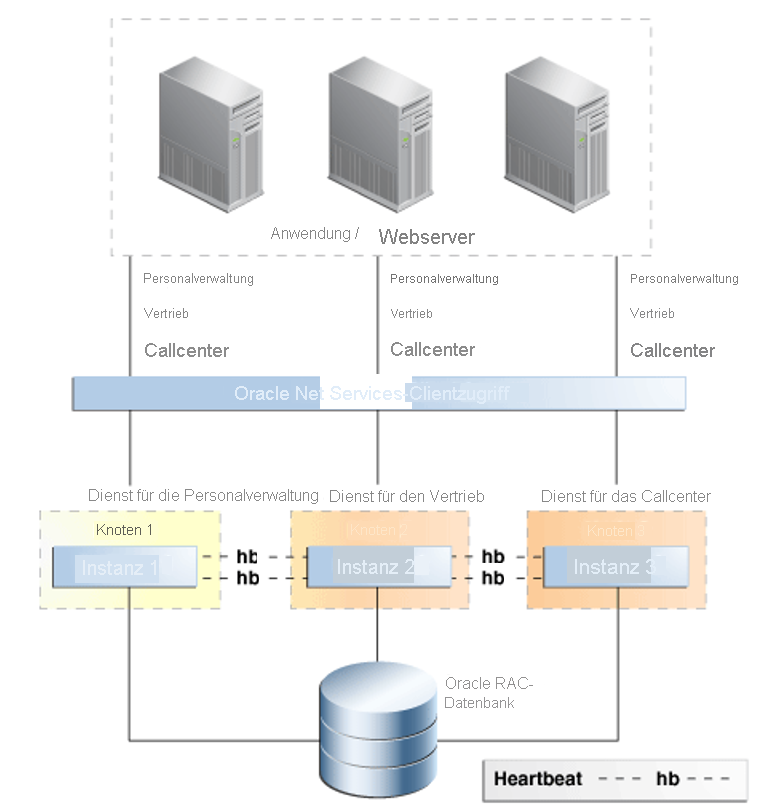

# Hochverfügbarkeitsfeatures für Oracle in Azure BareMetal

In diesem Artikel werden die wichtigsten Features für Hochverfügbarkeit und Notfallwiederherstellung von Oracle behandelt.

Oracle bietet zahlreiche Features für die Erstellung einer resilienten Plattform zum Ausführen von Oracle-Datenbanken. Es gibt kein Einzelfeature, dass jede Art von Ausfall abdeckt. Die Kombination von Technologien auf mehreren Ebenen ermöglicht jedoch die Erstellung eines hochverfügbaren Systems. Nicht jedes Feature ist erforderlich, um die Verfügbarkeit zu gewährleisten. Durch die Kombination von Strategien erzielen Sie jedoch den bestmöglichen Schutz vor diversen möglichen Ausfällen. 

## Flashback Database

Das Feature [Flashback Database](https://docs.oracle.com/en/database/oracle/oracle-database/21/rcmrf/FLASHBACK-DATABASE.html#GUID-584AC79A-40C5-45CA-8C63-DED3BE3A4511) ist in Oracle Database Enterprise Edition enthalten. Mit Flashback Database lässt sich die Datenbank auf einen bestimmten Zeitpunkt zurücksetzen. Dieses Feature unterscheidet sich von einer Point-in-Time-Wiederherstellung mit [Recovery Manager (RMAN)](https://docs.oracle.com/en/cloud/paas/db-backup-cloud/csdbb/performing-general-restore-and-recovery-operations.html), da die Zurücksetzung nicht vom Zeitpunkt einer Wiederherstellung (vorwärts) ausgeht, sondern von der aktuellen Zeit (rückwärts). Dadurch ist Flashback Database deutlich schneller.
 
Dieses Feature kann zusammen mit [Oracle Data Guard](https://docs.oracle.com/en/database/oracle/oracle-database/19/sbydb/preface.html#GUID-B6209E95-9DA8-4D37-9BAD-3F000C7E3590) verwendet werden. Mit Flashback Database kann ein Datenbankadministrator eine ausgefallene Datenbank wieder in einer Data Guard-Konfiguration instanziieren, ohne eine vollständige RMAN-Wiederherstellung durchführen zu müssen. Dieses Feature ermöglicht eine wesentlich schnellere Wiederherstellung der Notfallwiederherstellungsfunktion (sowie aller ausgelagerten Berichts- und Sicherungsvorteile mit Active Data Guard).
 
Sie können dieses Feature anstelle einer verzögerten Wiederholung für die Standbydatenbank verwenden. Eine Standbydatenbank kann mittels Flashback in einen Zustand vor dem Problem zurückversetzt werden.
 
In Oracle Database werden Flashbackprotokolle im Bereich für die schnelle Wiederherstellung (Fast Recovery Area, FRA) gespeichert. Diese Protokolle sind von den Wiederholungsprotokollen getrennt und beanspruchen mehr Speicherplatz innerhalb der FRA. Standardmäßig werden 24 Stunden an Flashbackprotokollen aufbewahrt. Diese Einstellung kann allerdings bei Bedarf angepasst werden.

## Oracle Real Application Clusters

[Oracle Real Application Clusters (RAC)](https://docs.oracle.com/en/database/oracle/oracle-database/19/racad/introduction-to-oracle-rac.html#GUID-5A1B02A2-A327-42DD-A1AD-20610B2A9D92) ermöglicht die Darstellung mehrerer miteinander verbundener Server als einzelner Datenbankdienst für Endbenutzer und Anwendungen. Dieses Feature beseitigt zahlreiche potenzielle Fehlerquellen und ist eine anerkannte Aktiv/Aktiv-Hochverfügbarkeitslösung für Oracle-Datenbanken.

Wie in der folgenden Abbildung aus dem [Oracle-Artikel mit einer Übersicht und bewährten Methoden für Hochverfügbarkeit](https://docs.oracle.com/en/database/oracle/oracle-database/19/haovw/ha-features.html) zu sehen, wird der Anwendungsschicht eine einzelne RAC-Datenbank präsentiert. Von den Anwendungen wird eine Verbindung mit dem SCAN-Listener hergestellt, der Datenverkehr an eine bestimmte Datenbankinstanz weiterleitet. RAC steuert den Zugriff von mehreren Instanzen, um die Datenkonsistenz über separate Computeknoten hinweg zu gewährleisten.

Sollte eine Instanz ausfallen, wird der Dienst in allen übrigen Instanzen fortgesetzt. Die für die Lösung bereitgestellten Datenbank befinden sich jeweils in einer RAC-Konfiguration vom Typ „n+1“. „n“ ist hierbei die Mindestverarbeitungsleistung, die zur Unterstützung des Diensts erforderlich ist.

Oracle Database-Dienste werden verwendet, um Verbindungsfailover zwischen Knoten zu ermöglichen, wenn eine Instanz transparent ausfällt. Solche Fehler können geplant oder ungeplant sein. Ist bei der Verwendung der Anwendung (schnelle Anwendungsbenachrichtigungsereignisse) eine Instanz nicht mehr verfügbar, wird der Dienst auf einen weiterhin funktionsfähigen Knoten verlagert. Dabei wird der Dienst auf einen Knoten verlagert, der in der Dienstkonfiguration als bevorzugt oder verfügbar angegeben ist.

Ein weiteres wichtiges Feature von Oracle Database-Diensten ist das rollenabhängige Starten eines Diensts. Dieses Feature wird im Falle eines Data Guard-Failovers verwendet. Alle mit Data Guard bereitgestellten Muster sind erforderlich, um einen Datenbankdienst mit einer Data Guard-Rolle zu verknüpfen.

Beispielsweise können zwei Dienste erstellt werden: „MY\_DB\_APP“ und „MY\_DB\_AS“. Der „Dienst MY\_DB\_APP“ wird nur gestartet, wenn die Datenbankinstanz mit der Data Guard-Rolle „PRIMARY“ gestartet wird. „MY\_DB\_AS“ wird nur gestartet, wenn die Data Guard-Rolle „PHYSICAL\_STANDBY“ lautet. In dieser Konfiguration können Anwendungen auf den Dienst vom Typ „\_APP“ verweisen – bei gleichzeitiger Berichterstellung. Diese kann an „Active Standby“ ausgelagert und an den Dienst vom Typ „\_AS“ verwiesen werden.

## Oracle Data Guard

Mit Data Guard können Sie eine identische Kopie einer Datenbank auf separater physischer Hardware verwalten. Diese Hardware sollte sich im Idealfall in einer anderen geografischen Region befinden als die primäre Datenbank. Die Entfernung wird von Data Guard zwar nicht begrenzt, sie hat jedoch Auswirkungen auf Schutzmodi. Mit zunehmender Entfernung erhöht sich auch die Wartezeit zwischen Standorten, was dazu führen kann, dass einige Optionen (etwa die synchrone Replikation) nicht mehr praktikabel sind.

Data Guard bietet Vorteile gegenüber der Replikation auf Speicherebene:

- Da bei der Replikation die Datenbank berücksichtigt wird, wird nur relevanter Datenverkehr repliziert.
- Bestimmte Workloads können mit einem hohen Ein-/Ausgabevolumen für temporäre Tabellenbereiche einhergehen. Diese sind im Standbymodus nicht erforderlich und werden daher nicht repliziert.
- Die Überprüfung der replizierten Blöcke erfolgt in der Standbydatenbank, sodass physische Beschädigungen in der primären Datenbank nicht in der Standbydatenbank repliziert werden.
- Die Lösung verhindert logische blockinterne Beschädigungen sowie Beschädigungen aufgrund von verlorenen Schreibvorgängen (Lost Write). Darüber hinaus sorgt sie dafür, dass durch Speicheradministratoren verursachte Fehler nicht in der Standbydatenbank repliziert werden.
Die Wiederholung kann für einen vordefinierten Zeitraum verzögert werden, sodass Benutzerfehler nicht sofort in der Standbydatenbank repliziert werden.

## Azure NetApp Files-Momentaufnahmen

Mit der in BareMetal verwendeten NetApp Files-Speicherlösung können Sie Momentaufnahmen von Volumes erstellen. Mithilfe von Momentaufnahmen kann ein Dateisystem schnell auf einen bestimmten Zeitpunkt zurückgesetzt werden. Momentaufnahmetechnologien ermöglichen RTO-Zeiten (Recovery Time Objective), die einem Bruchteil der zeitaufwendigen Wiederherstellung einer Datenbanksicherung entsprechen.

Die Momentaufnahmefunktion für Oracle-Datenbanken ist über Azure NetApp SnapCenter verfügbar. SnapCenter ermöglicht Momentaufnahmen zu Sicherungszwecken, SnapVault bietet Ihnen einen Offlinetresor, und Snap Clone ermöglicht Self-Service-Wiederherstellung und andere Vorgänge.

## Recovery Manager

Recovery Manager (RMAN) ist das bevorzugte Hilfsprogramm für die Erstellung physischer Datenbanksicherungen. RMAN interagiert mit der Datenbanksteuerungsdatei (oder einem zentralisierten Wiederherstellungskatalog), um die verschiedenen Kernkomponenten der Datenbank zu schützen. Hierzu zählen unter anderem:

- Datenbankdatendateien
- Archivierte Wiederholungsprotokolle
- Datenbanksteuerungsdateien
- Datenbankinitialisierungsdateien (SPFILE)

RMAN ermöglicht die Erstellung heißer und kalter Datenbanksicherungen. Mit diesen Sicherungen können Sie Standbydatenbanken erstellen oder Datenbanken duplizieren, um Umgebungen zu klonen. RMAN verfügt auch über eine Gültigkeitsprüfungsfunktion für Wiederherstellungen. Von dieser Funktion wird ein Sicherungssatz gelesen und bestimmt, ob damit eine bestimmte Point-in-Time-Wiederherstellung der Datenbank möglich ist.

Da RMAN ein von Oracle bereitgestelltes Hilfsprogramm ist, liest es die interne Struktur von Datenbankdateien. Dies ermöglicht Prüfungen auf physische und logische Beschädigungen bei Sicherungs- und Wiederherstellungsvorgängen. Sie können auch Datenbankdatendateien wiederherstellen sowie eine Point-in-Time-Wiederherstellung für einzelne Datendateien und Tabellenbereiche durchführen. Dies sind Vorteile, die RMAN gegenüber Speichermomentaufnahmen bietet. RMAN-Sicherungen sind eine letzte Schutzmaßnahme gegen vollständigen Datenverlust, wenn Sie keine Momentaufnahmen verwenden können.

## Nächste Schritte

Machen Sie sich mit Optionen und Empfehlungen zur Optimierung des Schutzes und der Leistung bei Verwendung von Oracle in der BareMetal-Infrastruktur vertraut:

> [!div class="nextstepaction"]
> [Optionen für Oracle auf BareMetal-Infrastrukturservern](options-considerations-high-availability.md)
