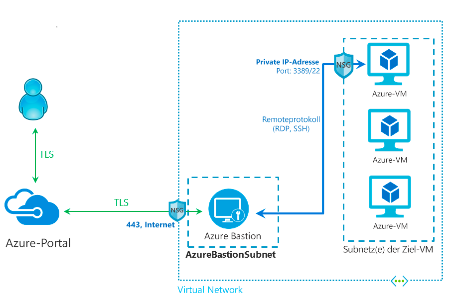

# Was ist Azure Bastion?

Azure Bastion ist ein von Ihnen bereitgestellter Dienst, mit dem Sie eine Verbindung mit einem virtuellen Computer herstellen können, indem Sie Ihren Browser und das Azure-Portal verwenden. Bei Azure Bastion handelt es sich um einen vollständig verwalteten PaaS-Dienst, den Sie in Ihrem virtuellen Netzwerk bereitstellen können. Dieser Dienst ermöglicht sichere und nahtlose RDP- und SSH-Verbindungen mit Ihren virtuellen Computern über TLS direkt im Azure-Portal. Beim Herstellen einer Verbindung über Azure Bastion benötigen Ihre virtuellen Computer keine öffentliche IP-Adresse, keinen Agent und keine spezielle Clientsoftware.

Bastion bietet sichere RDP- und SSH-Verbindungen mit allen virtuellen Computern in dem virtuellen Netzwerk, in dem der Dienst bereitgestellt wird. Durch die Verwendung von Azure Bastion wird verhindert, dass Ihre virtuellen Computer RDP- und SSH-Ports öffentlich verfügbar machen. Gleichzeitig wir weiterhin der sichere Zugriff per RDP/SSH ermöglicht.

## Aufbau

Die Bereitstellung von Azure Bastion erfolgt pro virtuellem Netzwerk und nicht pro Abonnement/Konto oder virtuellem Computer. Nachdem Sie Azure Bastion in Ihrem virtuellen Netzwerk bereitgestellt haben, sind die RDP- und SSH-Funktionen für alle virtuellen Computer im virtuellen Netzwerk verfügbar.

RDP und SSH sind grundlegende Protokolle, über die Sie eine Verbindung mit Ihren in Azure ausgeführten Workloads herstellen können. Das Verfügbarmachen von RDP- oder SSH-Ports über das Internet ist nicht erwünscht und wird als erhebliche Angriffsfläche angesehen. Dies ist häufig auf Protokollschwachstellen zurückzuführen. Um diese Angriffsfläche einzudämmen, können Sie Bastion-Hosts (auch Jumpserver genannt) auf der öffentlichen Seite Ihres Umkreisnetzwerks bereitstellen. Bastion-Hostserver sind so konzipiert und konfiguriert, dass sie Angriffen standhalten. Bastion-Server bieten außerdem RDP- und SSH-Verbindungen mit den Workloads, die sich hinter dem Bastion-Server und weiter innen im Netzwerk befinden.

In dieser Abbildung ist die Architektur einer Azure Bastion-Bereitstellung wie folgt In diesem Diagramm:

* Der Bastion-Host wird im virtuellen Netzwerk bereitgestellt.
* Der Benutzer stellt in einem HTML5-Browser eine Verbindung mit dem Azure-Portal her.
* Der Benutzer wählt den virtuellen Computer für die Verbindung aus.
* Mit nur einem Klick wird die RDP- oder SSH-Sitzung im Browser geöffnet.
* Für den virtuellen Azure-Computer ist keine öffentliche IP-Adresse erforderlich.

## Wichtige Features

Folgende Funktionen stehen zur Verfügung:

* **RDP und SSH direkt im Azure-Portal:** Sie können RDP- und SSH-Sitzungen nahtlos mit nur einem Klick direkt über das Azure-Portal aufrufen.
* **Remotesitzung über TLS und Firewalldurchlauf für RDP/SSH:** Azure Bastion verwendet einen HTML5-basierten Webclient, der automatisch an Ihr lokales Gerät gestreamt wird, sodass Sie die RDP- oder SSH-Sitzung über TLS an Port 443 aufrufen und so Firewalls des Unternehmens sicher durchlaufen können.
* **Keine öffentliche IP-Adresse erforderlich für den virtuellen Azure-Computer:** Azure Bastion öffnet die RDP- oder SSH-Verbindung mit Ihrem virtuellen Azure-Computer über eine private IP-Adresse für den virtuellen Computer. Sie benötigen keine öffentliche IP-Adresse für den virtuellen Computer.
* **Kein Aufwand beim Verwalten von Netzwerksicherheitsgruppen:** Azure Bastion ist ein vollständig verwalteter PaaS-Dienst von Azure, der intern gehärtet ist, um sichere RDP- und SSH-Verbindungen zu bieten. Sie müssen keine Netzwerksicherheitsgruppen im Azure Bastion-Subnetz anwenden. Da mit Azure Bastion Verbindungen mit Ihren virtuellen Computern über private IP-Adressen hergestellt werden, können Sie die Netzwerksicherheitsgruppen so konfigurieren, dass RDP/SSH nur über Azure Bastion zulässig ist. Dadurch entfällt der Aufwand für die Verwaltung von Netzwerksicherheitsgruppen, wenn Sie eine sichere Verbindung mit den virtuellen Computern herstellen.
* **Schutz vor Portscans:** Da Ihre virtuellen Computer nicht im öffentlichen Internet verfügbar gemacht werden müssen, sind sie vor Portscans durch nicht autorisierte und böswillige Benutzer außerhalb Ihres virtuellen Netzwerks geschützt.
* **Schutz vor Zero-Day-Exploits. Härtung an nur einem Ort:** Azure Bastion ist ein vollständig verwalteter PaaS-Dienst. Da er sich im Umkreis Ihres virtuellen Netzwerks befindet, ist eine Härtung der einzelnen virtuellen Computer im virtuellen Netzwerk nicht erforderlich. Dank konsequenter Härtung und Aktualisierung von Azure Bastion bietet die Azure-Plattform Schutz vor Zero-Day-Exploits.

## Neuerungen

Abonnieren Sie den RSS-Feed, und zeigen Sie die neuesten Azure Bastion-Featureupdates auf der Seite [Azure-Updates](https://azure.microsoft.com/updates/?category=networking&query=Azure%20Bastion) an.

## Häufig gestellte Fragen

[!INCLUDE [Bastion FAQ](../../includes/bastion-faq-include.md)]

## Nächste Schritte

* [Tutorial: Erstellen eines Azure Bastion-Hosts und Herstellen einer Verbindung mit einem virtuellen Windows-Computer](tutorial-create-host-portal.md).
* Erfahren Sie mehr über die anderen zentralen [Netzwerkfunktionen](../networking/networking-overview.md) von Azure.
