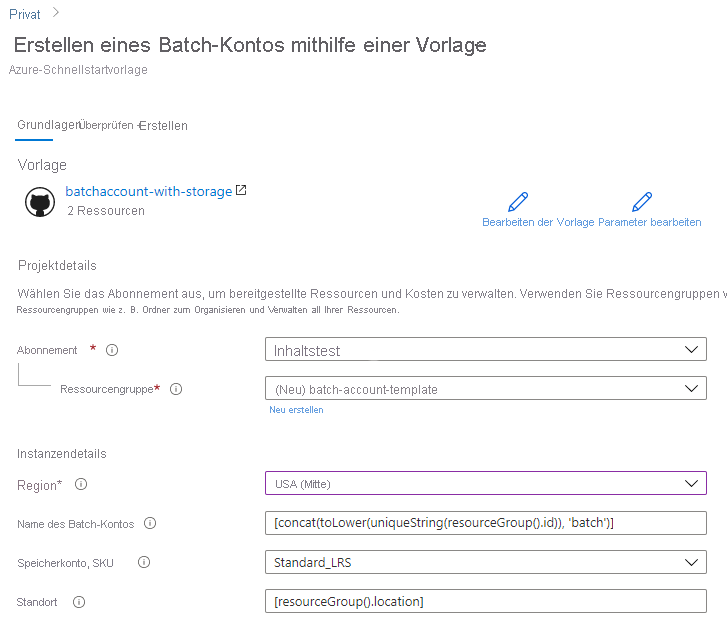

# Schnellstart: Erstellen eines Batch-Kontos mithilfe einer ARM-Vorlage

Sie benötigen ein Batch-Konto zum Erstellen von Computeressourcen (Pools mit Computeknoten) und Batch-Aufträgen. Sie können ein Azure Storage-Konto mit Ihrem Batch-Konto verknüpfen. Dies ist nützlich zum Bereitstellen von Anwendungen und Speichern von Eingabe- und Ausgabedaten für die meisten Workloads in der Praxis. In dieser Schnellstartanleitung wird erläutert, wie Sie mithilfe einer Azure Resource Manager-Vorlage (ARM-Vorlage) ein Batch-Konto einschließlich Speicher erstellen. Nach Abschluss dieser Schnellstartanleitung sind Sie mit den wichtigsten Konzepten des Batch-Diensts vertraut und können Batch mit realistischeren Workloads und in größerem Umfang ausprobieren.

[!INCLUDE [About Azure Resource Manager](../../includes/resource-manager-quickstart-introduction.md)]

Wenn Ihre Umgebung die Voraussetzungen erfüllt und Sie mit der Verwendung von ARM-Vorlagen vertraut sind, klicken Sie auf die Schaltfläche **In Azure bereitstellen**. Die Vorlage wird im Azure-Portal geöffnet.

## Voraussetzungen

Sie benötigen ein aktives Azure-Abonnement.

- [!INCLUDE [quickstarts-free-trial-note](../../includes/quickstarts-free-trial-note.md)]

## Überprüfen der Vorlage

Die in dieser Schnellstartanleitung verwendete Vorlage stammt von der Seite mit den [Azure-Schnellstartvorlagen](https://azure.microsoft.com/resources/templates/101-batchaccount-with-storage/).

:::code language="json" source="~/quickstart-templates/101-batchaccount-with-storage/azuredeploy.json":::

Zwei Azure-Ressourcen sind in der Vorlage definiert:

- [Microsoft.Storage/storageAccounts](/azure/templates/microsoft.storage/storageaccounts): Erstellt ein Speicherkonto.
- [Microsoft.Batch/batchAccounts](/azure/templates/microsoft.batch/batchaccounts): Erstellt ein Batch-Konto

## Bereitstellen der Vorlage

1. Klicken Sie auf das folgende Bild, um sich bei Azure anzumelden und eine Vorlage zu öffnen. Die Vorlage erstellt ein Azure Batch-Konto und ein Speicherkonto.

   

1. Wählen Sie die folgenden Werte aus, bzw. geben Sie sie ein.

   

   - **Abonnement**: Wählen Sie ein Azure-Abonnement aus.
   - **Ressourcengruppe**: Wählen Sie die Option **Neu erstellen** aus, geben Sie einen eindeutigen Namen für die Ressourcengruppe ein, und klicken Sie dann auf **OK**.
   - **Standort**: Wählen Sie einen Standort aus. Beispiel: **USA, Mitte**.
   - **Name des Batchkontos**: Behalten Sie den Standardwert bei.
   - **Speicherkonto-SKU**: Wählen Sie einen Speicherkontotyp aus. Beispielsweise **Standard_LRS**.
   - **Standort**: Behalten Sie die Standardeinstellung bei, sodass sich die Ressourcen am gleichen Ort wie Ihre Ressourcengruppe befinden.
   - Ich stimme den oben genannten Geschäftsbedingungen zu: **Auswählen**.

1. Wählen Sie die Option **Kaufen**.

Nach einigen Minuten sollte eine Benachrichtigung angezeigt werden, dass das Batch-Konto erfolgreich erstellt wurde.

In diesem Beispiel wird das Azure-Portal zum Bereitstellen der Vorlage verwendet. Neben dem Azure-Portal können Sie auch Azure PowerShell, die Azure-Befehlszeilenschnittstelle (Azure CLI) und die REST-API verwenden. Informationen zu anderen Bereitstellungsmethoden finden Sie unter [Bereitstellen von Vorlagen](../azure-resource-manager/templates/deploy-powershell.md).

## Überprüfen der Bereitstellung

Sie können die Bereitstellung im Azure-Portal validieren, indem Sie zu der von Ihnen erstellten Ressourcengruppe navigieren. Vergewissern Sie sich im Bildschirm **Übersicht**, dass das Batch-Konto und das Speicherkonto vorhanden sind.

## Bereinigen von Ressourcen

Falls Sie mit weiteren [Tutorials](./tutorial-parallel-dotnet.md) fortfahren möchten, empfiehlt es sich ggf., die Ressourcen nicht zu bereinigen. Sie können [die Ressourcengruppe auch löschen](../azure-resource-manager/management/delete-resource-group.md?tabs=azure-portal#delete-resource-group), wenn Sie die Ressourcen nicht mehr benötigen, wodurch auch das von Ihnen erstellte Batch-Konto und Speicherkonto gelöscht werden.

## Nächste Schritte

In dieser Schnellstartanleitung haben Sie ein Batch-Konto und ein Speicherkonto erstellt. Weitere Informationen zu Azure Batch finden Sie in den Azure Batch-Tutorials.

> [!div class="nextstepaction"]
> [Azure Batch-Tutorials](./tutorial-parallel-dotnet.md)
