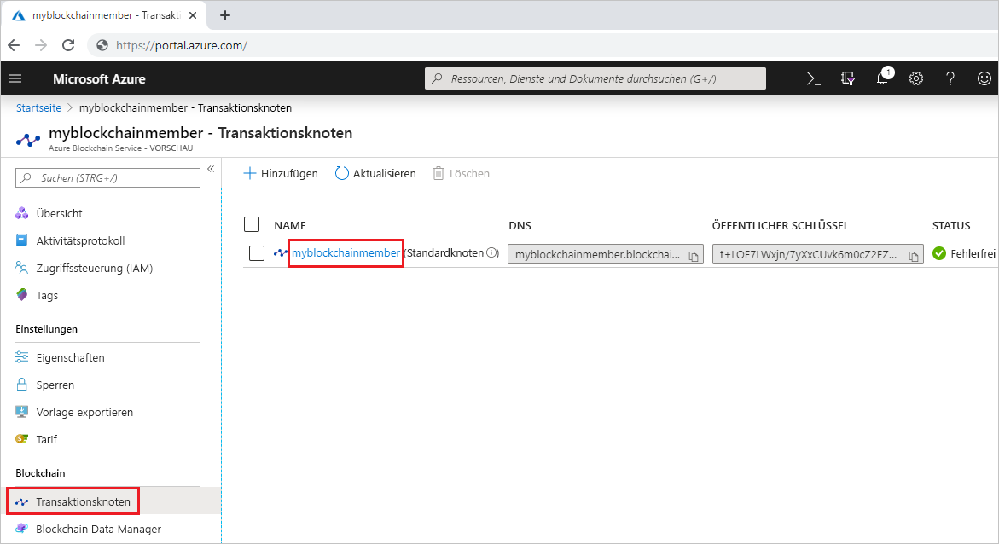
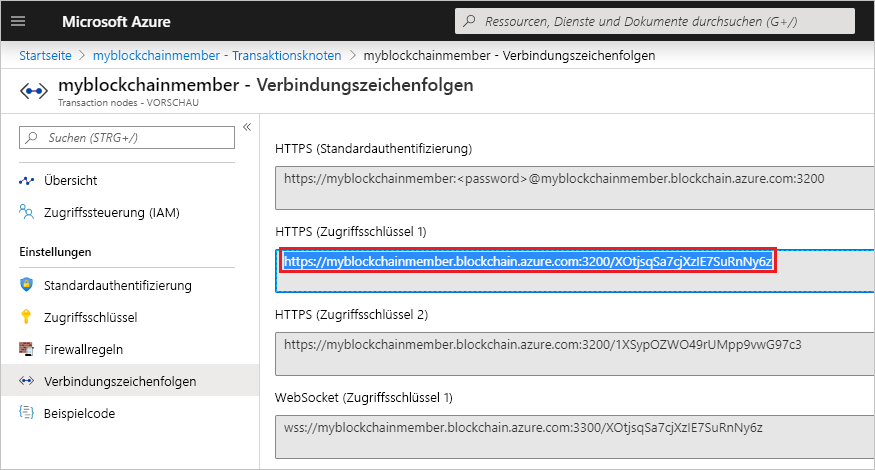

# <a name="quickstart-use-geth-to-attach-to-an-azure-blockchain-service-transaction-node"></a>Schnellstart: Anfügen an einen Azure Blockchain Service-Transaktionsknoten mithilfe von Geth

In dieser Schnellstartanleitung verwenden Sie den Geth-Client, um eine Anfügung an eine Geth-Instanz in einem Azure Blockchain Service-Transaktionsknoten durchzuführen. Nach dem Anfügen rufen Sie über die Geth-Konsole eine Ethereum-JavaScript-API auf.

[!INCLUDE [quickstarts-free-trial-note](../../../includes/quickstarts-free-trial-note.md)]

## <a name="prerequisites"></a>Voraussetzungen

* Installieren Sie [Geth](https://github.com/ethereum/go-ethereum/wiki/geth).
* [Quickstart: Create a blockchain member using the Azure portal (Schnellstart: Erstellen eines Blockchainmitglieds über das Azure-Portal)](create-member.md) oder [Schnellstart: Erstellen eines Blockchainmitglieds für den Azure Blockchain-Dienst mithilfe der Azure CLI](create-member-cli.md)

## <a name="get-geth-connection-string"></a>Abrufen der Geth-Verbindungszeichenfolge

Sie können die Geth-Verbindungszeichenfolge für einen Azure Blockchain Service-Transaktionsknoten über das Azure-Portal abrufen.

1. Melden Sie sich beim [Azure-Portal](https://portal.azure.com) an.
1. Navigieren Sie zu Ihrem Azure Blockchain Service-Mitglied. Klicken Sie auf **Transaktionsknoten** und dann auf den Link „default transaction node“ (Standardtransaktionsknoten).

    

1. Wählen Sie **Connection strings** (Verbindungszeichenfolgen).
1. Kopieren Sie die Verbindungszeichenfolge aus **HTTPS (Access key 1)** (HTTPS (Zugriffsschlüssel 1)). Sie benötigen die Zeichenfolge für den nächsten Abschnitt.

    

## <a name="connect-to-geth"></a>Herstellen einer Verbindung mit Geth

1. Öffnen Sie eine Eingabeaufforderung oder Shell.
1. Verwenden Sie den Unterbefehl „geth attach“, um eine Anfügung an die ausgeführte Geth-Instanz auf Ihrem Transaktionsknoten durchzuführen. Fügen Sie die Verbindungszeichenfolge als Argument für den Unterbefehl ein. Beispiel:

    ``` bash
    geth attach <connection string>
    ```

1. Sobald eine Verbindung mit der Ethereum-Konsole des Transaktionsknotens hergestellt wurde, können Sie die Ethereum-JavaScript-API aufrufen.

    Mit der folgenden API können Sie beispielsweise den Wert von chainId ermitteln:

    ``` bash
    admin.nodeInfo.protocols.istanbul.config.chainId
    ```

    In diesem Beispiel lautet der Wert von chainId 661.

    

1. Geben Sie `exit` ein, um die Verbindung zur Konsole zu trennen.

## <a name="next-steps"></a>Nächste Schritte

In diesem Schnellstart haben Sie den Geth-Client verwendet, um eine Anfügung an eine Geth-Instanz auf einem Azure Blockchain-Transaktionsknoten durchzuführen. Im nächsten Tutorial erfahren Sie, wie Sie das Azure Blockchain Development Kit für Ethereum verwenden, um eine Smart Contract-Funktion über eine Transaktion zu erstellen, bereitstellen und auszuführen.

> [!div class="nextstepaction"]
> [Tutorial: Erstellen und Bereitstellen von Smart Contracts in Azure Blockchain Service](send-transaction.md)
