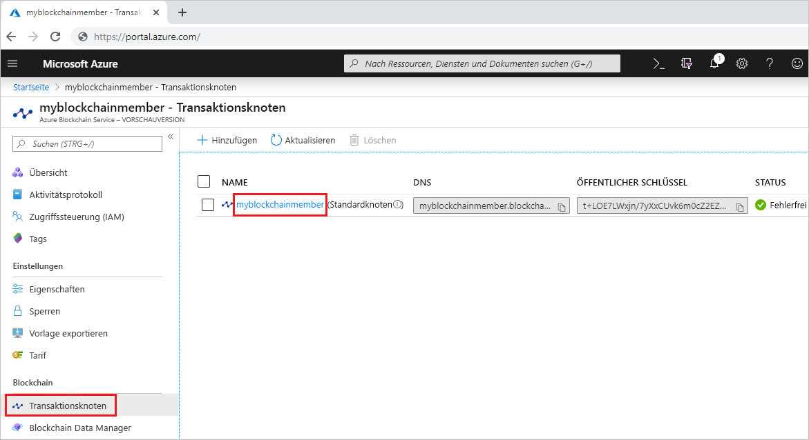
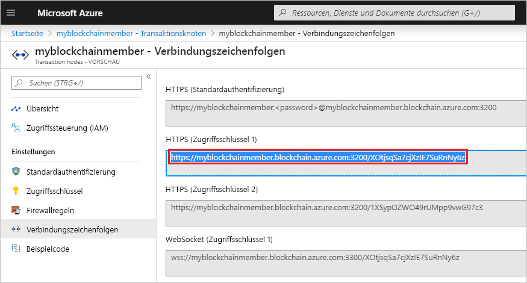

# <a name="quickstart-use-metamask-to-connect-and-deploy-a-smart-contract"></a>Schnellstart: Verwenden von MetaMask zum Verbinden und Bereitstellen eines Smart Contracts

In diesem Schnellstart verwenden Sie MetaMask, um eine Verbindung mit einem Azure Blockchain-Netzwerk herzustellen. Zudem verwenden Sie Remix, um einen Smart Contract bereitzustellen. Bei MetaMask handelt es sich um eine Browsererweiterung, die für die Verwaltung von Ether-Wallets und für Smart Contract-Aktionen verwendet wird.

[!INCLUDE [quickstarts-free-trial-note](../../../includes/quickstarts-free-trial-note.md)]

## <a name="prerequisites"></a>Voraussetzungen

* [Quickstart: Create a blockchain member using the Azure portal (Schnellstart: Erstellen eines Blockchainmitglieds über das Azure-Portal)](create-member.md) oder [Schnellstart: Erstellen eines Blockchainmitglieds für den Azure Blockchain-Dienst mithilfe der Azure CLI](create-member-cli.md)
* Installieren Sie die Browsererweiterung [MetaMask](https://metamask.io).
* Generieren Sie ein [MetaMask-Wallet](https://metamask.zendesk.com/hc/en-us/articles/360015488971-New-to-MetaMask-Learn-How-to-Setup-MetaMask-the-First-Time).

## <a name="get-endpoint-address"></a>Rufen Sie die Endpunktadresse ab.

Sie benötigen die Adresse des Azure Blockchain-Endpunkts, um eine Verbindung mit dem Blockchainnetzwerk herzustellen. Die Endpunktadresse und die Zugriffsschlüssel finden Sie im Azure-Portal.

1. Melden Sie sich beim [Azure-Portal](https://portal.azure.com) an.
1. Navigieren Sie zu Ihrem Azure Blockchain-Mitglied.
1. Klicken Sie auf **Transaktionsknoten** und dann auf den Link „default transaction node“ (Standardtransaktionsknoten).

    

1. Klicken Sie auf **Verbindungszeichenfolgen > Zugriffsschlüssel**.
1. Kopieren Sie die Endpunktadresse von **HTTP (Zugriffsschlüssel 1)** .

    

## <a name="connect-metamask"></a>Herstellen einer Verbindung mit MetaMask

1. Öffnen Sie die Browsererweiterung MetaMask, und melden Sie sich an.
1. Wählen Sie aus der Dropdownliste „Network“ (Netzwerk) **Custom RPC** (RPC (benutzerdefiniert)) aus.

    

1. Fügen Sie unter **New Network > New RPC URL** (Neues Netzwerk > Neue RPC-URL) die Endpunktadresse ein, die Sie weiter oben kopiert haben.
1. Wählen Sie **Speichern** aus.

    Wenn die Verbindung erfolgreich hergestellt wurde, wird das private Netzwerk in der Dropdownliste „Network“ (Netzwerk) angezeigt.

    

## <a name="deploy-smart-contract"></a>Bereitstellen des Smart Contracts

Remix ist eine browserbasierte Solidity-Entwicklungsumgebung. Wenn Sie MetaMask und Remix zusammen verwenden, können Sie Smart Contracts bereitstellen und Smart Contract-Aktionen durchführen.

1. Navigieren Sie in Ihrem Browser zu `https://remix.ethereum.org`.
1. Wählen Sie auf der Registerkarte **Start** unter **Datei** die Option **Neue Datei** aus.

    Geben Sie der neuen Datei den Namen `simple.sol`.

    

    Klicken Sie auf **OK**.
1. Fügen Sie im Remix-Editor folgenden einfachen **Smart Contract-Code** ein.

    ```solidity
    pragma solidity ^0.5.0;
             
    contract simple {
        uint balance;
                 
        constructor() public{
            balance = 0;
        }
                 
        function add(uint _num) public {
            balance += _num;
        }
                 
        function get() public view returns (uint){
            return balance;
        }
    }
    ```

    Unter **contract simple** wird eine statische Variable namens **balance** deklariert. Zudem werden zwei Funktionen definiert. Die **add**-Funktion fügt eine Zahl zu **balance** hinzu. Die **get**-Funktion gibt den Wert von **balance** zurück.
1. Zum Kompilieren des Vertrags wählen Sie zuerst den Bereich „Solidity Compiler“ aus und dann die Option **Compile simple.sol**.

    

1. Wählen Sie den Bereich **Bereitstellen und ausführen** aus, und legen Sie dann **Umgebung** auf **Web3 (injiziert)** fest, um über MetaMask eine Verbindung mit Ihrem Blockchainmitglied herzustellen.

    

1. Wählen Sie den Smart Contract **simple** und dann die Option **Deploy** (Bereitstellen) aus.

    


1. Eine MetaMask-Benachrichtigung mit der Warnung wird angezeigt, dass nicht genügend Mittel vorhanden sind, um die Transaktion auszuführen.

    Für ein öffentliches Blockchainnetzwerk benötigen Sie Ether, um die Transaktionskosten zu bezahlen. Da es sich um ein privates Netzwerk in einem Konsortium handelt, können Sie den Gaspreis auf 0 (null) festlegen.

1.  Klicken Sie auf **Gas Fee > Edit > Advanced** (Gasgebühr > Bearbeiten > Erweitert), und legen Sie **Gas Price** (Gaspreis) auf 0 fest.

    

    Wählen Sie **Speichern** aus.

1. Klicken Sie auf **Confirm** (Bestätigen), um den Smart Contract in der Blockchain bereitzustellen.
1. Erweitern Sie im Abschnitt **Deploy Contracts** den Smart Contract **simple**.

    

    Die beiden Aktionen **add** und **get** entsprechen den Funktionen, die für den Smart Contract definiert wurden.

1. Wenn Sie eine **add**-Transaktion in der Blockchain durchführen möchten, geben Sie die hinzuzufügende Zahl ein, und klicken Sie auf **add**. Möglicherweise erhalten Sie eine Fehlermeldung zur Gasschätzung von Remix: „Sie senden die Transaktion an eine private Blockchain, die kein Gas erfordert.“ Wählen Sie **Transaktion senden** aus, um die Transaktion zu erzwingen.
1. Ähnlich wie bei der Bereitstellung des Smart Contracts wird eine MetaMask-Benachrichtigung mit der Warnung angezeigt, dass nicht genügend Mittel vorhanden sind, um die Transaktion auszuführen.

    Da es sich um ein privates Netzwerk in einem Konsortium handelt, können Sie den Gaspreis auf 0 (null) festlegen.

1. Klicken Sie auf **Gas Fee > Edit > Advanced** (Gasgebühr > Bearbeiten > Erweitert), und legen Sie **Gas Price** (Gaspreis) auf 0 fest. Wählen Sie dann **Save** (Speichern) aus.
1. Klicken Sie auf **Bestätigen**, um die Transaktion für die Blockchain auszuführen.
1. Klicken Sie auf die **get**-Aktion. Dadurch werden die Knotendaten abgefragt. Es ist keine Transaktion erforderlich.

Im Debugbereich von Remix werden Details zu den Transaktionen in der Blockchain angezeigt:


Die Erstellung des Smart Contracts **simple**, die Transaktion für **simple.add** und der Aufruf von **simple.get** werden dort aufgeführt.

Öffnen Sie zum Anzeigen des Transaktionsverlaufs in MetaMask die Browsererweiterung MetaMask, und suchen Sie im Abschnitt **History** (Verlauf) nach einem Protokoll des bereitgestellten Vertrags und der Transaktionen.

## <a name="next-steps"></a>Nächste Schritte

In diesem Schnellstart haben Sie die MetaMask-Browsererweiterung verwendet, um eine Verbindung mit einem Azure Blockchain-Transaktionsknoten herzustellen, einen Smart Contract bereitzustellen und eine Transaktion an die Blockchain zu senden. Im nächsten Tutorial erfahren Sie, wie Sie das Azure Blockchain Development Kit für Ethereum und Truffle verwenden, um eine Smart Contract-Funktion über eine Transaktion zu erstellen, bereitstellen und auszuführen.

> [!div class="nextstepaction"]
> [Tutorial: Erstellen und Bereitstellen von Smart Contracts in Azure Blockchain Service](send-transaction.md)