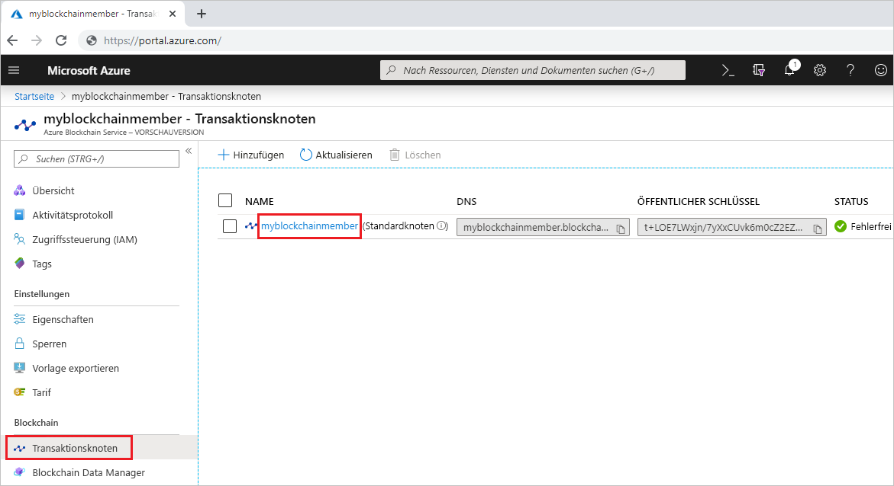
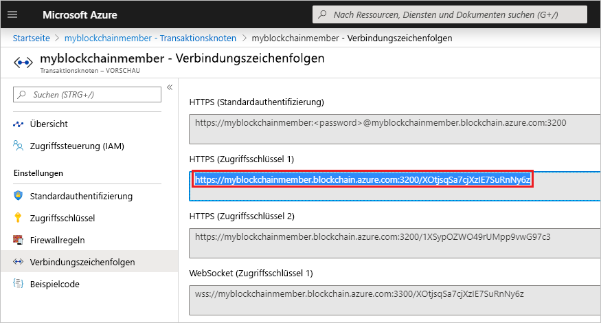

# <a name="quickstart-use-truffle-to-connect-to-azure-blockchain-service"></a>Schnellstart: Herstellen einer Verbindung mit Azure Blockchain mithilfe von Truffle

In dieser Schnellstartanleitung verwenden Sie Truffle, um eine Verbindung mit einem Azure Blockchain Service-Transaktionsknoten herzustellen. Anschließend rufen Sie über die interaktive Truffle-Konsole **Web3**-Methoden für die Interaktion mit dem Blockchainnetzwerk auf.

[!INCLUDE [quickstarts-free-trial-note](../../../includes/quickstarts-free-trial-note.md)]

## <a name="prerequisites"></a>Voraussetzungen

* [Quickstart: Create a blockchain member using the Azure portal (Schnellstart: Erstellen eines Blockchainmitglieds über das Azure-Portal)](create-member.md) oder [Schnellstart: Erstellen eines Blockchainmitglieds für den Azure Blockchain-Dienst mithilfe der Azure CLI](create-member-cli.md)
* Installieren Sie [Truffle](https://github.com/trufflesuite/truffle). Für Truffle ist die Installation mehrerer Tools erforderlich, dazu gehören [Node.js](https://nodejs.org) und [Git](https://git-scm.com/book/en/v2/Getting-Started-Installing-Git).
* Installieren Sie [Python 2.7.15](https://www.python.org/downloads/release/python-2715/). Python ist für Web3 erforderlich.

## <a name="create-truffle-project"></a>Erstellen eines Truffle-Projekts

1. Öffnen Sie eine Node.js-Eingabeaufforderung oder -Shell.
1. Wählen Sie das Verzeichnis aus, in dem Sie das Truffle-Projektverzeichnis erstellen möchten.
1. Erstellen Sie ein Verzeichnis für das Projekt, und ändern Sie den Pfad in das neue Verzeichnis. Beispiel:

    ``` bash
    mkdir truffledemo
    cd truffledemo
    ```

1. Initialisieren Sie das Truffle-Projekt.

    ``` bash
    truffle init
    ```

1. Installieren Sie die Ethereum-JavaScript-API (web3) im Projektordner. Derzeit ist die web3-Version 1.0.0-beta.37 erforderlich.

    ``` bash
    npm install web3@1.0.0-beta.37
    ```

    Möglicherweise werden während der Installation npm-Warnungen ausgelöst.
    
## <a name="configure-truffle-project"></a>Konfigurieren eines Truffle-Projekts

Zum Konfigurieren des Truffle-Projekts benötigen Sie einige Informationen zum Transaktionsknoten aus dem Azure-Portal.

1. Melden Sie sich beim [Azure-Portal](https://portal.azure.com) an.
1. Navigieren Sie zu Ihrem Azure Blockchain Service-Mitglied. Klicken Sie auf **Transaktionsknoten** und dann auf den Link „default transaction node“ (Standardtransaktionsknoten).

    

1. Wählen Sie **Connection strings** (Verbindungszeichenfolgen).
1. Kopieren Sie die Verbindungszeichenfolge aus **HTTPS (Access key 1)** (HTTPS (Zugriffsschlüssel 1)). Sie benötigen die Zeichenfolge für den nächsten Abschnitt.

    

### <a name="edit-configuration-file"></a>Bearbeiten der Konfigurationsdatei

Als Nächstes müssen Sie die Truffle-Konfigurationsdatei mit dem Transaktionsknotenendpunkt aktualisieren.

1. Öffnen Sie im Projektordner **truffledemo** die Truffle-Kconfigurationsdatei `truffle-config.js` in einem Editor.
1. Ersetzen Sie den Inhalt der Datei durch die folgenden Konfigurationsinformationen. Fügen Sie eine Variable hinzu, die die Endpunktadresse enthält. Ersetzen Sie die spitzen Klammern durch die Werte, die Sie im vorherigen Abschnitt abgerufen haben.

    ``` javascript
    var defaultnode = "<default transaction node connection string>";   
    var Web3 = require("web3");
    
    module.exports = {
      networks: {
        defaultnode: {
          provider: new Web3.providers.HttpProvider(defaultnode),
          network_id: "*"
        }
      }
    }
    ```

1. Speichern Sie die Änderungen in `truffle-config.js`.

## <a name="connect-to-transaction-node"></a>Herstellen einer Verbindung mit dem Transaktionsknoten

Verwenden Sie *Web3*, um eine Verbindung mit dem Transaktionsknoten herzustellen.

1. Verwenden Sie die Truffle-Konsole, um eine Verbindung mit dem Standardtransaktionsknoten herzustellen. Führen Sie an der Eingabeaufforderung oder in einer Shell den folgenden Befehl aus:

    ``` bash
    truffle console --network defaultnode
    ```

    Truffle stellt eine Verbindung mit dem Standardtransaktionsknoten her und stellt eine interaktive Konsole bereit.

    Sie können Methoden für das **Web3-Objekt** aufrufen, um mit Ihrem Blockchainnetzwerk zu interagieren.

1. Rufen Sie die Methode **getBlockNumber** auf, damit die aktuelle Blocknummer zurückgegeben wird.

    ```bash
    web3.eth.getBlockNumber();
    ```

    Beispielausgabe:

    ```bash
    truffle(defaultnode)> web3.eth.getBlockNumber();
    18567
    ```
1. Beenden Sie die Truffle-Konsole.

    ```bash
    .exit
    ```

## <a name="next-steps"></a>Nächste Schritte

In dieser Schnellstartanleitung haben Sie mithilfe von Truffle eine Verbindung mit einem Azure Blockchain Service-Standardtransaktionsknoten hergestellt und die interaktive Konsole verwendet, um die aktuelle Blockchainblocknummer zurückzugeben.

Im nächsten Tutorial erfahren Sie, wie Sie das Azure Blockchain Development Kit für Ethereum verwenden, um eine Smart Contract-Funktion über eine Transaktion zu erstellen, bereitstellen und auszuführen.

> [!div class="nextstepaction"]
> [Tutorial: Erstellen und Bereitstellen von Smart Contracts in Azure Blockchain Service](send-transaction.md)
