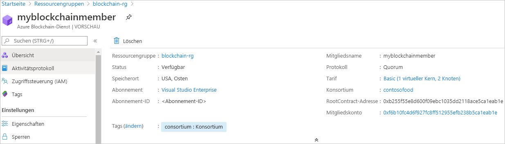

# Schnellstart: Erstellen eines Azure Blockchain Service-Mitglieds mithilfe einer Azure Resource Manager-Vorlage

In dieser Schnellstartanleitung stellen Sie mithilfe einer Azure Resource Manager-Vorlage ein neues Blockchainmitglied und -konsortium in Azure Blockchain Service bereit. Ein Azure Blockchain Service-Mitglied ist ein Blockchainknoten in einem privaten Konsortium-Blockchainnetzwerk. Wenn Sie ein Mitglied bereitstellen, können Sie ein Konsortiumsnetzwerk erstellen oder einem Konsortiumsnetzwerk beitreten. Für ein Konsortiumsnetzwerk wird mindestens ein Mitglied benötigt. Die Anzahl der von den Teilnehmern benötigten Blockchainmitglieder hängt von Ihrem Szenario ab. Die Konsortiumsteilnehmer können über eines oder mehrere Blockchainmitglieder verfügen oder Mitglieder gemeinsam mit anderen Teilnehmern nutzen. Weitere Informationen zu Konsortien finden Sie unter [Azure Blockchain Service-Konsortium](consortium.md).

[!INCLUDE [About Azure Resource Manager](../../../includes/resource-manager-quickstart-introduction.md)]

Wenn Sie kein Azure-Abonnement besitzen, können Sie ein [kostenloses Konto](https://azure.microsoft.com/free/) erstellen, bevor Sie beginnen.

## Voraussetzungen

Keine.

## Erstellen eines Blockchain-Dienstmitglieds

### Überprüfen der Vorlage

Die in dieser Schnellstartanleitung verwendete Vorlage stammt von der Seite mit den [Azure-Schnellstartvorlagen](https://azure.microsoft.com/resources/templates/201-blockchain-asaservice/).

:::code language="json" source="~/quickstart-templates/201-blockchain-asaservice/azuredeploy.json" range="1-84" highlight="52-80":::

In der Vorlage sind die folgenden Azure-Ressourcen definiert:

* [**Microsoft.Blockchain/blockchainMembers**](/azure/templates/microsoft.blockchain/blockchainmembers)

### Bereitstellen der Vorlage

1. Wählen Sie den folgenden Link aus, um sich bei Azure anzumelden und eine Vorlage zu öffnen.

    

1. Geben Sie die Einstellungen für das Azure Blockchain-Mitglied an:

    Einstellung | BESCHREIBUNG
    --------|------------
    Subscription | Wählen Sie das Azure-Abonnement aus, das Sie für Ihren Dienst verwenden möchten. Falls Sie über mehrere Abonnements verfügen, wählen Sie das Abonnement aus, über das die Ressource abgerechnet wird.
    Resource group | Erstellen Sie einen neuen Ressourcengruppennamen, oder wählen Sie einen bereits vorhandenen Namen aus Ihrem Abonnement aus.
    Standort | Wählen Sie zum Erstellen des Mitglieds einen Standort aus. Alle Mitglieder des Konsortiums müssen sich am gleichen Standort befinden. Für die Bereitstellung sind die folgenden Standorte verfügbar: *westeurope, eastus, southeastasia, westeurope, northeurope, westus2* und *japaneast*.
    Membername | Wählen Sie einen eindeutigen Namen für das Azure Blockchain-Mitglied aus. Der Name des Blockchainmitglieds darf nur Kleinbuchstaben und Zahlen enthalten. Das erste Zeichen muss ein Buchstabe sein. Der Wert muss zwischen 2 und 20 Zeichen umfassen.
    Konsortiumsname | Geben Sie einen eindeutigen Namen ein. Weitere Informationen zu Konsortien finden Sie unter [Azure Blockchain Service-Konsortium](consortium.md).
    Mitgliedskennwort | Das Mitgliedskontokennwort wird zum Verschlüsseln des privaten Schlüssels für das Ethereum-Konto verwendet, das für Ihr Mitglied erstellt wird. Sie verwenden das Mitgliedskonto und das Mitgliedskontokennwort für die Verwaltung des Konsortiums.
    SKU-Tarif | Der Tarif für Ihren neuen Dienst. Wählen Sie zwischen den Tarifen **Standard** und **Basic**. Verwenden Sie *Basic* für die Entwicklung, das Testen und Proof of Concept-Vorgänge. Verwenden Sie *Standard* für Bereitstellungen für die Produktion. Sie sollten den Tarif *Standard* auch wählen, wenn Sie Blockchain Data Manager verwenden oder eine große Menge privater Transaktionen senden. Das Wechseln zwischen den Tarifen „Basic“ und „Standard“ nach der Erstellung eines Mitglieds wird nicht unterstützt.
    SKU-Name | Die Knotenkonfiguration und Kosten für Ihren neuen Dienst.

1. Wählen Sie **Kaufen** aus, um die Vorlage bereitzustellen.

  Hier wird zum Bereitstellen der Vorlage das Azure-Portal verwendet. Sie können auch Azure PowerShell, die Azure CLI und die REST-API verwenden. Informationen zu anderen Bereitstellungsmethoden finden Sie unter [Bereitstellen von Vorlagen](../../azure-resource-manager/templates/deploy-powershell.md).

## Überprüfen der bereitgestellten Ressourcen

Sie können das Azure-Portal verwenden, um Details zum bereitgestellten Azure Blockchain Service-Mitglied anzuzeigen. Navigieren Sie im Portal zu der Ressourcengruppe, die das Azure Blockchain Service-Mitglied enthält. Wählen Sie das von Ihnen erstellte Blockchainmitglied aus.

## Bereinigen von Ressourcen

Das von Ihnen erstellte Blockchainmitglied können Sie für die nächste Schnellstartanleitung oder das nächste Tutorial verwenden. Wenn Ressourcen nicht mehr benötigt werden, können Sie diese löschen, indem Sie die für die Schnellstartanleitung erstellte Ressourcengruppe löschen.

So löschen Sie die Ressourcengruppe:

1. Navigieren Sie im Azure-Portal im linken Navigationsbereich zu **Ressourcengruppe**, und wählen Sie die Ressourcengruppe aus, die gelöscht werden soll.
2. Wählen Sie die Option **Ressourcengruppe löschen**. Überprüfen Sie den Löschvorgang, indem Sie den Ressourcengruppennamen eingeben und auf **Löschen** klicken.

## Nächste Schritte

In dieser Schnellstartanleitung haben Sie ein Azure Blockchain Service-Mitglied und ein neues Konsortium bereitgestellt. In der nächsten Schnellstartanleitung erfahren Sie, wie Sie das Azure Blockchain Development Kit für Ethereum zum Anfügen an ein Azure Blockchain Service-Mitglied verwenden.

> [!div class="nextstepaction"]
> [Herstellen einer Verbindung mit Azure Blockchain Service mithilfe von Visual Studio Code](connect-vscode.md)