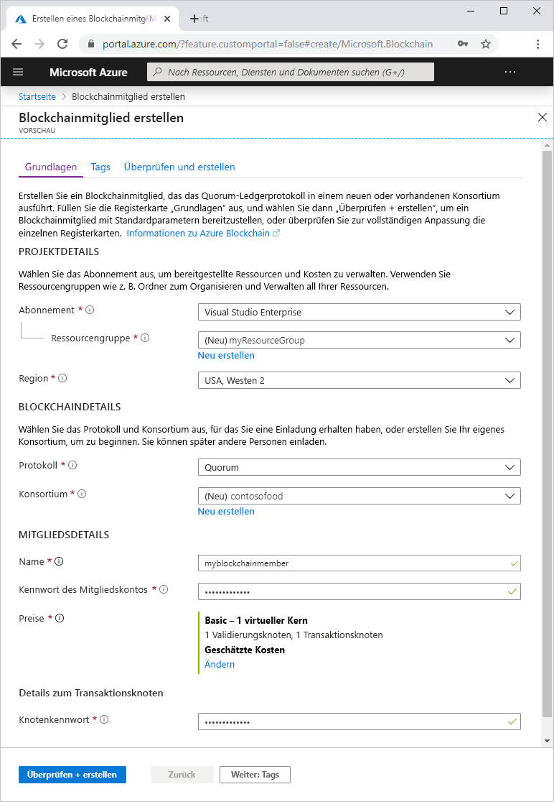
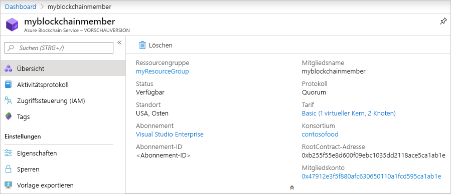

# Schnellstart: Erstellen eines Blockchainmitglieds für Azure Blockchain Service mithilfe des Azure-Portals

In dieser Schnellstartanleitung stellen Sie mithilfe des Azure-Portals ein neues Blockchainmitglied und -konsortium in Azure Blockchain Service bereit.

[!INCLUDE [quickstarts-free-trial-note](../../../includes/quickstarts-free-trial-note.md)]

## Voraussetzungen

Keine.

## Erstellen eines Blockchainmitglieds

Ein Azure Blockchain Service-Mitglied ist ein Blockchainknoten in einem privaten Konsortium-Blockchainnetzwerk. Wenn Sie ein Mitglied bereitstellen, können Sie ein Konsortiumsnetzwerk erstellen oder einem Konsortiumsnetzwerk beitreten. Für ein Konsortiumsnetzwerk wird mindestens ein Mitglied benötigt. Die Anzahl der von den Teilnehmern benötigten Blockchainmitglieder hängt von Ihrem Szenario ab. Die Konsortiumsteilnehmer können über eines oder mehrere Blockchainmitglieder verfügen oder Mitglieder gemeinsam mit anderen Teilnehmern nutzen. Weitere Informationen zu Konsortien finden Sie unter [Azure Blockchain Service-Konsortium](consortium.md).

1. Melden Sie sich beim [Azure-Portal](https://portal.azure.com) an.
1. Klicken Sie im Azure-Portal links oben auf **Ressource erstellen**.
1. Wählen Sie **Blockchain** > **Azure Blockchain Service (Vorschau)** aus.

    

    Einstellung | Beschreibung
    --------|------------
    Subscription | Wählen Sie das Azure-Abonnement aus, das Sie für Ihren Dienst verwenden möchten. Falls Sie über mehrere Abonnements verfügen, wählen Sie das Abonnement aus, über das die Ressource abgerechnet wird.
    Resource group | Erstellen Sie einen neuen Ressourcengruppennamen, oder wählen Sie einen bereits vorhandenen Namen aus Ihrem Abonnement aus.
    Region | Wählen Sie zum Erstellen eines Mitglieds eine Region aus. Alle Mitglieder des Konsortiums müssen sich am gleichen Standort befinden. Features sind unter Umständen in einigen Regionen nicht verfügbar. Azure Blockchain Data Manager ist in den folgenden Azure-Regionen verfügbar: („USA, Osten“ und „Europa, Westen“) ausgeführt werden.
    Protocol | Derzeit unterstützt die Vorschauversion von Azure Blockchain Service das Quorum-Protokoll.
    Konsortium | Geben Sie für ein neues Konsortium einen eindeutigen Namen ein. Wenn Sie einem Konsortium über eine Einladung beitreten, wählen Sie das Konsortium aus, dem Sie beitreten. Weitere Informationen zu Konsortien finden Sie unter [Azure Blockchain Service-Konsortium](consortium.md).
    Name | Wählen Sie einen eindeutigen Namen für das Azure Blockchain-Mitglied aus. Der Name des Blockchainmitglieds darf nur Kleinbuchstaben und Zahlen enthalten. Das erste Zeichen muss ein Buchstabe sein. Der Wert muss zwischen 2 und 20 Zeichen umfassen.
    Mitgliedskontokennwort | Das Mitgliedskontokennwort wird zum Verschlüsseln des privaten Schlüssels für das Ethereum-Konto verwendet, das für Ihr Mitglied erstellt wird. Sie verwenden das Mitgliedskonto und das Mitgliedskontokennwort für die Verwaltung des Konsortiums.
    Preise | Die Knotenkonfiguration und Kosten für Ihren neuen Dienst. Wählen Sie den Link **Ändern** aus, um zwischen den Ebenen **Standard** und **Basic** zu wählen. Verwenden Sie *Basic* für die Entwicklung, das Testen und Proof of Concept-Vorgänge. Verwenden Sie *Standard* für Bereitstellungen für die Produktion. Verwenden Sie außerdem den Tarif *Standard*, wenn Sie Blockchain Data Manager verwenden oder eine große Menge privater Transaktionen senden. Das Wechseln zwischen den Tarifen „Basic“ und „Standard“ nach der Erstellung eines Mitglieds wird nicht unterstützt.
    Knotenkennwort | Das Kennwort für den Standardtransaktionsknoten des Mitglieds. Verwenden Sie das Kennwort für die Standardauthentifizierung, wenn Sie eine Verbindung mit dem öffentlichen Endpunkt des Standardtransaktionsknotens des Blockchainmitglieds herstellen.

1. Wählen Sie zum Überprüfen Ihrer Einstellungen **Überprüfen + erstellen** aus. Wählen Sie **Erstellen** aus, um den Dienst bereitzustellen. Die Bereitstellung dauert ungefähr 10 Minuten.
1. Klicken Sie in der Symbolleiste auf **Benachrichtigungen**, um den Bereitstellungsprozess zu überwachen.
1. Wenn die Bereitstellung abgeschlossen ist, navigieren Sie zu Ihrem Blockchainmitglied.

Klicken Sie auf **Übersicht**, um die grundlegenden Informationen über Ihren Dienst, einschließlich der RootContract-Adresse und des Mitgliedskontos, anzuzeigen.

## Bereinigen von Ressourcen

Das von Ihnen erstellte Mitglied können Sie für die nächste Schnellstartanleitung oder das nächste Tutorial verwenden. Wenn Ressourcen nicht mehr benötigt werden, können Sie diese löschen, indem Sie die für die Schnellstartanleitung erstellte Ressourcengruppe `myResourceGroup` löschen.

So löschen Sie die Ressourcengruppe:

1. Navigieren Sie im Azure-Portal im linken Navigationsbereich zu **Ressourcengruppe**, und wählen Sie die Ressourcengruppe aus, die gelöscht werden soll.
2. Wählen Sie die Option **Ressourcengruppe löschen**. Überprüfen Sie den Löschvorgang, indem Sie den Ressourcengruppennamen eingeben und auf **Löschen** klicken.

## Nächste Schritte

In dieser Schnellstartanleitung haben Sie ein Azure Blockchain Service-Mitglied und ein neues Konsortium bereitgestellt. In der nächsten Schnellstartanleitung erfahren Sie, wie Sie das Azure Blockchain Development Kit für Ethereum zum Anfügen an ein Azure Blockchain Service-Mitglied verwenden.

> [!div class="nextstepaction"]
> [Herstellen einer Verbindung mit Azure Blockchain Service mithilfe von Visual Studio Code](connect-vscode.md)
