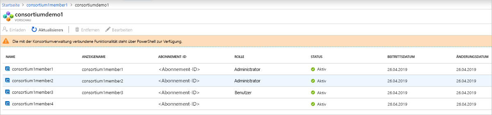

# Was ist der Azure Blockchain-Dienst?

Der Azure Blockchain-Dienst ist ein vollständig verwalteter Ledger-Dienst, der es Benutzern ermöglicht, Blockchainnetzwerke in Azure in ihrer Größe zu erweitern und zu betreiben. Durch die Bereitstellung einer einheitlichen Steuerung sowohl für die Infrastrukturverwaltung als auch für die Steuerung des Blockchainnetzwerks bietet der Azure Blockchain-Dienst:

* Einfache Netzwerkbereitstellung und einfacher Betrieb
* Integrierte Konsortiumsverwaltung
* Entwickeln von Smart Contracts mit vertrauten Entwicklungstools

Der Azure Blockchain-Dienst unterstützt mehrere Ledger-Protokolle. Derzeit wird der Ethereum-Ledger [Quorum](https://www.goquorum.com/) mithilfe des [IBFT](https://github.com/jpmorganchase/quorum/wiki/Quorum-Consensus)-Konsensmechanismus (Istanbul Byzantine Fault Tolerance) unterstützt.

Diese Funktionen erfordern fast keine Administration und werden alle ohne zusätzliche Kosten bereitgestellt. Sie können sich auf die Entwicklung von Anwendungen und Geschäftslogik konzentrieren, anstatt Zeit und Ressourcen für die Verwaltung virtueller Computer und Infrastrukturen aufzuwenden. Darüber hinaus können Sie Ihre Anwendung weiterhin mit den Open-Source-Tools und der Plattform Ihrer Wahl entwickeln, um Ihre Lösung bereitzustellen, ohne dass Sie sich dafür neue Fähigkeiten aneignen müssen.

## Netzwerkbereitstellung und Betrieb

Die Bereitstellung von Azure Blockchain Service kann über das Azure-Portal, die Azure CLI oder über Visual Studio-Code mit der Azure Blockchain-Erweiterung erfolgen. Die Bereitstellung wird vereinfacht. Dazu gehören die Bereitstellung von Transaktions- und Validierungsknoten, virtuelle Azure-Netzwerke zur Sicherheitsisolation sowie dienstverwalteter Speicher.  Darüber hinaus erstellen oder verbinden Benutzer beim Bereitstellen eines neuen Blockchainmitglieds auch ein Konsortium.  Konsortien ermöglichen es mehreren Parteien in verschiedenen Azure-Abonnements, sicher miteinander über eine gemeinsame Blockchain zu kommunizieren.  Diese vereinfachte Bereitstellung reduziert die Dauer der Bereitstellung von Blockchainnetzwerken von Tagen auf Minuten.

### Leistungs- und Dienstebenen

Azure Blockchain Service bietet zwei Dienstebenen: *Basic* und *Standard*. Jede Ebene bietet unterschiedliche Leistungen und Funktionen zur Unterstützung von kompakten Entwicklungs- und Testworkloads bis hin zu massiv skalierten Produktions-Blockchainbereitstellungen. Verwenden Sie *Basic* für die Entwicklung, das Testen und Proof of Concept-Vorgänge. Verwenden Sie *Standard* für Bereitstellungen für die Produktion. Beide Ebenen beinhalten mindestens einen Transaktionsknoten und einen Validierungsknoten (Basic) oder zwei Validierungsknoten (Standard). 

Zusätzlich zu den zwei Validierungsknoten bietet der *Standard*-Tarif zwei *virtuelle Kerne* für jede Transaktion und jeden Validierungsknoten, der *Basic*-Tarif hingegen bietet eine Konfiguration mit einem virtuellen Kern.  Durch die 2 vCores für Transaktions- und Validierungsknoten kann 1 vCore dem Quorum-Ledger zugeordnet werden, während der verbleibende 1 vCore für andere infrastrukturbezogene Dienste verwendet werden kann, was eine optimale Leistung für Workloads von Produktionsblockchains gewährleistet. Weitere Informationen zu den Preisdetails finden Sie unter [Azure Blockchain-Dienst – Preise](https://azure.microsoft.com/pricing/details/blockchain-service).

### Sicherheit und Wartung

Nachdem Sie Ihr erstes Blockchainmitglied bereitgestellt haben, können Sie Ihrem Mitglied zusätzliche Transaktionsknoten hinzufügen.  Standardmäßig sind Transaktionsknoten durch Firewallregeln gesichert und müssen für den Zugriff konfiguriert werden.  Darüber hinaus verschlüsseln alle Transaktionsknoten Daten während der Übertragung über TLS.  Es gibt mehrere Optionen zur Sicherung des Zugriffs auf Transaktionsknoten, einschließlich Firewallregeln, Basisauthentifizierung, Zugriffsschlüssel und Azure Active Directory-Integration. Weitere Informationen finden Sie unter [Konfigurieren von Transaktionsknoten](configure-transaction-nodes.md) und [Konfigurieren des Azure Active Directory-Zugriffs](configure-aad.md).

Als verwalteter Dienst stellt der Azure Blockchain-Dienst sicher, dass die Knoten Ihrer Blockchainmitglieder mit den neuesten Updates des Host-Betriebssystems und des Ledger-Softwarestapels gepatcht werden, die für Hochverfügbarkeit konfiguriert sind (nur Standard-Ebene), wodurch ein Großteil der DevOps, die für herkömmliche IaaS-Blockchainknoten erforderlich sind, entfällt.  Weitere Informationen zu Patches und Updates finden Sie unter [Unterstützte Ledger-Versionen des Azure Blockchain-Dienstledgers](ledger-versions.md).

### Überwachung und Protokollierung

Darüber hinaus bietet Azure Blockchain Service umfangreiche Metriken über den Azure Monitor-Dienst, die Einblicke in die CPU-, Arbeitsspeicher- und Speicherauslastung der Knoten bieten.  Azure Monitor ermöglicht zudem hilfreiche Einblicke in die Aktivitäten des Blockchainnetzwerks wie Transaktionen und abgeleitete Blöcke, Länge der Transaktionswarteschlange sowie aktive Verbindungen.  Metriken können angepasst werden, um Informationen anzuzeigen, die für Ihre Blockchainanwendung wichtig sind.  Darüber hinaus können Schwellenwerte durch Warnmeldungen definiert werden, die es Benutzern ermöglichen, Aktionen auszulösen, wie z.B. das Senden einer E-Mail oder Textnachricht, das Ausführen einer Logik-App, einer Azure Function oder das Senden an einen benutzerdefinierten Webhook.

Über Azure Log Analytics können Benutzer Protokolle anzeigen, die sich auf den Quorum-Ledger beziehen, oder andere wichtige Informationen, wie z.B. versuchte Verbindungen zu den Transaktionsknoten.

## Integrierte Konsortiumsverwaltung

Wenn Sie Ihr erstes Blockchainmitglied bereitstellen, tritt es entweder einem Konsortium bei oder es wird ein neues Konsortium erstellt.  Ein Konsortium ist eine logische Gruppe, die verwendet wird, um die Governance und Konnektivität zwischen Blockchainmitgliedern zu verwalten, die in einem Mehrparteienprozess interagieren.  Der Azure Blockchain-Dienst bietet integrierte Governance-Steuerung durch vordefinierte Smart Contracts, die festlegen, welche Maßnahmen die Mitglieder des Konsortiums ergreifen können.  Diese Governance-Steuerungen können vom Administrator des Konsortiums nach Bedarf angepasst werden. Wenn Sie ein neues Konsortium erstellen, ist Ihr Blockchainmitglied der Standardadministrator des Konsortiums, sodass Sie andere Parteien einladen können, Ihrem Konsortium beizutreten.  Sie können einem Konsortium nur beitreten, wenn Sie zuvor eingeladen wurden.  Wenn Sie einem Konsortium beitreten, unterliegt Ihr Blockchainmitglied den vom Administrator des Konsortiums eingerichteten Governance-Steuerungen.

Auf Konsortiumsverwaltungsaktionen, wie das Hinzufügen zu und das Entfernen von Mitgliedern aus einem Konsortium, kann über PowerShell und eine REST-API zugegriffen werden. Sie können ein Konsortium programmgesteuert über gemeinsame Schnittstellen verwalten, anstatt Solidity-basierte Smart Contracts zu ändern und zu übermitteln. Weitere Informationen finden Sie unter [Konsortiumsverwaltung](consortium.md).

## Entwickeln mit vertrauten Entwicklungstools

Basierend auf dem Open-Source-Ledger Quorum Ethereum können Sie Anwendungen für den Azure Blockchain-Dienst genauso entwickeln wie für bestehende Ethereum-Anwendungen. In Zusammenarbeit mit führenden Branchenpartnern ermöglicht die Visual Studio Code-Erweiterung für das Azure Blockchain Development Kit Entwicklern die Nutzung vertrauter Tools wie Truffle Suite zur Erstellung von Smart Contracts. Mit der Visual Studio Code-Erweiterung für Azure Blockchain können Sie ein bestehendes Konsortium erstellen oder sich mit diesem verbinden, sodass Sie Ihre Smart Contracts über eine IDE erstellen und bereitstellen können. Weitere Informationen finden Sie im [Azure Blockchain Development Kit im VS Code-Marketplace](https://aka.ms/vscodebcextension) und im Benutzerhandbuch zum [Azure Blockchain Development Kit](https://aka.ms/vscodebcextensionwiki).

## Veröffentlichen von Blockchaindaten

Blockchain Data Manager für Azure Blockchain Service erfasst, transformiert und stellt Azure Blockchain Service-Transaktionsdaten für Azure Event Grid-Themen bereit, die eine zuverlässige und skalierbare Blockchain-Ledger-Integration in Azure-Dienste ermöglichen. Sie können Blockchain Data Manager verwenden, um externe Anwendungen und Datenspeicher zu integrieren. Weiter Informationen finden Sie unter [Was ist Blockchain Data Manager für Azure Blockchain Service?](data-manager.md).

## Support und Feedback

Neues zu Azure Blockchain: Mit dem [Azure Blockchain-Blog](https://azure.microsoft.com/blog/topics/blockchain/) bleiben Sie in Bezug auf Blockchain-Dienstangebote und Informationen vom Azure Blockchain-Technikteam immer auf dem Laufenden.

Über das [Azure-Feedbackforum für Blockchain](https://aka.ms/blockchainuservoice) können Sie Produktfeedback senden, neue Features anfordern oder über Ideen abstimmen.

### Communityunterstützung

Diskutieren Sie mit Microsoft-Technikern und Azure Blockchain-Communityexperten.

* [Frageseite von Microsoft Q&A (Fragen und Antworten) für Azure Blockchain Service](/answers/topics/azure-blockchain-service.html)
* [Microsoft Tech Community](https://techcommunity.microsoft.com/t5/Blockchain/bd-p/AzureBlockchain)
* [Stack Overflow](https://stackoverflow.com/questions/tagged/azure-blockchain-service)

## Nächste Schritte

Um loszulegen, probieren Sie einen Schnellstart aus, oder informieren Sie sich über weitere Details in diesen Ressourcen.
* [Erstellen eines Blockchainmitglieds über das Azure-Portal](create-member.md) oder [Erstellen eines Blockchainmitglieds mit der Azure-Befehlszeilenschnittstelle](create-member-cli.md)
* Kostenvergleiche und -rechner finden Sie auf der [Seite mit der Preisgestaltung](https://azure.microsoft.com/pricing/details/blockchain-service).
* Erstelle Ihrer ersten Anwendung mit dem [Azure Blockchain Development Kit](https://github.com/Azure-Samples/blockchain-devkit)
* [Benutzerhandbuch](https://github.com/Microsoft/vscode-azure-blockchain-ethereum/wiki) für die Azure Blockchain-VSCode-Erweiterung
