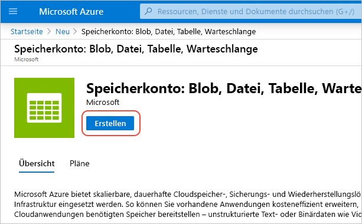
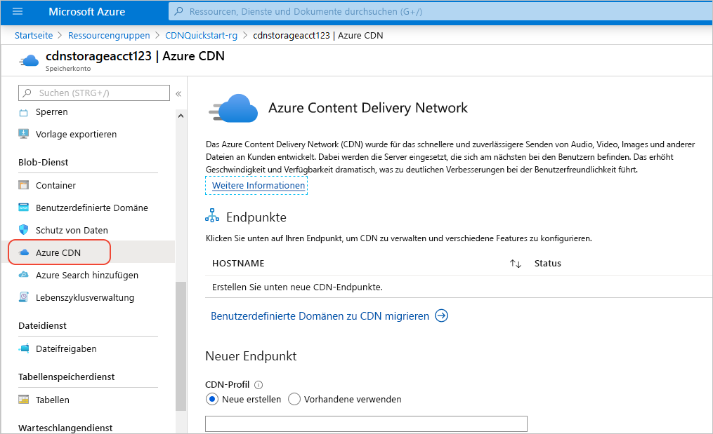

# Schnellstart: Integrieren eines Azure Storage-Kontos in Azure CDN

In dieser Schnellstartanleitung aktivieren Sie das [Azure Content Delivery Network (CDN)](cdn-overview.md) für die Zwischenspeicherung von Inhalten aus Azure Storage. Azure CDN bietet Entwicklern eine globale Lösung für die Übermittlung von Inhalten mit hoher Bandbreite. Sie können Blobs und statische Inhalte von Compute-Instanzen auf physischen Knoten in den USA, Europa, Asien, Australien und Südamerika zwischenspeichern.

## Voraussetzungen

- Ein Azure-Konto mit einem aktiven Abonnement. Sie können [kostenlos ein Konto erstellen](https://azure.microsoft.com/free/?ref=microsoft.com&utm_source=microsoft.com&utm_medium=docs&utm_campaign=visualstudio).

## Melden Sie sich auf dem Azure-Portal an.

Melden Sie sich mit Ihrem Azure-Konto beim [Azure-Portal](https://portal.azure.com) an.

## Speicherkonto erstellen

Ein Speicherkonto ermöglicht den Zugriff auf Azure Storage-Dienste. Das Speicherkonto stellt die höchste Ebene des Namespace für den Zugriff auf die verschiedenen Komponenten des Azure Storage-Diensts dar: Azure Blob Storage, Queue Storage und Table Storage. Weitere Informationen finden Sie unter [Einführung in Microsoft Azure Storage](../storage/common/storage-introduction.md).

Um ein Speicherkonto zu erstellen, müssen Sie entweder der Dienstadministrator oder ein Co-Administrator für das zugehörige Abonnement sein.

1. Wählen Sie links oben im Azure-Portal **Ressource erstellen** aus. Der Bereich **Neu** wird angezeigt.

1. Suchen Sie nach **Speicherkonto**, und wählen Sie in der Dropdownliste **Speicherkonto – Blob, Datei, Tabelle, Warteschlange** aus. Wählen Sie anschließend **Erstellen** aus:
    
    

1. Geben Sie im Bereich **Speicherkonto erstellen** die folgenden Details ein:

    | Einstellung | Wert | 
    | --- | --- |
    | Projektdetails > Ressourcengruppe | Wählen Sie **Neu erstellen** aus, und verwenden Sie den Namen *CDNQuickstart-rg*. Sie können auch eine vorhandene Ressourcengruppe verwenden, wenn Sie dies bevorzugen. |
    | Instanzdetails > Speicherkontoname | Geben Sie einen Namen mit 3 bis 24 Zeichen für das Konto ein. Es dürfen nur Kleinbuchstaben und Zahlen verwendet werden. Der Name muss in Azure eindeutig sein. Er wird der Hostname in der URL, die zum Adressieren von Blob-, Warteschlangen- oder Tabellenspeicherressourcen für das Abonnement verwendet wird. Verwenden Sie zum Adressieren einer Containerressource in Blobspeicher einen URI im folgenden Format: http:// *&lt;Speicherkontoname&gt;* .blob.core.windows.net/ *&lt;Containername&gt;* .
    | Instanzdetails > Standort | Wählen Sie in der Dropdownliste eine Azure-Region in Ihrer Nähe aus. |
    
    Übernehmen Sie für alle anderen Angaben die Standardwerte, und wählen Sie dann **Überprüfen und erstellen** aus.

1. Die Erstellung des Speicherkontos kann einige Minuten dauern. Wählen Sie nach der Erstellung **Zu Ressource wechseln** aus, um die Seite des Speicherkontos für den nächsten Schritt zu öffnen.

## Aktivieren von Azure CDN für das Speicherkonto

1. Wählen Sie auf der Seite für Ihr Speicherkonto im linken Menü **Blob-Dienst** > **Azure CDN** aus. Die Seite **Azure CDN** wird angezeigt.

    
    
1. Geben Sie im Abschnitt **Neuer Endpunkt** die folgenden Informationen ein:

    | Einstellung  | Wert |
    | -------- | ----- |
    | **CDN-Profil** | Wählen Sie **Neu erstellen** aus, und geben Sie Ihren Profilnamen ein (beispielsweise *cdn-profile-123*). Ein Profil ist eine Sammlung von Endpunkten. |
    | **Preisstufe** | Wählen Sie eine der **Standard**-Optionen aus, etwa **Microsoft Standard**. |
    | **CDN-Endpunktname** | Geben Sie den Hostnamen Ihres Endpunkts (etwa *cdn-endpoint-123*) ein. Dieser Name muss in Azure global eindeutig sein, da er für den Zugriff auf Ihre zwischengespeicherten Ressourcen unter der URL „ _&lt;Endpunktname&gt;_ .azureedge.net“ verwendet wird. |
    | **Hostname des Ursprungs** | Für einen neuen CDN-Endpunkt wird standardmäßig der Hostname Ihres Speicherkontos als Ursprungsserver verwendet. |

1. Klicken Sie auf **Erstellen**. Der erstellte Endpunkt wird in der Liste mit den Endpunkten angezeigt.

    

> [!TIP]
> Wenn Sie erweiterte Konfigurationseinstellungen (etwa die [Optimierung des Downloads großer Dateien](cdn-optimization-overview.md#large-file-download)) für den CDN-Endpunkt angeben möchten, können Sie stattdessen die [Azure CDN-Erweiterung](cdn-create-new-endpoint.md) verwenden, um ein CDN-Profil und einen CDN-Endpunkt zu erstellen.

## Aktivieren weiterer CDN-Features

Wählen Sie in der Liste auf der Seite **Azure CDN** des Speicherkontos den CDN-Endpunkt aus, um die Seite mit der CDN-Endpunktkonfiguration zu öffnen.

Auf dieser Seite können Sie weitere CDN-Features für Ihre Übertragung aktivieren (beispielsweise [Komprimierung](cdn-improve-performance.md), [Zwischenspeicherung von Abfragezeichenfolgen](cdn-query-string.md) und [Geofilterung](cdn-restrict-access-by-country.md)). 
    
## SAS aktivieren

Wenn Sie eingeschränkten Zugriff auf private Speichercontainer gewähren möchten, können Sie die SAS-Funktion (Shared Access Signature) Ihres Azure Storage-Kontos verwenden. Eine SAS ist ein URI, der eingeschränkte Zugriffsrechte auf Ihre Azure Storage-Ressourcen erteilt, ohne Ihren Kontoschlüssel verfügbar zu machen. Weitere Informationen finden Sie unter [Verwendung von Azure CDN mit SAS](cdn-sas-storage-support.md).

## Zugreifen auf CDN-Inhalte

Verwenden Sie für den Zugriff auf die im CDN zwischengespeicherten Inhalte den im Portal bereitgestellten CDN-URL. Die Adresse eines zwischengespeicherten Blobs hat das folgende Format:

http://<*Endpunktname*\>.azureedge.net/<*meinÖffentlicherContainer*\>/<*Blobname*\>

> [!NOTE]
> Nachdem Sie den Azure CDN-Zugriff auf ein Speicherkonto aktiviert haben, kann die CDN-POP-Zwischenspeicherung für alle öffentlich verfügbaren Objekte verwendet werden. Wenn Sie ein Objekt ändern, das gerade im CDN zwischengespeichert ist, stehen die neuen Inhalte erst dann über Azure CDN zur Verfügung, wenn Azure CDN die Inhalte aktualisiert. Dies erfolgt nach Ablauf der Lebensdauer der zwischengespeicherten Inhalte.

## Entfernen von Inhalten aus Azure CDN

Wenn ein Objekt nicht mehr in Azure CDN zwischengespeichert werden soll, können Sie einen der folgenden Schritte ausführen:

- Legen Sie den öffentlichen Container als privat fest. Weitere Informationen finden Sie unter [Verwalten des anonymen Lesezugriffs auf Container und Blobs](../storage/blobs/storage-manage-access-to-resources.md).
- Deaktivieren oder löschen Sie den CDN-Endpunkt mit dem Azure-Portal.
- Ändern Sie den gehosteten Dienst so, dass er nicht mehr auf Anforderungen für das Objekt antwortet.

Ein bereits in Azure CDN zwischengespeichertes Objekt bleibt zwischengespeichert, bis die Lebensdauer des Objekts abgelaufen ist oder der Endpunkt [gelöscht](cdn-purge-endpoint.md) wird. Wenn die Lebensdauer abläuft, bestimmt Azure CDN, ob der CDN-Endpunkt weiterhin gültig ist und ob weiterhin anonym auf das Objekt zugegriffen werden kann. Ist dies nicht der Fall, wird das Objekt nicht mehr zwischengespeichert.

## Bereinigen von Ressourcen

In den vorherigen Schritten haben Sie ein CDN-Profil und einen Endpunkt in einer Ressourcengruppe erstellt. Speichern Sie diese Ressourcen, falls Sie die [nächsten Schritte](#next-steps) ausführen und erfahren möchten, wie Sie Ihrem Endpunkt eine benutzerdefinierte Domäne hinzufügen. Sollten Sie die Ressourcen dagegen nicht mehr benötigen, können Sie die Ressourcengruppe mit den Ressourcen löschen, um weitere Kosten zu vermeiden:

1. Wählen Sie im Azure-Portal im Menü auf der linken Seite die Option **Ressourcengruppen** und dann *CDNQuickstart-rg** aus.

2. Wählen Sie auf der Seite **Ressourcengruppe** die Option **Ressourcengruppe löschen** aus, geben Sie *CDNQuickstart-rg* in das Textfeld ein, und wählen Sie anschließend **Löschen** aus.

    Dadurch werden die Ressourcengruppe, das Profil und der Endpunkt gelöscht, die Sie im Rahmen dieser Schnellstartanleitung erstellt haben.

3. Wenn Sie Ihr Speicherkonto löschen möchten, wählen Sie es über das Dashboard aus, und klicken Sie anschließend im oberen Menü auf **Löschen**.

## Nächste Schritte

> [!div class="nextstepaction"]
> [Erstellen eines Azure CDN-Profils und -Endpunkts](cdn-create-new-endpoint.md)

> [!div class="nextstepaction"]
> [Tutorial: Hinzufügen von Azure CDN zu einer Azure App Service-Web-App](cdn-add-to-web-app.md)
