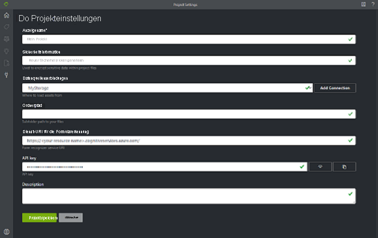

# <a name="train-a-form-recognizer-model-with-labels-using-the-sample-labeling-tool"></a>Trainieren eines Formularerkennungsmodells mit Beschriftungen mithilfe des Tools für die Beschriftung von Beispielen

In dieser Schnellstartanleitung verwenden Sie die Formularerkennungs-REST-API zusammen mit dem Tool für die Beschriftung von Beispielen, um ein benutzerdefiniertes Modell mit manuell beschrifteten Daten zu trainieren. Weitere Informationen zu diesem Feature finden Sie im Abschnitt [Trainieren mit Beschriftungen](../overview.md#train-with-labels) der Übersicht.

Wenn Sie kein Azure-Abonnement besitzen, können Sie ein [kostenloses Konto](https://azure.microsoft.com/free/?WT.mc_id=A261C142F) erstellen, bevor Sie beginnen.

## <a name="prerequisites"></a>Voraussetzungen

Für diesen Schnellstart benötigen Sie Folgendes:
- Zugriff auf die Vorschauversion der Formularerkennung mit eingeschränktem Zugriff. Um Zugriff auf die Vorschauversion zu erhalten, füllen Sie das [Formular zum Anfordern des Zugriffs auf die Formularerkennung](https://aka.ms/FormRecognizerRequestAccess) aus, und übermitteln Sie es. Sie erhalten eine E-Mail mit einem Link zum Erstellen einer Formularerkennungsressource.
- Einen Satz mit mindestens sechs Formularen desselben Typs. Diese Daten verwenden Sie zum Trainieren des Modells und zum Testen eines Formulars. Für diesen Schnellstart können Sie ein [Beispieldataset](https://go.microsoft.com/fwlink/?linkid=2090451) verwenden. Laden Sie die Trainingsdateien in das Stammverzeichnis eines Blobspeichercontainers in einem Azure Storage-Konto hoch.

## <a name="set-up-the-sample-labeling-tool"></a>Einrichten des Tools für die Beschriftung von Beispielen

Sie verwenden die Docker-Engine, um das Tool für die Beschriftung von Beispielen auszuführen. Gehen Sie folgendermaßen vor, um den Docker-Container einzurichten. Eine Einführung in Docker und Container finden Sie in der [Docker-Übersicht](https://docs.docker.com/engine/docker-overview/).
1. Installieren Sie zunächst Docker auf einem Hostcomputer. Bei dem Hostcomputer kann es sich um Ihren lokalen Computer ([Windows](https://docs.docker.com/docker-for-windows/), [MacOS](https://docs.docker.com/docker-for-mac/) oder [Linux](https://docs.docker.com/install/)) handeln. Alternativ dazu können Sie auch einen Docker-Hostingdienst in Azure verwenden, z. B. [Azure Kubernetes Service](https://docs.microsoft.com/azure/aks/index), [Azure Container Instances](https://docs.microsoft.com/azure/container-instances/index) oder einen auf einer [Azure Stack-Instanz bereitgestellten](https://docs.microsoft.com/azure-stack/user/azure-stack-solution-template-kubernetes-deploy?view=azs-1910) Kubernetes-Cluster. Der Hostcomputer muss die folgenden Hardwareanforderungen erfüllen:

    | Container | Minimum | Empfohlen|
    |:--|:--|:--|
    |Tool für die Beschriftung von Beispielen|2 Kerne, 4 GB Arbeitsspeicher|4 Kerne, 8 GB Arbeitsspeicher|
    
1. Rufen Sie mit dem `docker pull`-Befehl den Container für das Tool für die Beschriftung von Beispielen ab.
    ```
    docker pull mcr.microsoft.com/azure-cognitive-services/custom-form/labeltool
    ```
1. Jetzt können Sie mit `docker run` den Container ausführen.
    ```
    docker run -it -p 3000:80 mcr.microsoft.com/azure-cognitive-services/custom-form/labeltool eula=accept
    ```

   Dieser Befehl macht das Tool für die Beschriftung von Beispielen über einen Webbrowser verfügbar. Wechseln Sie zu [http://localhost:3000](http://localhost:3000).

> [!NOTE]
> Sie können auch die Formularerkennungs-REST-API verwenden, um Dokumente zu beschriften und Modelle zu trainieren. Informationen zum Trainieren und Analysieren mit der REST-API finden Sie unter [Trainieren mit Beschriftungen mit der REST-API und Python](./python-labeled-data.md).

## <a name="set-up-input-data"></a>Einrichten von Eingabedaten

Stellen Sie zunächst sicher, dass alle Trainingsdokumente im selben Format vorliegen. Wenn Ihre Formulare unterschiedliche Formate aufweisen, sortieren Sie sie in Unterordner für jeweils ein Format. Beim Trainieren müssen Sie für die API einen der Unterordner angeben.

### <a name="configure-cross-domain-resource-sharing-cors"></a>Konfigurieren der Ressourcenfreigabe zwischen verschiedenen Ursprüngen (CORS)

Aktivieren Sie CORS in Ihrem Speicherkonto. Wählen Sie im Azure-Portal Ihr Speicherkonto aus, und klicken Sie im linken Bereich auf die Registerkarte **CORS**. Geben Sie auf der untersten Zeile die folgenden Werte ein. Klicken Sie dann oben auf **Speichern**.

* Zulässige Ursprünge = * 
* Zulässige Methoden = \[alle auswählen\]
* Zulässige Header = *
* Verfügbar gemachte Header = * 
* Max. Alter = 200

> [!div class="mx-imgBorder"]
> 

## <a name="connect-to-the-sample-labeling-tool"></a>Herstellen einer Verbindung mit dem Tool für die Beschriftung von Beispielen

Das Tool für die Beschriftung von Beispielen stellt eine Verbindung mit einer Quelle (in der sich Ihre Originalformulare befinden) und einem Ziel (dem Speicherort, an den die erstellten Beschriftungen und Ausgabedaten exportiert werden) her.

Verbindungen können projektübergreifend eingerichtet und freigegeben werden. Dabei wird ein erweiterbares Anbietermodell verwendet, sodass Sie ganz einfach neue Anbieter von Quellen und Zielen hinzufügen können.

Um eine neue Verbindung zu erstellen, klicken Sie in der linken Navigationsleiste auf das Symbol für **Neue Verbindung** (Stecker).

Geben Sie die folgenden Werte in die Felder ein:

* **Anzeigename**: der Anzeigename der Verbindung.
* **Beschreibung**: die Beschreibung Ihres Projekts.
* **SAS-URL**: die Shared Access Signature-URL (SAS) Ihres Azure Blob Storage-Containers. Um die SAS-URL abzurufen, öffnen Sie den Microsoft Azure Storage-Explorer, klicken mit der rechten Maustaste auf Ihren Container und wählen **Abrufen der Shared Access Signature** aus. Legen Sie die Ablaufzeit auf einen Zeitpunkt nach Ihrer Dienstverwendung fest. Stellen Sie sicher, dass die Berechtigungen **Lesen**, **Schreiben**, **Löschen** und **Auflisten** aktiviert sind, und klicken Sie auf **Erstellen**. Kopieren Sie den Wert im **URL**-Abschnitt. Er muss das Format `https://<storage account>.blob.core.windows.net/<container name>?<SAS value>` aufweisen.


## <a name="create-a-new-project"></a>Erstellen eines neuen Projekts

Im Tool für die Beschriftung von Beispielen werden Ihre Konfigurationen und Einstellungen in Projekten gespeichert. Erstellen Sie ein neues Projekt, und geben Sie die folgenden Werte in die Felder ein:

* **Anzeigename**: der Anzeigename des Projekts.
* **Sicherheitstoken**: Einige Projekteinstellungen können vertrauliche Werte wie z. B. API-Schlüssel oder andere gemeinsam genutzte Geheimnisse enthalten. Jedes Projekt generiert ein Sicherheitstoken, das zum Verschlüsseln und Entschlüsseln von vertraulichen Projekteinstellungen verwendet werden kann. Die Sicherheitstoken finden Sie, indem Sie in den Anwendungseinstellungen auf das Zahnradsymbol in der unteren Ecke der linken Navigationsleiste klicken.
* **Quellverbindung**: Die von Ihnen im vorherigen Schritt erstellte Azure Blob Storage-Verbindung, die Sie für dieses Projekt verwenden möchten.
* **Ordnerpfad** (optional): Wenn Ihre Quellformulare in einem Ordner im Blobcontainer gespeichert sind, geben Sie hier den Ordnernamen an.
* **URI des Formularerkennungsdiensts**: Die URL Ihres Formularerkennungs-Endpunkts.
* **API-Schlüssel**: Der Schlüssel Ihres Formularerkennungsabonnements.
* **Beschreibung** (optional): Projektbeschreibung.



## <a name="label-your-forms"></a>Beschriften Ihrer Formulare

Wenn Sie ein Projekt erstellen oder öffnen, wird das Hauptfenster des Beschriftungs-Editors geöffnet. Der Beschriftungs-Editor besteht aus drei Teilen:

* Ein Vorschaubereich, dessen Größe angepasst werden kann und der eine scrollbare Liste mit Formularen aus der Quellverbindung enthält.
* Der Hauptbereich des Editors, in dem Sie Beschriftungen anwenden können.
* Der Bearbeitungsbereich des Editors, in dem Sie Beschriftungen ändern, sperren, neu anordnen und löschen können. 

### <a name="identify-text-elements"></a>Identifizieren von Textelementen

Klicken Sie im linken Bereich auf **OCR in allen Dateien ausführen**, um Textlayoutinformationen für jedes Dokument abzurufen. Das Beschriftungstool zeichnet einen Begrenzungsrahmen um jedes Textelement.

### <a name="apply-labels-to-text"></a>Anwenden von Beschriftungen auf Text

Als Nächstes erstellen Sie Beschriftungen und wenden sie auf die Textelemente an, die das Modell erkennen soll.

1. Verwenden Sie zuerst den Bearbeitungsbereich des Editors, um die Beschriftungen zu erstellen, die Sie identifizieren möchten.
1. Klicken und ziehen Sie im Hauptbereich des Editors, um ein oder mehrere Wörter in den markierten Textelementen auszuwählen.

    > [!NOTE]
    > Derzeit kann Text nicht seitenübergreifend ausgewählt werden.
1. Klicken Sie auf die Beschriftung, die Sie anwenden möchten, oder drücken Sie die entsprechende Taste auf der Tastatur. Sie können jedem ausgewählten Textelement nur eine Beschriftung zuweisen, und jede Beschriftung kann nur ein Mal pro Seite angewendet werden.

    > [!TIP]
    > Die Zifferntasten sind als Schnellzugriffstasten für die ersten zehn Beschriftungen zugewiesen. Sie können die Beschriftungen mithilfe der nach oben und unten weisenden Pfeilsymbole im Bearbeitungsbereich neu anordnen.

Führen Sie die oben genannten Schritte aus, um fünf Ihrer Formulare zu beschriften, und fahren Sie dann mit dem nächsten Schritt fort.


## <a name="train-a-custom-model"></a>Trainieren eines benutzerdefinierten Modells

Klicken Sie im linken Bereich auf das Symbol „Trainieren“ (Eisenbahnwaggon), um die Seite „Training“ zu öffnen. Klicken Sie dann auf die Schaltfläche **Trainieren**, um mit dem Training des Modells zu beginnen. Sobald der Trainingsprozess abgeschlossen ist, werden folgende Informationen angezeigt:

* **Modell-ID**: Die ID des Modells, das erstellt und trainiert wurde. Jeder Trainingsaufruf erstellt ein neues Modell mit eigener ID. Kopieren Sie diese Zeichenfolge an einen sicheren Speicherort; Sie werden sie benötigen, wenn Sie Vorhersageaufrufe über die REST-API ausführen möchten.
* **Durchschnittliche Genauigkeit**: Die durchschnittliche Genauigkeit des Modells. Sie können die Modellgenauigkeit verbessern, indem Sie weitere Formulare beschriften und erneut ein Training ausführen, um ein neues Modell zu erstellen. Wir empfehlen, zunächst fünf Formulare zu beschriften und dann bei Bedarf weitere Formulare hinzuzufügen.
* Die Liste der Beschriftungen und die geschätzte Genauigkeit für jede Beschriftung.


Untersuchen Sie nach Abschluss des Trainings den Wert **Durchschnittliche Genauigkeit**. Wenn dieser Wert niedrig ist, sollten Sie weitere Eingabedokumente hinzufügen und die oben beschriebenen Schritte wiederholen. Die von Ihnen bereits beschrifteten Dokumente verbleiben im Projektindex.

> [!TIP]
> Sie können den Trainingsprozess auch mit einem REST-API-Aufruf ausführen. Informationen dazu finden Sie unter [Trainieren mit Beschriftungen mit Python](./python-labeled-data.md).

## <a name="analyze-a-form"></a>Analysieren eines Formulars

Klicken Sie links auf das Symbol für die Vorhersage (Rechtecke), um Ihr Modell zu testen. Laden Sie ein Formulardokument hoch, das Sie im Trainingsprozess nicht verwendet haben. Klicken Sie dann rechts auf die Schaltfläche **Vorhersage**, um die Schlüssel-Wert-Vorhersagen für das Formular zu erhalten. Das Tool wendet Beschriftungen in Begrenzungsrahmen an und meldet die Konfidenz jeder Beschriftung.

> [!TIP]
> Sie können die Analyse-API auch mit einem REST-Aufruf ausführen. Informationen dazu finden Sie unter [Trainieren mit Beschriftungen mit Python](./python-labeled-data.md).

## <a name="improve-results"></a>Verbessern der Ergebnisse

Je nach gemeldeter Genauigkeit können Sie weitere Trainingsiterationen durchführen, um das Modell zu verbessern. Untersuchen Sie nach jeder Vorhersage die Konfidenzwerte für jede angewendete Beschriftung. Wenn der durchschnittliche Genauigkeitswert im Training hoch war, aber die Konfidenzscores niedrig sind (oder die Ergebnisse ungenau sind), sollten Sie die für die Vorhersage verwendete Datei zum Trainingssatz hinzufügen, sie beschriften, und das Training erneut durchführen.

Die gemeldete durchschnittliche Genauigkeit, die Konfidenzscores und die tatsächliche Genauigkeit können inkonsistent sein, wenn die analysierten Dokumente sich von den im Training verwendeten Dokumenten unterscheiden. Denken Sie daran, dass Dokumente für das menschliche Auge gleich aussehen können, für das KI-Modell aber unterschiedlich sind. Ein Beispiel: Sie führen das Training mit einem Formulartyp durch, der zwei Variationen aufweist. Der Trainingssatz besteht zu 20 % aus Variation A und zu 80 % aus Variation B. In diesem Fall ist es wahrscheinlich, dass die Konfidenzscores für Variation A bei der Vorhersage niedriger sind.

## <a name="save-a-project-and-resume-later"></a>Speichern und späteres Fortsetzen eines Projekts

Um Ihr Projekt zu einem anderen Zeitpunkt oder in einem anderen Browser fortzusetzen, müssen Sie das Sicherheitstoken des Projekts speichern und später erneut eingeben. 

### <a name="get-project-credentials"></a>Abrufen der Projektanmeldeinformationen
Wechseln Sie zur Seite mit den Projekteinstellungen (Schiebereglersymbol), und merken Sie sich den Namen des Sicherheitstokens. Wechseln Sie dann zu Ihren Anwendungseinstellungen (Zahnradsymbol), in denen alle Sicherheitstoken in Ihrer aktuellen Browserinstanz angezeigt werden. Suchen Sie nach dem Sicherheitstoken Ihres Projekts, und kopieren Sie den Namen und Schlüsselwert an einen sicheren Speicherort.

### <a name="restore-project-credentials"></a>Wiederherstellen der Projektanmeldeinformationen
Wenn Sie Ihr Projekt fortsetzen möchten, müssen Sie zunächst eine Verbindung mit demselben Blobspeichercontainer herstellen. Führen Sie dazu die oben genannten Schritte aus. Wechseln Sie zur Seite mit den Anwendungseinstellungen (Zahnradsymbol), und überprüfen Sie, ob sich das Sicherheitstoken Ihres Projekts dort befindet. Wenn dies nicht der Fall ist, fügen Sie ein neues Sicherheitstoken hinzu, und fügen Sie den Namen und Schlüssel des Tokens aus dem vorherigen Schritt ein. Klicken Sie dann auf „Einstellungen speichern“. 

### <a name="resume-a-project"></a>Fortsetzen eines Projekts
Wechseln Sie abschließend auf die Hauptseite (Haussymbol), und klicken Sie auf „Cloudprojekt öffnen“. Wählen Sie die Verbindung mit dem Blobspeicher aus, und wählen Sie dann die *.vott*-Datei Ihres Projekts aus. Die Anwendung lädt sämtliche Projekteinstellungen, weil das Sicherheitstoken vorliegt.

## <a name="next-steps"></a>Nächste Schritte

In dieser Schnellstartanleitung haben Sie erfahren, wie Sie das Formularerkennungstool für die Beschriftung von Beispielen verwenden, um ein Modell mit manuell beschrifteten Daten zu trainieren. Wenn Sie das Beschriftungstool in Ihre eigene Anwendung integrieren möchten, verwenden Sie die REST-APIs, die das Training von beschrifteten Daten verarbeiten.

> [!div class="nextstepaction"]
> [Trainieren mit Beschriftungen mit Python](./python-labeled-data.md)
