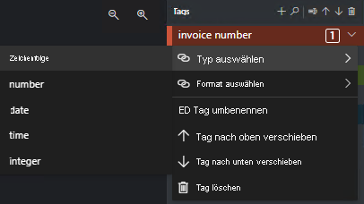

# Neuerungen in der Formularerkennung

Der Formularerkennungsdienst wird fortlaufend aktualisiert. In diesem Artikel finden Sie aktuelle Informationen zu Featureverbesserungen, Fixes und Dokumentationsaktualisierungen.

> [!NOTE]
> In den Schnellstartanleitungen und Leitfäden für die Formularerkennung wird immer die neueste Version der API verwendet, sofern nicht anders angegeben.

## März 2020 

### Extraktionsverbesserungen

Dieses Release bietet Verbesserungen bei der Extraktion sowie eine verbesserte Genauigkeit. Hierzu zählt insbesondere die Möglichkeit, mehrere Schlüssel-Wert-Paare in der gleichen Textzeile zu beschriften und zu extrahieren. 
 
### Formularerkennungstool für die Beschriftung von Beispielen jetzt als Open-Source-Projekt verfügbar

Das Formularerkennungstool für die Beschriftung von Beispielen ist jetzt als Open-Source-Projekt verfügbar. Sie können es in Ihre Lösungen integrieren und kundenspezifische Änderungen vornehmen, um es an Ihre individuellen Anforderungen anzupassen.

Weitere Informationen zum Formularerkennungstool für die Beschriftung von Beispielen finden Sie in der Dokumentation auf [GitHub](https://github.com/microsoft/OCR-Form-Tools/blob/master/README.md).

### Beschriften von Werttypen

Für das Formularerkennungstool für die Beschriftung von Beispielen stehen nun Werttypen zur Verfügung. Derzeit werden folgende Werttypen unterstützt: 

* String
* Number 
* Integer
* Date 
* Time

Die folgende Abbildung zeigt die Werttypauswahl im Formularerkennungstool für die Beschriftung von Beispielen:

> [!div class="mx-imgBorder"]
> 

Die extrahierten Tabellen stehen in der JSON-Ausgabe in `pageResults` zur Verfügung.

### Tabellenvisualisierung 

Im Formularerkennungstool für die Beschriftung von Beispielen werden nun im Dokument erkannte Tabellen angezeigt. Dadurch können Sie die im Dokument erkannten und aus dem Dokument extrahierten Tabellen anzeigen, bevor Sie die Beschriftung und Analyse mit dem Formularerkennungstool für die Beschriftung von Beispielen durchführen. Dieses Feature kann mithilfe der Ebenenoption aktiviert bzw. deaktiviert werden. 

Hier sehen Sie ein Beispiel für die Erkennung und Extraktion von Tabellen:

> [!div class="mx-imgBorder"]
> 

> [!IMPORTANT]
> Das Beschriften von Tabellen wird nicht unterstützt. Nicht automatisch erkannte und extrahierte Tabellen können nur als Schlüssel-Wert-Paare beschriftet werden. Beim Beschriften von Tabellen als Schlüssel-Wert-Paare muss jede Zelle als Wert beschriftet werden.

### Erzwingen von TLS 1.2

* TLS 1.2 wird nun für alle HTTP-Anforderungen erzwungen, die an diesen Dienst gerichtet werden. Weitere Informationen finden Sie unter [Sicherheit von Azure Cognitive Services](../cognitive-services-security.md).

## Januar 2020

In diesem Release wird die Formularerkennung 2.0 (Vorschauversion) eingeführt. In den folgenden Abschnitten finden Sie weitere Informationen zu neuen Features, Verbesserungen und Änderungen. 

### Neue Funktionen

* **Benutzerdefiniertes Modell**
  * **Trainieren mit Bezeichnungen** Sie können jetzt ein benutzerdefiniertes Modell mit manuell gekennzeichneten Daten trainieren. Dies führt zu Modellen mit besserer Leistung und kann Modelle hervorbringen, die mit komplexen Formularen oder Formularen arbeiten, die Werte ohne Schlüssel enthalten.
  * **Asynchrone API** Sie können asynchrone API-Aufrufe verwenden, um mit großen Datasets und Dateien zu trainieren und diese zu analysieren.
  * **Unterstützung von TIFF-Dateien** Sie können jetzt mit TIFF-Dokumenten trainieren und Daten aus ihnen extrahieren.
  * **Verbesserte Extrahierungsgenauigkeit**

* **Vordefiniertes Belegmodell**
  * **Trinkgeldbeträge** Sie können jetzt Trinkgeldbeträge und andere handschriftliche Werte extrahieren.
  * **Extraktion von Zeilenelementen** Sie können Werte von Zeilenelementen aus Belegen extrahieren.
  * **Zuverlässigkeitswerte** Sie können die Zuverlässigkeit des Modells für jeden extrahierten Wert anzeigen.
  * **Verbesserte Extrahierungsgenauigkeit**

* **Layoutextraktion** Sie können nun mit der Layout-API Textdaten und Tabellendaten aus Ihren Formularen extrahieren.

### Änderungen an der benutzerdefinierten Modell-API

Alle APIs für das Trainieren und Verwenden benutzerdefinierter Modelle wurden umbenannt, und einige synchrone Methoden sind jetzt asynchron. Dies sind die wichtigsten Änderungen:

* Der Prozess zum Trainieren eines Modells ist jetzt asynchron. Sie initiieren das Training über den API-Aufruf **/custom/models**. Dieser Aufruf gibt eine Vorgangs-ID zurück, die Sie in **custom/models/{modelID}** übergeben können, um die Trainingsergebnisse zurückzugeben.
* Die Schlüssel-Wert-Extraktion wird jetzt vom API-Aufruf **/custom/models/{modelID}/analyze** initiiert. Dieser Aufruf gibt eine Vorgangs-ID zurück, die Sie in **custom/models/{modelID}/analyzeResults/{resultID}** übergeben können, um die Extraktionsergebnisse zurückzugeben.
* Vorgangs-IDs für das Trainieren finden sich jetzt im Header **Location** von HTTP-Antworten, nicht mehr im Header **Operation-Location**.

### Änderungen an der Beleg-API

Die APIs zum Lesen von Belegen wurden umbenannt.

* Die Extraktion von Belegdaten wird jetzt vom API-Aufruf **/prebuilt/receipt/analyze** initiiert. Dieser Aufruf gibt eine Vorgangs-ID zurück, die Sie in **/prebuilt/receipt/analyzeResults/{resultID}** übergeben können, um die Extraktionsergebnisse zurückzugeben.

### Änderungen am Ausgabeformat

Die JSON-Antworten für alle API-Aufrufe haben neue Formate. Es wurden einige Schlüssel und Werte hinzugefügt, entfernt oder umbenannt. Beispiele für die aktuellen JSON-Formate finden Sie in den Schnellstarts.

## Nächste Schritte

Absolvieren Sie einen [Schnellstart](quickstarts/curl-train-extract.md) zu den ersten Schritten mit den [Formularerkennungs-APIs](https://westus2.dev.cognitive.microsoft.com/docs/services/form-recognizer-api-v2-preview/operations/AnalyzeWithCustomForm).