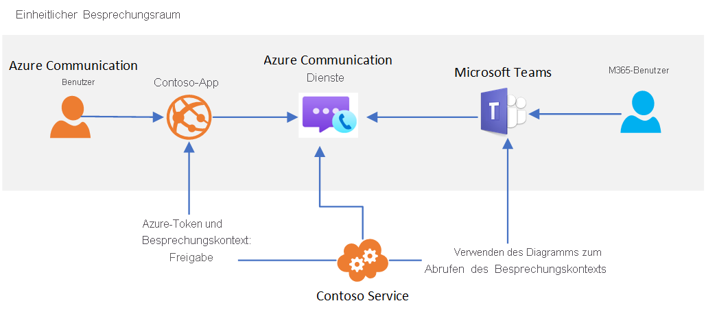

# Teams-Interoperabilität

[!INCLUDE [Private Preview Notice](../includes/private-preview-include.md)]

Azure Communication Services kann dazu verwendet werden, benutzerdefinierte Besprechungsumgebungen zu erstellen, die mit Microsoft Teams interagieren. Benutzer Ihrer Communication Services-Lösung(en) können mit den Teams-Teilnehmern über Sprache, Video, Chat und Bildschirmfreigabe interagieren.

Die Teams-Interoperabilität ermöglicht es Ihnen, benutzerdefinierte Anwendungen zu erstellen, die Verbindungen zwischen Benutzern und Teams-Besprechungen herstellen. Benutzer Ihrer benutzerdefinierten Anwendungen müssen keine Azure Active Directory-Identitäten oder Teams-Lizenzen besitzen, um diese Funktion nutzen zu können. Dies ist ideal, um Mitarbeiter (die möglicherweise mit Teams vertraut sind) und externe Benutzer (mithilfe einer benutzerdefinierten Anwendungsumgebung) in einer reibungslosen Besprechungsumgebung zusammenzubringen. Beispiel:

1. Mitarbeiter verwenden Teams zur Planung einer Besprechung 
1. Besprechungsdetails werden über Ihre benutzerdefinierte Anwendung für externe Benutzer freigegeben.
   * **Verwenden der Graph-API:** Ihre benutzerdefinierte Communication Services-Anwendung verwendet die Microsoft Graph-APIs für den Zugriff auf freizugebende Besprechungsdetails. 
   * **Verwenden anderer Optionen:** Beispielsweise kann der Besprechungslink aus Ihrem Kalender in Microsoft Teams kopiert werden.
1. Externe Benutzer verwenden Ihre benutzerdefinierte Anwendung, um an der Teams-Besprechung teilzunehmen (über die Clientbibliotheken für Communication Services-Telefonie und -Chats).

Die allgemeine Architektur für diesen Anwendungsfall sieht folgendermaßen aus: 

Obwohl bestimmte Features für Teams-Besprechungen, z. B. Heben der Hand, Together-Modus und Breakout Rooms nur für Benutzer von Teams verfügbar sind, hat Ihre benutzerdefinierte Anwendung Zugriff auf die wichtigsten Funktionen für Audio, Video, Chat und Bildschirmfreigabe der Besprechung.

Wenn ein Communication Services-Benutzer an der Teams-Besprechung teilnimmt, wird der Anzeigename, der über die Clientbibliothek für Telefonie bereitgestellt wird, den Teams-Benutzern angezeigt. Der Communication Services-Benutzer wird ansonsten wie ein anonymer Benutzer in Teams behandelt.  Ihre benutzerdefinierte Anwendung sollte die Benutzerauthentifizierung und andere Sicherheitsmaßnahmen zum Schutz von Teams-Besprechungen berücksichtigen. Seien Sie sich der Auswirkungen auf die Sicherheit bewusst, wenn Sie anonymen Benutzern die Teilnahme an Besprechungen ermöglichen, und verwenden Sie den [Teams-Sicherheitsleitfaden](/microsoftteams/teams-security-guide#addressing-threats-to-teams-meetings), um die für anonyme Benutzer verfügbaren Funktionen zu konfigurieren.

Die Communication Services-Interoperabilität mit Teams befindet sich derzeit in der privaten Vorschau. Wenn sie dann allgemein verfügbar ist, werden Communication Services-Benutzer wie Benutzer mit externem Zugriff behandelt. Weitere Informationen zum externen Zugriff finden Sie unter [Anrufen, Chatten und Zusammenarbeiten in Microsoft Teams mit Personen außerhalb Ihrer Organisation](https://docs.microsoft.com/microsoftteams/communicate-with-users-from-other-organizations).

Communication Services-Benutzer können an geplanten Teams-Besprechungen teilnehmen, solange in den [Besprechungseinstellungen](/microsoftteams/meeting-settings-in-teams) die anonyme Teilnahme aktiviert ist.

## Teams in Government-Clouds (GCC)
Azure Communication Services-Interoperabilität ist derzeit nicht mit Teams-Bereitstellungen mit [Microsoft 365-Government-Clouds (GCC)](/MicrosoftTeams/plan-for-government-gcc) kompatibel. 

## Nächste Schritte

> [!div class="nextstepaction"]
> [Beitreten mit einer Telefonie-App zu einer Teams-Besprechung](../quickstarts/voice-video-calling/get-started-teams-interop.md)
