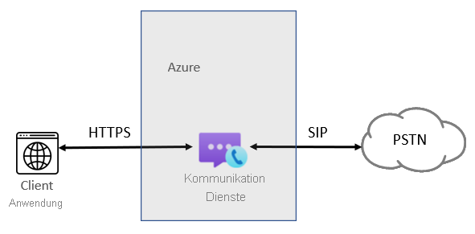
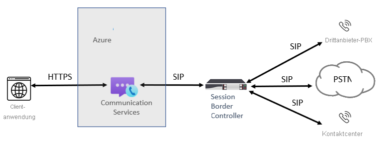

# Telefoniekonzepte

[!INCLUDE [Regional Availability Notice](../../includes/regional-availability-include.md)]

Mithilfe der Azure Communication Services Calling SDKs können Sie Ihren Anwendungen Telefonie- und Festnetzfunktionen hinzufügen. Auf dieser Seite werden wichtige Telefoniekonzepte und -funktionen zusammengefasst. Weitere Informationen zu bestimmten SDK-Sprachen und -Funktionen finden Sie [hier](../../quickstarts/voice-video-calling/calling-client-samples.md).

## Übersicht über Telefonie
Wenn Ihre Benutzer mit einer herkömmlichen Telefonnummer interagieren, werden Anrufe als Sprachanrufe über das Telefonfestnetz (Public Switched Telephone Network, PSTN) abgewickelt. Für aus- und eingehende PSTN-Anrufe müssen Ihrer Azure Communication Services-Ressource Telefoniefunktionen hinzugefügt werden. In diesem Fall wird für Signale und Medien eine Kombination aus IP- und PSTN-basierten Technologien verwendet, um die Verbindung zwischen den Benutzern herzustellen. Communication Services bietet zwei Möglichkeiten, um das Telefonfestnetz zu erreichen: Azure Cloud Calling und SIP-Schnittstelle.

### Azure Cloud Calling

Eine einfache Möglichkeit, um PSTN-Konnektivität für Ihre App oder Ihren Dienst bereitzustellen. In diesem Fall fungiert Microsoft als Ihr Telekommunikationsanbieter. Nummern können direkt von Microsoft erworben werden. Azure Cloud Calling ist eine reine Cloudtelefonielösung für Communication Services. Mithilfe dieser Lösung können Sie besonders einfach eine Verbindung zwischen ACS und dem Telefonfestnetz (Public Switched Telephone Network, PSTN) herstellen und Anrufe bei Festnetz- und Mobiltelefonnummern auf der ganzen Welt ermöglichen. Bei dieser Option fungiert Microsoft als Ihr Festnetzbetreiber, wie in der folgenden Abbildung zu sehen:

Azure Cloud Calling die richtige Lösung für Sie, wenn Folgendes erfüllt ist:
- Azure Cloud Calling ist in Ihrer Region verfügbar.
- Sie können Ihren aktuellen Festnetzbetreiber wechseln.
- Sie möchten von Microsoft verwalteten Zugriff auf das Telefonfestnetz verwenden.

Merkmale dieser Option:
- Sie erhalten Nummern direkt von Microsoft und können Telefonnummern auf der ganzen Welt anrufen.
- Sie benötigen keine Bereitstellung und müssen sich nicht um die Verwaltung einer lokalen Bereitstellung kümmern, da Azure Cloud Calling auf Azure Communication Services basiert.
- Hinweis: Bei Bedarf können Sie per SIP-Schnittstelle einen unterstützten Session Border Controller (SBC) verbinden, um Interoperabilität mit Nebenstellenanlagen von Drittanbietern sowie mit analogen Geräten und anderen Drittanbieter-Telefoniegeräten zu ermöglichen, die von dem SBC unterstützt werden.

Hierfür ist eine ununterbrochene Verbindung mit Azure Communication Services erforderlich.

### SIP-Schnittstelle

Mit dieser Option können Sie Ihre lokale Legacytelefonie und den Betreiber Ihrer Wahl mit Azure Communication Services verbinden. Sie bietet Festnetztelefoniefunktionen für Ihre ACS-Anwendungen, auch wenn Azure Cloud Calling in Ihrem Land/Ihrer Region nicht verfügbar ist. 

Die SIP-Schnittstelle ist die richtige Lösung für Sie, wenn eine der folgenden Bedingungen erfüllt ist:

- Sie möchten ACS mit Festnetztelefoniefunktionen verwenden.
- Sie möchten bei Ihrem aktuellen Festnetzbetreiber bleiben.
- Sie möchten gemischtes Routing verwenden, bei dem einige Anrufe über Azure Cloud Calling und einige über Ihren Betreiber abgewickelt werden.
- Sie müssen mit Nebenstellenanlagen und/oder Geräten von Drittanbietern interagieren (beispielsweise mit Pagern oder analogen Geräte).

Merkmale dieser Option:

- Sie verbinden Ihren eigenen unterstützten SBC ohne zusätzliche lokale Software mit Azure Communication Services.
- Sie können einen beliebigen Telefoniebetreiber mit ACS verwenden.
- Sie können diese Option bei Bedarf selbst konfigurieren und verwalten oder die Konfiguration und Verwaltung Ihrem Netzbetreiber oder Partner überlassen, sofern dieser eine solche Option anbietet.
- Sie können die Interoperabilität zwischen Ihren Telefoniegeräten (beispielsweise Nebenstellenanlagen von Drittanbietern oder analoge Geräte) und ACS konfigurieren.

Voraussetzungen für diese Option:

- Ununterbrochene Verbindung mit Azure
- Bereitstellen und Pflegen eines unterstützten SBC
- Vertrag mit einem externen Netzbetreiber (es sei denn, die Bereitstellung wird als Option für eine Verbindung mit einer Nebenstellenanlage eines Drittanbieters, mit analogen Geräten oder mit anderen Telefoniegeräten für Benutzer in Communication Services vorgenommen).

## Nächste Schritte

### Dokumentation

- [Telefonnummerntypen in Azure Communication Services](./plan-solution.md)
- [Infrastrukturanforderungen für die SIP-Schnittstelle](./sip-interface-infrastructure.md)
- [Preise](../pricing.md)

### Schnellstarts

- [Beschaffen einer Telefonnummer](../../quickstarts/telephony-sms/get-phone-number.md)
- [Schnellstart: Auf Telefon anrufen](../../quickstarts/voice-video-calling/pstn-call.md)
