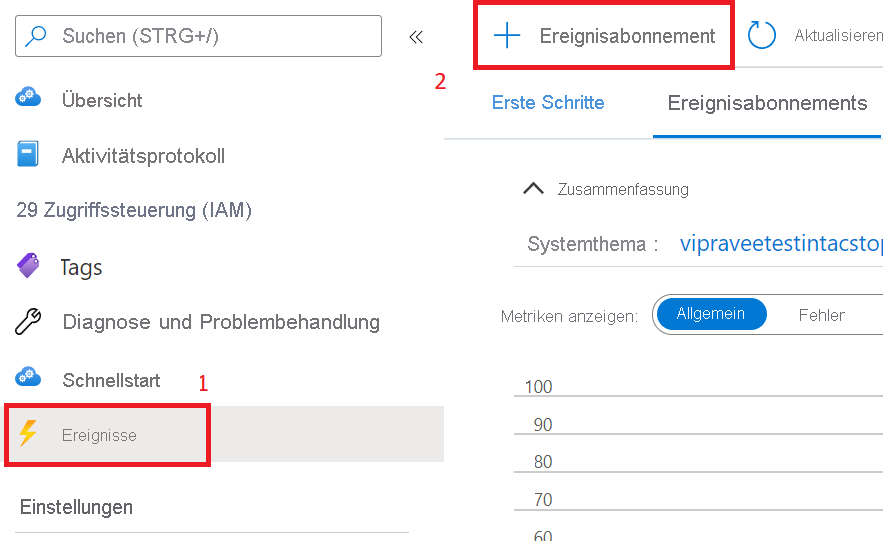

# <a name="record-and-download-calls-with-event-grid"></a>Aufzeichnen und Herunterladen von Anrufen mit Event Grid

[!INCLUDE [Private Preview Notice](../../includes/private-preview-include.md)]

Führen Sie erste Schritte mit Azure Communication Services aus, indem Sie Ihre Communication Services-Anrufe mithilfe von Azure Event Grid aufzeichnen.

## <a name="prerequisites"></a>Voraussetzungen
- Ein Azure-Konto mit einem aktiven Abonnement. Sie können [kostenlos ein Konto erstellen](https://azure.microsoft.com/free/?WT.mc_id=A261C142F).
- Eine aktive Communication Services-Ressource. [Erstellen Sie eine Communication Services-Ressource](../create-communication-resource.md?pivots=platform-azp&tabs=windows).
- Das NuGet-Paket [`Microsoft.Azure.EventGrid`](https://www.nuget.org/packages/Microsoft.Azure.EventGrid/)

## <a name="create-a-webhook-and-subscribe-to-the-recording-events"></a>Erstellen eines Webhooks und Abonnieren der Aufzeichnungsereignisse
Sie verwenden *Webhooks* und *Ereignisse*, um die Anrufaufzeichnung und Mediendateidownloads zu vereinfachen. 

Sie erstellen zunächst einen Webhook. Ihre Communication Services-Ressource benachrichtigt mithilfe von Event Grid diesen Webhook, wenn das `recording`-Ereignis ausgelöst wird, und dann erneut, wenn aufgezeichnete Medien heruntergeladen werden können.

Sie können Ihren eigenen benutzerdefinierten Webhook schreiben, um diese Ereignisbenachrichtigungen zu empfangen. Es ist wichtig, dass dieser Webhook mit dem Validierungscode auf eingehende Nachrichten reagiert, um den Webhook erfolgreich für den Ereignisdienst zu abonnieren.

```
[HttpPost]
public async Task<ActionResult> PostAsync([FromBody] object request)
  {
   //Deserializing the request 
    var eventGridEvent = JsonConvert.DeserializeObject<EventGridEvent[]>(request.ToString())
        .FirstOrDefault();
    var data = eventGridEvent.Data as JObject;

    // Validate whether EventType is of "Microsoft.EventGrid.SubscriptionValidationEvent"
    if (string.Equals(eventGridEvent.EventType, EventTypes.EventGridSubscriptionValidationEvent, StringComparison.OrdinalIgnoreCase))
   {
        var eventData = data.ToObject<SubscriptionValidationEventData>();
        var responseData = new SubscriptionValidationResponseData
        {
            ValidationResponse = eventData.ValidationCode
        };
        if (responseData.ValidationResponse != null)
        {
            return Ok(responseData);
        }
    }

    // Implement your logic here.
    ...
    ...
  }
```


Der obige Code hängt vom NuGet-Paket `Microsoft.Azure.EventGrid` ab. Weitere Informationen zur Event Grid-Endpunktüberprüfung finden Sie in der [Dokumentation zur Endpunktüberprüfung](https://docs.microsoft.com/azure/event-grid/receive-events#endpoint-validation).

Anschließend abonnieren Sie diesen Webhook für das `recording`-Ereignis:

1. Wählen Sie in Ihrer Azure Communication Services-Ressource das Blatt `Events` aus.
2. Wählen Sie wie nachfolgend gezeigt `Event Subscription` aus:

3. Konfigurieren Sie das Ereignisabonnement, und wählen Sie `Call Recording File Status Update` als `Event Type` aus. Wählen Sie `Webhook` als `Endpoint type` aus.

4. Geben Sie unter `Subscriber Endpoint` die URL Ihres Webhooks ein.


Ihr Webhook wird nun benachrichtigt, wenn die Communication Services-Ressource zum Aufzeichnen eines Anrufs verwendet wird.

## <a name="notification-schema"></a>Benachrichtigungsschema
Wenn die Aufzeichnung zum Download zur Verfügung steht, gibt die Communication Services-Ressource eine Benachrichtigung mit dem folgenden Ereignisschema aus. Die Dokument-IDs für die Aufzeichnung können aus den `documentId`-Feldern der einzelnen `recordingChunk`-Elemente abgerufen werden.

```
{
    "id": string, // Unique guid for event
    "topic": string, // Azure Communication Services resource id
    "subject": string, // /recording/call/{call-id}
    "data": {
        "recordingStorageInfo": {
            "recordingChunks": [
                {
                    "documentId": string, // Document id for retrieving from AMS storage
                    "index": int, // Index providing ordering for this chunk in the entire recording
                    "endReason": string, // Reason for chunk ending: "SessionEnded", "ChunkMaximumSizeExceeded”, etc.
                }
            ]
        },
        "recordingStartTime": string, // ISO 8601 date time for the start of the recording
        "recordingDurationMs": int, // Duration of recording in milliseconds
        "sessionEndReason": string // Reason for call ending: "CallEnded", "InitiatorLeft”, etc.
    },
    "eventType": string, // "Microsoft.Communication.RecordingFileStatusUpdated"
    "dataVersion": string, // "1.0"
    "metadataVersion": string, // "1"
    "eventTime": string // ISO 8601 date time for when the event was created
}

```

## <a name="download-the-recorded-media-files"></a>Herunterladen der aufgezeichneten Mediendateien

Wenn Sie die Dokument-ID für die Datei abgerufen haben, die Sie herunterladen möchten, rufen Sie die folgenden Azure Communication Services-APIs auf, um die aufgezeichneten Medien und Metadaten mithilfe der HMAC-Authentifizierung herunterzuladen.

Die maximale Größe der Aufzeichnungsdatei beträgt 1,5 GB. Wenn diese Dateigröße überschritten wird, teilt der Rekorder aufgezeichnete Medien automatisch in mehrere Dateien auf.

Der Client sollte in der Lage sein, alle Mediendateien mit einer einzelnen Anforderung herunterzuladen. Bei einem Problem kann der Client den Vorgang mit einem Bereichsheader wiederholen, um das erneute Herunterladen bereits heruntergeladener Segmente zu vermeiden.

So laden Sie aufgezeichnete Medien herunter: 
- Methode: `GET` 
- URL: https://contoso.communication.azure.com/recording/download/{documentId}?api-version=2021-04-15-preview1

So laden Sie Metadaten aufgezeichneter Medien herunter: 
- Methode: `GET` 
- URL: https://contoso.communication.azure.com/recording/download/{documentId}/metadata?api-version=2021-04-15-preview1


### <a name="authentication"></a>Authentifizierung
Verwenden Sie zum Herunterladen aufgezeichneter Medien und Metadaten die HMAC-Authentifizierung, um die Anforderung für Azure Communication Services-APIs zu authentifizieren.

Erstellen Sie ein `HttpClient`-Element, und fügen Sie die erforderlichen Header mithilfe des unten angegebenen `HmacAuthenticationUtils`-Elements hinzu:

```
  var client = new HttpClient();

  // Set Http Method
  var method = HttpMethod.Get;
  StringContent content = null;

  // Build request
  var request = new HttpRequestMessage
  {
      Method = method, // Http GET method
      RequestUri = new Uri(<Download_Recording_Url>), // Download recording Url
      Content = content // content if required for POST methods
  };

  // Question: Why do we need to pass String.Empty to CreateContentHash() method?
  // Answer: In HMAC authentication, the hash of the content is one of the parameters used to generate the HMAC token.
  // In our case our recording download APIs are GET methods and do not have any content/body to be passed in the request. 
  // However in this case we still need the SHA256 hash for the empty content and hence we pass an empty string. 


  string serializedPayload = string.Empty;

  // Hash the content of the request.
  var contentHashed = HmacAuthenticationUtils.CreateContentHash(serializedPayload);

  // Add HAMC headers.
  HmacAuthenticationUtils.AddHmacHeaders(request, contentHashed, accessKey, method);

  // Make a request to the Azure Communication Services APIs mentioned above
  var response = await client.SendAsync(request).ConfigureAwait(false);
```

#### <a name="hmacauthenticationutils"></a>HmacAuthenticationUtils 
Die folgenden Hilfsprogramme können zum Verwalten Ihres HMAC-Workflows verwendet werden:

**Erstell des Inhaltshashs**

```
public static string CreateContentHash(string content)
{
    var alg = SHA256.Create();

    using (var memoryStream = new MemoryStream())
    using (var contentHashStream = new CryptoStream(memoryStream, alg, CryptoStreamMode.Write))
    {
        using (var swEncrypt = new StreamWriter(contentHashStream))
        {
            if (content != null)
            {
                swEncrypt.Write(content);
            }
        }
    }

    return Convert.ToBase64String(alg.Hash);
}
```

**Hinzufügen von HMAC-Headern**

```
public static void AddHmacHeaders(HttpRequestMessage requestMessage, string contentHash, string accessKey)
{
    var utcNowString = DateTimeOffset.UtcNow.ToString("r", CultureInfo.InvariantCulture);
    var uri = requestMessage.RequestUri;
    var host = uri.Authority;
    var pathAndQuery = uri.PathAndQuery;

    var stringToSign = $"{requestMessage.Method}\n{pathAndQuery}\n{utcNowString};{host};{contentHash}";
    var hmac = new HMACSHA256(Convert.FromBase64String(accessKey));
    var hash = hmac.ComputeHash(Encoding.ASCII.GetBytes(stringToSign));
    var signature = Convert.ToBase64String(hash);
    var authorization = $"HMAC-SHA256 SignedHeaders=date;host;x-ms-content-sha256&Signature={signature}";

    requestMessage.Headers.Add("x-ms-content-sha256", contentHash);
    requestMessage.Headers.Add("Date", utcNowString);
    requestMessage.Headers.Add("Authorization", authorization);
}
```

## <a name="clean-up-resources"></a>Bereinigen von Ressourcen
Wenn Sie ein Communication Services-Abonnement bereinigen und entfernen möchten, können Sie die Ressource oder die Ressourcengruppe löschen. Wenn Sie die Ressourcengruppe löschen, werden auch alle anderen Ressourcen gelöscht, die ihr zugeordnet sind. Weitere Informationen zum Bereinigen von Ressourcen finden Sie [hier](../create-communication-resource.md?pivots=platform-azp&tabs=windows#clean-up-resources).


## <a name="next-steps"></a>Nächste Schritte
Weitere Informationen finden Sie in den folgenden Artikeln:

- Sehen Sie sich das [Beispiel für Webanrufe](https://docs.microsoft.com/azure/communication-services/samples/web-calling-sample) an.
- Informieren Sie sich über die [Funktionen des Calling SDK](https://docs.microsoft.com/azure/communication-services/quickstarts/voice-video-calling/calling-client-samples?pivots=platform-web).
- Informieren Sie sich über die [Funktionsweise von Anrufen](https://docs.microsoft.com/azure/communication-services/concepts/voice-video-calling/about-call-types).
