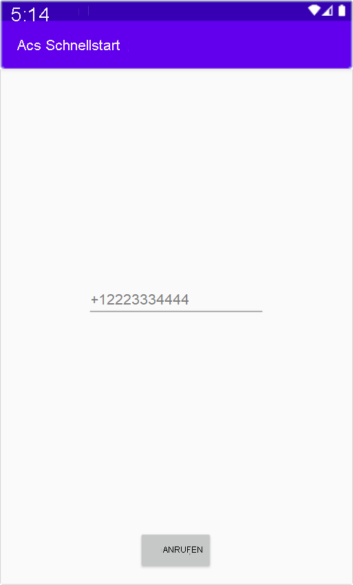

[!INCLUDE [Emergency Calling Notice](../../../includes/emergency-calling-notice-include.md)]
## <a name="prerequisites"></a>Voraussetzungen

- Ein Azure-Konto mit einem aktiven Abonnement. Sie können [kostenlos ein Konto erstellen](https://azure.microsoft.com/free/?WT.mc_id=A261C142F). 
- Eine bereitgestellte Communication Services-Ressource. [Erstellen einer Communication Services-Ressource](../../create-communication-resource.md)
- Eine Telefonnummer, die in der Communication Services-Ressource abgerufen wurde. [Beschaffen einer Telefonnummer](../../telephony-sms/get-phone-number.md)
- Ein `User Access Token`, um den Anrufclient zu aktivieren. Weitere Informationen zum [Abrufen eines `User Access Token`](../../access-tokens.md)
- Gehen Sie den Schnellstart [Erste Schritte beim Hinzufügen von Anruffunktionen zu einer Anwendung](../getting-started-with-calling.md) durch.

### <a name="prerequisite-check"></a>Prüfen der Voraussetzungen

- Melden Sie sich zum Anzeigen der Telefonnummern für Ihre Communication Services-Ressource beim [Azure-Portal](https://portal.azure.com/) an, suchen Sie nach Ihrer Communication Services-Ressource, und öffnen Sie im linken Navigationsbereich die Registerkarte **Telefonnummern**.

## <a name="setting-up"></a>Einrichten

### <a name="add-pstn-functionality-to-your-app"></a>Hinzufügen von PSTN-Funktionen zu Ihrer App

Fügen Sie den Typ `PhoneNumber` zu Ihrer App hinzu, indem Sie **MainActivity.java** ändern:


```java
import com.azure.android.communication.common.PhoneNumberIdentifier;
```

<!--
> [!TBD]
> Namespace based on input from Komivi Agbakpem. But it does not correlates with other use namespaces in Calling Quickstart. E.g: "com.azure.communication.calling.CommunicationUserIdentifier" or "com.azure.communication.common.client.CommunicationTokenCredential". Double-chek this.
-->

## <a name="start-a-call-to-phone"></a>Starten eines Anrufs auf dem Telefon

Geben Sie die Telefonnummer an, die Sie in Ihrer Communication Services-Ressource abgerufen haben. Diese wird zum Starten des Aufrufes verwendet:

> [!WARNING]
> Beachten Sie, dass Telefonnummern im internationalen Standardformat E.164 angegeben werden sollten. (Beispiel: +12223334444)

Ändern Sie den Ereignishandler `startCall()` in **MainActivity.java**, sodass er Telefonanrufe bearbeitet:

```java
    private void startCall() {
        EditText calleePhoneView = findViewById(R.id.callee_id);
        String calleePhone = calleePhoneView.getText().toString();
        PhoneNumberIdentifier callerPhone = new PhoneNumberIdentifier("+12223334444");
        StartCallOptions options = new StartCallOptions();
        options.setAlternateCallerId(callerPhone);
        options.setVideoOptions(new VideoOptions(null));
        call = agent.startCall(
                getApplicationContext(),
                new PhoneNumberIdentifier[] {new PhoneNumberIdentifier(calleePhone)},
                options);
    }
```

## <a name="launch-the-app-and-call-the-echo-bot"></a>Starten der App und Anrufen des Echobots

Die App kann jetzt mithilfe der Schaltfläche „Run app“ (App ausführen) auf der Symbolleiste gestartet werden (UMSCHALT + F10). Sie können einen Anruf tätigen, indem Sie eine Telefonnummer in das hinzugefügte Textfeld eingeben und auf die Schaltfläche **CALL** (ANRUFEN) klicken.
> [!WARNING]
> Beachten Sie, dass Telefonnummern im internationalen Standardformat E.164 angegeben werden sollten. (Beispiel: +12223334444)


