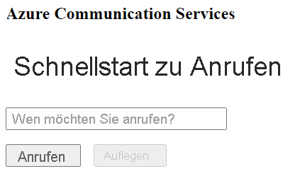

[!INCLUDE [Emergency Calling Notice](../../../includes/emergency-calling-notice-include.md)]
## <a name="prerequisites"></a>Voraussetzungen

- Ein Azure-Konto mit einem aktiven Abonnement. Sie können [kostenlos ein Konto erstellen](https://azure.microsoft.com/free/?WT.mc_id=A261C142F). 
- Eine bereitgestellte Communication Services-Ressource. [Erstellen einer Communication Services-Ressource](../../create-communication-resource.md)
- Eine Telefonnummer, die in der Communication Services-Ressource abgerufen wurde. [Beschaffen einer Telefonnummer](../../telephony-sms/get-phone-number.md)
- Ein `User Access Token`, um den Anrufclient zu aktivieren. Weitere Informationen zum [Abrufen eines `User Access Token`](../../access-tokens.md)
- Gehen Sie den Schnellstart [Erste Schritte beim Hinzufügen von Anruffunktionen zu einer Anwendung](../getting-started-with-calling.md) durch.

### <a name="prerequisite-check"></a>Prüfen der Voraussetzungen

- Melden Sie sich zum Anzeigen der Telefonnummern für Ihre Communication Services-Ressource beim [Azure-Portal](https://portal.azure.com/) an, suchen Sie nach Ihrer Communication Services-Ressource, und öffnen Sie im linken Navigationsbereich die Registerkarte **Telefonnummern**.
- Sie können Ihre App mit der Azure Communication Services-Clientbibliothek „Calling“ für JavaScript erstellen und ausführen:

```console
npx webpack-dev-server --entry ./client.js --output bundle.js
```

## <a name="setting-up"></a>Einrichten

### <a name="add-pstn-functionality-to-your-app"></a>Hinzufügen von PSTN-Funktionen zu Ihrer App

Erweitern Sie Ihr Layout mit Steuerelementen für die Telefonwahl.

Positionieren Sie diesen Code am Ende des `<body />`-Abschnitts von **index.html**, vor `<script />`-Tags:

```html
<input 
  id="callee-phone-input"
  type="text"
  placeholder="Phone number you would like to dial"
  style="margin-bottom:1em; width: 230px;"
/>
<div>
  <button id="call-phone-button" type="button">
    Start Phone Call
  </button>
  &nbsp;
  <button id="hang-up-phone-button" type="button" disabled="true">
    Hang Up Phone Call
  </button>
</div>
```

Erweitern Sie Ihre Anwendungslogik um Telefoniefunktionen.

Fügen Sie den folgenden Code zu **client.js** hinzu:

```javascript
const calleePhoneInput = document.getElementById("callee-phone-input");
const callPhoneButton = document.getElementById("call-phone-button");
const hangUpPhoneButton = document.getElementById("hang-up-phone-button");
```

## <a name="start-a-call-to-phone"></a>Starten eines Anrufs auf dem Telefon

Geben Sie die Telefonnummer an, die Sie in der Communication Services-Ressource abgerufen haben und mit deren Hilfe der Anruf gestartet wird:
> [!WARNING]
> Beachten Sie, dass Telefonnummern im internationalen Standardformat E.164 angegeben werden sollten. (Beispiel: +12223334444)

Fügen Sie einen Ereignishandler hinzu, um einen Anruf an die von Ihnen angegebene Telefonnummer zu tätigen, wenn Sie auf `callPhoneButton` klicken:


```javascript
callPhoneButton.addEventListener("click", () => {
  // start a call to phone
  const phoneToCall = calleePhoneInput.value;
  call = callAgent.call(
    [{phoneNumber: phoneToCall}], { alternateCallerId: {phoneNumber: '+18336528005'}
  });

  // toggle button states
  hangUpPhoneButton.disabled = false;
  callPhoneButton.disabled = true;
});
```

## <a name="end-a-call-to-phone"></a>Beenden eines Anrufs auf dem Telefon

Fügen Sie einen Ereignislistener hinzu, um den aktuellen Anruf zu beenden, wenn auf `hangUpPhoneButton` geklickt wird:

```javascript
hangUpPhoneButton.addEventListener("click", () => {
  // end the current call
  call.hangUp({
    forEveryone: true
  });

  // toggle button states
  hangUpPhoneButton.disabled = true;
  callPhoneButton.disabled = false;
});
```

Die Eigenschaft `forEveryone` beendet den Anruf für alle Anrufteilnehmer.

## <a name="run-the-code"></a>Ausführen des Codes

Verwenden Sie `webpack-dev-server`, um Ihre App zu erstellen und auszuführen. Führen Sie den folgenden Befehl aus, um den Anwendungshost auf einem lokalen Webserver zu bündeln:


```console
npx webpack-dev-server --entry ./client.js --output bundle.js
```

Navigieren Sie in Ihrem Browser zu `http://localhost:8080/`. Daraufhin sollte Folgendes angezeigt werden:




Sie können einen Anruf an eine echte Telefonnummer tätigen, indem Sie eine Telefonnummer in das hinzugefügte Textfeld eingeben und auf die Schaltfläche **Start Phone Call** (Telefonanruf starten) klicken.

> [!WARNING]
> Beachten Sie, dass Telefonnummern im internationalen Standardformat E.164 angegeben werden sollten. (Beispiel: +12223334444)
