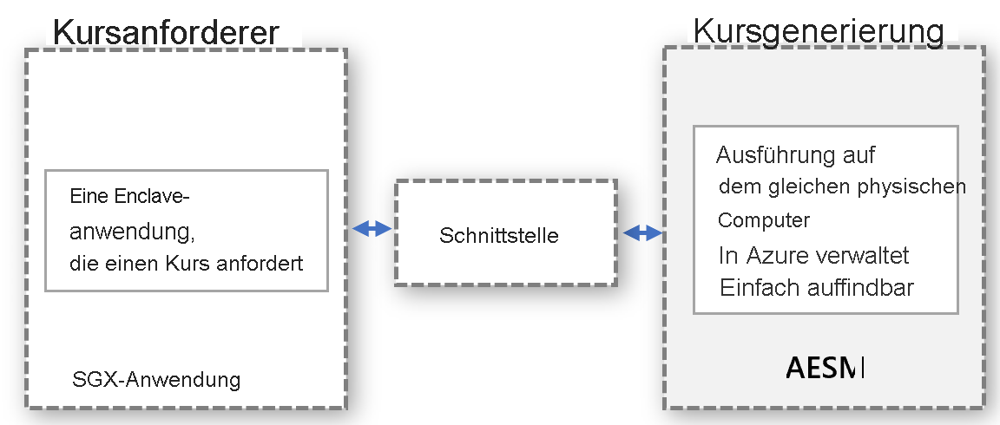

# <a name="platform-software-management-with-sgx-quote-helper-daemon-set-preview"></a>Plattformsoftwareverwaltung mit DaemonSet für SGX-Angebotshilfe (Vorschau)

Für [Enklavenanwendungen](confidential-computing-enclaves.md), bei denen ein Remotenachweis durchgeführt wird, muss ein ANGEBOT erstellt werden. Dieses ANGEBOT liefert den kryptografischen Nachweis der Identität und des Status der Anwendung sowie für die Umgebung, in der die Enklave ausgeführt wird. Für die Erstellung des ANGEBOTS müssen vertrauenswürdige Softwarekomponenten verwendet werden, die Teil der Plattformsoftwarekomponenten (PSW) von Intel sind.

## <a name="overview"></a>Übersicht
 
Intel unterstützt zwei Nachweismodi zum Ausführen der Angebotserstellung:
- **In-Proc**: Die vertrauenswürdigen Softwarekomponenten werden innerhalb des Enklavenanwendungsprozesses gehostet.

- **Out-of-Proc**: Die vertrauenswürdigen Softwarekomponenten werden außerhalb der Enklavenanwendung gehostet.
 
Für SGX-Anwendungen, die mit dem Open Enclave SDK erstellt werden, wird standardmäßig der Modus für den prozessinternen Nachweis (In-Proc) verwendet. Bei SGX-basierten Anwendungen ist auch „Out-of-Proc“ möglich. Hierfür ist ein zusätzliches Hosting erforderlich, und die erforderlichen Komponenten, z. B. Architectural Enclave Service Manager (AESM), müssen außerhalb der Anwendung verfügbar gemacht werden.

Die Nutzung dieses Features wird **dringend empfohlen**, weil hierdurch die Betriebszeit für Ihre Enklaven-Apps bei Updates der Intel-Plattform oder der DCAP-Treiber verbessert wird.

Zur Aktivierung dieses Features für einen AKS-Cluster fügen Sie den Befehl „--enable-sgxquotehelper“ der CLI hinzu, wenn Sie das Confidential Computing-Add-On aktivieren. Ausführliche Anweisungen zur CLI finden Sie [hier](confidential-nodes-aks-get-started.md): 

```azurecli-interactive
# Create a new AKS cluster with system node pool with Confidential Computing addon enabled and SGX Quote Helper
az aks create -g myResourceGroup --name myAKSCluster --generate-ssh-keys --enable-addon confcom --enable-sgxquotehelper
```

## <a name="why-and-what-are-the-benefits-of-out-of-proc"></a>Welche Vorteile hat „Out-of-Proc“?

-   Für die Komponenten zur Angebotserstellung von PSW für die einzelnen Containeranwendungen sind keine Updates erforderlich: Bei „Out-of-Proc“ müssen Containerbesitzer keine Updates in ihrem Container verwalten. Besitzer von Containern nutzen stattdessen die vom Anbieter bereitgestellte Schnittstelle, mit der der zentralisierte Dienst außerhalb des Containers aufgerufen wird, der vom Anbieter aktualisiert und verwaltet wird.

-   Sie müssen sich keine Gedanken über Nachweisfehler aufgrund von veralteten PSW-Komponenten machen: Die Angebotserstellung umfasst auch die vertrauenswürdigen Softwarekomponenten (Quoting Enclave (QE) und Provisioning Certificate Enclave (PCE)), die Teil der vertrauenswürdigen Computerbasis (Trusted Computing Base, TCB) sind. Diese Softwarekomponenten müssen auf dem neuesten Stand sein, um die Nachweisanforderungen zu erfüllen. Da der Anbieter die Updates für diese Komponenten verwaltet, müssen sich Kunden nicht mehr um Nachweisfehler kümmern, die auftreten, weil ihr Container veraltete vertrauenswürdige Softwarekomponenten enthält.

-   Bessere Auslastung des EPC-Arbeitsspeichers: Beim Nachweismodus „In-Proc“ muss jede Enklavenanwendung die Kopie von QE und PCE für den Remotenachweis instanziieren. Bei „Out-of-Proc“ ist es nicht erforderlich, dass der Container diese Enklaven hostet. Daher wird hierfür auch kein Enklavenarbeitsspeicher des Containerkontingents genutzt.

-   Schutz vor Kernel-Erzwingung: Wenn der SGX-Treiber in den Linux-Kernel gestreamt wird, wird für eine Enklave eine höhere Berechtigung erzwungen. Mit dieser Berechtigung kann die Enklave PCE aufrufen. Dies führt zu einer Beschädigung der Enklavenanwendung, die im Modus „In-Proc“ ausgeführt wird. Standardmäßig wird Enklaven diese Berechtigung nicht gewährt. Zum Gewähren dieser Berechtigung für eine Enklavenanwendung muss der Prozess für die Anwendungsinstallation geändert werden. Dies ist für das Out-of-Proc-Modell leicht möglich, da vom Anbieter des Diensts, mit dem Out-of-Proc-Anforderungen verarbeitet werden, für den Dienst die Installation mit dieser Berechtigung sichergestellt wird.

-   Es ist nicht erforderlich, eine Überprüfung auf Abwärtskompatibilität mit PSW und DCAP durchzuführen. Die Updates der Komponenten für die Angebotserstellung von PSW werden vom Anbieter vor der Aktualisierung auf Abwärtskompatibilität überprüft. Dies erleichtert die Behebung von Kompatibilitätsproblemen vor der Bereitstellung von Updates für vertrauliche Workloads.

## <a name="how-does-the-out-of-proc-attestation-mode-work-for-confidential-workloads-scenario"></a>Wie funktioniert der Nachweismodus „Out-of-Proc“ für ein Szenario mit vertraulichen Workloads?

Das allgemeine Design basiert auf dem Modell, bei dem der Angebotsanforderer und die Angebotserstellung separat ausgeführt werden (aber auf demselben physischen Computer). Die Angebotserstellung erfolgt auf zentralisierte Weise, und es werden Anforderungen für ANGEBOTE von allen Entitäten bereitgestellt. Die Schnittstelle muss richtig definiert und ermittelbar sein, damit Entitäten Angebote anfordern können.



Das obige abstrakte Modell gilt für das Szenario mit vertraulichen Workloads. Es wird der bereits verfügbare AESM-Dienst genutzt. AESM befindet sich in einem Container und wird im gesamten Kubernetes-Cluster als DaemonSet bereitgestellt. Von Kubernetes wird sichergestellt, dass auf jedem Agentknoten eine Instanz eines AESM-Dienstcontainers, der von einem Pod umschlossen ist, bereitgestellt wird. Das neue DaemonSet für SGX-Angebote verfügt über eine Abhängigkeit vom DaemonSet „sgx-device-plugin“, weil der AESM-Dienstcontainer zum Starten von QE- und PCE-Enklaven EPC-Arbeitsspeicher von „sgx-device-plugin“ anfordert.

Für jeden Container muss die Nutzung der Out-of-Proc-Angebotserstellung aktiviert werden, indem während der Erstellung die Umgebungsvariable **SGX_AESM_ADDR=1** festgelegt wird. Darüber hinaus sollte der Container auch das Paket „libsgx-quote-ex“ enthalten, über das die Anforderung an den UNIX-Standard-Domänensocket geleitet wird.

Für eine Anwendung kann trotzdem wie vorher der In-Proc-Nachweis genutzt werden, aber „In-Proc“ und „Out-of-Proc“ können in einer Anwendung nicht gleichzeitig verwendet werden. Die Out-of-Proc-Infrastruktur ist standardmäßig verfügbar und verbraucht Ressourcen.

## <a name="sample-implementation"></a>Beispielimplementierung

Die unten angegebene Docker-Datei ist ein Beispiel für eine Anwendung, die auf Open Enclave basiert. Legen Sie die Umgebungsvariable SGX_AESM_ADDR=1 in der Docker-Datei oder in der Bereitstellungsdatei fest. Sehen Sie sich das Beispiel unten an, um Informationen zu den YAML-Details der Docker-Datei und zur Bereitstellung zu erhalten. 

  > [!Note] 
  > **libsgx-quote-ex** von Intel muss im Anwendungscontainer verpackt sein, damit der Out-of-Proc-Nachweis richtig funktioniert.
    
```yaml
# Refer to Intel_SGX_Installation_Guide_Linux for detail
FROM ubuntu:18.04 as sgx_base
RUN apt-get update && apt-get install -y \
    wget \
    gnupg

# Add the repository to sources, and add the key to the list of
# trusted keys used by the apt to authenticate packages
RUN echo "deb [arch=amd64] https://download.01.org/intel-sgx/sgx_repo/ubuntu bionic main" | tee /etc/apt/sources.list.d/intel-sgx.list \
    && wget -qO - https://download.01.org/intel-sgx/sgx_repo/ubuntu/intel-sgx-deb.key | apt-key add -
# Add Microsoft repo for az-dcap-client
RUN echo "deb [arch=amd64] https://packages.microsoft.com/ubuntu/18.04/prod bionic main" | tee /etc/apt/sources.list.d/msprod.list \
    && wget -qO - https://packages.microsoft.com/keys/microsoft.asc | apt-key add -

FROM sgx_base as sgx_sample
RUN apt-get update && apt-get install -y \
    clang-7 \
    libssl-dev \
    gdb \
    libprotobuf10 \
    libsgx-dcap-ql \
    libsgx-quote-ex \
    az-dcap-client \
    open-enclave
WORKDIR /opt/openenclave/share/openenclave/samples/remote_attestation
RUN . /opt/openenclave/share/openenclave/openenclaverc \
    && make build
# this sets the flag for out of proc attestation mode. alternatively you can set this flag on the deployment files
ENV SGX_AESM_ADDR=1 

CMD make run
```
Alternativ können Sie den Nachweismodus „Out-of-Proc“ auch wie unten gezeigt in der YAML-Bereitstellungsdatei festlegen.

```yaml
apiVersion: batch/v1
kind: Job
metadata:
  name: sgx-test
spec:
  template:
    spec:
      containers:
      - name: sgxtest
        image: <registry>/<repository>:<version>
        env:
        - name: SGX_AESM_ADDR
          value: 1
        resources:
          limits:
            kubernetes.azure.com/sgx_epc_mem_in_MiB: 10
        volumeMounts:
        - name: var-run-aesmd
          mountPath: /var/run/aesmd
      restartPolicy: "Never"
      volumes:
      - name: var-run-aesmd
        hostPath:
          path: /var/run/aesmd
```

## <a name="next-steps"></a>Nächste Schritte
[Bereitstellen von vertraulichen Knoten (DCsv2-Serie) in AKS](./confidential-nodes-aks-get-started.md)

[Schnellstart: Beispiele für vertrauliche Container](https://github.com/Azure-Samples/confidential-container-samples)

[DCsv2: SKU-Liste](../virtual-machines/dcv2-series.md)

<!-- LINKS - external -->
[Azure Attestation]: ../attestation/index.yml


<!-- LINKS - internal -->
[DC Virtual Machine]: /confidential-computing/virtual-machine-solutions
