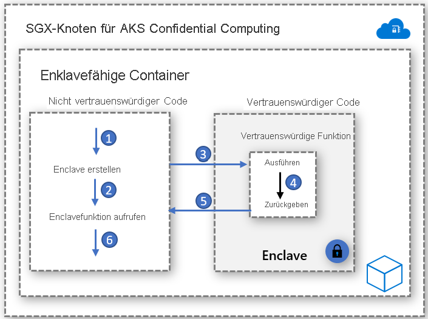

# Enklavefähige Container

Bei einer Enklave handelt es sich um einen geschützten Arbeitsspeicherbereich, der Vertraulichkeit für Daten und für die Codeausführung bietet. Sie ist eine Instanz einer hardwaregeschützten vertrauenswürdigen Ausführungsumgebung (Trusted Execution Environment, TEE). Von Confidential Computing-Knoten in AKS wird [Intel SGX (Software Guard Extensions)](https://software.intel.com/sgx) verwendet, um Umgebungen mit isolierten Enklaven in den Knoten zwischen den einzelnen Containeranwendungen zu erstellen.

Genau wie virtuelle Intel SGX-Computer verfügen auch Containeranwendungen, die für die Ausführung in Enklaven entwickelt werden, über zwei Komponenten:

- Eine nicht vertrauenswürdige Komponente (Host)
- Eine vertrauenswürdige Komponente (Enklave)

Die Anwendungsarchitektur enklavefähiger Container bietet maximale Kontrolle über die Implementierung und sorgt gleichzeitig dafür, den Codeumfang der Enklave gering zu halten. Die Minimierung des in der Enklave ausgeführten Codes trägt zur Verringerung der Angriffsfläche bei.   

## Grundvoraussetzungen

### Open Enclave SDK
Das Open Enclave SDK ist eine hardwareunabhängige Open-Source-Bibliothek für die Entwicklung von C- und C++-Anwendungen, von denen hardwarebasierte vertrauenswürdige Ausführungsumgebungen genutzt werden. Die aktuelle Implementierung unterstützt Intel SGX und bietet eine Vorschauunterstützung für [OP-TEE OS on Arm TrustZone](https://optee.readthedocs.io/en/latest/general/about.html).

Informationen zu den ersten Schritten mit Open Enclave-basierten Containeranwendungen finden Sie [hier](https://github.com/openenclave/openenclave/tree/master/docs/GettingStartedDocs).

### Intel SGX SDK
Intel pflegt das Software Development Kit für die Erstellung von SGX-Anwendungen für Linux- und Windows-Containerworkloads. Windows-Container werden derzeit von Confidential Computing-Knoten in AKS nicht unterstützt.

Informationen zu den ersten Schritten mit Intel SGX-basierten Anwendungen finden Sie [hier](https://software.intel.com/content/www/us/en/develop/topics/software-guard-extensions/sdk.html).

### Confidential Consortium Framework (CCF)
Das Confidential Consortium Framework (CCF) ist ein Open-Source-Framework für die Erstellung einer neuen Kategorie sicherer, hochverfügbarer und leistungsfähiger Anwendungen mit Schwerpunkt auf Computing und Daten mehrerer Parteien. Das CCF ermöglicht die Erstellung umfangreicher, vertraulicher Netzwerke, die die wichtigsten Unternehmensanforderungen erfüllen, was wiederum zur Beschleunigung der Produktion sowie der Einführung von konsortiumbasierten Blockchain-Lösungen und Mehrparteien-Computetechnologien in Unternehmen beitragen kann.

Informationen zu den ersten Schritten mit Azure Confidential Computing und CCF finden Sie [hier](https://github.com/Microsoft/CCF).

### ONNX-Runtime für vertrauliches Rückschließen

Von der enklavebasierten Open-Source-ONNX-Runtime wird ein sicherer Kanal zwischen dem Client und dem Rückschlussdienst eingerichtet, um sicherzustellen, dass weder die Anforderung noch die Antwort die sichere Enklave verlässt. 

Mit dieser Lösung können Sie ein bereits vorhandenes, per Machine Learning trainiertes Modell verwenden und vertraulich ausführen. Gleichzeitig sorgt die Lösung mittels Nachweis und Überprüfungen für Vertrauen zwischen Client und Server. 

Informationen zu den ersten Schritten für eine Lift & Shift-Migration eines ML-Modells zur ONNX-Runtime finden Sie [hier](https://aka.ms/confidentialinference).

### Edgeless RT

Edgeless RT ist ein Open-Source-Projekt, das auf dem Open Enclave SDK aufbaut. Es ist Unterstützung für Go und zusätzliche C++-Features vorhanden. Steigen Sie [hier](https://github.com/edgelesssys/edgelessrt) in die Nutzung einer einfachen vertraulichen Go-Anwendung in Ihrer vertrauten VS Code-Umgebung ein. Befolgen Sie [diese Anleitung](https://github.com/edgelesssys/edgelessrt/blob/master/docs/ERTAzureAKSDeployment.md) für Edgeless-Anwendungen in AKS.

## Containerbasierte Beispielimplementierungen

[Azure-Beispiele für enklavefähige Container in AKS](https://github.com/Azure-Samples/confidential-computing/tree/main/containersamples)

<!-- LINKS - external -->
[Azure Attestation](../attestation/overview.md)

<!-- LINKS - internal -->
[Virtuelle DC-Computer](./virtual-machine-solutions.md)
[Vertrauliche Container](./confidential-containers.md)