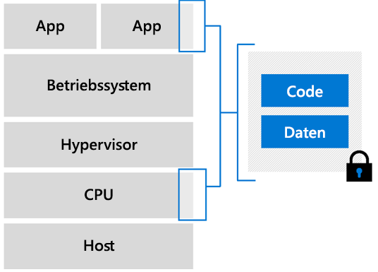

# Confidential Computing unter Azure

Mit Azure Confidential Computing können Sie Ihre vertraulichen Daten isolieren, während sie in der Cloud verarbeitet werden. Confidential Computing wird in vielen Branchen genutzt, um die Daten zu schützen. Beispiele für Workloads dieser Art sind:

- Schützen von Finanzdaten
- Schützen von Patientendaten
- Ausführen von Machine Learning-Prozessen für vertrauliche Daten
- Ausführen von Algorithmen für verschlüsselte Datasets aus mehreren Quellen

## Übersicht

> [!VIDEO https://www.youtube.com/embed/rT6zMOoLEqI]

Wir wissen, wie wichtig der Schutz Ihrer Clouddaten für Sie ist. Wir nehmen Ihre Bedenken ernst. Hier sind einige Fragen aufgeführt, die unsere Kunden in Bezug auf die Verlagerung von sensiblen Workloads in die Cloud ggf. stellen: 

- Wie kann ich sicherstellen, dass Microsoft keinen Zugriff auf unverschlüsselte Daten hat?
- Wie kann ich Sicherheitsbedrohungen durch privilegierte Administratoren innerhalb meines Unternehmens verhindern?
- Welche weiteren Möglichkeiten habe ich, um zu verhindern, dass Dritte Zugriff auf vertrauliche Kundendaten haben?

Mit Microsoft Azure können Sie Ihre Angriffsfläche verkleinern, um einen höheren Schutz von Daten zu erzielen. Azure verfügt bereits über viele Tools zum Schützen von [**ruhenden Daten**](../security/fundamentals/encryption-atrest.md), indem Modelle wie die clientseitige und serverseitige Verschlüsselung genutzt werden. Darüber hinaus können in Azure Verfahren genutzt werden, um [**Daten während der Übertragung**](../security/fundamentals/data-encryption-best-practices.md#protect-data-in-transit) zu verschlüsseln. Hierfür werden sichere Protokolle wie TLS und HTTPS verwendet. Auf dieser Seite wird noch eine dritte Möglichkeit zum Verschlüsseln von Daten vorgestellt: die Verschlüsselung von **Daten in Gebrauch**.

## Einführung in Confidential Computing 

Confidential Computing ist ein branchenüblicher Begriff, der vom [Confidential Computing Consortium](https://confidentialcomputing.io/) (CCC) definiert wurde. Diese Vereinigung hat es sich zur Aufgabe gemacht, Definitionen für die Einführung des Confidential Computing festzulegen und die Nutzung zu fördern. Das CCC definiert Confidential Computing als den Schutz der verwendeten Daten durch die Durchführung von Berechnungen in einer hardwarebasierten vertrauenswürdigen Ausführungsumgebung (Trusted Execution Environment, TEE).

Eine TEE ist eine Umgebung, mit der die ausschließliche Ausführung von autorisiertem Code erzwungen wird. Für alle Daten in der TEE ist es nicht möglich, dass sie mit Code, der sich außerhalb dieser Umgebung befindet, gelesen oder manipuliert werden.

### Enclaves

Enklaven sind geschützte Bereiche des Prozessors und Arbeitsspeichers von Hardware. Es gibt keine Möglichkeit, Daten oder Code innerhalb der Enklave anzuzeigen – auch nicht mit einem Debugger. Wenn mit nicht vertrauenswürdigem Code versucht wird, den Inhalt im Arbeitsspeicher der Enklave zu ändern, wird die Umgebung deaktiviert und die Durchführung der Vorgänge verweigert.

Beim Entwickeln von Anwendungen können Sie [Softwaretools](#oe-sdk) verwenden, um Teile Ihres Codes und Ihrer Daten in der Enklave abzuschirmen. Mit diesen Tools können Sie sicherstellen, dass Ihr Code und Ihre Daten von Personen außerhalb der vertrauenswürdigen Umgebung nicht angezeigt oder geändert werden können. 

Sie können sich eine Enklave im Wesentlichen wie eine geschützte Box vorstellen. Sie fügen verschlüsselten Code und verschlüsselte Daten in die Blackbox ein. Von außen ist der Blick in das innere der Blackbox nicht möglich. Sie ordnen der Enklave einen Schlüssel zum Entschlüsseln der Daten zu, und die Daten werden dann verarbeitet und wieder verschlüsselt, bevor das Versenden aus der Enklave erfolgt.

### Nachweis

Sie möchten sicherlich überprüfen und verifizieren können, dass Ihre vertrauenswürdige Umgebung sicher ist. Diese Verifizierung wird als Nachweisvorgang bezeichnet. 

Mit der Erbringung des Nachweises kann das Vertrauen der vertrauenden Seite gestärkt werden, dass die eigene Software (1) in einer Enklave ausgeführt wird und (2) dass die Enklave aktuell und geschützt ist. Bei einer Enklave wird die zugrunde liegende Hardware aufgefordert, Anmeldeinformationen als Nachweis zu generieren, dass die Enklave auf der Plattform vorhanden ist. Der Bericht kann dann an eine zweite Enklave weitergegeben werden, die bestätigt, dass der Bericht auf derselben Plattform generiert wurde.

Der Nachweisvorgang muss über einen sicheren Nachweisdienst implementiert werden, der mit der Systemsoftware und der Hardware kompatibel ist. Die [Nachweis- und Bereitstellungsdienste von Intel](https://software.intel.com/sgx/attestation-services) sind mit virtuellen Azure Confidential Computing-Computern kompatibel.

## Verwenden von Azure für cloudbasiertes Confidential Computing 

Mit Azure Confidential Computing können Sie Confidential Computing-Funktionen in einer virtualisierten Umgebung nutzen. Sie können jetzt Tools, Software und Cloudinfrastruktur verwenden, um basierend auf sicherer Hardware Erweiterungen vorzunehmen. 

### Virtual Machines

Azure ist der erste Cloudanbieter, der Confidential Computing in einer virtualisierten Umgebung anbietet. Wir haben virtuelle Computer entwickelt, die als Abstraktionsschicht zwischen der Hardware und Ihrer Anwendung fungieren. Sie können Workloads bedarfsgesteuert und mit Redundanz- und Verfügbarkeitsoptionen ausführen.  

#### Intel SGX-fähige virtuelle Computer

Bei virtuellen Azure Confidential Computing-Computern ist ein Teil der CPU-Hardware für einen Teil des Codes und der Daten in Ihrer Anwendung reserviert. Dieser eingeschränkte Teil ist die Enklave. 

Azure Confidential Computing-Infrastruktur umfasst derzeit eine spezielle SKU mit virtuellen Computern (VMs). Diese VMs werden auf Intel-Prozessoren mit Software Guard Extension (Intel SGX) ausgeführt. [Intel SGX](https://intel.com/sgx) ist die Komponente, die den höheren Schutzgrad beim Confidential Computing ermöglicht. 

Azure bietet die [DCsv2-Serie](https://docs.microsoft.com/azure/virtual-machines/dcv2-series), die auf Intel SGX-Technologie basiert, für die Erstellung von hardwarebasierten Enklaven an. Sie können sichere Enklavenanwendungen entwickeln, die auf VMs der DCsv2-Serie ausgeführt werden, um Ihre Anwendungsdaten und den verwendeten Code zu schützen. 

[Informieren Sie sich weiter](virtual-machine-solutions.md) über die Bereitstellung von virtuellen Azure Confidential Computing-Computern mit hardwarebasierten vertrauenswürdigen Enklaven.

## Anwendungsentwicklung 

Für die Nutzung der Leistungsfähigkeit von Enklaven und isolierten Umgebungen müssen Sie Tools verwenden, die Confidential Computing unterstützen. Es gibt unterschiedliche Tools, die die Entwicklung von Enklavenanwendungen unterstützen. Beispielsweise können Sie die folgenden Open-Source-Frameworks verwenden: 

- [Open Enclave Software Development Kit (SDK)](https://github.com/openenclave/openenclave)
- [Confidential Consortium Framework (CCF)](https://github.com/Microsoft/CCF)

### Übersicht

Eine für Enklaven erstellte Anwendung wird auf zwei Arten partitioniert:
1. In eine „nicht vertrauenswürdige“ Komponente (Host)
1. In eine „vertrauenswürdige“ Komponente (Enklave)

**Der Host** ist eine nicht vertrauenswürdige Umgebung, in der Ihre Enklavenanwendung ausgeführt wird. Auf den auf dem Host bereitgestellten Enklavencode kann der Host nicht zugreifen. 

**Die Enklave** ist der Ort, an dem der Anwendungscode und seine zwischengespeicherten Daten bzw. der Arbeitsspeicher ausgeführt werden. Rechenvorgänge mit hohen Sicherheitsanforderungen sollten in der Enklave durchgeführt werden, um dafür zu sorgen, dass Geheimnisse und vertrauliche Daten geschützt bleiben. 

Während des Anwendungsentwurfs ist es wichtig, zu identifizieren und zu bestimmen, welcher Teil der Anwendung in den Enklaven ausgeführt werden muss. Der Code, den Sie in der vertrauenswürdigen Komponente anordnen, wird vom restlichen Teil Ihrer Anwendung isoliert. Nachdem die Enklave initialisiert und der Code in den Arbeitsspeicher geladen wurde, kann dieser Code nicht mehr von den nicht vertrauenswürdigen Komponenten gelesen oder geändert werden. 

### Open Enclave Software Development Kit (OE SDK) 

Verwenden Sie eine Bibliothek oder ein Framework, die bzw. das von Ihrem Anbieter unterstützt wird, falls Sie Code für die Ausführung in einer Enklave schreiben möchten. Das [Open Enclave SDK](https://github.com/openenclave/openenclave) (OE SDK) ist ein Open-Source-SDK, das die Abstraktion über unterschiedliche Confidential Computing-fähige Hardware ermöglicht. 

Das OE SDK ist so konzipiert, dass es als einzelne Abstraktionsschicht für beliebige Hardware und CSPs genutzt wird. Das OE SDK kann zusätzlich zu virtuellen Azure Confidential Computing-Computern verwendet werden, um Anwendungen basierend auf Enklaven zu erstellen und auszuführen.

## Nächste Schritte

Stellen Sie einen virtuellen Computer der DCsv2-Serie bereit, und installieren Sie das OE SDK darauf.

> [!div class="nextstepaction"]
> [Bereitstellen eines virtuellen Confidential Computing-Computers in Azure Marketplace](quick-create-marketplace.md)
