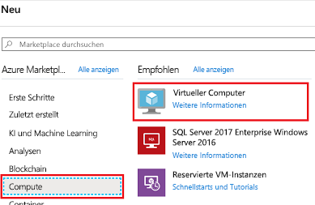
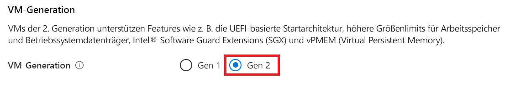
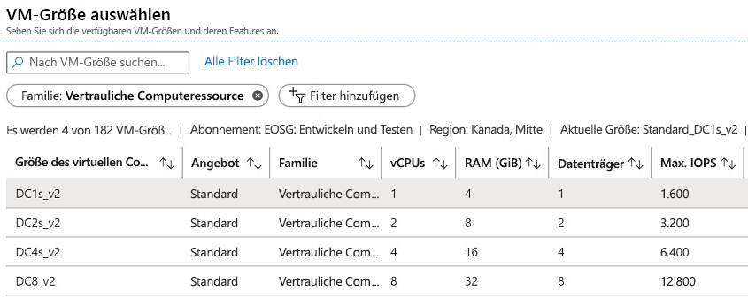
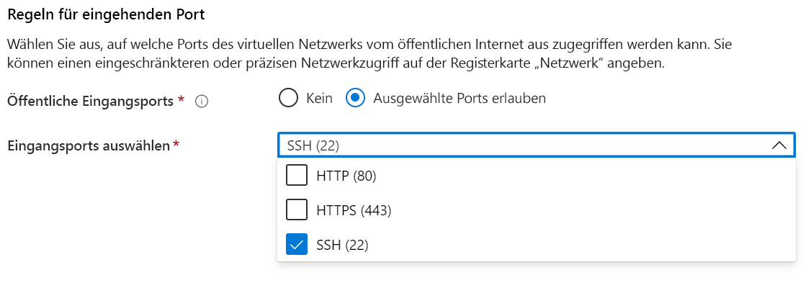

# <a name="quickstart-deploy-an-azure-confidential-computing-vm-in-the-azure-portal"></a>Schnellstart: Bereitstellen eines virtuellen Azure Confidential Computing-Computers im Azure-Portal

Steigen Sie in Azure Confidential Computing ein, indem Sie das Azure-Portal zum Erstellen eines virtuellen Computers (VM) verwenden, der auf Intel SGX basiert. Anschließend installieren Sie das Open Enclave Software Development Kit (SDK), um Ihre Entwicklungsumgebung einzurichten. 

Wir empfehlen Ihnen dieses Tutorial, wenn Sie an der Bereitstellung eines virtuellen Confidential Computing-Computers mit benutzerdefinierter Konfiguration interessiert sind. Andernfalls empfehlen wir Ihnen, den Artikel zum Thema [Virtueller Confidential Computing-Computer: Bereitstellungsschritte für den kommerziellen Microsoft-Marketplace](quick-create-marketplace.md) zu lesen.


## <a name="prerequisites"></a>Voraussetzungen

Wenn Sie kein Azure-Abonnement besitzen, [erstellen Sie ein Konto](https://azure.microsoft.com/pricing/purchase-options/pay-as-you-go/), bevor Sie beginnen.

> [!NOTE]
> Mit kostenlosen Testkonten ist kein Zugriff auf die virtuellen Computer möglich, die in diesem Tutorial verwendet werden. Führen Sie ein Upgrade auf ein Abonnement mit nutzungsbasierter Zahlung durch.


## <a name="sign-in-to-azure"></a>Anmelden bei Azure

1. Melden Sie sich beim [Azure-Portal](https://portal.azure.com/) an.

1. Wählen Sie oben die Option **Ressource erstellen** aus.

1. Wählen Sie im Bereich **Marketplace** links die Option **Compute** aus.

1. Wählen Sie **Virtueller Computer** aus.

    

1. Wählen Sie auf der Startseite des virtuellen Computers die Option **Erstellen** aus.


## <a name="configure-a-confidential-computing-virtual-machine"></a>Konfigurieren eines virtuellen Confidential Computing-Computers

1. Wählen Sie auf der Registerkarte **Grundlagen** Ihr **Abonnement** und Ihre **Ressourcengruppe** aus.

1. Geben Sie im Feld **Name des virtuellen Computers** einen Namen für Ihre neue VM ein.

1. Geben Sie folgende Werte ein bzw. wählen diese aus:

   * **Region**: Wählen Sie die für Sie geeignete Azure-Region aus.

        > [!NOTE]
        > Virtuelle Confidential Computing-Computer werden nur auf spezieller Hardware ausgeführt, die in bestimmten Regionen verfügbar ist. Die neuesten verfügbaren Regionen für VMs der DCsv2-Serie sind unter [Verfügbare Regionen](https://azure.microsoft.com/global-infrastructure/services/?products=virtual-machines) angegeben.

1. Konfigurieren Sie das Betriebssystemimage, das Sie für Ihren virtuellen Computer verwenden möchten.

    * **Image auswählen**: Wählen Sie für dieses Tutorial „Ubuntu 18.04 LTS“ aus. Sie können auch „Windows Server 2019“, „Windows Server 2016“ oder „Ubuntu 16.04 LTS“ auswählen. Wenn Sie sich für eines dieser Images entscheiden, werden Sie in diesem Tutorial entsprechend umgeleitet.
    
    * **Image für Gen 2 wechseln**: Virtuelle Confidential Computing-Computer werden nur unter Images vom Typ [Generation 2](../virtual-machines/generation-2.md) ausgeführt. Stellen Sie sicher, dass das ausgewählte Image den Typ „Generation 2“ aufweist. Klicken Sie oben auf die Registerkarte **Erweitert**, auf der Sie den virtuellen Computer konfigurieren. Scrollen Sie nach unten bis zum Abschnitt „VM-Generation“. Wählen Sie „Gen 2“ aus, und wechseln Sie anschließend zurück zur Registerkarte **Grundlagen**.
    

        


        

    * **Zur grundlegenden Konfiguration wechseln**: Wechseln Sie zurück zur Registerkarte **Grundlagen**, indem Sie oben die Navigationselemente verwenden.

1. Wählen Sie in der Größenauswahl einen virtuellen Computer mit Confidential Computing-Funktionen aus, indem Sie die Option **Größe ändern** verwenden. Klicken Sie in der VM-Größenauswahl auf **Alle Filter löschen**. Wählen Sie die Option **Filter hinzufügen** und **Familie** als Filtertyp aus. Wählen Sie anschließend nur **Vertrauliche Computeressource** aus.

    

    > [!TIP]
    > Es sollten die Größen **DC1s_v2**, **DC2s_v2**, **DC4s_V2** und **DC8_v2** aufgeführt sein. Dies sind die einzigen VM-Größen, für die Confidential Computing derzeit unterstützt wird. [Weitere Informationen](virtual-machine-solutions.md)

1. Geben Sie die folgenden Informationen ein:

   * **Authentifizierungstyp:** Wählen Sie **Öffentlicher SSH-Schlüssel** aus, wenn Sie eine Linux-VM erstellen. 

        > [!NOTE]
        > Für die Authentifizierung können Sie einen öffentlichen SSH-Schlüssel oder ein Kennwort verwenden. SSH ist sicherer. Wie Sie einen SSH-Schlüssel generieren, erfahren Sie unter [Erstellen und Verwenden eines SSH-Schlüsselpaars (öffentlich und privat) für virtuelle Linux-Computer in Azure](../virtual-machines/linux/mac-create-ssh-keys.md).

    * **Benutzername**: Geben Sie den Administratornamen für die VM ein.

    * **Öffentlicher SSH-Schlüssel**: Geben Sie Ihren öffentlichen RSA-Schlüssel ein (falls zutreffend).
    
    * **Kennwort**: Geben Sie Ihr Kennwort für die Authentifizierung ein (falls zutreffend).

    * **Öffentliche Eingangsports**: Wählen Sie die Option **Ausgewählte Ports zulassen** und dann in der Liste **Öffentliche Eingangsports hinzufügen** die Optionen **SSH (22)** und **HTTP (80)** aus. Wählen Sie bei der Bereitstellung einer Windows-VM die Optionen **HTTP (80)** und **RDP (3389)** aus. In dieser Schnellstartanleitung ist dieser Schritt erforderlich, um eine Verbindung mit dem virtuellen Computer herzustellen und die Konfiguration für das Open Enclave SDK durchzuführen. 

     


1. Nehmen Sie Änderungen auf der Registerkarte **Datenträger** vor.

   * Bei Auswahl eines virtuellen Computers vom Typ **DC1s_v2**, **DC2s_v2** oder **DC4s_V2** sollten Sie entweder **SSD Standard** oder **SSD Premium** als Datenträgertyp auswählen. 
   * Wählen Sie für einen virtuellen Computer vom Typ **DC8_v2** die Option **SSD Standard** als Datenträgertyp aus.

1. Nehmen Sie auf den folgenden Registerkarten die gewünschten Änderungen an den Einstellungen vor, oder übernehmen Sie die Standardeinstellungen.

    * **Netzwerk**
    * **Verwaltung**
    * **Gastkonfiguration**
    * **Tags**

1. Klicken Sie auf **Überprüfen + erstellen**.

1. Klicken Sie im Bereich **Bewerten + erstellen** auf **Erstellen**.

> [!NOTE]
> Fahren Sie im nächsten Abschnitt mit diesem Tutorial fort, wenn Sie eine Linux-VM bereitgestellt haben. Gehen Sie bei Bereitstellung einer Windows-VM so vor, dass Sie [diese Schritte für die Verbindungsherstellung mit Ihrer Windows-VM ausführen](../virtual-machines/windows/connect-logon.md) und dann das [OE SDK unter Windows installieren](https://github.com/openenclave/openenclave/blob/master/docs/GettingStartedDocs/install_oe_sdk-Windows.md).


## <a name="connect-to-the-linux-vm"></a>Herstellen einer Verbindung mit dem virtuellen Linux-Computer

Wenn Sie bereits über eine BASH-Shell verfügen, verwenden Sie den Befehl **ssh**, um eine Verbindung mit dem virtuellen Azure-Computer herzustellen. Ersetzen Sie im folgenden Befehl den VM-Benutzernamen und die IP-Adresse, um eine Verbindung mit Ihrem virtuellen Linux-Computer herzustellen.

```bash
ssh azureadmin@40.55.55.555
```

Sie finden die öffentliche IP-Adresse Ihrer VM im Azure-Portal im Abschnitt mit der „Übersicht“ für Ihre VM.

:::image type="content" source="media/quick-create-portal/public-ip-virtual-machine.png" alt-text="IP-Adresse im Azure-Portal":::

Wenn Sie mit Windows arbeiten und nicht über eine BASH-Shell verfügen, installieren Sie einen SSH-Client (beispielsweise PuTTY).

1. [Laden Sie PuTTY herunter, und installieren Sie es.](https://www.chiark.greenend.org.uk/~sgtatham/putty/download.html)

1. Führen Sie PuTTY aus.

1. Geben Sie im Konfigurationsbildschirm von PuTTY die öffentliche IP-Adresse Ihres virtuellen Computers ein.

1. Wählen Sie **Öffnen** aus, und geben Sie Ihren Benutzernamen und Ihr Kennwort ein.

Weitere Informationen zum Herstellen einer Verbindung mit virtuellen Linux-Computern finden Sie unter [Erstellen einer Linux-VM mit dem Azure-Portal](../virtual-machines/linux/quick-create-portal.md).

> [!NOTE]
> Falls eine PuTTY-Sicherheitswarnung angezeigt wird, dass der Hostschlüssel des Servers nicht in der Registrierung zwischengespeichert wird, wählen Sie eine der folgenden Optionen aus. Wenn Sie diesem Host vertrauen, wählen Sie **Ja** aus, um den Schlüssel dem Cache von PuTTy hinzuzufügen und die Verbindungsherstellung fortzusetzen. Wenn Sie die Verbindung nur einmal herstellen möchten, ohne den Schlüssel dem Cache hinzuzufügen, wählen Sie **Nein** aus. Wenn Sie diesem Host nicht vertrauen, wählen Sie **Abbrechen** aus, um die Verbindungsherstellung abzubrechen.

## <a name="install-the-open-enclave-sdk-oe-sdk"></a>Installieren des Open Enclave SDK (OE SDK) <a id="Install"></a>

Befolgen Sie die Schritt-für-Schritt-Anleitung für die Installation des [OE SDK](https://github.com/openenclave/openenclave) auf Ihrem virtuellen Computer der DCsv2-Serie, auf dem ein Image vom Typ „Ubuntu 18.04 LTS Gen 2“ ausgeführt wird. 

Wenn Ihr virtueller Computer unter Ubuntu 16.04 LTS Gen 2 ausgeführt wird, gilt die [Installationsanleitung für Ubuntu 16.04](https://github.com/openenclave/openenclave/blob/master/docs/GettingStartedDocs/install_oe_sdk-Ubuntu_16.04.md).

#### <a name="1-configure-the-intel-and-microsoft-apt-repositories"></a>1. Konfigurieren der Intel- und Microsoft APT-Repositorys

```bash
echo 'deb [arch=amd64] https://download.01.org/intel-sgx/sgx_repo/ubuntu bionic main' | sudo tee /etc/apt/sources.list.d/intel-sgx.list
wget -qO - https://download.01.org/intel-sgx/sgx_repo/ubuntu/intel-sgx-deb.key | sudo apt-key add -

echo "deb http://apt.llvm.org/bionic/ llvm-toolchain-bionic-7 main" | sudo tee /etc/apt/sources.list.d/llvm-toolchain-bionic-7.list
wget -qO - https://apt.llvm.org/llvm-snapshot.gpg.key | sudo apt-key add -

echo "deb [arch=amd64] https://packages.microsoft.com/ubuntu/18.04/prod bionic main" | sudo tee /etc/apt/sources.list.d/msprod.list
wget -qO - https://packages.microsoft.com/keys/microsoft.asc | sudo apt-key add -
```

#### <a name="2-install-the-intel-sgx-dcap-driver"></a>2. Installieren des Intel SGX DCAP-Treibers

```bash
sudo apt update
sudo apt -y install dkms
wget https://download.01.org/intel-sgx/sgx-dcap/1.9/linux/distro/ubuntu18.04-server/sgx_linux_x64_driver_1.36.2.bin -O sgx_linux_x64_driver.bin
chmod +x sgx_linux_x64_driver.bin
sudo ./sgx_linux_x64_driver.bin
```

> [!WARNING]
> Verwenden Sie den aktuellen Intel SGX DCAP-Treiber von der [SGX-Website von Intel](https://01.org/intel-software-guard-extensions/downloads).

#### <a name="3-install-the-intel-and-open-enclave-packages-and-dependencies"></a>3. Installieren der Intel- und Open Enclave-Pakete und -Abhängigkeiten

```bash
sudo apt -y install clang-7 libssl-dev gdb libsgx-enclave-common libsgx-enclave-common-dev libprotobuf10 libsgx-dcap-ql libsgx-dcap-ql-dev az-dcap-client open-enclave
```

> [!NOTE] 
> In diesem Schritt wird auch das Paket [az-dcap-client](https://github.com/microsoft/azure-dcap-client) installiert, das für die Durchführung von Remotenachweisen in Azure benötigt wird.

#### <a name="4-verify-the-open-enclave-sdk-install"></a>4. **Überprüfen der Open Enclave SDK-Installation**

Informationen zur Überprüfung und Nutzung des installierten SDK finden Sie auf GitHub unter [Verwenden des Open Enclave SDK](https://github.com/openenclave/openenclave/blob/master/docs/GettingStartedDocs/Linux_using_oe_sdk.md).

## <a name="clean-up-resources"></a>Bereinigen von Ressourcen

Wenn Ressourcengruppe, virtueller Computer und alle zugehörigen Ressourcen nicht mehr benötigt werden, können Sie sie löschen. 

Wählen Sie die Ressourcengruppe für den virtuellen Computer und dann **Löschen** aus. Bestätigen Sie dann den Namen der Ressourcengruppe, um das Löschen der Ressourcen abzuschließen.

## <a name="next-steps"></a>Nächste Schritte

In dieser Schnellstartanleitung haben Sie einen virtuellen Confidential Computing-Computer bereitgestellt und das Open Enclave SDK installiert. Weitere Informationen zu virtuellen Confidential Computing-Computern in Azure finden Sie unter [Lösungen für virtuelle Computer](virtual-machine-solutions.md). 

Machen Sie sich damit vertraut, wie Sie Confidential Computing-Anwendungen entwickeln, indem Sie mit den Beispielen zum Open Enclave SDK auf GitHub fortfahren. 

> [!div class="nextstepaction"]
> [Entwickeln von Open Enclave SDK-Beispielen](https://github.com/openenclave/openenclave/blob/master/samples/README.md)