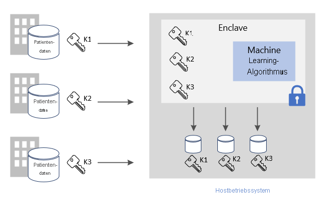
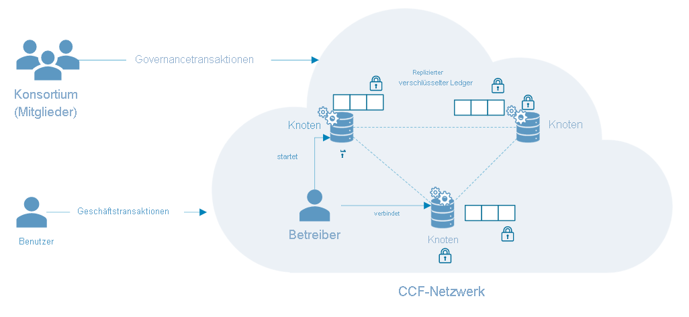

# Gängige Szenarien für Azure Confidential Computing

Dieser Artikel enthält eine Übersicht über verschiedene gängige Szenarien für Azure Confidential Computing. Die Empfehlungen in diesem Artikel dienen als Ausgangspunkt für die Anwendungsentwicklung mit Confidential Computing-Diensten und -Frameworks. 

Nach Lesen dieses Artikels können Sie die folgenden Fragen beantworten:

- Was sind Beispiele für gängige Azure Confidential Computing-Szenarien?
- Welche Vorteile hat die Verwendung von Azure Confidential Computing in Szenarien mit mehreren Parteien?
- Welche Vorteile hat die Verwendung von Azure Confidential Computing in einem Blockchain-Netzwerk?

## Sicheres Computing mit mehreren Parteien
Azure Confidential Computing ermöglicht die Verarbeitung von Daten aus mehreren Quellen, ohne die Eingabedaten für andere Parteien offenzulegen. Diese Art der sicheren Berechnung ermöglicht zahlreiche Szenarien. Hierzu zählen beispielsweise Geldwäschebekämpfung, Betrugserkennung und die sichere Analyse von Gesundheitsdaten.

Daten können von mehreren Quellen in eine Enklave auf einem virtuellen Computer hochgeladen werden. Eine Partei weist die Enklave an, Berechnungen oder Verarbeitungsvorgänge für die Daten durchzuführen. Die Daten, die von anderen Parteien in die Enklave hochgeladen wurden, sind für die jeweils anderen Parteien nicht sichtbar (auch nicht für die Partei, die die Analyse durchführt). 

Beim sicheren Computing mit mehreren Parteien werden verschlüsselte Daten an die Enklave übermittelt. Die Enklave entschlüsselt die Daten mithilfe eines Schlüssels, führt die Analyse durch, ruft ein Ergebnis ab und gibt ein verschlüsseltes Ergebnis zurück, das von einer Partei unter Verwendung des entsprechenden Schlüssels entschlüsselt werden kann. 

**Schützen von Daten während der Verwendung** 
- Verwenden Sie einen virtuellen Computer (virtual machine, VM) der DCsv2-Serie in Azure mit aktivierter Intel SGX-Unterstützung. Diese virtuellen Computer verfügen über vertrauenswürdige Ausführungsumgebungen (Trusted Execution Environments, TEEs), in denen Teile Ihrer Anwendungsdaten und Ihres Codes geschützt und isoliert werden.
- Verwenden Sie ein enklavefähiges SDK, um innerhalb des virtuellen Computers eine Enklave erstellen zu können. Daten in der Enklave werden nicht offengelegt (nicht einmal dem VM-Anbieter gegenüber). Die Daten in der Enklave werden mit Hardwareunterstützung verschlüsselt.
    - Für die serverseitige Verarbeitung kann beispielsweise das [OE SDK](https://github.com/openenclave/openenclave) verwendet werden. 

**Schützen von Daten bei der Übertragung** 
- Verwenden Sie bestätigte TLS als geschützten Kanal, um die Sicherheit von Daten bei der Übertragung zu gewährleisten.
- Der Client stellt sicher, dass die Daten nur an den gleichen Server gesendet werden, der durch die Enklave geschützt ist. 

**Schutz gespeicherter Daten**
- Verwenden Sie geschützte und sichere Datenspeicher, um die Sicherheit ruhender Daten zu gewährleisten. 

### Geldwäschebekämpfung
In diesem Beispiel für sicheres Computing mit mehreren Parteien tauschen mehrere Banken Daten aus, ohne persönliche Daten Ihrer Kunden offenzulegen. Banken führen vereinbarte Analysen für das kombinierte vertrauliche Dataset durch. Durch die Analyse des aggregierten Datasets können Geldbewegungen eines Benutzers zwischen mehreren Banken erkannt werden, ohne dass die Banken auf die Daten der jeweils anderen Banken zugreifen.

Dank Confidential Computing können diese Finanzinstitute die Betrugserkennungsrate erhöhen, Maßnahmen gegen Geldwäsche ergreifen, False Positives reduzieren und weitere Erkenntnisse aus umfangreicheren Datasets gewinnen. 

### Medikamentenentwicklung im Gesundheitswesen
Partnergesundheitseinrichtungen steuern private Gesundheitsdatasets bei, um ein Machine Learning-Modell zu trainieren. Die einzelnen Einrichtungen haben jeweils nur Zugriff auf ihr eigenes Dataset. Die Daten und das Trainingsmodell sind weder für eine andere Einrichtung noch für den Cloudanbieter sichtbar. 

Alle Einrichtungen profitieren von der Nutzung des trainierten Modells. Durch die Erstellung eines Modells mit mehr Daten wurde das Modell genauer. Jede Einrichtung, die zum Trainieren des Modells beigetragen hat, kann das Modell nutzen und hilfreiche Ergebnisse erhalten. 

## Blockchain

Bei einem Blockchain-Netzwerk handelt es sich um ein dezentralisiertes Netzwerk von Knoten. Diese Knoten werden von Operatoren oder Validierern betrieben und gepflegt, deren Ziel darin besteht, die Integrität zu wahren und einen Konsens hinsichtlich des Netzwerkzustands zu erreichen. Die Knoten selbst sind Replikate von Ledgern und dienen zur Nachverfolgung von Blockchain-Transaktionen. Jeder Knoten verfügt über eine vollständige Kopie des Transaktionsverlaufs, um die Integrität und Verfügbarkeit in einem verteilten Netzwerk zu gewährleisten.

Auf Confidential Computing aufbauende Blockchain-Technologien ermöglichen die Nutzung von hardwarebasiertem Datenschutz, um die Vertraulichkeit von Daten sowie sichere Berechnungen sicherzustellen. In einigen Fällen wird auch das gesamte Ledger verschlüsselt, um den Datenzugriff zu schützen. Manchmal wird die eigentliche Transaktion unter Umständen in einem Computemodul innerhalb der Enklave im Knoten abgewickelt.

### Confidential Consortium Framework (CCF)
Das [CCF](https://www.microsoft.com/research/project/confidential-consortium-framework/) ist ein Beispiel für ein verteiltes Blockchain-Framework, das auf Azure Confidential Computing basiert. Dieses Framework wurde von Microsoft Research eingeführt und nutzt vertrauenswürdige Ausführungsumgebungen (Trusted Execution Environments, TEEs), um ein Netzwerk mit Remoteenklaven für Nachweise zu schaffen. Knoten können auf virtuellen Azure-Computern ([DCsv2-Serie](confidential-computing-enclaves.md)) ausgeführt werden und die Enklaveninfrastruktur nutzen. Über Nachweisprotokolle können Benutzer der Blockchain die Integrität eines einzelnen CCF-Knotens verifizieren und effektiv das gesamte Netzwerk überprüfen. 

Im CCF besteht der dezentralisierte Ledger aus erfassten Änderungen an einem Schlüssel-Wert-Speicher, der auf allen Netzwerkknoten repliziert wird. Auf jedem dieser Knoten wird eine Transaktionsengine ausgeführt, die von Benutzern der Blockchain über TLS ausgelöst werden kann. Wenn Sie einen Endpunkt auslösen, wird der Schlüssel-Wert-Speicher mutiert. Damit die verschlüsselte Änderung im dezentralisierten Ledger erfasst wird, ist die Zustimmung einer bestimmten Anzahl von Knoten erforderlich, um einen Konsens zu erreichen. 

## Nächste Schritte
[Schnellstart: Bereitstellen eines virtuellen Azure Confidential Computing-Computers im Marketplace](quick-create-marketplace.md)

