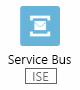
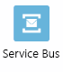

# Connectors für Azure Logic Apps

Connectors ermöglichen den schnellen anwendungs-, dienst-, protokoll- und plattformübergreifenden Zugriff von Azure Logic Apps auf Ereignisse, Daten und Aktionen. Durch Verwenden von Connectors in Ihren Logik-Apps erweitern Sie die Funktionen für Ihre Cloud- und lokalen Apps, um Aufgaben mit zu erstellenden oder bereits vorhandenen Daten auszuführen.

Logic Apps bietet [Hunderte Connectors](/connectors). In diesem Artikel werden die *beliebten und häufiger verwendeten* Connectors beschrieben, die in Tausenden von Apps und Millionen von Ausführungen zur Verarbeitung von Daten und Informationen erfolgreich verwendet werden. Eine vollständige Liste der Connectors und die Referenzinformationen zu jedem Connector, wie Trigger, Aktionen und Limits, finden Sie auf den Referenzseiten zu Connectors unter [Übersicht über Connectors](/connectors). Informieren Sie sich auch über [Trigger und Aktionen](#triggers-actions), das [Preismodell von Logic Apps](../logic-apps/logic-apps-pricing.md) und die [Preise für Logic Apps](https://azure.microsoft.com/pricing/details/logic-apps/).

> [!TIP]
> Zur Integration mit einem Dienst oder einer API, die keine Connectors haben, können Sie den Dienst entweder direkt über ein Protokoll wie HTTP aufrufen oder einen [benutzerdefinierten Connector](#custom) erstellen.

## Connectortypen

Connectors sind entweder als integrierte Trigger und Aktionen oder als verwaltete Connectors verfügbar.

* [**Integriert**](#built-ins): Integrierte Trigger und Aktionen werden nativ in Azure Logic Apps ausgeführt, daher müssen Sie keine Verbindung erstellen, um diese für die folgenden Aufgaben für Ihre Logik-Apps verwenden zu können:

  * Ausführen nach benutzerdefinierten und erweiterten Zeitplänen.

  * Organisieren und Kontrollieren des Workflows ihrer Logik-App, z. B. Schleifen und Bedingungen, sowie das Arbeiten mit Variablen und Datenvorgängen.

  * Kommunizieren mit anderen Endpunkten.

  * Empfangen von und Reagieren auf Anforderungen.

  * Aufrufen von Azure Functions, Azure-API-Apps (Web-Apps), Ihren eigenen, mit Azure API Management verwalteten und veröffentlichten APIs sowie geschachtelten Logik-Apps, die Anforderungen empfangen können.

* [**Verwaltete Connectors**](#managed-api-connectors): Diese von Microsoft bereitgestellten und verwalteten Connectors stellen Trigger und Aktionen für den Zugriff auf Clouddienste und lokale Systeme bereit, z. B. Office 365, Azure Blob Storage, SQL Server, Dynamics, Salesforce, SharePoint und andere. Einige Connectors unterstützen insbesondere B2B-Kommunikationsszenarien (Business-to-Business) und erfordern ein [Integrationskonto](../logic-apps/logic-apps-enterprise-integration-create-integration-account.md), das mit Ihrer Logik-App verknüpft ist. Vor der Verwendung bestimmter Connectors müssen Sie möglicherweise zunächst Verbindungen erstellen, die von Azure Logic Apps verwaltet werden.

  Wenn Sie beispielsweise Microsoft BizTalk Server nutzen, können Ihre Logik-Apps eine Verbindung mit Ihrer BizTalk Server-Instanz herstellen und damit kommunizieren, wenn Sie den [lokalen BizTalk Server-Connector](#on-premises-connectors) verwenden. Sie können dann mithilfe der [Integrationskonto-Connectors](#integration-account-connectors) BizTalk-ähnliche Vorgänge in Ihren Logik-Apps erweitern oder durchführen.

  Connectors werden entweder als „Standard“ oder als „Enterprise“ (Unternehmen) klassifiziert. [Unternehmensconnectors](#enterprise-connectors) bieten gegen zusätzliche Gebühren Zugriff auf Unternehmenssysteme wie SAP, IBM MQ und IBM 3270. Um zu ermitteln, ob ein Connector Standard oder Enterprise ist, sehen Sie sich die technischen Details auf der Referenzseite des Connectors auf der Übersichtsseite [Connectors](/connectors) an.

  Sie können Connectors auch mithilfe dieser Kategorien identifizieren, obwohl einige Connectors in mehreren Kategorien enthalten sein können. SAP ist beispielsweise ein Unternehmensconnector und ein lokaler Connector:

  | Category | Beschreibung |
  |----------|-------------|
  | [**Verwaltete Connectors**](#managed-api-connectors) | Erstellen von Logik-Apps, die Dienste wie Azure Blob Storage, Office 365, Dynamics, Power BI, OneDrive, Salesforce, SharePoint Online und viele mehr verwenden. |
  | [**Lokale Connectors**](#on-premises-connectors) | Nach dem Installieren und Einrichten des [lokalen Datengateways][gateway-doc] können Ihre Logik-Apps mithilfe dieser Connectors auf lokale Systeme wie SQL Server, SharePoint Server, Oracle DB, Dateifreigaben und andere zugreifen. |
  | [**Integrationskonto-Connectors**](#integration-account-connectors) | Diese Connectors sind verfügbar, wenn Sie ein Integrationskonto erstellen und bezahlen. Die Connectors transformieren und validieren XML, codieren und decodieren Flatfiles und verarbeiten Business-to-Business-Nachrichten (B2B) mit AS2-, EDIFACT- und X12-Protokollen. |
  |||

### Herstellen einer Verbindung aus einer Integrationsdienstumgebung (Integration Service Environment, ISE)

Für Logik-Apps, die Direktzugriff auf Ressourcen in einem virtuellen Azure-Netzwerk benötigen, können Sie eine dedizierte [Integrationsdienstumgebung (ISE)](../logic-apps/connect-virtual-network-vnet-isolated-environment-overview.md) erstellen, in der Sie Ihre Logik-Apps auf dedizierten Ressourcen erstellen, bereitstellen und ausführen können. Wenn Sie im Logik-App-Designer die Connectors durchsuchen, die Sie für Logik-Apps in einer ISE verwenden möchten, wird eine **CORE**-Bezeichnung bei integrierten Triggern und Aktionen angezeigt, während bei einigen Connectors die **ISE**-Bezeichnung angezeigt wird.

> [!NOTE]
> Logik-Apps, die in einer ISE ausgeführt werden, und ihre Connectors, unabhängig davon, wo diese Connectors ausgeführt werden, unterliegen einem festgelegten Tarif im Vergleich zum nutzungsbasierten Tarif. Weitere Informationen finden Sie im [Preismodell für Logik-Apps](../logic-apps/logic-apps-pricing.md) und unter [Logic Apps – Preise](https://azure.microsoft.com/pricing/details/logic-apps/).

| Bezeichnung | Beispiel | BESCHREIBUNG |
|-------|---------|-------------|
| **CORE** |  | Integrierte Trigger und Aktionen mit dieser Bezeichnung werden in derselben Integrationsdienstumgebung wie Ihre Logik-Apps ausgeführt. |
| **ISE** |  | Verwaltete Connectors mit dieser Bezeichnung werden in derselben ISE wie Ihre Logik-Apps ausgeführt. Wenn Sie ein lokales System haben, das mit einem virtuellen Azure-Netzwerk verbunden ist, ermöglicht eine ISE Ihren Logik-Apps den Direktzugriff auf dieses System ohne das [lokale Datengateway](../logic-apps/logic-apps-gateway-connection.md). Stattdessen können Sie entweder, falls verfügbar, den **ISE**-Connector dieses Systems verwenden, eine HTTP-Aktion oder einen [benutzerdefinierten Connector](#custom). Für lokale Systeme, die keine **ISE**-Connectors aufweisen, verwenden Sie das lokale Datengateway. Informationen zu verfügbaren ISE-Connectors finden Sie unter [ISE-Connectors](#ise-connectors). |
| Keine Bezeichnung |  | Alle anderen Connectors ohne die Bezeichnung **CORE** oder **ISE**, die Sie weiterhin verwenden können, werden im globalen, mehrinstanzenfähigen Logic Apps-Dienst ausgeführt. |
|||

## Integriert

Logic Apps umfasst integrierte Trigger und Aktionen, sodass Sie zeitplanbasierte Workflows erstellen, Ihre Logik-Apps mit anderen Apps und Diensten kommunizieren lassen, den Workflow über die Logik-Apps steuern und Daten verwalten oder bearbeiten können.

| Name | Beschreibung |
|------|-------------|
| [![Integrierter Zeitplanconnector][schedule-icon] **Zeitplan**][schedule-doc] | – Ausführen einer Logik-App mit einer festgelegten Wiederholung auf Grundlage einfacher bis komplexer Zeitpläne mit dem Trigger [**Wiederholung**][schedule-recurrence-doc].  – Ausführen einer Logik-App, die Daten in kontinuierlichen Blöcken verarbeiten muss, mit dem Trigger [**Gleitendes Fenster**][schedule-sliding-window-doc].  – Anhalten Ihrer Logik-App für einen bestimmten Zeitraum mit der Aktion [**Verzögerung**][schedule-delay-doc].  – Anhalten Ihrer Logik-App bis zum festgelegten Zeitpunkt (Datum und Uhrzeit) mit der Aktion [**Verzögern bis**][schedule-delay-until-doc]. |
| [![Integrierter Batchconnector][batch-icon] **Batch**][batch-doc] | - Verarbeiten von Nachrichten in Batches mit dem Trigger **Batchnachrichten**.  - Aufrufen von Logik-Apps mit vorhandenen Batchtriggern mit der Aktion **Nachrichten an Batch senden**. |
| [![Integrierter HTTP-Connector][http-icon] **HTTP**][http-doc] | Aufrufen von HTTP- oder HTTPS-Endpunkten mit Triggern und Aktionen für HTTP. Andere integrierte HTTP-Trigger und -Aktionen umfassen [Integrierter HTTP + Swagger-Connector][http-swagger-doc] und [HTTP + Webhook][http-webhook-doc]. |
| [![Integrierter Anforderungsconnector][http-request-icon] **Anforderung**][http-request-doc] | - Festlegen, dass die Logik-App über andere Apps oder Dienste aufrufbar ist und bei Event Grid-Ressourcenereignissen oder bei Antworten auf Azure Security Center-Warnungen mit dem Trigger **Anforderung** ausgelöst wird.  - Senden von Antworten an eine App oder einen Dienst mit der Aktion **Antwort**. |
| [![Integrierter Azure API Management-Connector][azure-api-management-icon] **Azure API  Management**][azure-api-management-doc] | Aufrufen von Triggern und Aktionen, die in Ihren eigenen APIs definiert sind, die Sie mit Azure API Management verwalten und veröffentlichen. |
| [![Integrierter Azure App Services-Connector][azure-app-services-icon] **Azure App  Services**][azure-app-services-doc] | Aufrufen von Azure API-Apps oder Web-Apps, die in Azure App Service gehostet werden. Die in diesen Apps definierten Trigger und Aktionen werden wie alle anderen erstklassigen Trigger und Aktionen angezeigt, wenn Swagger enthalten ist. |
| [![Integrierter Azure Logic Apps-Connector][azure-logic-apps-icon] **Azure Logic  Apps**][nested-logic-app-doc] | Aufrufen anderer Logik-Apps, die mit dem Trigger **Anforderung** gestartet werden. |
|||

### Ausführen von Code aus Logic Apps

Logic Apps bietet integrierte Aktionen zum Ausführen Ihres eigenen Codes im Workflow Ihrer Logik-App:

| Name | Beschreibung |
|------|-------------|
| [![Integrierter Azure Functions-Connector][azure-functions-icon] **Azure Functions**][azure-functions-doc] | Aufrufen von Azure-Funktionen, die benutzerdefinierte Codeausschnitte (C# oder Node.js) aus Ihren Logik-Apps ausführen. |
| [![Integrierter Inlinecodeconnector][inline-code-icon] **Inlinecode**][inline-code-doc] | Hinzufügen und Ausführen von JavaScript-Codeausschnitten in Ihren Logik-Apps. |
|||

### Steuern des Workflows

Logic Apps bietet integrierte Aktionen zum Strukturieren und Steuern der Aktionen im Workflow Ihrer Logik-App:

| Name | Beschreibung |
|------|-------------|
| [![Integrierte Aktion „Condition“][condition-icon] **Condition**][condition-doc] | Auswerten einer Bedingung und Ausführen unterschiedlicher Aktionen abhängig davon, ob die Bedingung TRUE oder FALSE ist. |
| [![Integrierte Aktion „For Each“][for-each-icon] **For Each**][for-each-doc] | Ausführen der gleichen Aktionen für jedes Element in einem Array. |
| [![Integrierte Aktion „Scope“][scope-icon] **Scope**][scope-doc] | Gruppieren von Aktionen in *Bereiche*, die einen eigenen Status erhalten, nachdem die Ausführung der Aktionen im Bereich beendet ist. |
| [![Integrierte Aktion „Switch“][switch-icon] **Switch**][switch-doc] | Gruppieren von Aktionen in *Fälle*, denen mit Ausnahme des Standardfalls eindeutige Werte zugewiesen werden. Es wird nur der Fall ausgeführt, dessen zugewiesener Wert mit dem Ergebnis eines Ausdrucks, Objekts oder Token übereinstimmt. Wenn keine Übereinstimmungen vorhanden sind, wird der Standardfall ausgeführt. |
| [![Integrierte Aktion „Terminate“][terminate-icon] **Terminate**][terminate-doc] | Beenden des aktiv ausgeführten Workflows einer Logik-App. |
| [![Integrierte Aktion „Until“][until-icon] **Until**][until-doc] | Wiederholen von Aktionen, bis die angegebene Bedingung TRUE ist oder sich ein Status geändert hat. |
|||

### Verwalten oder Bearbeiten von Daten

Logic Apps bietet integrierte Aktionen zur Verwendung von Datenausgaben mit den zugehörigen Formaten:

| Name | Beschreibung |
|------|-------------|
| [![Integrierte Aktion „Data Operations“][data-operations-icon] **Data Operations**][data-operations-doc] | Ausführen von Vorgängen mit Daten: 
- **Erstellen**: Erstellen einer einzelnen Ausgabe aus mehreren Eingaben mit verschiedenen Typen.  - **CSV-Tabelle erstellen**: Erstellen einer Tabelle mit durch Komma getrennten Werten (CSV-Tabelle) aus einem Array mit JSON-Objekten.  - **HTML-Tabelle erstellen**: Erstellen einer HTML-Tabelle aus einem Array mit JSON-Objekten.  - **Array filtern**: Erstellen eines Arrays aus Elementen in einem anderen Array, die Ihren Kriterien entsprechen.  - **Verknüpfen**: Erstellen einer Zeichenfolge aus allen Elementen in einem Array und Trennen dieser Elemente mit dem angegebenen Trennzeichen.  - **JSON analysieren**: Erstellen von benutzerfreundlichen Token aus Eigenschaften und den zugehörigen Werten in JSON-Inhalten, sodass Sie diese Eigenschaften in Ihrem Workflow verwenden können.  - **Auswählen**: Erstellen eines Arrays mit JSON-Objekten durch Transformieren von Elementen oder Werten in einem anderen Array und Zuordnen dieser Elemente zu angegebenen Eigenschaften. |
| ![Integrierte Aktion „Date Time“][date-time-icon] **Datum und Uhrzeit** | Ausführen von Vorgängen mit Zeitstempeln: 
- **Zu Zeit hinzufügen**: Hinzufügen der angegebenen Anzahl von Einheiten zu einem Zeitstempel.  - **Zeitzone konvertieren**: Konvertiert einen Zeitstempel von der Quellzeitzone in die Zielzeitzone.  - **Aktuelle Zeit**: Gibt den aktuellen Zeitstempel als Zeichenfolge zurück.  - **Zukünftige Zeit abrufen**: Gibt den aktuellen Zeitstempel plus der angegebenen Zeiteinheiten zurück.  - **Vergangene Zeit abrufen**: Gibt den aktuellen Zeitstempel abzüglich der angegebenen Zeiteinheiten zurück.  - **Von Uhrzeit abziehen**: Subtrahiert eine Anzahl von Zeiteinheiten von einem Zeitstempel. |
| [![Integrierte Aktion „Variables“][variables-icon] **Variables**][variables-doc] | Ausführen von Vorgängen mit Variablen: 
- **An Arrayvariable anfügen**: Einfügen eines Werts als letztes Element in einem Array, das in einer Variablen gespeichert ist.  - **An Zeichenfolgenvariable anfügen**: Einfügen eines Werts als letztes Element in einer Zeichenfolge, die in einer Variablen gespeichert ist.  - **Variablenwert verringern**: Verringern einer Variablen um einen konstanten Wert.  - **Variable schrittweise erhöhen**: Erhöhen einer Variablen um einen konstanten Wert.  - **Variable initialisieren**: Erstellen einer Variablen und Deklarieren ihres Datentyps und Anfangswert.  - **Variable festlegen**: Zuweisen eines anderen Werts zu einer vorhandenen Variable. |
|||

## Verwaltete Connectors

Logic Apps bietet die folgenden beliebten Standardconnectors zur Automatisierung von Aufgaben, Prozessen und Workflows mit folgenden Diensten oder Systemen:

| Name | BESCHREIBUNG |
|------|-------------|
| [![Verwalteter Azure Service Bus-Connector][azure-service-bus-icon] **Azure Service Bus**][azure-service-bus-doc] | Verwalten von asynchronen Nachrichten, Sitzungen und Themenabonnements mit dem am häufigsten verwendeten Connector in Logic Apps. |
| [![Verwalteter SQL Server-Connector][sql-server-icon] **SQL Server**][sql-server-doc] | Herstellen einer Verbindung mit Ihrer lokalen SQL Server-Instanz oder einer Azure SQL-Datenbank in der Cloud, sodass Sie Datensätze verwalten, gespeicherte Prozeduren ausführen oder Abfragen ausführen können. |
| [![Verwalteter Azure Blob Storage-Connector][azure-blob-storage-icon] **Azure Blob Storage**][azure-blob-storage-doc] | Herstellen einer Verbindung mit Ihrem Storage-Konto, sodass Sie Blobinhalte erstellen und verwalten können. |
| [![Verwalteter Office 365 Outlook-Connector][office-365-outlook-icon] **Office 365 Outlook**][office-365-outlook-doc] | Herstellen einer Verbindung mit Ihrer Geschäfts-, Schul- oder Uni-E-Mail-Adresse, sodass Sie E-Mails, Aufgaben, Kalenderereignisse und Besprechungen, Kontakte, Anforderungen und mehr erstellen und verwalten können. |
| [![Verwalteter SFTP-SSH-Connector][sftp-ssh-icon] **SFTP-SSH**][sftp-ssh-doc] | Herstellen einer Verbindung mit SFTP-Servern, auf die Sie über das Internet mittels SSH zugreifen können, sodass Sie Ihre Dateien und Ordner verwenden können. |
| [![Verwalteter SharePoint Online-Connector][sharepoint-online-icon] **SharePoint Online**][sharepoint-online-doc] | Herstellen einer Verbindung mit SharePoint Online, sodass Sie Dateien, Anlagen, Ordner und mehr verwalten können. |
| [![Verwalteter Azure-Warteschlangenconnector][azure-queues-icon] **Azure- Warteschlangen**][azure-queues-doc] | Herstellen einer Verbindung mit Ihrem Azure Storage-Konto, sodass Sie Warteschlangen und Nachrichten erstellen und verwalten können. |
| [![Verwalteter FTP-Connector][ftp-icon] **FTP**][ftp-doc] | Herstellen einer Verbindung mit FTP-Servern, auf die Sie über das Internet zugreifen können, sodass Sie Ihre Dateien und Ordner verwenden können. |
| [![Verwalteter Dateisystemconnector][file-system-icon] **Dateisystem **][file-system-doc] | Herstellen einer Verbindung mit Ihrer lokalen Dateifreigabe, sodass Sie Dateien erstellen und verwalten können. |
| [![Verwalteter Azure Event Hubs-Connector][azure-event-hubs-icon] **Azure Event Hubs**][azure-event-hubs-doc] | Nutzen und Veröffentlichen von Ereignissen über einen Event Hub. Sie können beispielsweise mithilfe von Event Hubs eine Ausgabe Ihrer Logik-App abrufen und die Ausgabe anschließend an einen Echtzeitanalyseanbieter senden. |
| [![Verwalteter Azure Event Grid-Connector][azure-event-grid-icon] **Azure Event** **Grid**][azure-event-grid-doc] | Überwachen von Ereignissen, die von Event Grid veröffentlicht werden, z.B. bei Änderungen von Azure-Ressourcen oder Drittanbieterressourcen. |
| [![Verwalteter Salesforce-Connector][salesforce-icon] **Salesforce**][salesforce-doc] | Herstellen einer Verbindung mit Ihrem Salesforce-Konto, sodass Sie Elemente wie Datensätze, Aufträge, Objekte usw. erstellen und verwalten können. |
|||

## Lokale Connectors

Damit Sie eine Verbindung mit einem lokalen System herstellen können, müssen Sie zunächst [ein lokales Datengateway herunterladen, installieren und einrichten][gateway-doc]. Dieses Gateway stellt einen sicheren Kommunikationskanal dar, ohne dass die erforderliche Netzwerkinfrastruktur eingerichtet werden muss. 

Im Folgenden sind *einige* häufig verwendete Standardconnectors aufgeführt, die Logic Apps für den Zugriff auf Daten und Ressourcen in lokalen Systemen bereitstellt. Die Liste der lokalen Connectors finden Sie unter [Unterstützte Datenquellen](../logic-apps/logic-apps-gateway-connection.md#supported-connections).

:::row:::
    :::column:::
        [![BizTalk Server-Connector][biztalk-server-icon] **BizTalk**  **Server**][biztalk-server-doc]
    :::column-end:::
    :::column:::
        [![Dateisystemconnector][file-system-icon] **Dateisystem **][file-system-doc]
    :::column-end:::
    :::column:::
        [![DB2-Connector][ibm-db2-icon] **IBM DB2**][ibm-db2-doc]
    :::column-end:::
    :::column:::
        [![Informix-Connector][ibm-informix-icon] **IBM**  **Informix**][ibm-informix-doc]
    :::column-end:::
:::row-end:::
:::row:::
    :::column:::
        [![MySQL-Connector][mysql-icon] **MySQL**][mysql-doc]
    :::column-end:::
    :::column:::
        [![Oracle DB-Connector][oracle-db-icon] **Oracle DB**][oracle-db-doc]
    :::column-end:::
    :::column:::
        [![PostgreSQL-Connector][postgre-sql-icon] **PostgreSQL**][postgre-sql-doc]
    :::column-end:::
    :::column:::
        [![SharePoint Server-Connector][sharepoint-server-icon] **SharePoint  Server**][sharepoint-server-doc]
    :::column-end:::
:::row-end:::
:::row:::
    :::column:::
        [![SQL Server-Connector][sql-server-icon] **SQL  Server**][sql-server-doc]
    :::column-end:::
    :::column:::
        [![Teradata-Connector][teradata-icon] **Teradata**][teradata-doc]
    :::column-end:::
    :::column:::
        
    :::column-end:::
    :::column:::
        
    :::column-end:::
:::row-end:::

## Integrationskonto-Connectors

Logic Apps bietet Standardconnectors zum Erstellen von Business-to-Business-Lösungen (B2B) mit Ihren Logik-Apps, wenn Sie ein [Integrationskonto](../logic-apps/logic-apps-enterprise-integration-create-integration-account.md) erstellen und bezahlen. Dieses ist über das Enterprise Integration Pack (EIP) in Azure verfügbar. Mit diesem Konto können Sie B2B-Artefakte wie Handelspartner, Vereinbarungen, Zuordnungen, Schemas, Zertifikate usw. erstellen und speichern. Zur Verwendung dieser Artefakte ordnen Sie Ihre Logik-Apps dem Integrationskonto zu. Wenn Sie derzeit BizTalk Server verwenden, sind Ihnen diese Connectors möglicherweise bereits bekannt.

:::row:::
    :::column:::
        [![AS2-Decodierungsaktion][as2-icon] **AS2-Decodierung **][as2-doc]
    :::column-end:::
    :::column:::
        [![AS2 Codierungsaktion][as2-icon] **AS2-Codierung **][as2-doc]
    :::column-end:::
    :::column:::
        [![EDIFACT-Decodierungsaktion][edifact-icon] **EDIFACT-Decodierung **][edifact-decode-doc]
    :::column-end:::
    :::column:::
        [![EDIFACT-Codierungsaktion][edifact-icon] **EDIFACT-Codierung **][edifact-encode-doc]
    :::column-end:::
:::row-end:::
:::row:::
    :::column:::
        [![Flatfile-Decodierungsaktion][flat-file-decode-icon] **Flatfile-Decodierung **][flat-file-decode-doc]
    :::column-end:::
    :::column:::
        [![Flatfile-Codierungsaktion][flat-file-encode-icon] **Flatfile-Codierung **][flat-file-encode-doc]
    :::column-end:::
    :::column:::
        [![Integrationskontoaktion][integration-account-icon] **Integrationskonto **][integration-account-doc]
    :::column-end:::
    :::column:::
        [![Liquid-Transformationsaktion][liquid-icon] **Liquid-**  **Transformationen**][json-liquid-transform-doc]
    :::column-end:::
:::row-end:::
:::row:::
    :::column:::
        [![X12-Decodierungsaktion][x12-icon] **X12-Decodierung **][x12-decode-doc]
    :::column-end:::
    :::column:::
        [![X12-Codierungsaktion][x12-icon] **X12-Codierung **][x12-encode-doc]
    :::column-end:::
    :::column:::
        [![XML-Transformationsaktion][xml-transform-icon] **XML-**  **Transformationen**][xml-transform-doc]
    :::column-end:::
    :::column:::
        [![XML-Überprüfungsaktion][xml-validate-icon] **XML-Überprüfung **][xml-validate-doc]
    :::column-end:::
:::row-end:::

## Enterprise-Connectors

Logic Apps bietet die folgenden Unternehmensconnectors für den Zugriff auf Unternehmenssysteme wie SAP und IBM MQ:

:::row:::
    :::column:::
        [![IBM 3270-Connector][ibm-3270-icon] **IBM 3270**][ibm-3270-doc]
    :::column-end:::
    :::column:::
        [![MQ-Connector][ibm-mq-icon] **IBM MQ**][ibm-mq-doc]
    :::column-end:::
    :::column:::
        [![SAP-Connector][sap-icon] **SAP**][sap-connector-doc]
    :::column-end:::
    :::column:::
        
    :::column-end:::
:::row-end:::

## ISE-Connectors

Für Logik-Apps, die Sie erstellen und in einer dedizierten [Integrationsdienstumgebung (ISE)](#integration-service-environment) ausführen, identifiziert der Logik-App-Designer integrierte Trigger und Aktionen, die in ihrer ISE ausgeführt werden, indem die **CORE**-Bezeichnung verwendet wird. Verwaltete Connectors, die in einer ISE ausgeführt werden, weisen die **ISE**-Bezeichnung auf, während Connectors, die im globalen, mehrinstanzenfähigen Logic Apps-Dienst ausgeführt werden, keine Bezeichnung aufweisen. Diese Liste zeigt die Connectors, die derzeit über ISE-Versionen verfügen:

:::row:::
    :::column:::
        [![AS2-ISE-Connector][as2-icon] **AS2**][as2-doc]
    :::column-end:::
    :::column:::
        [![Azure Automation-ISE-Connector][azure-automation-icon] **Azure  Automation**][azure-automation-doc]
    :::column-end:::
    :::column:::
        [![Azure Blob Storage-ISE-Connector][azure-blob-storage-icon] **Azure Blob Storage**][azure-blob-storage-doc]
    :::column-end:::
    :::column:::
        [![Azure Cosmos DB-ISE-Connector][azure-cosmos-db-icon] **Azure Cosmos   DB**][azure-cosmos-db-doc]
    :::column-end:::
:::row-end:::
:::row:::
    :::column:::
        [![Azure Event Hubs-ISE-Connector][azure-event-hubs-icon] **Azure Event  Hubs**][azure-event-hubs-doc]
    :::column-end:::
    :::column:::
        [![Azure Event Grid-ISE-Connector][azure-event-grid-icon] **Azure Event  Grid**][azure-event-grid-doc]
    :::column-end:::
    :::column:::
        [![Azure File Storage-ISE-Connector][azure-file-storage-icon] **Azure File Storage**][azure-file-storage-doc]
    :::column-end:::
    :::column:::
        [![Azure Key Vault-ISE-Connector][azure-key-vault-icon] **Azure Key  Vault**][azure-key-vault-doc]
    :::column-end:::
:::row-end:::
:::row:::
    :::column:::
        [![Azure Monitor-Protokolle-ISE-Connector][azure-monitor-logs-icon] **Azure Monitor-Protokolle **][azure-monitor-logs-doc]
    :::column-end:::
    :::column:::
        [![Azure Service Bus-ISE-Connector][azure-service-bus-icon] **Azure Service  Bus**][azure-service-bus-doc]
    :::column-end:::
    :::column:::
        [![Azure Synapse Analytics-ISE-Connector][azure-sql-data-warehouse-icon] **Azure SQL Data  Warehouse**][azure-sql-data-warehouse-doc]
    :::column-end:::
    :::column:::
        [![Azure Table Storage-ISE-Connector][azure-table-storage-icon] **Azure Table  Storage**][azure-table-storage-doc]
    :::column-end:::
:::row-end:::
:::row:::
    :::column:::
        [![Azure-Warteschlangen-ISE-Connector][azure-queues-icon] **Azure-Warteschlangen **][azure-queues-doc]
    :::column-end:::
    :::column:::
        [![EDIFACT-ISE-Connector][edifact-icon] **EDIFACT**][edifact-doc]
    :::column-end:::
    :::column:::
        [![Dateisystem-ISE-Connector][file-system-icon] **Dateisystem **][file-system-doc]
    :::column-end:::
    :::column:::
        [![FTP-ISE-Connector][ftp-icon] **FTP**][ftp-doc]
    :::column-end:::
:::row-end:::
:::row:::
    :::column:::
        [![IBM 3270-ISE-Connector][ibm-3270-icon] **IBM 3270**][ibm-3270-doc]
    :::column-end:::
    :::column:::
        [![DB2-ISE-Connector][ibm-db2-icon] **IBM DB2**][ibm-db2-doc]
    :::column-end:::
    :::column:::
        [![MQ-ISE-Connector][ibm-mq-icon] **IBM MQ**][ibm-mq-doc]
    :::column-end:::
    :::column:::
        [![SAP-ISE-Connector][sap-icon] **SAP**][sap-connector-doc]
    :::column-end:::
:::row-end:::
:::row:::
    :::column:::
        [![SFTP-SSH-ISE-Connector][sftp-ssh-icon] **SFTP-SSH**][sftp-ssh-doc]
    :::column-end:::
    :::column:::
        [![SMTP-ISE-Connector][smtp-icon] **SMTP**][smtp-doc]
    :::column-end:::
    :::column:::
        [![SQL Server-ISE-Connector][sql-server-icon] **SQL  Server**][sql-server-doc]
    :::column-end:::
    :::column:::
        [![X12-ISE-Connector][x12-icon] **X12**][x12-doc]
    :::column-end:::
:::row-end:::

Weitere Informationen finden Sie in den folgenden Themen:

* [Zugriff auf virtuelle Azure-Netzwerkressourcen aus Azure Logic Apps](../logic-apps/connect-virtual-network-vnet-isolated-environment-overview.md)
* [Logic Apps – Preismodell](../logic-apps/logic-apps-pricing.md)
* [Herstellen einer Verbindung mit virtuellen Azure-Netzwerken über Azure Logic Apps](../logic-apps/connect-virtual-network-vnet-isolated-environment.md)

## Trigger und Aktionstypen

Connectors können *Trigger*, *Aktionen* oder beides bereitstellen. Ein *Trigger* ist der erste Schritt in jeder Logik-App und gibt in der Regel das Ereignis an, das den Trigger auslöst und die Ausführung der Logik-App startet. Der FTP-Connector beispielsweise verfügt über einen Trigger, der Ihre Logik-App startet, „wenn eine Datei hinzugefügt oder geändert wird“. Einige Trigger suchen regelmäßig nach dem angegebenen Ereignis oder den Daten und lösen aus, wenn das angegebene Ereignis oder die Daten erkannt wurden. Andere Trigger befinden sich im Wartezustand, lösen aber sofort aus, wenn ein bestimmtes Ereignis eintritt oder neue Daten verfügbar sind. Trigger übergeben außerdem alle erforderlichen Daten an Ihre Logik-App. Ihre Logik-App kann diese Daten im gesamten Workflow lesen und verwenden. Der Office 365 Outlook-Connector beispielsweise verfügt über den Trigger „Wenn eine neue E-Mail eingeht“, der den Inhalt dieser E-Mail an den Workflow Ihrer Logik-App übergeben kann.

Wenn ein Trigger ausgelöst wird, erstellt Azure Logic Apps eine Instanz der Logik-App und beginnt mit der Ausführung der *Aktionen* im Workflow Ihrer Logik-App. Aktionen sind die Schritte, die auf den Trigger folgen und Aufgaben im Workflow Ihrer Logik-App ausführen. Sie können beispielsweise eine Logik-App erstellen, die Kundendaten aus einer SQL-Datenbank abruft und diese Daten in späteren Aktionen verarbeitet.

Nachfolgend sind die allgemeinen Triggerarten von Azure Logic Apps aufgelistet:

* *Wiederholungstrigger*: Dieser Trigger wird nach einem festgelegten Zeitplan ausgeführt und ist nicht mit einem bestimmten Dienst oder System verknüpft.

* *Abfragetrigger*: Dieser Trigger fragt anhand des angegebenen Zeitplans regelmäßig einen bestimmten Dienst oder ein bestimmtes System ab und sucht nach neuen Daten oder prüft, ob ein bestimmtes Ereignis aufgetreten ist. Wenn neue Daten verfügbar sind oder das jeweilige Ereignis aufgetreten ist, erstellt der Trigger eine neue Instanz der Logik-App und führt diese aus. Diese kann nun die übergebenen Daten als Eingabe verwenden.

* *Pushtrigger*: Dieser Trigger wartet und lauscht, ob neue Daten verfügbar sind oder ein Ereignis eintritt. Wenn neue Daten verfügbar sind oder das jeweilige Ereignis aufgetreten ist, erstellt der Trigger eine neue Instanz der Logik-App und führt diese aus. Diese kann nun die übergebenen Daten als Eingabe verwenden.

## Connector-Konfiguration

Die Trigger und Aktionen der einzelnen Connectors verfügen über eigene Eigenschaften, die Sie konfigurieren müssen. Bei vielen Connectors müssen Sie zuerst eine *Verbindung* zum Zieldienst oder -system herstellen und Anmeldeinformationen zur Authentifizierung oder andere Konfigurationsdetails bereitstellen, bevor Sie einen Trigger oder eine Aktion in Ihrer Logik-App verwenden können. Bevor Sie beispielsweise auf Ihr Office 365 Outlook-E-Mail-Konto zugreifen und damit arbeiten können, müssen Sie eine Verbindung mit diesem Konto autorisieren.

Bei Connectors, die Azure AD-OAuth (Azure Active Directory) verwenden, bedeutet das Erstellen einer Verbindung die Anmeldung bei dem Dienst (z. B. Office 365, Salesforce oder GitHub), wobei das Zugriffstoken [verschlüsselt](../security/fundamentals/encryption-overview.md) und sicher in einem Azure-Geheimnisspeicher gespeichert wird. Andere Connectors (z.B. FTP und SQL) erfordern eine Verbindung mit Konfigurationsdetails wie Serveradresse, Benutzername und Kennwort. Diese Verbindungskonfigurationsdetails werden ebenfalls verschlüsselt und sicher gespeichert. Weitere Informationen zur Verschlüsselung in Azure finden Sie [hier](../security/fundamentals/encryption-overview.md).

Verbindungen können solange auf den Zieldienst oder das Zielsystem zugreifen, wie der Dienst oder das System dies zulässt. Bei Diensten, die Azure AD-OAuth-Verbindungen verwenden (z. B. Office 365 und Dynamics), aktualisiert Azure Logic Apps die Zugriffstoken unbegrenzt. Bei anderen Diensten gibt es unter Umständen eine zeitliche Begrenzung für die Verwendung eines Tokens durch Azure Logic Apps, nach der eine Aktualisierung erforderlich ist. Bei einigen Aktionen (z.B. Ändern des Kennworts) werden in der Regel alle Zugriffstoken ungültig.

## Wiederholungsverhalten

Integrierte Trigger für Wiederholungen, die in Azure Logic Apps nativ ausgeführt werden, wie z. B der [Serientrigger](../connectors/connectors-native-recurrence.md), unterscheiden sich im Verhalten von verbindungsbasierten Triggern für Wiederholungen, bei denen Sie zuerst eine Verbindung erstellen müssen, wie z. B. der SQL-Verbindungstrigger.

Für beide Triggerarten gilt jedoch: Wenn eine Serie kein bestimmtes Startdatum und keine Startuhrzeit angibt, wird die erste Wiederholung trotz der Serieneinrichtung Ihres Triggers sofort ausgeführt, wenn Sie die Logik-App speichern oder bereitstellen. Um dieses Verhalten zu vermeiden, geben Sie ein Startdatum und eine Startuhrzeit für die Ausführung der ersten Wiederholung an.

### Integrierte Trigger für Wiederholungen

Integrierte Trigger für Wiederholungen berücksichtigen den von Ihnen festgelegten Zeitplan, einschließlich der von Ihnen angegebenen Zeitzone. Wenn eine Serie jedoch keine anderen erweiterten Zeitplanungsoptionen angibt, wie z. B. spezifische Uhrzeiten zum Ausführen zukünftiger Wiederholungen, basieren diese Wiederholungen auf der letzten Triggerausführung. Hieraus ergibt sich, dass die Startzeiten für diese Wiederholungen sich aufgrund von Faktoren wie Wartezeiten während Speicheraufrufen verschieben können. Wenn Sie keine Zeitzone auswählen, könnte sich auch die Sommerzeit auf die Ausführung von Triggern auswirken: Beispielsweise könnte sich die Startzeit zu Beginn der Sommerzeit um eine Stunde nach vorne und am Ende der Sommerzeit um eine Stunde nach hinten verschieben.

Um sicherzustellen, dass Ihre Logik-App zur angegebenen Startzeit ausgeführt wird und keine Wiederholung verpasst – insbesondere wenn die Häufigkeit im Bereich von Tagen oder länger liegt –, versuchen Sie die folgenden Lösungen:

* Wählen Sie eine Zeitzone aus, damit Ihre Logik-App zu Ihrer angegebenen Startzeit ausgeführt wird. Andernfalls könnte sich die Sommerzeit auf die Ausführung von Triggern auswirken: Beispielsweise könnte sich die Startzeit zu Beginn der Sommerzeit um eine Stunde nach vorne und am Ende der Sommerzeit um eine Stunde nach hinten verschieben.

  Beim Planen von Aufträgen fügt Logic Apps die Nachricht zur Verarbeitung in die Warteschlange ein und gibt an, wann diese Nachricht verfügbar wird. Diese Angabe basiert auf der UTC-Zeit, zu der der letzte Auftrag ausgeführt wurde, und der UTC-Zeit, zu der die Ausführung des nächsten Auftrags geplant ist. Durch Angabe einer Zeitzone wird auch die UTC-Zeit für Ihre Logik-App geändert, um die Sommerzeitumstellung auszugleichen. Einige Zeitfenster können jedoch bei einer Zeitverschiebung Probleme verursachen. Weitere Informationen und Beispiele finden Sie unter [Wiederholung für Sommerzeit und Normalzeit](../logic-apps/concepts-schedule-automated-recurring-tasks-workflows.md#daylight-saving-standard-time).

* Verwenden Sie den Serientrigger, und geben Sie ein Startdatum und eine Uhrzeit für die Wiederholung an. Geben Sie außerdem die spezifischen Zeiten an, zu denen nachfolgende Wiederholungen ausgeführt werden sollen. Legen Sie dazu die Eigenschaften **Zu diesen Stunden** und **Zu diesen Minuten** fest, die nur für die Häufigkeitsangaben **Tag** und **Woche** verfügbar sind.

* Verwenden Sie den Trigger [Gleitendes Fenster](../connectors/connectors-native-sliding-window.md) anstelle des Triggers „Wiederholung“.

### Wiederholung für verbindungsbasierte Trigger

Bei verbindungsbasierten Triggern für Wiederholungen, wie beispielsweise SQL oder SFTP-SSH, ist der Zeitplan nicht der einzige Faktor, der die Ausführung steuert, und die Zeitzone bestimmt nur die anfängliche Startzeit. Nachfolgende Ausführungen richten sich nach dem Wiederholungszeitplan, der letzten Triggerausführung *und* anderen Faktoren, die zu einer Verschiebung der Ausführungszeiten oder zu unerwartetem Verhalten führen können. Beispiele:

* Der Trigger greift auf einen Server mit weiteren Daten zu, für die der Trigger sofort einen Abruf startet.

* Alle Fehler oder Wiederholungsversuche des Triggers.

* Wartezeit bei Speicheraufrufen.

* Nichteinhaltung des angegebenen Zeitplans zu Beginn und Ende der Sommerzeit.

* Andere Faktoren, die sich auf den Zeitpunkt der nächsten Ausführung auswirken können.

Um diese Probleme zu beheben oder zu umgehen, versuchen Sie folgende Lösungen:

* Um sicherzustellen, dass sich die Wiederholungszeit nicht verschiebt, wenn die Sommerzeit wirksam wird, passen Sie die Wiederholung manuell so an, dass Ihre Logik-App weiterhin zum erwarteten Zeitpunkt ausgeführt wird. Andernfalls verschiebt sich die Startzeit zu Beginn der Sommerzeit um eine Stunde nach vorne und am Ende der Sommerzeit um eine Stunde nach hinten.

* Verwenden Sie den Serientrigger, und geben Sie eine Zeitzone, ein Startdatum, eine Uhrzeit *sowie* die spezifischen Zeiten an, zu denen nachfolgende Wiederholungen ausgeführt werden sollen. Legen Sie dazu die Eigenschaften **Zu diesen Stunden** und **Zu diesen Minuten** fest, die nur für die Häufigkeitsangaben **Tag** und **Woche** verfügbar sind. Einige Zeitfenster können bei einer Zeitverschiebung dennoch weiterhin Probleme verursachen. Weitere Informationen und Beispiele finden Sie unter [Wiederholung für Sommerzeit und Normalzeit](../logic-apps/concepts-schedule-automated-recurring-tasks-workflows.md#daylight-saving-standard-time).

* Verwenden Sie den Trigger [Gleitendes Fenster](../connectors/connectors-native-sliding-window.md) anstelle des Serientriggers, um verpasste Wiederholungen zu vermeiden.

## Benutzerdefinierte APIs und Connectors

Zum Aufrufen von APIs, die benutzerdefinierten Code ausführen oder nicht als Connector verfügbar sind, können Sie die Logic Apps-Plattform erweitern, indem Sie [benutzerdefinierte API-Apps erstellen](../logic-apps/logic-apps-create-api-app.md). Sie können außerdem für *alle* REST- oder SOAP-basierten APIs [benutzerdefinierte Connectors erstellen](../logic-apps/custom-connector-overview.md), mit denen diese APIs in allen Logik-Apps in Ihrem Azure-Abonnement verfügbar werden. Um benutzerdefinierte API-Apps oder Connectors für alle Benutzer in Azure öffentlich zu machen, können Sie [Connectors für die Microsoft-Zertifizierung einreichen](/connectors/custom-connectors/submit-certification).

> [!NOTE]
> Logik-Apps, die Sie in einer [Integrationsdienstumgebung (ISE)](../logic-apps/connect-virtual-network-vnet-isolated-environment-overview.md) bereitstellen und ausführen, können direkt auf Ressourcen in einem virtuellen Azure-Netzwerk zugreifen. Wenn Sie über benutzerdefinierte Connectors verfügen, für die das lokale Datengateway erforderlich ist, und Sie diese Connectors außerhalb einer ISE erstellt haben, können Logik-Apps in einer ISE diese Connectors ebenfalls verwenden.
>
> Benutzerdefinierte Connectors, die in einer ISE erstellt wurden, funktionieren nicht mit dem lokalen Datengateway. Diese Connectors können jedoch direkt auf lokale Datenquellen zugreifen, die mit dem virtuellen Azure-Netzwerk verbunden sind, das die ISE hostet. Deshalb benötigen Logik-Apps in einer ISE sehr wahrscheinlich das Datengateway nicht, wenn sie mit diesen Ressourcen kommunizieren.
>
> Weitere Informationen zum Erstellen von ISEs finden Sie unter [Verbinden mit Azure Virtual Networks über Azure Logic Apps](../logic-apps/connect-virtual-network-vnet-isolated-environment.md).

## Vorbereiten der Bereitstellung

Obwohl Sie Verbindungen in einer Logik-App erstellen, sind Verbindungen separate Azure-Ressourcen mit eigenen Ressourcendefinitionen. Zum Überprüfen dieser Verbindungsressourcendefinitionen [laden Sie die Logik-App von Azure in Visual Studio herunter](../logic-apps/manage-logic-apps-with-visual-studio.md). Dies ist die einfachste Möglichkeit, eine gültige parametrisierte Logik-App-Vorlage zu erstellen, die größtenteils für die Bereitstellung bereit ist.

## Blockieren der Verbindungserstellung

Falls Ihre Organisation das Herstellen einer Verbindung mit bestimmten Ressourcen mithilfe der Connectors in Azure Logic Apps nicht erlaubt, können Sie mithilfe von [Azure Policy](../governance/policy/overview.md) für bestimmte Connectors in Logik-App-Workflows die [Funktion zum Erstellen dieser Verbindungen blockieren](../logic-apps/block-connections-connectors.md) Weitere Informationen finden Sie unter [Blockieren der von Connectors in Azure Logic Apps erstellten Verbindungen](../logic-apps/block-connections-connectors.md)

## Bekannte Probleme

#### Error: BadGateway. Clientanforderungs-ID: „{GUID}“

Dieser Fehler tritt beim Aktualisieren der Tags in einer Logik-App auf, bei der mindestens eine Verbindung die OAuth-Authentifizierung mit Azure Active Directory (Azure AD) nicht unterstützt (z. B. SFTP und SQL), sodass diese Verbindungen unterbrochen werden. Um dieses Verhalten zu vermeiden, sollten Sie diese Tags nicht aktualisieren.

## Nächste Schritte

* Anzeigen der [Vollständigen Liste der Connectors](/connectors)
* [Erstellen Ihrer ersten Logik-App](../logic-apps/quickstart-create-first-logic-app-workflow.md)
* [Erstellen benutzerdefinierter Connectors für Logik-Apps](/connectors/custom-connectors/)
* [Erstellen einer benutzerdefinierten API zur Verwendung mit Logik-Apps](../logic-apps/logic-apps-create-api-app.md)

<!-- Built-ins icons -->
[azure-api-management-icon]: ./media/apis-list/azure-api-management.png
[azure-app-services-icon]: ./media/apis-list/azure-app-services.png
[azure-functions-icon]: ./media/apis-list/azure-functions.png
[azure-logic-apps-icon]: ./media/apis-list/azure-logic-apps.png
[batch-icon]: ./media/apis-list/batch.png
[condition-icon]: ./media/apis-list/condition.png
[data-operations-icon]: ./media/apis-list/data-operations.png
[date-time-icon]: ./media/apis-list/date-time.png
[for-each-icon]: ./media/apis-list/for-each-loop.png
[http-icon]: ./media/apis-list/http.png
[http-request-icon]: ./media/apis-list/request.png
[http-response-icon]: ./media/apis-list/response.png
[http-swagger-icon]: ./media/apis-list/http-swagger.png
[http-webhook-icon]: ./media/apis-list/http-webhook.png
[inline-code-icon]: ./media/apis-list/inline-code.png
[schedule-icon]: ./media/apis-list/recurrence.png
[scope-icon]: ./media/apis-list/scope.png
[switch-icon]: ./media/apis-list/switch.png
[terminate-icon]: ./media/apis-list/terminate.png
[until-icon]: ./media/apis-list/until.png
[variables-icon]: ./media/apis-list/variables.png

<!--Managed connector icons-->
[appfigures-icon]: ./media/apis-list/appfigures.png
[asana-icon]: ./media/apis-list/asana.png
[azure-automation-icon]: ./media/apis-list/azure-automation.png
[azure-blob-storage-icon]: ./media/apis-list/azure-blob-storage.png
[azure-cognitive-services-text-analytics-icon]: ./media/apis-list/azure-cognitive-services-text-analytics.png
[azure-cosmos-db-icon]: ./media/apis-list/azure-cosmos-db.png
[azure-data-lake-icon]: ./media/apis-list/azure-data-lake.png
[azure-devops-icon]: ./media/apis-list/azure-devops.png
[azure-document-db-icon]: ./media/apis-list/azure-document-db.png
[azure-event-grid-icon]: ./media/apis-list/azure-event-grid.png
[azure-event-grid-publish-icon]: ./media/apis-list/azure-event-grid-publish.png
[azure-event-hubs-icon]: ./media/apis-list/azure-event-hubs.png
[azure-file-storage-icon]: ./media/apis-list/azure-file-storage.png
[azure-key-vault-icon]: ./media/apis-list/azure-key-vault.png
[azure-ml-icon]: ./media/apis-list/azure-ml.png
[azure-monitor-logs-icon]: ./media/apis-list/azure-monitor-logs.png
[azure-queues-icon]: ./media/apis-list/azure-queues.png
[azure-resource-manager-icon]: ./media/apis-list/azure-resource-manager.png
[azure-service-bus-icon]: ./media/apis-list/azure-service-bus.png
[azure-sql-data-warehouse-icon]: ./media/apis-list/azure-sql-data-warehouse.png
[azure-table-storage-icon]: ./media/apis-list/azure-table-storage.png
[basecamp-3-icon]: ./media/apis-list/basecamp.png
[bitbucket-icon]: ./media/apis-list/bitbucket.png
[bitly-icon]: ./media/apis-list/bitly.png
[biztalk-server-icon]: ./media/apis-list/biztalk.png
[blogger-icon]: ./media/apis-list/blogger.png
[campfire-icon]: ./media/apis-list/campfire.png
[common-data-service-icon]: ./media/apis-list/common-data-service.png
[dynamics-365-financials-icon]: ./media/apis-list/dynamics-365-financials.png
[dynamics-365-operations-icon]: ./media/apis-list/dynamics-365-operations.png
[easy-redmine-icon]: ./media/apis-list/easyredmine.png
[file-system-icon]: ./media/apis-list/file-system.png
[ftp-icon]: ./media/apis-list/ftp.png
[github-icon]: ./media/apis-list/github.png
[google-calendar-icon]: ./media/apis-list/google-calendar.png
[google-drive-icon]: ./media/apis-list/google-drive.png
[google-sheets-icon]: ./media/apis-list/google-sheet.png
[google-tasks-icon]: ./media/apis-list/google-tasks.png
[hipchat-icon]: ./media/apis-list/hipchat.png
[ibm-3270-icon]: ./media/apis-list/ibm-3270.png
[ibm-db2-icon]: ./media/apis-list/ibm-db2.png
[ibm-informix-icon]: ./media/apis-list/ibm-informix.png
[ibm-mq-icon]: ./media/apis-list/ibm-mq.png
[insightly-icon]: ./media/apis-list/insightly.png
[instagram-icon]: ./media/apis-list/instagram.png
[instapaper-icon]: ./media/apis-list/instapaper.png
[jira-icon]: ./media/apis-list/jira.png
[mandrill-icon]: ./media/apis-list/mandrill.png
[mysql-icon]: ./media/apis-list/mysql.png
[office-365-outlook-icon]: ./media/apis-list/office-365.png
[onedrive-icon]: ./media/apis-list/onedrive.png
[onedrive-for-business-icon]: ./media/apis-list/onedrive-business.png
[oracle-db-icon]: ./media/apis-list/oracle-db.png
[outlook.com-icon]: ./media/apis-list/outlook.png
[pagerduty-icon]: ./media/apis-list/pagerduty.png
[pinterest-icon]: ./media/apis-list/pinterest.png
[postgre-sql-icon]: ./media/apis-list/postgre-sql.png
[project-online-icon]: ./media/apis-list/projecton-line.png
[redmine-icon]: ./media/apis-list/redmine.png
[salesforce-icon]: ./media/apis-list/salesforce.png
[sap-icon]: ./media/apis-list/sap.png
[send-grid-icon]: ./media/apis-list/sendgrid.png
[sftp-ssh-icon]: ./media/apis-list/sftp.png
[sharepoint-online-icon]: ./media/apis-list/sharepoint-online.png
[sharepoint-server-icon]: ./media/apis-list/sharepoint-server.png
[slack-icon]: ./media/apis-list/slack.png
[smartsheet-icon]: ./media/apis-list/smartsheet.png
[smtp-icon]: ./media/apis-list/smtp.png
[sparkpost-icon]: ./media/apis-list/sparkpost.png
[sql-server-icon]: ./media/apis-list/sql.png
[teradata-icon]: ./media/apis-list/teradata.png
[todoist-icon]: ./media/apis-list/todoist.png
[twilio-icon]: ./media/apis-list/twilio.png
[vimeo-icon]: ./media/apis-list/vimeo.png
[wordpress-icon]: ./media/apis-list/wordpress.png
[youtube-icon]: ./media/apis-list/youtube.png

<!-- Enterprise Integration Pack icons -->
[as2-icon]: ./media/apis-list/as2.png
[edifact-icon]: ./media/apis-list/edifact.png
[flat-file-encode-icon]: ./media/apis-list/flat-file-encoding.png
[flat-file-decode-icon]: ./media/apis-list/flat-file-decoding.png
[integration-account-icon]: ./media/apis-list/integration-account.png
[liquid-icon]: ./media/apis-list/liquid-transform.png
[x12-icon]: ./media/apis-list/x12.png
[xml-validate-icon]: ./media/apis-list/xml-validation.png
[xml-transform-icon]: ./media/apis-list/xsl-transform.png

<!--Other doc links-->
[gateway-doc]: ../logic-apps/logic-apps-gateway-connection.md "Herstellen einer Verbindung mit lokalen Datenquellen über Logik-Apps mit dem lokalen Datengateway"

<!--Built-in doc links-->
[azure-api-management-doc]: ../api-management/get-started-create-service-instance.md "Erstellen einer Azure API Management-Dienstinstanz zum Verwalten und Veröffentlichen von APIs"
[azure-app-services-doc]: ../logic-apps/logic-apps-custom-api-host-deploy-call.md "Integration von Logik-Apps in App Service-API-Apps"
[azure-functions-doc]: ../logic-apps/logic-apps-azure-functions.md "Integration von Logik-Apps in Azure Functions"
[batch-doc]: ../logic-apps/logic-apps-batch-process-send-receive-messages.md "Verarbeiten von Nachrichten in Gruppen oder als Batches"
[condition-doc]: ../logic-apps/logic-apps-control-flow-conditional-statement.md "Auswerten einer Bedingung und Ausführen unterschiedlicher Aktionen abhängig davon, ob die Bedingung TRUE oder FALSE ist"
[for-each-doc]: ../logic-apps/logic-apps-control-flow-loops.md#foreach-loop "Ausführen der gleichen Aktionen für jedes Element in einem Array"
[http-doc]: ./connectors-native-http.md "Aufrufen von HTTP- oder HTTPS-Endpunkten aus Ihren Logik-Apps"
[http-request-doc]: ./connectors-native-reqres.md "Empfangen von HTTP-Anforderungen in Ihren Logik-Apps"
[http-response-doc]: ./connectors-native-reqres.md "Antworten auf HTTP-Anforderungen aus Ihren Logik-Apps"
[http-swagger-doc]: ./connectors-native-http-swagger.md "Aufrufen von REST-Endpunkten aus Ihren Logik-Apps"
[http-webhook-doc]: ./connectors-native-webhook.md "Warten auf bestimmte Ereignisse von HTTP- oder HTTPS-Endpunkten"
[inline-code-doc]: ../logic-apps/logic-apps-add-run-inline-code.md "Hinzufügen und Ausführen von JavaScript-Codeausschnitten in Ihren Logik-Apps"
[nested-logic-app-doc]: ../logic-apps/logic-apps-http-endpoint.md "Integrieren von Logik-Apps in geschachtelte Workflows"
[query-doc]: ../logic-apps/logic-apps-perform-data-operations.md#filter-array-action "Auswählen und Filtern von Arrays mit der Abfrageaktion"
[schedule-doc]: ../logic-apps/concepts-schedule-automated-recurring-tasks-workflows.md "Ausführen von Logik-Apps, basierend auf einem Zeitplan"
[schedule-delay-doc]: ./connectors-native-delay.md "Verzögern der Ausführung der nächsten Aktion"
[schedule-delay-until-doc]: ./connectors-native-delay.md "Verzögern der Ausführung der nächsten Aktion"
[schedule-recurrence-doc]:  ./connectors-native-recurrence.md "Ausführen von Logik-Apps nach einem sich wiederholenden Zeitplan"
[schedule-sliding-window-doc]: ./connectors-native-sliding-window.md "Ausführen von Logik-Apps, die Daten in zusammenhängenden Blöcken verarbeiten müssen"
[scope-doc]: ../logic-apps/logic-apps-control-flow-run-steps-group-scopes.md "Organisieren von Aktionen in Gruppen, die einen eigenen Status erhalten, nachdem die Ausführung der Aktionen in der Gruppe beendet ist"
[switch-doc]: ../logic-apps/logic-apps-control-flow-switch-statement.md "Organisieren von Aktionen in Fälle, denen eindeutige Werte zugewiesen werden. Es wird nur der Fall ausgeführt, dessen Wert mit dem Ergebnis eines Ausdrucks, Objekts oder Token übereinstimmt. Wenn keine Übereinstimmungen vorhanden sind, wird der Standardfall ausgeführt."
[terminate-doc]: ../logic-apps/logic-apps-workflow-actions-triggers.md#terminate-action "Beenden oder Abbrechen eines aktiv ausgeführten Workflows für Ihre Logik-App"
[until-doc]: ../logic-apps/logic-apps-control-flow-loops.md#until-loop "Wiederholen von Aktionen, bis die angegebene Bedingung TRUE ist oder sich ein Status geändert hat"
[data-operations-doc]: ../logic-apps/logic-apps-perform-data-operations.md "Ausführen von Datenvorgängen, z.B. das Filtern von Arrays oder das Erstellen von CSV- und HTML-Tabellen"
[variables-doc]: ../logic-apps/logic-apps-create-variables-store-values.md "Ausführen von Vorgängen mit Variablen, z.B. Initialisieren, Festlegen, Erhöhen oder Verringern in einzelnen Schritten sowie Anfügen an Arrayvariable oder Zeichenfolgenvariable"

<!--Managed connector doc links-->
[azure-automation-doc]: /connectors/azureautomation/ "Erstellen und Verwalten von Automatisierungsaufträgen für Ihre Cloud und lokale Infrastruktur"
[azure-blob-storage-doc]: ./connectors-create-api-azureblobstorage.md "Verwalten von Dateien in Ihrem Blobcontainer mit Azure Blob Storage-Connector"
[azure-cosmos-db-doc]: /connectors/documentdb/ "Herstellen einer Verbindung mit Azure Cosmos DB, damit Sie auf Dokumente und gespeicherte Prozeduren zugreifen können"
[azure-event-grid-doc]: ../event-grid/monitor-virtual-machine-changes-event-grid-logic-app.md "Überwachen von Ereignissen, die von Event Grid veröffentlicht werden, z. B. bei Änderungen von Azure-Ressourcen oder Drittanbieterressourcen"
[azure-event-hubs-doc]: ./connectors-create-api-azure-event-hubs.md "Herstellen einer Verbindung mit Azure Event Hubs, sodass Sie Ereignisse zwischen Logik-Apps und Event Hubs empfangen und senden können"
[azure-file-storage-doc]: /connectors/azurefile/ "Herstellen einer Verbindung mit Ihrem Azure Storage-Konto, sodass Sie Dateien erstellen, aktualisieren, abrufen und löschen können"
[azure-key-vault-doc]: /connectors/keyvault/ "Herstellen einer Verbindung mit Ihrem Azure Key Vault, sodass Sie Ihre Geheimnisse und Schlüssel verwalten können"
[azure-monitor-logs-doc]: /connectors/azuremonitorlogs/ "Ausführen von Abfragen an Azure Monitor-Protokolle über Log Analytics-Arbeitsbereiche und Application Insights-Komponenten hinweg"
[azure-queues-doc]: /connectors/azurequeues/ "Herstellen einer Verbindung mit Ihrem Azure Storage-Konto, sodass Sie Warteschlangen und Nachrichten erstellen und verwalten können"
[azure-service-bus-doc]: ./connectors-create-api-servicebus.md "Senden von Nachrichten aus Service Bus-Warteschlangen und -Themen und Empfangen von Nachrichten aus Service Bus-Warteschlangen und -Abonnements"
[azure-sql-data-warehouse-doc]: /connectors/sqldw/ "Herstellen einer Verbindung mit Azure Synapse Analytics, sodass Sie Ihre Daten anzeigen können"
[azure-table-storage-doc]: /connectors/azuretables/ "Herstellen einer Verbindung mit Ihrem Azure Storage-Konto, sodass Sie Dateien erstellen und aktualisieren, Tabellen abfragen und mehr können"
[biztalk-server-doc]: /connectors/biztalk/ "Herstellen einer Verbindung mit Ihrer BizTalk Server-Instanz, sodass Sie BizTalk-basierte Anwendungen parallel mit Azure Logic Apps ausführen können"
[file-system-doc]: ../logic-apps/logic-apps-using-file-connector.md "Herstellen einer Verbindung mit einem lokalen Dateisystem"
[ftp-doc]: ./connectors-create-api-ftp.md "Herstellen einer Verbindung mit einem FTP/FTPS-Server für FTP-Aufgaben, z.B. Hochladen, Abrufen, Löschen von Dateien usw."
[github-doc]: ./connectors-create-api-github.md "Herstellen einer Verbindung mit GitHub und Nachverfolgen von Problemen"
[google-calendar-doc]: ./connectors-create-api-googlecalendar.md "Herstellen einer Verbindung mit Google Calendar und zum Verwalten des Kalenders"
[google-sheets-doc]: ./connectors-create-api-googlesheet.md "Herstellen einer Verbindung mit Google Sheets zur Bearbeitung Ihrer Tabellen"
[google-tasks-doc]: ./connectors-create-api-googletasks.md "Herstellen einer Verbindung mit Google Tasks zur Verwaltung Ihrer Aufgaben"
[ibm-3270-doc]: ./connectors-run-3270-apps-ibm-mainframe-create-api-3270.md "Herstellen einer Verbindung mit 3270-Apps auf IBM-Mainframes"
[ibm-db2-doc]: ./connectors-create-api-db2.md "Stellen Sie eine Verbindung mit IBM DB2 in der Cloud oder lokal her. Sie können eine Zeile aktualisieren, eine Tabelle abrufen und vieles mehr."
[ibm-informix-doc]: ./connectors-create-api-informix.md "Stellen Sie eine Verbindung mit Informix in der Cloud oder lokal her. Sie können eine Zeile lesen, die Tabellen auflisten und vieles mehr."
[ibm-mq-doc]: ./connectors-create-api-mq.md "Herstellen einer Verbindung mit IBM MQ (lokal oder in Azure) und Senden und Empfangen von Nachrichten"
[instagram-doc]: ./connectors-create-api-instagram.md "Stellen Sie eine Verbindung mit Instagram her. Lösen Sie Ereignisse aus, oder reagieren Sie darauf."
[mandrill-doc]: ./connectors-create-api-mandrill.md "Herstellen einer Verbindung mit Mandrill zur Kommunikation"
[mysql-doc]: /connectors/mysql/ "Herstellen einer Verbindung mit Ihrer lokalen MySQL-Datenbank, sodass Sie Daten lesen und schreiben können"
[office-365-outlook-doc]: ./connectors-create-api-office365-outlook.md "Herstellen einer Verbindung mit Ihrem Geschäfts-, Schul- oder Unikonto, sodass Sie E-Mails senden und empfangen sowie Ihren Kalender und Ihre Kontakte verwalten und mehr können"
[onedrive-doc]: ./connectors-create-api-onedrive.md "Herstellen einer Verbindung mit Ihrem persönlichen Microsoft OneDrive-Ordner, sodass Sie Dateien hochladen, löschen, auflisten und mehr können"
[onedrive-for-business-doc]: ./connectors-create-api-onedriveforbusiness.md "Herstellen einer Verbindung mit Ihrem geschäftlichen Microsoft OneDrive-Ordner, sodass Sie Ihre Dateien hochladen, löschen, auflisten und mehr können"
[oracle-db-doc]: ./connectors-create-api-oracledatabase.md "Herstellen einer Verbindung mit einer Oracle-Datenbank, sodass Sie Zeilen hinzufügen, einfügen, löschen und mehr können"
[outlook.com-doc]: ./connectors-create-api-outlook.md "Herstellen einer Verbindung mit Ihrem Outlook-Postfach, sodass Sie Ihre E-Mails, Kalender, Kontakte und mehr verwalten können"
[postgre-sql-doc]: /connectors/postgresql/ "Herstellen einer Verbindung mit Ihrer PostgreSQL-Datenbank, sodass Sie Daten aus Tabellen lesen können"
[salesforce-doc]: ./connectors-create-api-salesforce.md "Stellen Sie eine Verbindung mit Ihrem Salesforce-Konto her. Sie können Konten, Leads, Vertriebschancen usw. verwalten."
[sap-connector-doc]: ../logic-apps/logic-apps-using-sap-connector.md "Herstellen einer Verbindung mit einem lokalen SAP-System"
[sendgrid-doc]: ./connectors-create-api-sendgrid.md "Stellen Sie eine Verbindung mit SendGrid her. Sie können E-Mails senden und die Liste der Empfänger verwalten."
[sftp-ssh-doc]: ./connectors-sftp-ssh.md "Herstellen einer Verbindung mit Ihrem SFTP-Konto mittels SSH. Sie können Dateien hochladen, abrufen, löschen und vieles mehr."
[sharepoint-server-doc]: ./connectors-create-api-sharepoint.md "Stellen Sie eine Verbindung mit dem lokalen SharePoint-Server her. Sie können Dokumente verwalten, Elemente auflisten und vieles mehr."
[sharepoint-online-doc]: ./connectors-create-api-sharepoint.md "Stellen Sie eine Verbindung mit SharePoint Online her. Sie können Dokumente verwalten, Elemente auflisten und vieles mehr."
[slack-doc]: ./connectors-create-api-slack.md "Herstellen einer Verbindung mit Slack zum Veröffentlichen von Nachrichten in Slack-Kanälen"
[smtp-doc]: ./connectors-create-api-smtp.md "Herstellen einer Verbindung mit einem SMTP-Server und Senden von E-Mails mit Anhängen"
[sparkpost-doc]: ./connectors-create-api-sparkpost.md "Herstellen einer Verbindung mit SparkPost zur Kommunikation"
[sql-server-doc]: ./connectors-create-api-sqlazure.md "Stellen Sie eine Verbindung mit Azure SQL-Datenbank oder SQL Server her. Erstellten, Aktualisieren, Abrufen und Löschen von Einträgen in einer SQL-Datenbanktabelle"
[teradata-doc]: /connectors/teradata/ "Herstellen einer Verbindung mit Ihrer Teradata-Datenbank zum Lesen von Daten aus Tabellen"
[twilio-doc]: ./connectors-create-api-twilio.md "Stellen Sie eine Verbindung mit Twilio her. Sie können Nachrichten senden und empfangen, verfügbare Nummern abrufen, eingehende Telefonnummern verwalten und vieles mehr."
[youtube-doc]: ./connectors-create-api-youtube.md "Stellen Sie eine Verbindung mit YouTube her. Sie können Ihre Videos und Kanäle verwalten."

<!--Enterprise Intregation Pack doc links-->
[as2-doc]: ../logic-apps/logic-apps-enterprise-integration-as2.md "Codieren und Decodieren von Nachrichten, die das AS2-Protokoll verwenden"
[edifact-doc]: ../logic-apps/logic-apps-enterprise-integration-edifact.md "Codieren und Decodieren von Nachrichten, die das EDIFACT-Protokoll verwenden"
[edifact-decode-doc]: ../logic-apps/logic-apps-enterprise-integration-EDIFACT-decode.md "Decodieren von Nachrichten, die das EDIFACT-Protokoll verwenden"
[edifact-encode-doc]: ../logic-apps/logic-apps-enterprise-integration-EDIFACT-encode.md "Codieren von Nachrichten, die das EDIFACT-Protokoll verwenden"
[flat-file-decode-doc]:../logic-apps/logic-apps-enterprise-integration-flatfile.md "Informationen zu Enterprise Integration (Flatfile)"
[flat-file-encode-doc]:../logic-apps/logic-apps-enterprise-integration-flatfile.md "Informationen zu Enterprise Integration (Flatfile)"
[integration-account-doc]: ../logic-apps/logic-apps-enterprise-integration-metadata.md "Verwalten von Metadaten für Integrationskontoartefakte"
[json-liquid-transform-doc]: ../logic-apps/logic-apps-enterprise-integration-liquid-transform.md "Transformieren von JSON mithilfe einer Liquid-Vorlage"
[x12-doc]: ../logic-apps/logic-apps-enterprise-integration-x12.md "Codieren und Decodieren von Nachrichten, die das X12-Protokoll verwenden"
[x12-decode-doc]: ../logic-apps/logic-apps-enterprise-integration-X12-decode.md "Decodieren von Nachrichten, die das X12-Protokoll verwenden"
[x12-encode-doc]: ../logic-apps/logic-apps-enterprise-integration-X12-encode.md "Codieren von Nachrichten, die das X12-Protokoll verwenden"
[xml-transform-doc]: ../logic-apps/logic-apps-enterprise-integration-transform.md "Transformieren von XML-Nachrichten"
[xml-validate-doc]: ../logic-apps/logic-apps-enterprise-integration-xml-validation.md "Überprüfen von XML-Nachrichten"
