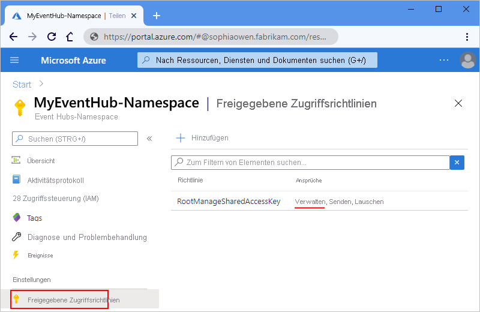
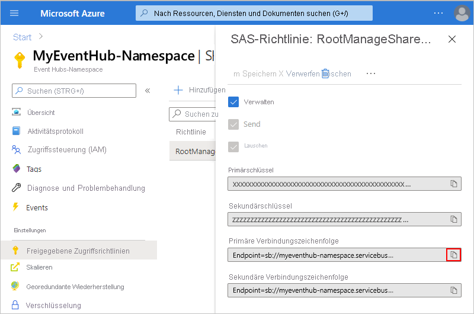
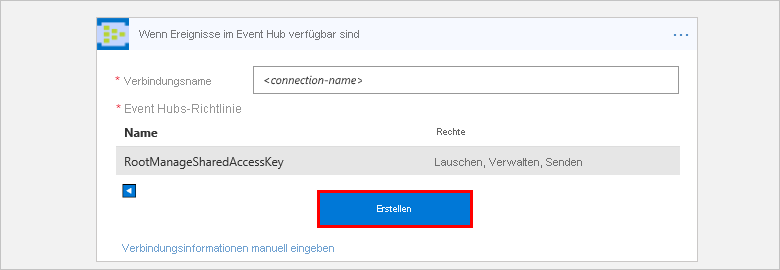
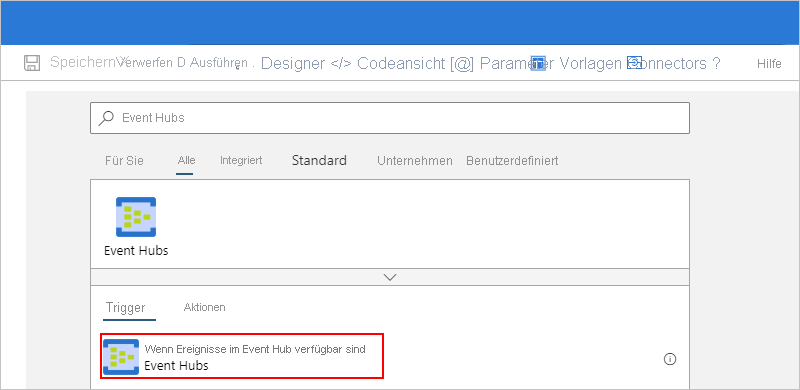
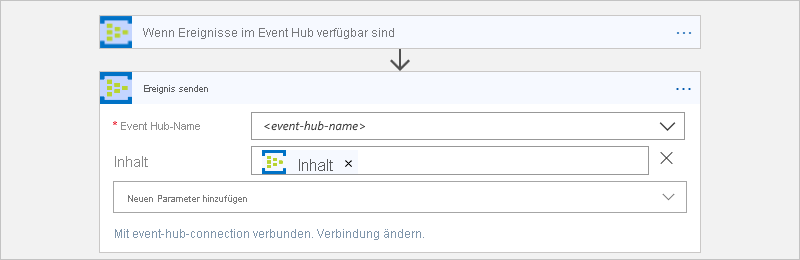

# Herstellen einer Verbindung mit einem Event Hub über Workflows in Azure Logic Apps

Der Azure Event Hubs-Connector hilft Ihnen, Ihre Logik-App-Workflows mit Event Hubs in Azure zu verbinden. Anschließend können Sie Ihre Workflows Ereignisse überwachen und verwalten lassen, die an einen Event Hub gesendet werden. Beispielsweise kann Ihr Workflow Ereignisse von Ihrem Event Hub überprüfen, senden und empfangen. Dieser Artikel enthält Anleitungen mit ersten Schritten zur Verwendung des Azure Event Hubs-Connectors, indem gezeigt wird, wie Sie eine Verbindung mit einem Event Hub herstellen und Ihrem Workflow einen Event Hubs-Trigger oder eine -Aktion hinzufügen.

Weitere Informationen zu Azure Event Hubs und Azure Logic Apps finden Sie unter [Was ist Azure Event Hubs](../event-hubs/event-hubs-about.md) bzw. [Was ist Azure Logic Apps](../logic-apps/logic-apps-overview.md).

## Verfügbare Vorgänge

Informationen zu allen Vorgängen und anderen technischen Informationen wie Eigenschaften, Grenzwerten usw. finden Sie auf der [Referenzseite des Event Hubs-Connectors](/connectors/eventhubs/).

> [!NOTE]
> Für Logik-Apps in einer [Integrationsdienstumgebung (ISE)](../logic-apps/connect-virtual-network-vnet-isolated-environment-overview.md) verwendet die ISE-Version des Connectors stattdessen die [ISE-Nachrichtengrenzwerte](../logic-apps/logic-apps-limits-and-config.md#message-size-limits).

## Voraussetzungen

* Ein Azure-Konto und ein Azure-Abonnement. Wenn Sie nicht über ein Azure-Abonnement verfügen, können Sie sich [für ein kostenloses Azure-Konto registrieren](https://azure.microsoft.com/free/). 

* Ein [Event Hubs-Namespace und Event Hub](../event-hubs/event-hubs-create.md)

* Der Logik-App-Workflow, in dem Sie auf Ihren Event Hub zugreifen möchten

  Um einen Workflow mit einem Event Hubs-Trigger zu starten, benötigen Sie einen leeren Workflow. Wenn Sie noch nicht mit [Azure Logic Apps](../logic-apps/logic-apps-overview.md) vertraut sind, verwenden Sie diesen [Schnellstart, um einen Logik-App-Beispielworkflow zu erstellen](../logic-apps/quickstart-create-first-logic-app-workflow.md).

## Überprüfen der Berechtigungen und Abrufen der Verbindungszeichenfolge

Um sicherzustellen, dass Ihr Workflow auf Ihren Event Hub zugreifen kann, überprüfen Sie Ihre Berechtigungen, und rufen Sie dann die Verbindungszeichenfolge für Ihren Event Hubs-Namespace ab.

1. Navigieren Sie im [Azure-Portal](https://portal.azure.com) zu Ihrem Event Hubs-*Namespace*, nicht zu einem spezifischen Event Hub.

1. Wählen Sie im Menü „Namespace“ unter **Einstellungen** die Option **Freigegebene Zugriffsrichtlinien** aus. Überprüfen Sie in der Spalte **Ansprüche**, ob Sie mindestens über die Berechtigung **Verwalten** für diesen Namespace verfügen.

   

1. Wenn Sie die Verbindungsinformationen später manuell eingeben möchten, rufen Sie die Verbindungszeichenfolge für Ihren Event Hubs-Namespace ab.

   1. Wählen Sie in der Spalte **Richtlinie** die Option **RootManageSharedAccessKey** aus.

   1. Suchen Sie die Verbindungszeichenfolge des Primärschlüssels. Kopieren und speichern Sie die Verbindungszeichenfolge für die spätere Verwendung.

      

      > [!TIP]
      > Um zu überprüfen, ob Ihre Verbindungszeichenfolge Ihrem Event Hubs-Namespace oder einem bestimmten Event Hub zugeordnet ist, stellen Sie sicher, dass die Verbindungszeichenfolge nicht den Parameter `EntityPath` aufweist. Wenn Sie diesen Parameter gefunden haben, gilt die Verbindungszeichenfolge für eine bestimmte Event Hubs-Entität und stellt nicht die richtige Zeichenfolge für die Verwendung mit Ihrem Workflow dar.

## Erstellen einer Event Hub-Verbindung

Wenn Sie zum ersten Mal einen Event Hubs-Trigger oder eine -Aktion hinzufügen, werden Sie aufgefordert, eine Verbindung mit Ihrem Event Hub herzustellen.

1. Wenn Sie dazu aufgefordert werden, wählen Sie eine der folgenden Optionen aus:

   * Geben Sie die folgenden Verbindungsinformationen an:

     | Eigenschaft | Erforderlich | Wert | BESCHREIBUNG |
     |----------|----------|-------|-------------|
     | **Verbindungsname** | Ja | <*connection-name*> | Der Name, der für Ihre Verbindung erstellt werden soll |
     | **Event Hubs-Namespace** | Ja | <*event-hubs-namespace*> | Wählen Sie den Event Hubs-Namespace aus, den Sie verwenden möchten. |
     |||||

   * Wenn Sie die zuvor gespeicherte Verbindungszeichenfolge manuell eingeben möchten, wählen Sie **Verbindungsinformationen manuell eingeben** aus. Erfahren Sie, [wie Sie Ihre Verbindungszeichenfolge suchen](#permissions-connection-string).

1. Wählen Sie die zu verwendende Event Hubs-Richtlinie aus, wenn sie noch nicht ausgewählt ist, und wählen Sie dann **Erstellen** aus.

   

1. Nachdem Sie die Verbindung erstellt haben, fahren Sie mit [Hinzufügen eines Event Hubs-Triggers](#add-trigger) oder [Hinzufügen einer Event Hubs-Aktion](#add-action) fort.

## Hinzufügen des Event Hubs-Triggers

In Azure Logic Apps muss jeder Workflow mit einem [Trigger](../logic-apps/logic-apps-overview.md#logic-app-concepts) beginnen, der ausgelöst wird, wenn eine bestimmte Bedingung erfüllt wird. Jedes Mal, wenn der Trigger ausgelöst wird, erstellt der Logic Apps-Dienst eine Workflowinstanz und beginnt mit der Ausführung der Schritte im Workflow.

Die folgenden Schritte beschreiben die allgemeine Methode zum Hinzufügen eines Triggers, z. B. **Wenn Ereignisse in Event Hub verfügbar sind**. In diesem Beispiel wird gezeigt, wie Sie einen Trigger hinzufügen, der in Ihrem Event Hub nach neuen Ereignissen sucht und eine Workflowausführung startet, wenn neue Ereignisse vorhanden sind.

1. Öffnen Sie im Logic Apps-Designer Ihren leeren Logik-App-Workflow, falls er noch nicht geöffnet ist.

1. Geben Sie `event hubs` in das Vorgangssuchfeld ein. Wählen Sie in der Triggerliste den Trigger namens **Wenn Ereignisse im Event Hub verfügbar sind** aus.

   

1. Wenn Sie aufgefordert werden, eine Verbindung mit Ihrem Event Hub herzustellen, [geben Sie die angeforderten Verbindungsinformationen](#create-connection) an.

1. Stellen Sie im Trigger Informationen zum Event Hub bereit, den Sie überwachen möchten, beispielsweise:

   | Eigenschaft | Erforderlich | BESCHREIBUNG |
   |----------|----------|-------------|
   | **Event Hub-Name** | Ja | Der Name für den Event Hub, den Sie überwachen möchten |
   | **Inhaltstyp** | Nein | Der Inhaltstyp des Ereignisses. Der Standardwert lautet `application/octet-stream`. |
   | **Name der Consumergruppe** | Nein | Der [Name für die Event Hubs-Consumergruppe](../event-hubs/event-hubs-features.md#consumer-groups), die zum Lesen von Ereignissen verwendet werden soll. Wenn Sie hier nichts angeben, wird die Standardconsumergruppe verwendet. |
   | **Höchstanzahl von Ereignissen** | Nein | Die maximale Anzahl von Ereignissen. Der Trigger gibt einen Wert zwischen 1 und der durch diese Eigenschaft definierten Anzahl von Ereignissen zurück. |
   | **Intervall** | Ja | Eine positive ganze Zahl, die beschreibt, wie oft der Workflow basierend auf der Häufigkeit ausgeführt wird. |
   | **Frequency** | Ja | Die Zeiteinheit für die Wiederholung. |
   ||||

   Öffnen Sie die Liste **Neuen Parameter hinzufügen**, um weitere Eigenschaften anzuzeigen. Durch die Auswahl eines Parameters wird diese Eigenschaft dem Trigger hinzugefügt, beispielsweise:

   

   **Weitere Eigenschaften**

   | Eigenschaft | Erforderlich | BESCHREIBUNG |
   |----------|----------|-------------|
   | **Inhaltsschema** | Nein | Das JSON-Inhaltsschema für die Ereignisse, die aus Ihrem Event Hub gelesen werden sollen. Wenn Sie z. B. das Inhaltsschema angeben, können Sie den Workflow nur für die Ereignisse auslösen, die dem Schema entsprechen. |
   | **Partitionsschlüssel (niedrigster Wert)** | Nein | Geben Sie die niedrigste [Partitions](../event-hubs/event-hubs-features.md#partitions)-ID ein, die gelesen werden soll. Standardmäßig werden alle Partitionen gelesen. |
   | **Partitionsschlüssel (höchster Wert)** | Nein | Geben Sie die höchste [Partitions](../event-hubs/event-hubs-features.md#partitions)-ID ein, die gelesen werden soll. Standardmäßig werden alle Partitionen gelesen. |
   | **Zeitzone** | Nein | Nur relevant, wenn Sie eine Startzeit angeben, da dieser Trigger keine UTC-Abweichung akzeptiert. Wählen Sie die anzuwendende Zeitzone aus. 
Weitere Informationen finden Sie unter [Erstellen und Ausführen wiederkehrender Aufgaben und Workflows mit Azure Logic Apps](../connectors/connectors-native-recurrence.md). |
   | **Startzeit** | Nein | Geben Sie eine Startzeit im folgenden Format ein: 
JJJJ-MM-TTThh:mm:ss (bei Auswahl einer Zeitzone)
Oder
JJJJ-MM-TTThh:mm:ssZ (wenn keine Zeitzone ausgewählt wird)
Weitere Informationen finden Sie unter [Erstellen und Ausführen wiederkehrender Aufgaben und Workflows mit Azure Logic Apps](../connectors/connectors-native-recurrence.md). |
   ||||

1. Wenn Sie fertig sind, wählen Sie auf der Symbolleiste des Designers die Option **Speichern** aus.

1. Fügen Sie nun mindestens eine Aktion hinzu, damit Sie andere Aufgaben mithilfe der Triggerausgaben ausführen können.

   Sie können z. B. zum Filtern von Ereignissen nach einem bestimmten Wert (wie einer Kategorie) eine Bedingung hinzufügen, sodass die Aktion **Ereignis senden** nur Ereignisse sendet, die Ihrer Bedingung entsprechen. 

## Triggerabrufverhalten

Alle Event Hubs-Trigger sind Trigger mit *langer Abrufzeit*. Das bedeutet, dass ein Trigger alle Ereignisse verarbeitet und dann pro Partition 30 Sekunden lang auf weitere im Event Hub eingehende Ereignisse wartet. 

Wenn der Trigger z. B. mit vier Partitionen eingerichtet ist, kann es bis zu zwei Minuten dauern, bis der Trigger alle Partitionen abgerufen hat. Werden innerhalb dieser Verzögerung keine Ereignisse empfangen, wird die Triggerausführung übersprungen. Andernfalls setzt der Trigger das Lesen von Ereignissen fort, bis Ihr Event Hub leer ist. Der nächste Triggerabruf erfolgt basierend auf dem in den Triggereigenschaften angegebenen Wiederholungsintervall.

## Triggerprüfpunktverhalten

Wenn ein Event Hubs-Trigger Ereignisse aus jeder Partition in einem Event Hub liest, verwendet der Trigger seinen eigenen Zustand, um Informationen zum Datenstromoffset (die Ereignisposition in einer Partition) und den Partitionen zu verwalten, aus denen der Trigger Ereignisse liest.

Bei jeder Ausführung des Workflows liest der Trigger Ereignisse aus einer Partition, beginnend mit dem Datenstromoffset, der durch den Triggerzustand gespeichert wird. Im Roundrobinmodus durchläuft der Trigger jede Partition im Event Hub und liest Ereignisse in nachfolgenden Triggerausführungen. Eine einzelne Ausführung ruft Ereignisse nacheinander aus einer einzelnen Partition ab.

Der Trigger verwendet diese Prüfpunktfunktion nicht im Speicher, sodass keine zusätzlichen Kosten anfallen. Der wichtigste Punkt ist jedoch, dass beim Aktualisieren des Event Hubs-Triggers der Status des Triggers zurückgesetzt wird, was dazu führen kann, dass der Trigger Ereignisse am Beginn des Datenstroms liest.

## Hinzufügen einer Event Hubs-Aktion

In Azure Logic Apps folgt eine [Aktion](../logic-apps/logic-apps-overview.md#logic-app-concepts) dem Trigger oder einer anderen Aktion und führt einen Vorgang in Ihrem Workflow aus. In den folgenden Schritten wird die allgemeine Vorgehensweise zum Hinzufügen einer Aktion beschrieben, z. B. **Ereignis senden.** In diesem Beispiel startet der Workflow mit einem Event Hubs-Trigger, der Ihren Event Hub auf neue Ereignisse überprüft.

1. Öffnen Sie im Logic Apps-Designer Ihren Logik-App-Workflow, falls er noch nicht geöffnet ist.

1. Fügen Sie unter dem Trigger oder einer anderen Aktion einen neuen Schritt hinzu.

   Um einen Schritt zwischen vorhandenen Schritten hinzuzufügen, bewegen Sie den Mauszeiger über den Pfeil. Wählen Sie das angezeigte Pluszeichen ( **+** ) aus, und wählen Sie dann **Aktion hinzufügen** aus.

1. Geben Sie `event hubs` in das Vorgangssuchfeld ein. Wählen Sie in der Aktionenliste die Aktion namens **Ereignis senden** aus.

   

1. Wenn Sie aufgefordert werden, eine Verbindung mit Ihrem Event Hub herzustellen, [geben Sie die angeforderten Verbindungsinformationen](#create-connection) an.

1. Stellen Sie in der Aktion Informationen zu den Ereignissen bereit, die Sie senden möchten.

   | Eigenschaft | Erforderlich | BESCHREIBUNG |
   |----------|----------|-------------|
   | **Event Hub-Name** | Ja | Der Event Hub, an den Sie das Event senden möchten |
   | **Inhalt** | Nein | Der Inhalt für das Ereignis, das Sie senden möchten |
   | **Eigenschaften** | Nein | Die App-Eigenschaften und Werte, die gesendet werden sollen |
   | **Partitionsschlüssel** | Nein | Die ID der [Partition](../event-hubs/event-hubs-features.md#partitions) für die Adresse, an die das Ereignis gesendet werden soll. |
   ||||

   Öffnen Sie die Liste **Neuen Parameter hinzufügen**, um weitere Eigenschaften anzuzeigen. Die Auswahl eines Parameters fügt der Aktion diese Eigenschaft hinzu, beispielsweise:

   

   Sie können z. B. die Ausgabe von Ihrem Event Hubs-Trigger an einen anderen Event Hub senden:

   

1. Wenn Sie fertig sind, wählen Sie auf der Symbolleiste des Designers die Option **Speichern** aus.

## Connector-Referenz

Informationen zu allen Vorgängen und anderen technischen Informationen wie Eigenschaften, Grenzwerten usw. finden Sie auf der [Referenzseite des Event Hubs-Connectors](/connectors/eventhubs/).

> [!NOTE]
> Für Logik-Apps in einer [Integrationsdienstumgebung (ISE)](../logic-apps/connect-virtual-network-vnet-isolated-environment-overview.md) verwendet die ISE-Version des Connectors stattdessen die [ISE-Nachrichtengrenzwerte](../logic-apps/logic-apps-limits-and-config.md#message-size-limits).

## Nächste Schritte

* Informationen zu anderen [Logic Apps-Connectors](../connectors/apis-list.md)