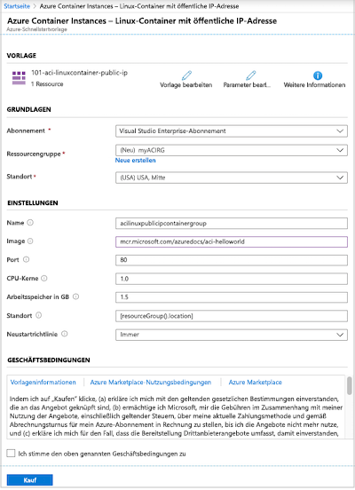
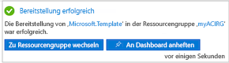
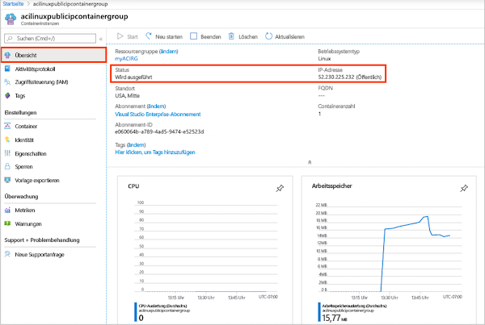
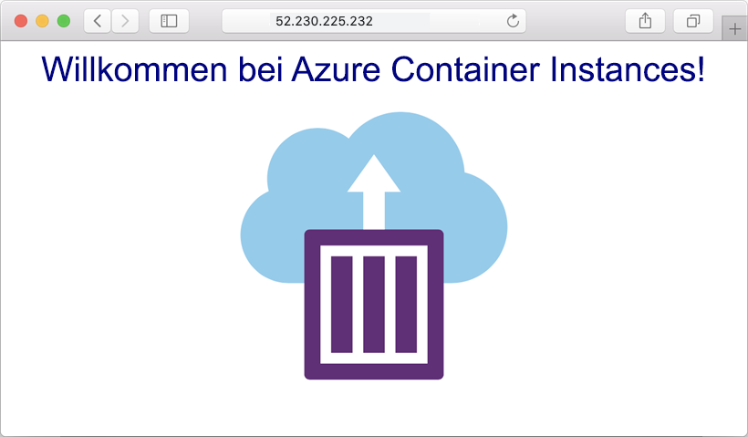
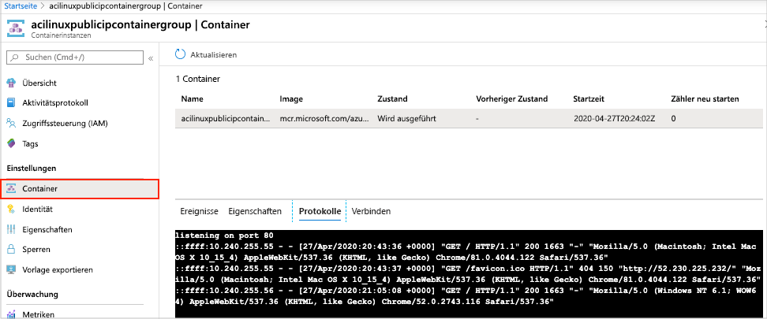

# Schnellstart: Bereitstellen einer Containerinstanz in Azure mithilfe einer ARM-Vorlage

Führen Sie mithilfe von Azure Container Instances serverlose Docker-Container schnell und einfach in Azure aus. Sie stellen eine Anwendung bedarfsgesteuert in einer Containerinstanz bereit, wenn Sie keine vollständige Containerorchestrierungsplattform wie Azure Kubernetes Service benötigen. In dieser Schnellstartanleitung stellen Sie mithilfe einer Azure Resource Manager-Vorlage (ARM-Vorlage) einen isolierten Docker-Container bereit und machen seine Webanwendung mit einer öffentlichen IP-Adresse verfügbar.

[!INCLUDE [About Azure Resource Manager](../../includes/resource-manager-quickstart-introduction.md)]

Wenn Ihre Umgebung die Voraussetzungen erfüllt und Sie mit der Verwendung von ARM-Vorlagen vertraut sind, klicken Sie auf die Schaltfläche **In Azure bereitstellen**. Die Vorlage wird im Azure-Portal geöffnet.

## Voraussetzungen

Wenn Sie kein Azure-Abonnement besitzen, können Sie ein [kostenloses Konto](https://azure.microsoft.com/free/) erstellen, bevor Sie beginnen.

## Überprüfen der Vorlage

Die in dieser Schnellstartanleitung verwendete Vorlage stammt von der Seite mit den [Azure-Schnellstartvorlagen](https://azure.microsoft.com/resources/templates/101-aci-linuxcontainer-public-ip/).

:::code language="json" source="~/quickstart-templates/101-aci-linuxcontainer-public-ip/azuredeploy.json":::

In der Vorlage ist die folgende Ressource definiert:

* **[Microsoft.ContainerInstance/containerGroups](/azure/templates/microsoft.containerinstance/containergroups)** : Erstellen einer Azure-Containergruppe. Diese Vorlage definiert eine Gruppe, die aus einer einzelnen Containerinstanz besteht.

Weitere Azure Container Instances-Vorlagenbeispiele finden Sie im [Schnellstartvorlagenkatalog](https://azure.microsoft.com/resources/templates/?resourceType=Microsoft.Containerinstance&pageNumber=1&sort=Popular).

## Bereitstellen der Vorlage

 1. Klicken Sie auf das folgende Bild, um sich bei Azure anzumelden und eine Vorlage zu öffnen. Die Vorlage erstellt eine Registrierung und ein Replikat an einem anderen Standort.

    

 2. Wählen Sie die folgenden Werte aus, bzw. geben Sie sie ein.

    * **Abonnement**: Wählen Sie ein Azure-Abonnement aus.
    * **Ressourcengruppe**: Wählen Sie die Option **Neu erstellen** aus, geben Sie einen eindeutigen Namen für die Ressourcengruppe ein, und wählen Sie dann **OK** aus.
    * **Standort**: Wählen Sie einen Standort für die Ressourcengruppe aus. Beispiel: **USA, Mitte**
    * **Name**: Übernehmen Sie den generierten Namen für die Instanz, oder geben Sie einen Namen ein.
    * **Image**: Übernehmen Sie den Standardnamen für das Image. Dieses Linux-Beispielimage verpackt eine kleine in Node.js geschriebene Web-App, die eine statische HTML-Seite bedient. 

    Übernehmen Sie für die übrigen Eigenschaften die Standardwerte.

    Sehen Sie sich die Geschäftsbedingungen an. Wenn Sie einverstanden sind, aktivieren Sie **Ich stimme den oben genannten Geschäftsbedingungen zu**.

    

 3. Nach der erfolgreichen Erstellung der Instanz erhalten Sie eine Benachrichtigung:

    

 Zum Bereitstellen der Vorlage wird das Azure-Portal verwendet. Neben dem Azure-Portal können Sie Azure PowerShell, die Azure-Befehlszeilenschnittstelle (Azure CLI) und die REST-API verwenden. Informationen zu anderen Bereitstellungsmethoden finden Sie unter [Bereitstellen von Vorlagen](../azure-resource-manager/templates/deploy-cli.md).

## Überprüfen der bereitgestellten Ressourcen

Verwenden Sie das Azure-Portal oder ein Tool wie die [Azure CLI](container-instances-quickstart.md), um die Eigenschaften der Containerinstanz zu überprüfen.

1. Suchen Sie im Portal nach „Containerinstanzen“, und wählen Sie die von Ihnen erstellte Containerinstanz aus.

1. Sehen Sie sich auf der Seite **Übersicht** den **Status** der Instanz sowie den Wert unter **IP-Adresse** an.

    

2. Sobald der Status *Ausgeführt* lautet, navigieren Sie in Ihrem Browser zur IP-Adresse. 

    

### Containerprotokolle anzeigen

Die Protokolle für eine Containerinstanz sind hilfreich, wenn Sie Probleme mit dem Container oder mit der ausgeführten Anwendung behandeln.

Wählen Sie zum Anzeigen der Protokolle des Containers unter **Einstellungen** die Optionen **Container** > **Protokolle** aus. Daraufhin sollte die HTTP GET-Anforderung angezeigt werden, die beim Betrachten der Anwendung in Ihrem Browser generiert wurde.

## Bereinigen von Ressourcen

Wenn Sie den Container nicht mehr benötigen, wählen Sie auf der Seite **Übersicht** für die Containerinstanz die Option **Löschen** aus. Bestätigen Sie den Löschvorgang, wenn Sie dazu aufgefordert werden.

## Nächste Schritte

In dieser Schnellstartanleitung haben Sie eine Azure-Containerinstanz aus einem öffentlichen Microsoft-Image erstellt. Fahren Sie mit dem Azure Container Instances-Tutorial fort, wenn Sie ein Containerimage erstellen und über eine private Azure-Containerregistrierung bereitstellen möchten.

> [!div class="nextstepaction"]
> [Tutorial: Erstellen eines Containerimages für die Bereitstellung in Azure Container Instances](./container-instances-tutorial-prepare-app.md)

Ein Schritt-für-Schritt-Tutorial mit Anleitungen zum Erstellen einer Vorlage finden Sie unter folgendem Link:

> [!div class="nextstepaction"]
> [Tutorial: Erstellen und Bereitstellen Ihrer ersten ARM-Vorlage](../azure-resource-manager/templates/template-tutorial-create-first-template.md)