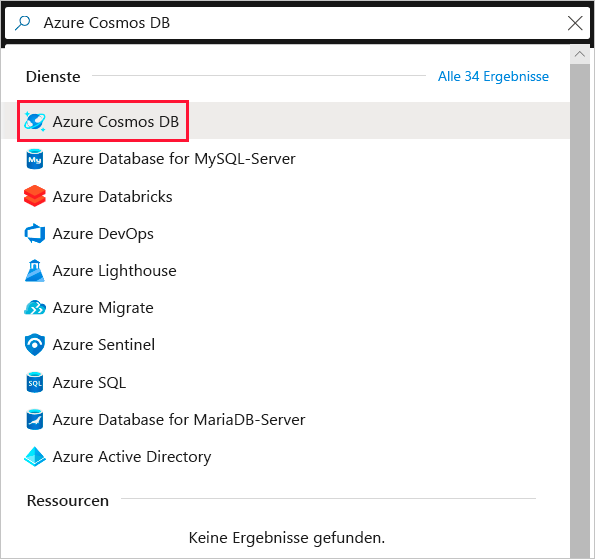
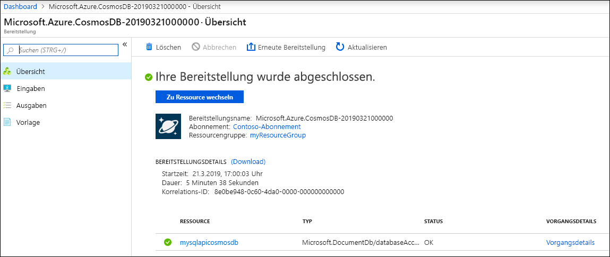
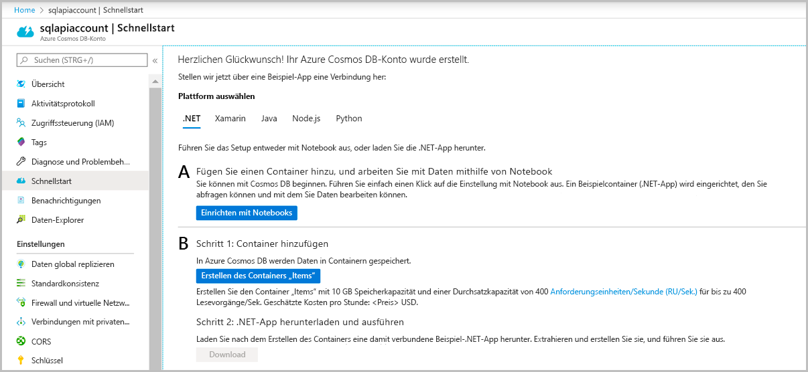

# <a name="quickstart-create-an-azure-cosmos-account-database-container-and-items-from-the-azure-portal"></a>Schnellstart: Erstellen eines Azure Cosmos-Kontos, einer Datenbank, eines Containers sowie von Elementen mit dem Azure-Portal

> [!div class="op_single_selector"]
> * [Azure portal](create-cosmosdb-resources-portal.md)
> * [.NET](create-sql-api-dotnet.md)
> * [Java](create-sql-api-java.md)
> * [Node.js](create-sql-api-nodejs.md)
> * [Python](create-sql-api-python.md)
> * [Xamarin](create-sql-api-xamarin-dotnet.md)
>  

Azure Cosmos DB ist ein global verteilter Datenbankdienst von Microsoft mit mehreren Modellen. Sie können Azure Cosmos DB verwenden, um schnell Schlüssel/Wert-, Dokument- und Graph-Datenbanken zu erstellen und abzufragen, und dabei stets die Vorteile der globalen Verteilung und der horizontalen Skalierung nutzen, die Azure Cosmos DB zugrunde liegen. 

In dieser Schnellstartanleitung wird veranschaulicht, wie Sie mithilfe des Azure-Portals ein [SQL-API](sql-api-introduction.md)-Konto, eine Dokumentdatenbank und einen Container für Azure Cosmos DB erstellen und dem Container Daten hinzufügen. 

## <a name="prerequisites"></a>Voraussetzungen

Azure-Abonnement oder kostenloses Azure Cosmos DB-Testkonto
- [!INCLUDE [quickstarts-free-trial-note](../../includes/quickstarts-free-trial-note.md)] 

- [!INCLUDE [cosmos-db-emulator-docdb-api](../../includes/cosmos-db-emulator-docdb-api.md)]  

<a id="create-account"></a>
## <a name="create-an-azure-cosmos-db-account"></a>Erstellen eines Azure Cosmos DB-Kontos

Wechseln Sie zum [Azure-Portal](https://portal.azure.com/), um ein Azure Cosmos DB-Konto zu erstellen. Suchen Sie nach **Azure Cosmos DB**, und wählen Sie die Option aus.

   

1. Wählen Sie **Hinzufügen**.
1. Geben Sie auf der Seite **Azure Cosmos DB-Konto erstellen** die grundlegenden Einstellungen für das neue Azure Cosmos-Konto ein. 

    |Einstellung|Wert|BESCHREIBUNG |
    |---|---|---|
    |Subscription|Abonnementname|Wählen Sie das Azure-Abonnement aus, das Sie für dieses Azure Cosmos-Konto verwenden möchten. |
    |Ressourcengruppe|Ressourcengruppenname|Wählen Sie eine Ressourcengruppe aus, oder wählen Sie **Neu erstellen** aus, und geben Sie einen eindeutigen Namen für die Ressourcengruppe ein. |
    |Kontoname|Ein eindeutiger Name|Geben Sie einen Namen ein, der Ihr Azure Cosmos-Konto identifiziert. Da *documents.azure.com* an den Namen angefügt wird, die Sie für die URI-Erstellung angeben, muss der Name eindeutig sein.<br><br>Der Name darf nur Kleinbuchstaben, Zahlen und den Bindestrich (-) enthalten. Sie muss zwischen drei und 31 Zeichen lang sein.|
    |API|Der Typ des zu erstellenden Kontos|Wählen Sie **Core (SQL)** aus, um eine Dokumentdatenbank und eine Abfrage mit SQL-Syntax zu erstellen. <br><br>Die API bestimmt den Typ des zu erstellenden Kontos. Azure Cosmos DB stellt fünf APIs bereit: Core (SQL) und MongoDB für Dokumentdaten, Gremlin für Diagrammdaten sowie Azure Table und Cassandra. Derzeit müssen Sie ein separates Konto für jede API erstellen. <br><br>[Weitere Informationen zur SQL-API](introduction.md)|
    |Tarifspezifischen Rabatt für den Free-Tarif anwenden|„Anwenden“ oder „Nicht anwenden“|Mit dem Azure Cosmos DB-Tarif „Free“ erhalten Sie die ersten 400 RUs/Sek. sowie 5 GB Speicher kostenlos in einem Konto. Weitere Informationen zum [Tarif „Free“](https://azure.microsoft.com/pricing/details/cosmos-db/)|
    |Standort|Die Region, die Ihren Benutzern am nächsten liegt|Wählen Sie einen geografischen Standort aus, an dem Ihr Azure Cosmos DB-Konto gehostet werden soll. Verwenden Sie den Standort, der Ihren Benutzern am nächsten ist, damit sie möglichst schnell auf die Daten zugreifen können.|
    |Kontotyp|„Produktionsbezogen“ oder „Nicht produktionsbezogen“|Wählen Sie **Produktionsbezogen** aus, wenn das Konto für eine Produktionsworkload verwendet wird. Wählen Sie **Nicht produktionsbezogen** aus, wenn das Konto nicht für die Produktion, sondern beispielsweise für Entwicklung, Tests, Qualitätssicherung oder Staging verwendet wird. Hierbei handelt es sich um eine Azure-Ressourcentageinstellung, die das Portal optimiert, aber keine Auswirkungen auf das zugrunde liegende Azure Cosmos DB-Konto hat. Sie können diesen Wert jederzeit ändern.|
    |Georedundanz|Aktivieren oder Deaktivieren|Aktivieren oder deaktivieren Sie die globale Verteilung für Ihr Konto, indem Sie Ihre Region mit einer Region koppeln. Sie können später weitere Regionen zu Ihrem Konto hinzufügen.|
    |Schreibvorgänge in mehreren Regionen|Aktivieren oder Deaktivieren|Mit der Funktion zum Schreiben in mehreren Regionen können Sie den bereitgestellten Durchsatz für Ihre Datenbanken und Container in der ganzen Welt nutzen.|
    |Verfügbarkeitszonen|Aktivieren oder Deaktivieren|Verfügbarkeitszonen helfen Ihnen, die Verfügbarkeit und Resilienz Ihrer Anwendung weiter zu verbessern.|


> [!NOTE]
> Sie können pro Azure-Abonnement maximal ein Azure Cosmos DB-Konto im Free-Tarif einrichten und müssen sich beim Erstellen des Kontos anmelden. Wird die Option zum Anwenden des tarifspezifischen Rabatts für den Free-Tarif nicht angezeigt, bedeutet dies, dass bereits ein anderes Konto im Abonnement mit dem Free-Tarif aktiviert wurde.
   
   

1. Klicken Sie auf **Überprüfen + erstellen**. Sie können die Abschnitte **Netzwerk** und **Tags** überspringen.

1. Überprüfen Sie die Kontoeinstellungen, und wählen Sie anschließend **Erstellen** aus. Die Erstellung des Kontos dauert einige Minuten. Warten Sie, bis auf der Portalseite **Ihre Bereitstellung wurde abgeschlossen.** angezeigt wird. 

    

1. Wählen Sie **Zu Ressource wechseln** aus, um zur Seite des Azure Cosmos DB-Kontos zu wechseln. 

    

<a id="create-container-database"></a>
## <a name="add-a-database-and-a-container"></a>Hinzufügen einer Datenbank und eines Containers 

Sie können mit dem Daten-Explorer im Azure-Portal eine Datenbank und einen Container erstellen. 

1.  Wählen Sie auf der Azure Cosmos DB-Kontoseite im linken Navigationsbereich die Option **Daten-Explorer** und dann **Neuer Container** aus. 
    
    Unter Umständen müssen Sie nach rechts scrollen, um das Fenster **Container hinzufügen** anzuzeigen.
    
    
    
1.  Geben Sie im Bereich **Container hinzufügen** die Einstellungen für den neuen Container ein.
    
    |Einstellung|Vorgeschlagener Wert|BESCHREIBUNG
    |---|---|---|
    |**Datenbank-ID**|ToDoList|Geben Sie *ToDoList* als Namen für die neue Datenbank ein. Datenbanknamen müssen zwischen 1 und 255 Zeichen lang sein und dürfen weder `/, \\, #, ?` noch nachgestellte Leerzeichen enthalten. Aktivieren Sie die Option **Provision database throughput** (Datenbankdurchsatz bereitstellen). Diese Option ermöglicht es Ihnen, den für die Datenbank bereitgestellten Durchsatz auf alle Container in der Datenbank zu verteilen. Darüber hinaus hilft sie Ihnen dabei, Kosten zu sparen. |
    |**Durchsatz**|400|Belassen Sie den Durchsatz bei 400 Anforderungseinheiten pro Sekunde (RU/s). Sie können den Durchsatz später hochskalieren, wenn Sie Wartezeiten reduzieren möchten.| 
    |**Container-ID**|Items|Geben Sie *Items* als Namen für den neuen Container ein. Für Container-IDs gelten dieselben Zeichenanforderungen wie für Datenbanknamen.|
    |**Partitionsschlüssel**| /category| Das in diesem Artikel beschriebene Beispiel verwendet */category* als Partitionsschlüssel.|

    
    Fügen Sie für dieses Beispiel keine Schlüssel über die Option **Eindeutige Schlüssel** hinzu. Mit eindeutigen Schlüsseln können Sie die Datenbank mit einer Datenintegritätsebene versehen, indem Sie die Eindeutigkeit von Werten per Partitionsschlüssel sicherstellen. Weitere Informationen finden Sie unter [Eindeutige Schlüssel in Azure Cosmos DB](unique-keys.md).
    
1.  Klicken Sie auf **OK**. Im Daten-Explorer werden die neue Datenbank und der Container angezeigt, die Sie erstellt haben.

## <a name="add-data-to-your-database"></a>Hinzufügen von Daten zu Ihrer Datenbank

Verwenden Sie den Daten-Explorer, um Ihrer neuen Datenbank Daten hinzuzufügen.

1. Erweitern Sie im **Daten-Explorer** die Datenbank **ToDoList** und dann den Container **Elemente**. Wählen Sie als Nächstes **Elemente** und dann **Neues Element** aus. 
   
   
   
1. Fügen Sie dem Dokument rechts im Bereich **Dokumente** die folgende Struktur hinzu:

     ```json
     {
         "id": "1",
         "category": "personal",
         "name": "groceries",
         "description": "Pick up apples and strawberries.",
         "isComplete": false
     }
     ```

1. Wählen Sie **Speichern** aus.
   
   
   
1. Wählen Sie erneut **Neues Dokument**, und erstellen und speichern Sie ein weiteres Dokument mit einer eindeutigen `id` und weiteren gewünschten Eigenschaften und Werten. Ihre Dokumente können eine beliebige Struktur aufweisen, da Azure Cosmos DB kein Schema für Ihre Daten vorgibt.

## <a name="query-your-data"></a>Abfragen Ihrer Daten

[!INCLUDE [cosmos-db-create-sql-api-query-data](../../includes/cosmos-db-create-sql-api-query-data.md)] 

## <a name="clean-up-resources"></a>Bereinigen von Ressourcen

[!INCLUDE [cosmosdb-delete-resource-group](../../includes/cosmos-db-delete-resource-group.md)]

Wenn Sie nur die Datenbank löschen und in Zukunft das Azure Cosmos-Konto verwenden möchten, können Sie zum Löschen der Datenbank die folgenden Schritte ausführen:

* Navigieren Sie zu Ihrem Azure Cosmos-Konto.
* Öffnen Sie **Daten-Explorer**, klicken Sie mit der rechten Maustaste auf die zu löschende Datenbank, und wählen Sie **Datenbank löschen** aus.
* Geben Sie die ID bzw. den Namen der Datenbank ein, um den Löschvorgang zu bestätigen. 

## <a name="next-steps"></a>Nächste Schritte

In diesem Schnellstart haben Sie gelernt, wie Sie ein Azure Cosmos DB-Konto, eine Datenbank und einen Container mit dem Daten-Explorer erstellen. Jetzt können Sie zusätzliche Daten in Ihr Azure Cosmos DB-Konto importieren. 

> [!div class="nextstepaction"]
> [Import data into Azure Cosmos DB (Importieren von Daten in Azure Cosmos DB)](import-data.md)
