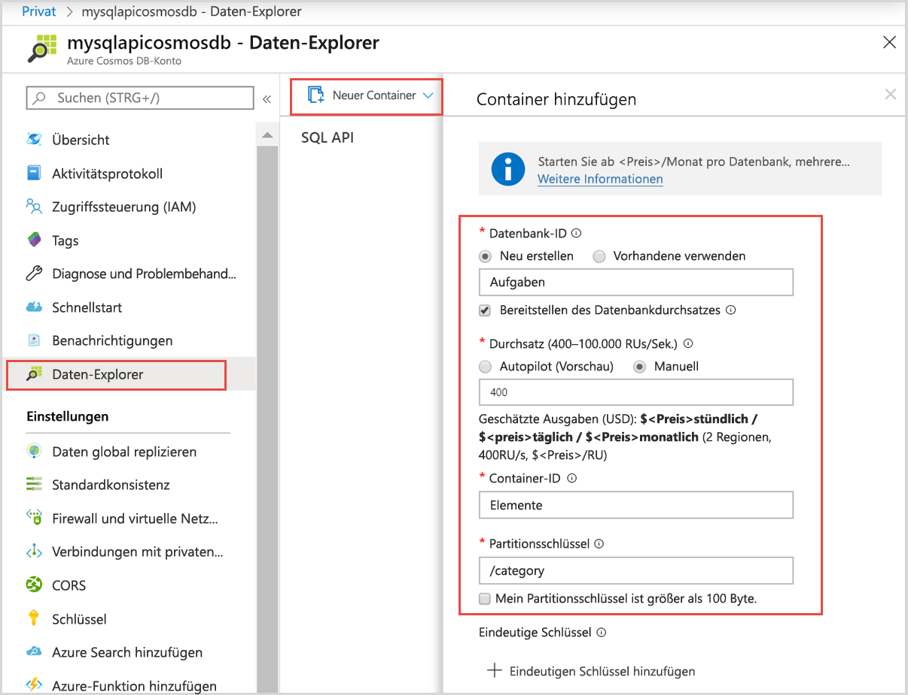
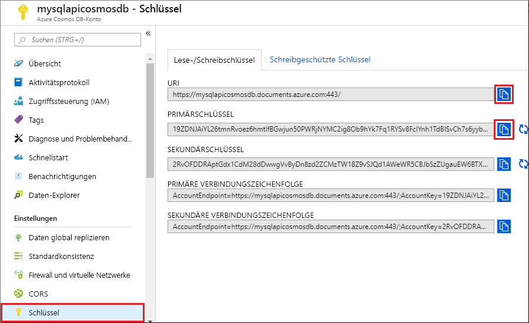

# <a name="quickstart-use-nodejs-to-connect-and-query-data-from-azure-cosmos-db-sql-api-account"></a>Schnellstart: Verwenden von Node.js zum Herstellen einer Verbindung mit einem und Abfragen von Daten aus einem Azure Cosmos DB-SQL-API-Konto

> [!div class="op_single_selector"]
> * [.NET V3](create-sql-api-dotnet.md)
> * [.NET V4](create-sql-api-dotnet-V4.md)
> * [Java](create-sql-api-java.md)
> * [Node.js](create-sql-api-nodejs.md)
> * [Python](create-sql-api-python.md)
> * [Xamarin](create-sql-api-xamarin-dotnet.md)

In dieser Schnellstartanleitung erstellen und verwalten Sie ein Azure Cosmos DB-SQL-API-Konto im Azure-Portal mithilfe einer über GitHub geklonten Node.js-App. Azure Cosmos DB ist ein Multimodell-Datenbankdienst, mit dem Sie mithilfe der Funktionen für globale Verteilung und horizontale Skalierung schnell Dokument-, Tabellen-, Schlüssel-Wert- und Graph-Datenbanken erstellen und abfragen können.

## <a name="prerequisites"></a>Voraussetzungen

- Ein Azure-Konto mit einem aktiven Abonnement. [Erstellen Sie ein kostenloses Konto.](https://azure.microsoft.com/free/?ref=microsoft.com&utm_source=microsoft.com&utm_medium=docs&utm_campaign=visualstudio) Oder [testen Sie Azure Cosmos DB kostenlos](https://azure.microsoft.com/try/cosmosdb/) ohne ein Azure-Abonnement. Sie können auch den [Azure Cosmos DB-Emulator](https://aka.ms/cosmosdb-emulator) mit dem URI `https://localhost:8081` und dem Schlüssel `C2y6yDjf5/R+ob0N8A7Cgv30VRDJIWEHLM+4QDU5DE2nQ9nDuVTqobD4b8mGGyPMbIZnqyMsEcaGQy67XIw/Jw==` verwenden.
- [Node.js 6.0.0 oder höher](https://nodejs.org/)
- [Git](https://www.git-scm.com/downloads).

## <a name="create-a-database"></a>Erstellen einer Datenbank

[!INCLUDE [cosmos-db-create-dbaccount](../../includes/cosmos-db-create-dbaccount.md)]

## <a name="add-a-container"></a>Hinzufügen eines Containers

Sie können nun mithilfe des Daten-Explorer-Tools im Azure-Portal eine Datenbank und einen Container erstellen. 

1. Wählen Sie **Daten-Explorer** > **Neuer Container** aus. 
    
    Der Bereich **Container hinzufügen** wird ganz rechts angezeigt. Möglicherweise müssen Sie nach rechts scrollen, damit Sie ihn sehen.

    

2. Geben Sie auf der Seite **Container hinzufügen** die Einstellungen für den neuen Container ein.

    |Einstellung|Vorgeschlagener Wert|Beschreibung
    |---|---|---|
    |**Datenbank-ID**|Aufgaben|Geben Sie *Tasks* als Namen für die neue Datenbank ein. Datenbanknamen müssen zwischen 1 und 255 Zeichen lang sein und dürfen weder `/, \\, #, ?` noch nachgestellte Leerzeichen enthalten. Aktivieren Sie die Option **Provision database throughput** (Datenbankdurchsatz bereitstellen). Diese Option ermöglicht es Ihnen, den für die Datenbank bereitgestellten Durchsatz auf alle Container in der Datenbank zu verteilen. Darüber hinaus hilft sie Ihnen dabei, Kosten zu sparen. |
    |**Durchsatz**|400|Belassen Sie den Durchsatz bei 400 Anforderungseinheiten pro Sekunde (RU/s). Sie können den Durchsatz später zentral hochskalieren, wenn Sie Wartezeiten reduzieren möchten.| 
    |**Container-ID**|Items|Geben Sie *Items* als Namen für den neuen Container ein. Für Container-IDs gelten dieselben Zeichenanforderungen wie für Datenbanknamen.|
    |**Partitionsschlüssel**| /category| Das in diesem Artikel beschriebene Beispiel verwendet */category* als Partitionsschlüssel.|
    
    Zusätzlich zu den zuvor beschriebenen Einstellungen können Sie optional auch **eindeutige Schlüssel** für den Container hinzufügen. In diesem Beispiel lassen wir das Feld leer. Eindeutige Schlüssel bieten Entwicklern die Möglichkeit, ihrer Datenbank eine zusätzliche Datenintegritätsebene hinzuzufügen. Durch das Erstellen einer Richtlinie für eindeutige Schlüssel beim Erstellen eines Containers wird die Eindeutigkeit von einem oder mehreren Werten pro Partitionsschlüssel gewährleistet. Weitere Informationen finden Sie im Artikel [Eindeutige Schlüssel in Azure Cosmos DB](unique-keys.md).
    
    Klicken Sie auf **OK**. Im Daten-Explorer werden die neue Datenbank und der neue Container angezeigt.

## <a name="add-sample-data"></a>Hinzufügen von Beispieldaten

[!INCLUDE [cosmos-db-create-sql-api-add-sample-data](../../includes/cosmos-db-create-sql-api-add-sample-data.md)]

## <a name="query-your-data"></a>Abfragen Ihrer Daten

[!INCLUDE [cosmos-db-create-sql-api-query-data](../../includes/cosmos-db-create-sql-api-query-data.md)]

## <a name="clone-the-sample-application"></a>Klonen der Beispielanwendung

Klonen Sie zunächst eine Node.js-App aus GitHub, legen Sie die Verbindungszeichenfolge fest, und führen Sie sie aus.

1. Führen Sie den folgenden Befehl aus, um das Beispielrepository zu klonen. Dieser Befehl erstellt eine Kopie der Beispiel-App auf Ihrem Computer.

   ```bash
   git clone https://github.com/Azure-Samples/azure-cosmos-db-sql-api-nodejs-getting-started.git
   ```

## <a name="review-the-code"></a>Überprüfen des Codes

Dieser Schritt ist optional. Wenn Sie erfahren möchten, wie die Azure Cosmos-Datenbankressourcen im Code erstellt werden, können Sie sich die folgenden Codeausschnitte ansehen. Andernfalls können Sie mit [Aktualisieren der Verbindungszeichenfolge](#update-your-connection-string) fortfahren.

Wenn Sie mit der vorherigen Version des SQL JavaScript SDK vertraut sind, kennen Sie unter Umständen bereits die Begriffe _Sammlung_ und _Dokument_. Azure Cosmos DB unterstützt [mehrere API-Modelle](introduction.md). Daher werden in [Version 2.0 und höheren Versionen des JavaScript SDK](https://www.npmjs.com/package/@azure/cosmos) die generischen Begriffe _Container_ (für eine Sammlung, einen Graph oder eine Tabelle) und _Element_ zum Beschreiben des Containerinhalts verwendet.

Die folgenden Codeausschnitte stammen alle aus der Datei _app.js_.

- Das Objekt `CosmosClient` ist initialisiert.

  ```javascript
  const client = new CosmosClient({ endpoint, key });
  ```

- Wählen Sie die Datenbank „Tasks“ aus.

  ```javascript
  const database = await client.databases(databaseId);
  ```

- Wählen Sie den Container bzw. die Sammlung „Items“ aus.

  ```javascript
  const container = await client.databases(containerId);
  ```

- Wählen Sie alle Elemente im Container „Items“ aus.

  ```javascript
  // query to return all items
  const querySpec = {
    query: "SELECT * from c"
  };

  const { resources: results } = await container.items
    .query(querySpec)
    .fetchAll();

  return results;
  ```

- Erstellen eines neuen Elements

  ```javascript
  const { resource: createdItem } = await container.items.create(newItem);
  ```

- Aktualisieren eines Elements

  ```javascript
  const { id, category } = createdItem;

  createdItem.isComplete = true;
  const { resource: itemToUpdate } = await container
    .item(id, category)
    .replace(itemToUpdate);

  return result;
  ```

- Löschen eines Elements

  ```javascript
  const { resource: result } = await this.container.item(id, category).delete();
  ```

> [!NOTE]
> Sowohl in der Methode „update“ als auch in der Methode „delete“ muss das Element aus der Datenbank durch Aufrufen von `container.item()` ausgewählt werden. Bei den beiden übergebenen Parametern handelt es sich um die ID und den Partitionsschlüssel des Elements. In diesem Fall ist der Partitionsschlüssel der Wert des Kategoriefelds.

## <a name="update-your-connection-string"></a>Aktualisieren der Verbindungszeichenfolge

Wechseln Sie nun zurück zum Azure-Portal, um die Details der Verbindungszeichenfolge Ihres Azure Cosmos-Kontos abzurufen. Kopieren Sie die Verbindungszeichenfolge in die App, damit sie eine Verbindung mit der Datenbank herstellen kann.

1. Wählen Sie in Ihrem Azure Cosmos DB-Konto im [Azure-Portal](https://portal.azure.com/) im linken Navigationsbereich die Option **Schlüssel** und anschließend **Lese-/Schreibschlüssel** aus. Mithilfe der Schaltflächen zum Kopieren auf der rechten Seite des Bildschirms kopieren Sie im nächsten Schritt den URI und den Primärschlüssel in die Datei _app.js_.

   

2. Öffnen Sie die Datei _config.js_.

3. Kopieren Sie den URI-Wert aus dem Portal (mithilfe der Schaltfläche zum Kopieren), und legen Sie ihn in _config.js_ als Wert des Endpunktschlüssels fest.

   `endpoint: "<Your Azure Cosmos account URI>"`

4. Kopieren Sie anschließend den Wert für „PRIMÄRSCHLÜSSEL“ aus dem Portal, und legen Sie ihn als Wert von `config.key` in _config.js_ fest. Sie haben die App nun mit allen erforderlichen Informationen für die Kommunikation mit Azure Cosmos DB aktualisiert.

   `key: "<Your Azure Cosmos account key>"`

## <a name="run-the-app"></a>Ausführen der App

1. Führen Sie `npm install` in einem Terminal aus, um erforderliche NPM-Module zu installieren

2. Führen Sie `node app.js` in einem Terminal aus, um Ihre Node-Anwendung zu starten.

Jetzt können Sie zum Daten-Explorer zurückkehren, um diese neuen Daten anzupassen und mit ihnen zu arbeiten.

## <a name="review-slas-in-the-azure-portal"></a>Überprüfen von SLAs im Azure-Portal

[!INCLUDE [cosmosdb-tutorial-review-slas](../../includes/cosmos-db-tutorial-review-slas.md)]

## <a name="clean-up-resources"></a>Bereinigen von Ressourcen

[!INCLUDE [cosmosdb-delete-resource-group](../../includes/cosmos-db-delete-resource-group.md)]

## <a name="next-steps"></a>Nächste Schritte

In dieser Schnellstartanleitung haben Sie gelernt, wie Sie ein Azure Cosmos DB-Konto erstellen, einen Container mit dem Daten-Explorer erstellen und eine Node.js-App ausführen. Jetzt können Sie zusätzliche Daten in Ihr Azure Cosmos DB-Konto importieren.

> [!div class="nextstepaction"]
> [Import data into Azure Cosmos DB (Importieren von Daten in Azure Cosmos DB)](import-data.md)
