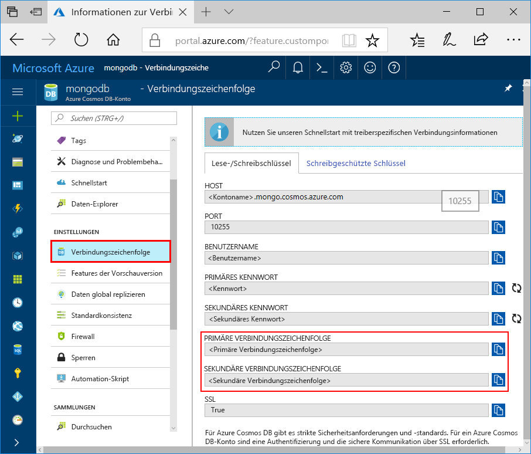

# Herstellen einer Verbindung mit der Azure Cosmos DB-API für MongoDB mithilfe von MongoDB Compass

Dieses Tutorial zeigt, wie Sie mit dem [MongoDB Compass](https://www.mongodb.com/products/compass) Daten in Cosmos DB speichern und/oder verwalten können. Für diese exemplarische Vorgehensweise wird die API für MongoDB von Azure Cosmos DB verwendet. Für diejenigen unter Ihnen, die es noch nicht kennen: Compass ist grafische Benutzeroberfläche für MongoDB. Es wird häufig zur Visualisierung und Verwaltung Ihrer Daten und zur Ausführung von Ad-hoc-Abfragen verwendet.

Cosmos DB ist ein global verteilter Datenbankdienst von Microsoft mit mehreren Modellen. Sie können schnell Dokument-, Schlüssel-Wert- und Graph-Datenbanken erstellen und abfragen und dabei stets die Vorteile der globalen Verteilung und der horizontalen Skalierung nutzen, die Cosmos DB zugrunde liegen.

## Voraussetzungen

Um mithilfe von MongoDB Compass eine Verbindung mit einem Cosmos DB-Konto herzustellen, müssen Sie die folgenden Aktionen ausführen:

* Herunterladen und Installieren von [Compass](https://www.mongodb.com/download-center/compass?jmp=hero)
* Abrufen der Informationen zur Cosmos DB-[Verbindungszeichenfolge](connect-mongodb-account.md)

> [!NOTE]
> Derzeit wird die API von Azure Cosmos DB für MongoDB Server Version 3.2 mit MongoDB Compass unterstützt.

## Herstellen einer Verbindung mit der Azure Cosmos DB-API für MongoDB

Um Ihr Cosmos DB-Konto mit Compass zu verbinden, können Sie die folgenden Schritte ausführen:

1. Rufen Sie die Verbindungsinformationen für Ihr Cosmos-Konto ab, das mit der API für MongoDB von Azure Cosmos DB konfiguriert wurde. Verwenden Sie dazu die [hier](connect-mongodb-account.md) beschriebenen Anweisungen.

    

2. Klicken Sie auf die Schaltfläche **In Zwischenablage kopieren** neben Ihrer **Primären/Sekundär en Verbindungszeichenfolge** in Cosmos DB. Wenn Sie auf diese Schaltfläche klicken, wird Ihre gesamte Verbindungszeichenfolge in die Zwischenablage kopiert.

    

3. Öffnen Sie Compass auf Ihrem Desktop/Computer, und klicken Sie auf **Verbinden** und dann auf **Verbinden mit...** .

4. Compass erkennt automatisch eine Verbindungszeichenfolge in der Zwischenablage und fragt, ob Sie diese für die Verbindung verwenden möchten. Klicken Sie auf **Ja** wie im folgenden Screenshot gezeigt:

    

5. Wenn Sie im obigen Schritt auf **Ja** klicken, werden Ihre Angaben aus der Verbindungszeichenfolge automatisch ausgefüllt. Entfernen Sie den Wert, der automatisch im Feld **Replikatgruppenname** eingetragen wird, um sicherzustellen, dass er leer bleibt.

    

6. Klicken Sie unten auf der Seite auf **Verbinden**. Ihr Cosmos DB-Konto und Ihre Datenbanken sollten nun in MongoDB Compass angezeigt werden.

## Nächste Schritte

- Erfahren Sie, wie Sie [Studio 3T](mongodb-mongochef.md) mit der API für MongoDB von Azure Cosmos DB verwenden.
- Untersuchen Sie MongoDB-[Beispiele](mongodb-samples.md) mit der API für MongoDB von Azure Cosmos DB.
