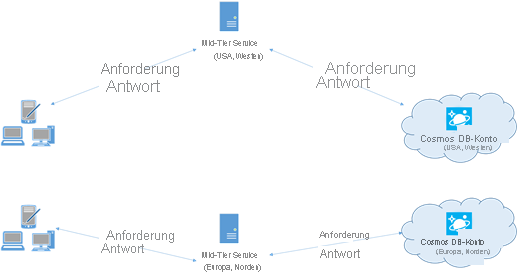

# <a name="performance-tips-for-azure-cosmos-db-java-sdk-v4"></a>Leistungstipps für das Azure Cosmos DB Java SDK v4

> [!div class="op_single_selector"]
> * [Java SDK v4](performance-tips-java-sdk-v4-sql.md)
> * [Async Java SDK v2](performance-tips-async-java.md)
> * [Sync Java SDK v2](performance-tips-java.md)
> * [.NET](performance-tips.md)
> 

> [!IMPORTANT]  
> Die Leistungstipps in diesem Artikel gelten ausschließlich für das Azure Cosmos DB Java SDK v4. Weitere Informationen finden Sie in den [Versionshinweisen zum Azure Cosmos DB Java SDK v4](sql-api-sdk-java-v4.md), im [Maven-Repository](https://mvnrepository.com/artifact/com.azure/azure-cosmos) und im [Leitfaden zur Problembehandlung für das Azure Cosmos DB Java SDK v4](troubleshoot-java-sdk-v4-sql.md). Wenn Sie aktuell eine ältere Version als v4 verwenden, lesen Sie den Leitfaden [Migrieren zum Azure Cosmos DB Java SDK v4](migrate-java-v4-sdk.md), um Hilfe beim Upgrade auf v4 zu erhalten.
>

Azure Cosmos DB ist eine schnelle und flexible verteilte Datenbank mit nahtloser Skalierung, garantierter Latenz und garantiertem Durchsatz. Die Skalierung Ihrer Datenbank mit Azure Cosmos DB erfordert weder aufwendige Änderungen an der Architektur noch das Schreiben von komplexem Code. Zentrales Hoch- und Herunterskalieren ist ebenso problemlos möglich wie das Aufrufen einer einzelnen API oder SDK-Methode. Da der Zugriff auf Azure Cosmos DB jedoch über Netzwerkaufrufe erfolgt, können Sie bei der Verwendung des Azure Cosmos DB Java SDK v4 clientseitige Optimierungen vornehmen, um eine optimale Leistung zu erzielen.

Im Anschluss finden Sie einige Optionen zur Optimierung der Datenbankleistung:

## <a name="networking"></a>Netzwerk

* **Verbindungsmodus: Verwenden des direkten Modus**
<a id="direct-connection"></a>
    
    Die Art der Verbindung eines Clients mit Azure Cosmos DB hat erhebliche Auswirkungen auf die Leistung, insbesondere im Hinblick auf die clientseitige Latenz. Für die Konfiguration der *ConnectionPolicy* des Clients ist *ConnectionMode* eine wichtige Konfigurationseinstellung. Dies sind die beiden für das Azure Cosmos DB Java SDK v4 verfügbaren *ConnectionMode*-Konfigurationseinstellungen:  
      
    * [Gateway (Standard)](/java/api/com.microsoft.azure.cosmosdb.connectionmode)  
    * [Direkt](/java/api/com.microsoft.azure.cosmosdb.connectionmode)

    Diese *ConnectionMode*-Konfigurationseinstellungen konditionieren im Wesentlichen die Weiterleitung von Anforderungen vom Clientcomputer an Partitionen im Azure Cosmos DB-Back-End. Im Allgemeinen ist der direkte Modus die bevorzugte Option für eine optimale Leistung. Er ermöglicht es dem Client, TCP-Verbindungen direkt mit Partitionen im Azure Cosmos DB-Back-End zu öffnen und Anforderungen *direkt* und ohne Vermittler zu senden. Im Gatewaymodus werden Anforderungen vom Client an einen sogenannten „Gatewayserver“ im Azure Cosmos DB-Front-End weitergeleitet, der wiederum Ihre Anforderungen an die entsprechenden Partitionen im Azure Cosmos DB-Back-End verteilt. Wenn Ihre Anwendung in einem Unternehmensnetzwerk mit strengen Firewalleinschränkungen ausgeführt wird, ist der Gatewaymodus die beste Wahl, da er den HTTPS-Standardport und einen einzelnen Endpunkt verwendet. Im Gatewaymodus ist jedoch jeweils ein zusätzlicher Netzwerkhop erforderlich (Client zu Gateway und Gateway zu Partition), wenn Daten in Azure Cosmos DB geschrieben oder daraus gelesen werden, was sich negativ auf die Leistung auswirkt. Aus diesem Grund bietet der direkte Modus die bessere Leistung, da weniger Netzwerkhops erforderlich sind.

    *ConnectionMode* wird im Zuge der Erstellung der Azure Cosmos DB-Clientinstanz mit dem *ConnectionPolicy*-Parameter konfiguriert:
    
   #### <a name="async"></a>[Async](#tab/api-async)

   ### <a name="java-sdk-v4-maven-comazureazure-cosmos-async-api"></a><a id="java4-connection-policy-async"></a>Java SDK v4 (Maven com.azure::azure-cosmos): Async-API

    ```java
    public ConnectionPolicy getConnectionPolicy() {
        ConnectionPolicy policy = new ConnectionPolicy();
        policy.setMaxPoolSize(1000);
        return policy;
    }

    ConnectionPolicy connectionPolicy = new ConnectionPolicy();
    CosmosAsyncClient client = new CosmosClientBuilder()
        .setEndpoint(HOST)
        .setKey(MASTER)
        .setConnectionPolicy(connectionPolicy)
        .buildAsyncClient();
    ```

    #### <a name="sync"></a>[Sync](#tab/api-sync)

    ### <a name="java-sdk-v4-maven-comazureazure-cosmos-sync-api"></a><a id="java4-connection-policy-sync"></a>Java SDK v4 (Maven com.azure::azure-cosmos): Sync-API

    ```java
    public ConnectionPolicy getConnectionPolicy() {
        ConnectionPolicy policy = new ConnectionPolicy();
        policy.setMaxPoolSize(1000);
        return policy;
    }

    ConnectionPolicy connectionPolicy = new ConnectionPolicy();
    CosmosClient client = new CosmosClientBuilder()
        .setEndpoint(HOST)
        .setKey(MASTER)
        .setConnectionPolicy(connectionPolicy)
        .buildClient();
    ```

    --- 

<a name="collocate-clients"></a>
* **Platzieren Sie Clients in derselben Azure-Region, um die Leistung zu verbessern.** <a id="same-region"></a>

    Platzieren Sie nach Möglichkeit sämtliche Anwendungen, die Azure Cosmos DB aufrufen, in der gleichen Region wie die Azure Cosmos-Datenbank. Damit Sie einen ungefähren Vergleich haben: Azure Cosmos DB-Aufrufe aus derselben Region werden normalerweise innerhalb von ca. 1 bis 2 ms abgeschlossen, während die Latenz zwischen West- und Ostküste der USA mehr als 50 ms beträgt. Diese Latenz variiert ggf. von Anforderung zu Anforderung und ist abhängig von der Route, die die Anforderung zwischen dem Client und der Grenze des Azure-Datencenters nimmt. Die geringste Latenz erzielen Sie, wenn sich die aufrufende Anwendung in der gleichen Azure-Region wie der bereitgestellte Azure Cosmos DB-Endpunkt befindet. Eine Liste mit den verfügbaren Regionen finden Sie unter [Azure-Regionen](https://azure.microsoft.com/regions/#services).

    

    Eine App, die mit einem Azure Cosmos DB-Konto in mehreren Regionen interagiert, muss [bevorzugte Regionen](tutorial-global-distribution-sql-api.md#preferred-locations) konfigurieren, um sicherzustellen, dass Anforderungen in eine angegebene Region weitergeleitet werden.

* **Aktivieren des beschleunigten Netzwerkbetriebs auf Ihrer Azure-VM für geringere Wartezeit**

Es wird empfohlen, dass Sie die Anweisungen zum Aktivieren des beschleunigten Netzwerkbetriebs für Ihre [Windows-](https://docs.microsoft.com/azure/virtual-network/create-vm-accelerated-networking-powershell) oder [Linux-VM](https://docs.microsoft.com/azure/virtual-network/create-vm-accelerated-networking-cli) befolgen (für Anweisungen jeweils klicken), um die Leistung zu maximieren.

Ohne den beschleunigten Netzwerkbetrieb können E/A-Vorgänge zwischen Ihrer Azure-VM und anderen Azure-Ressourcen unnötigerweise über einen Host und einen virtuellen Switch zwischen der VM und dessen Netzwerkkarte weitergeleitet werden. Wenn sich der Host und der virtuelle Switch inline auf dem Datenpfad befinden, sorgt dies beim Kommunikationskanal nicht nur für eine längere Wartezeit und Jitter, sondern auch die CPU-Zyklen von der VM werden reduziert. Bei beschleunigtem Netzwerkbetrieb erstellt die VM ohne Vermittler direkt Schnittstellen mit der Netzwerkkarte. Alle Netzwerkrichtliniendetails, die zuvor vom Host und dem virtuellen Switch verarbeitet wurden, werden jetzt über die Hardware der Netzwerkkarte verarbeitet, und der Host und der virtuelle Switch werden umgangen. Im Allgemeinen sind eine kürzere und *konsistentere* Wartezeit, ein höherer Durchsatz und eine geringere CPU-Auslastung zu erwarten, wenn Sie den beschleunigten Netzwerkbetrieb aktivieren.

Einschränkungen: Der beschleunigte Netzwerkbetrieb muss vom Betriebssystem der VM unterstützt werden und kann nur aktiviert werden, wenn die VM beendet und ihre Zuordnung aufgehoben wurde. Die VM kann nicht mit dem Azure Resource Manager bereitgestellt werden.

Weitere Informationen finden Sie in den Anweisungen für [Windows](https://docs.microsoft.com/azure/virtual-network/create-vm-accelerated-networking-powershell) bzw. [Linux](https://docs.microsoft.com/azure/virtual-network/create-vm-accelerated-networking-cli).

## <a name="sdk-usage"></a>SDK-Verwendung
* **Installieren des neuesten SDKs**

    Azure Cosmos DB-SDKs werden ständig verbessert, um eine optimale Leistung zu ermöglichen. Informationen zum neuesten SDK und zu den Verbesserungen finden Sie auf den Seiten unter [Azure Cosmos DB SDK](sql-api-sdk-async-java.md).

* **Verwenden eines Singleton-Azure Cosmos DB-Clients für die Lebensdauer der Anwendung**

    Jede Azure Cosmos DB-Clientinstanz ist threadsicher und verfügt über eine effiziente Verbindungsverwaltung und Adressenzwischenspeicherung. Es empfiehlt sich, für die gesamte Lebensdauer der Anwendung pro Anwendungsdomäne nur eine einzelne Azure Cosmos DB-Clientinstanz zu verwenden, um eine effiziente Verbindungsverwaltung und bessere Leistung des Azure Cosmos DB-Clients zu ermöglichen.

   <a id="max-connection"></a>

* **Verwenden der niedrigsten für die Anwendung erforderlichen Konsistenzebene**

    Wenn Sie eine *CosmosClient*-Klasse erstellen, wird *Sitzung* als Standardkonsistenz festgelegt, falls keine andere explizite Angabe gemacht wird. Wenn die Konsistenz *Sitzung* für Ihre Anwendungslogik nicht erforderlich ist, legen Sie die *Konsistenz* auf *Letztlich* fest. Hinweis: Es wird empfohlen, mindestens *Sitzung* für die Konsistenz bei Anwendungen zu verwenden, die den Azure Cosmos DB-Änderungsfeedprozessor verwenden.

* **Verwenden der Async-API zum Ausschöpfen des bereitgestellten Durchsatzes**

    Das Azure Cosmos DB Java SDK v4 bündelt die APIs „Sync“ und „Async“. Grob gesagt implementiert die Async-API SDK-Funktionen, während die Sync-API ein einfacher Wrapper ist, der blockierende Aufrufe der Async-API durchführt. Dies steht im Kontrast zum älteren Azure Cosmos DB Async Java SDK v2, das nur die Async-API enthielt, und dem älteren Azure Cosmos DB Sync Java SDK v2, das lediglich die Sync-API enthielt und eine vollständig unterschiedliche Implementierung erforderte. 
    
    Die Auswahl der API wird während der Clientinitialisierung getroffen. Eine *CosmosAsyncClient*-Klasse unterstützt die Async-API, während die *CosmosClient*-Klasse die Sync-API unterstützt. 
    
    Die Async-API implementiert nicht blockierende E/A-Vorgänge und ist die beste Wahl, wenn Sie den Durchsatz beim Ausgeben von Anforderungen an Azure Cosmos DB voll ausschöpfen möchten. 
    
    Die Verwendung der Sync-API eignet sich, wenn Sie eine API benötigen, die die Antwort auf jede Anforderung blockiert, oder wenn im Zusammenhang mit Ihrer Anwendung hauptsächlich der synchrone Vorgang verwendet wird. Sie verwenden beispielsweise die Sync-API, wenn Sie Daten für Azure Cosmos DB in einer Microserviceanwendung beibehalten und der Durchsatz nicht entscheidend ist.  
    
    Beachten Sie, dass der Durchsatz der Sync-API mit zunehmender Anforderungsantwortzeit geringer wird, während mit der Async-API die vollständige Bandbreitenkapazität Ihrer Hardware genutzt werden kann. 
    
    Bei Verwendung der Sync-API ermöglicht eine geografische Kollokation einen höheren und konsistenteren Durchsatz (siehe [Bereitstellen von Clients in derselben Azure-Region für eine bessere Leistung](#collocate-clients)), der Durchsatz der Async-API wird jedoch nicht erreicht.

    Einige Benutzer sind möglicherweise auch nicht mit [Project Reactor](https://projectreactor.io/) vertraut. Dabei handelt es sich um das Reactive Streams-Framework, das zum Implementieren der Async-API des Azure Cosmos DB Java SDK v4 verwendet wird. Wenn dies ein Problem darstellt, empfiehlt es sich, den [Einführungsleitfaden zu Reactor-Mustern](https://github.com/Azure-Samples/azure-cosmos-java-sql-api-samples/blob/master/reactor-pattern-guide.md) durchzulesen und sich mithilfe dieser [Einführung in das reaktive Programmieren](https://tech.io/playgrounds/929/reactive-programming-with-reactor-3/Intro) damit vertraut zu machen. Wenn Sie Azure Cosmos DB bereits mit einer Async-Schnittstelle verwendet haben und es sich bei dem verwendeten SDK um das Azure Cosmos DB Async Java SDK v2 gehandelt hat, sind Sie möglicherweise mit [ReactiveX](http://reactivex.io/)/[RxJava](https://github.com/ReactiveX/RxJava) vertraut, sind sich aber nicht sicher, was sich bei Project Reactor geändert hat. Sehen Sie sich in diesem Fall unseren [Leitfaden mit dem Vergleich von Reactor und RxJava](https://github.com/Azure-Samples/azure-cosmos-java-sql-api-samples/blob/master/reactor-rxjava-guide.md) an.

    Die folgenden Codeausschnitte zeigen, wie Sie Ihren Azure Cosmos DB-Client für Async- oder Sync-API-Vorgänge initialisieren:

    #### <a name="async"></a>[Async](#tab/api-async)

    ### <a name="java-sdk-v4-maven-comazureazure-cosmos-async-api"></a><a id="java4-async-client"></a>Java SDK v4 (Maven com.azure::azure-cosmos): Async-API

    ```java
    CosmosAsyncClient client = new CosmosClientBuilder()
        .setEndpoint(HOSTNAME)
        .setKey(MASTERKEY)
        .setConnectionPolicy(CONNECTIONPOLICY)
        .setConsistencyLevel(CONSISTENCY)
        .buildAsyncClient();
    ```

    #### <a name="sync"></a>[Sync](#tab/api-sync)
 
    ### <a name="java-sdk-v4-maven-comazureazure-cosmos-sync-api"></a><a id="java4-sync-client"></a>Java SDK v4 (Maven com.azure::azure-cosmos): Sync-API

    ```java
    CosmosClient client = new CosmosClientBuilder()
        .setEndpoint(HOSTNAME)
        .setKey(MASTERKEY)
        .setConnectionPolicy(CONNECTIONPOLICY)
        .setConsistencyLevel(CONSISTENCY)
        .buildClient();
    ```    

    ---

* **Optimieren von ConnectionPolicy**

    Bei Verwendung des Azure Cosmos DB Java SDK v4 erfolgen Cosmos DB-Anforderungen im direkten Modus standardmäßig über TCP. Intern verwendet das SDK eine spezielle Architektur für den direkten Modus, um Netzwerkressourcen dynamisch zu verwalten und die beste Leistung zu erzielen.

    Im Azure Cosmos DB Java SDK v4 ist der direkte Modus die beste Wahl, um die Datenbankleistung bei den meisten Workloads zu verbessern. 

    * ***Übersicht über den direkten Modus***

        

        Die clientseitige Architektur, die im direkten Modus eingesetzt wird, ermöglicht vorhersagbare Netzwerkauslastungen und Multiplexzugriff auf Azure Cosmos DB-Replikate. Das obige Diagramm zeigt, wie Clientanforderungen im direkten Modus an Replikate im Cosmos DB-Back-End weitergeleitet werden. Bei der Architektur für den direkten Modus werden auf der Clientseite bis zu 10 **Kanäle** pro DB-Replikat zugeordnet. Ein Kanal ist eine TCP-Verbindung mit einem vorgeschalteten Anforderungspuffer, der 30 Anforderungen aufnehmen kann. Die zu einem Replikat gehörenden Kanäle werden nach Bedarf dynamisch vom **Dienstendpunkt** des Replikats zugeordnet. Wenn der Benutzer eine Anforderung im direkten Modus übermittelt, leitet der **TransportClient** die Anforderung basierend auf dem Partitionsschlüssel an den richtigen Dienstendpunkt weiter. In der **Anforderungswarteschlange** werden die Anforderungen vor dem Dienstendpunkt gepuffert.

    * ***ConnectionPolicy-Konfigurationsoptionen für den direkten Modus***

        Diese Konfigurationseinstellungen steuern das Verhalten der RNTBD-Architektur, die das SDK-Verhalten im direkten Modus regelt.
        
        Verwenden Sie als ersten Schritt die folgenden empfohlenen Konfigurationseinstellungen. Diese *ConnectionPolicy*-Optionen sind erweiterte Konfigurationseinstellungen, die sich auf unerwartete Weise auf die SDK-Leistung auswirken können. Es wird empfohlen, dass Benutzer diese nicht ändern, es sei denn, sie kennen die möglichen Auswirkungen und dies ist absolut notwendig. Wenden Sie sich an das [Azure Cosmos DB-Team](mailto:CosmosDBPerformanceSupport@service.microsoft.com), wenn Sie mit diesem speziellen Thema Probleme haben.

        Wenn Sie Azure Cosmos DB als Verweisdatenbank verwenden (d. h., die Datenbank wird für viele Punktlesevorgänge und nur wenige Schreibvorgänge verwendet), ist es möglicherweise akzeptabel, *idleEndpointTimeout* auf 0 (null) festzulegen (d. h., es gibt keinen Timeout).


        | Konfigurationsoption       | Standard    |
        | :------------------:       | :-----:    |
        | bufferPageSize             | 8192       |
        | connectionTimeout          | „PT1M“     |
        | idleChannelTimeout         | „PT0S“     |
        | idleEndpointTimeout        | „PT1M10S“  |
        | maxBufferCapacity          | 8388608    |
        | maxChannelsPerEndpoint     | 10         |
        | maxRequestsPerChannel      | 30         |
        | receiveHangDetectionTime   | „PT1M5S“   |
        | requestExpiryInterval      | „PT5S“     |
        | requestTimeout             | „PT1M“     |
        | requestTimerResolution     | „PT0.5S“   |
        | sendHangDetectionTime      | „PT10S“    |
        | shutdownTimeout            | „PT15S“    |

* **Optimieren von parallelen Abfragen für partitionierte Sammlungen**

    Das Azure Cosmos DB Java SDK v4 unterstützt parallele Abfragen, mit denen Sie eine partitionierte Sammlung parallel abfragen können. Weitere Informationen finden Sie in den [Codebeispielen](https://github.com/Azure-Samples/azure-cosmos-java-sql-api-samples) für die Arbeit mit dem Azure Cosmos DB Java SDK v4. Parallele Abfragen sind darauf ausgelegt, Latenz und Durchsatz im Vergleich mit seriellen Abfragen zu verbessern.

    * ***Optimieren von setMaxDegreeOfParallelism\:***
    
        Bei parallelen Abfragen werden mehrere Partitionen parallel abgefragt. Die Daten einer individuell partitionierten Sammlung werden in Bezug auf die Abfrage aber seriell abgerufen. Legen Sie also „setMaxDegreeOfParallelism“ auf die Anzahl von Partitionen fest, bei der die Wahrscheinlichkeit, dass die bestmögliche Leistung für die Abfrage erzielt wird, am höchsten ist (vorausgesetzt, alle anderen Systembedingungen bleiben unverändert). Falls Ihnen die Anzahl von Partitionen nicht bekannt ist, können Sie setMaxDegreeOfParallelism auf einen hohen Wert festlegen. Das System wählt für den maximalen Grad an Parallelität dann den minimalen Wert aus (Anzahl von Partitionen, Benutzereingabe).

        Es ist wichtig zu beachten, dass sich für parallele Abfragen die größten Vorteile ergeben, wenn die Daten in Bezug auf die Abfrage gleichmäßig auf alle Partitionen verteilt werden. Wenn die partitionierte Auflistung so partitioniert ist, dass sich alle Daten bzw. die meisten Daten, die von einer Abfrage zurückgegeben werden, auf einigen wenigen Partitionen befinden (schlimmstenfalls nur auf einer Partition), können aufgrund dieser Partitionierung Engpässe bei der Leistung auftreten.

    * ***Optimieren von setMaxBufferedItemCount\:***
    
        Parallele Abfragen sind so konzipiert, dass Ergebnisse vorab abgerufen werden, während der Client den aktuellen Batch der Ergebnisse verarbeitet. Diese Art des Abrufs führt zu einer Verbesserung der Latenz einer Abfrage. setMaxBufferedItemCount begrenzt die Anzahl von vorab abgerufenen Ergebnissen. Wenn Sie „setMaxBufferedItemCount“ auf die erwartete Anzahl von zurückgegebenen Ergebnissen (oder eine höhere Anzahl) festlegen, ist der Vorteil durch das vorherige Abrufen für die Abfrage am größten.

        Das vorherige Abrufen funktioniert unabhängig von MaxDegreeOfParallelism, und es ist nur ein Puffer für die Daten aller Partitionen vorhanden.

* **Aufskalieren Ihrer Clientworkload**

    Wenn Sie auf einem hohen Durchsatzniveau testen, kann sich die Clientanwendung als Engpass erweisen, da der Computer die CPU- oder Netzwerkauslastung deckelt. Wenn dieser Punkt erreicht wird, können Sie das Azure Cosmos DB-Konto weiter auslasten, indem Sie Ihre Clientanwendungen auf mehrere Server horizontal hochskalieren.

    Eine gute Faustregel ist, eine CPU-Auslastung von 50 Prozent auf einem beliebigen Server nicht zu überschreiten, um die Wartezeit gering zu halten.

   <a id="tune-page-size"></a>

* **Optimieren der Seitengröße für Abfragen/Lesefeeds, um die Leistung zu verbessern**

    Wenn mehrere Dokumente mithilfe der Lesefeedfunktion (z. B. *readItems*) gleichzeitig gelesen werden oder eine SQL-Abfrage (*queryItems*) ausgegeben wird, werden die Ergebnisse bei der Rückgabe segmentiert, falls das Resultset zu groß ist. Ergebnisse werden standardmäßig in Blöcken mit je 100 Elementen oder 1 MB zurückgegeben (je nachdem, welcher Grenzwert zuerst erreicht wird).

    Angenommen, die Anwendung gibt eine Abfrage an Azure Cosmos DB aus, und die Anwendung erfordert alle Abfrageergebnisse, um die Aufgabe abzuschließen zu können. Durch Anpassen des Anforderungsheaderfelds [x-ms-max-item-count](/rest/api/cosmos-db/common-cosmosdb-rest-request-headers) können Sie die Seitengröße erhöhen, um die Anzahl von Netzwerkroundtrips zu verringern, die zum Abrufen aller entsprechenden Ergebnisse erforderlich sind. 

    * Wenn Sie den [x-ms-max-item-count](/rest/api/cosmos-db/common-cosmosdb-rest-request-headers)-Feldwert bei Abfragen mit nur einer Partition auf „-1“ (keine Begrenzung für Seitengröße) festlegen, wird die Wartezeit maximiert, indem die Anzahl der Abfrageantwortseiten reduziert wird: Entweder wird das vollständige Resultset auf einer einzelnen Seite zurückgegeben, oder das Resultset wird auf der möglichen Mindestanzahl von Seiten zurückgegeben, wenn die Abfrage länger als der Timeoutintervall dauert. Dadurch wird ein Vielfaches der Zeit für Roundtripanforderungen eingespart.
    
    * Bei partitionsübergreifenden Abfragen kann das Festlegen des [x-ms-max-item-count](/rest/api/cosmos-db/common-cosmosdb-rest-request-headers)-Felds auf „-1“ und das Entfernen der Seitengrößenbeschränkung zu einer Überlastung des SDK mit nicht verwaltbaren Seitengrößen führen. In diesem Fall empfiehlt es sich, die Seitengrößenbeschränkung auf einen hohen, aber dennoch begrenzten Wert (z. B. 1.000) festzulegen, um die Wartezeit zu verringern. 
    
    In einigen Anwendungen benötigen Sie möglicherweise nicht alle Abfrageergebnisse. Falls nur einige wenige Ergebnisse angezeigt werden müssen (etwa, wenn von der Benutzeroberfläche oder Anwendungs-API gleichzeitig nur zehn Ergebnisse zurückgegeben werden), können Sie die Seitengröße auch auf „10“ verringern, um den durch Lese- und Abfragevorgänge beanspruchten Durchsatz zu reduzieren.

    Sie können auch das Argument für die bevorzugte Seitengröße der *byPage*-Methode festlegen, anstatt das REST-Headerfeld direkt zu ändern. Beachten Sie, dass mit [x-ms-max-item-count](/rest/api/cosmos-db/common-cosmosdb-rest-request-headers) oder dem Argument der *byPage*-Methode für die bevorzugte Seitengröße nur eine Obergrenze für die Seitengröße und keine absolute Anforderung festgelegt wird. Aus mehreren Gründen gibt Azure Cosmos DB möglicherweise Seiten zurück, die kleiner als die bevorzugte Seitengröße sind. 

* **Verwenden des geeigneten Planers (Vermeiden des Diebstahls von Eventloop-E/A-Threads in Netty)**

    Die asynchrone Funktionalität des Azure Cosmos DB Java SDK basiert auf nicht blockierenden E/A-Vorgängen in [Netty](https://netty.io/). Das SDK verwendet eine feste Anzahl (die Anzahl von CPU-Kernen Ihres Computers) von E/A-Eventloop-Threads in Netty zum Ausführen von E/A-Vorgängen. Das von der API zurückgegebene Flux-Objekt gibt das Ergebnis auf einem der freigegebenen E/A-Eventloop-Threads in Netty aus. Daher ist es wichtig, die freigegebenen E/A-Eventloop-Threads in Netty nicht zu blockieren. CPU-intensives Arbeiten oder das Blockieren von Vorgängen auf dem E/A-Eventloop-Thread in Netty kann einen Deadlock verursachen oder den SDK-Durchsatz deutlich reduzieren.

    Beispiel: Der folgende Code führt eine CPU-intensive Arbeit auf dem E/A-Eventloop-Thread in Netty aus:
    ### <a name="java-sdk-v4-maven-comazureazure-cosmos-async-api"></a><a id="java4-noscheduler"></a>Java SDK v4 (Maven com.azure::azure-cosmos): Async-API

    ```java
    Mono<CosmosAsyncItemResponse<CustomPOJO>> createItemPub = asyncContainer.createItem(item);
    createItemPub.subscribe(
        itemResponse -> {
            //this is executed on eventloop IO netty thread.
            //the eventloop thread is shared and is meant to return back quickly.
            //
            // DON'T do this on eventloop IO netty thread.
            veryCpuIntensiveWork();                
        });
    ```

    Wenn Sie nach dem Empfang des Ergebnisses CPU-intensive Arbeit am Ergebnis durchführen möchten, sollte diese nicht auf dem E/A-Eventloop-Thread in Netty erfolgen. Stattdessen können Sie einen eigenen Planer bereitstellen, um wie unten gezeigt einen eigenen Thread für die Ausführung Ihrer Arbeit zur Verfügung zu stellen.

    ### <a name="java-sdk-v4-maven-comazureazure-cosmos-async-api"></a><a id="java4-scheduler"></a>Java SDK v4 (Maven com.azure::azure-cosmos): Async-API

    ```java
    import reactor.core.scheduler.Schedulers;
    Mono<CosmosAsyncItemResponse<CustomPOJO>> createItemPub = asyncContainer.createItem(item);
    createItemPub
        .subscribeOn(Schedulers.elastic())
        .subscribe(
        itemResponse -> {
            //this is executed on eventloop IO netty thread.
            //the eventloop thread is shared and is meant to return back quickly.
            //
            // DON'T do this on eventloop IO netty thread.
            veryCpuIntensiveWork();                
        });
    ```

    Je nach Art der Arbeit müssen Sie den entsprechenden vorhandenen Reactor-Planer verwenden. Lesen Sie hier nach: [``Schedulers``](https://projectreactor.io/docs/core/release/api/reactor/core/scheduler/Schedulers.html).

    Weitere Informationen zum Azure Cosmos DB Java SDK v4 finden Sie im [Azure Cosmos DB-Verzeichnis des Azure SDK für Java-Monorepos auf GitHub](https://github.com/Azure/azure-sdk-for-java/tree/master/sdk/cosmos/azure-cosmos).

* **Optimieren der Protokollierungseinstellungen in Ihrer Anwendung**

    Aus verschiedenen Gründen kann es erforderlich sein, die Protokollierung in einem Thread hinzuzufügen, der einen hohen Anforderungsdurchsatz verursacht. Wenn das Ziel darin besteht, den bereitgestellten Durchsatz eines Containers mit den von diesem Thread generierten Anforderungen vollständig auszuschöpfen, kann die Leistung mithilfe von Protokollierungsoptimierungen erheblich verbessert werden.

    * ***Konfigurieren einer Async-Protokollierung***

        Die Wartezeit einer synchronen Protokollierung ist notwendigerweise ein Faktor der Berechnung der Gesamtwartezeit des Threads, der Anforderungen generiert. Eine asynchrone Protokollierung wie [log4j2](https://nam06.safelinks.protection.outlook.com/?url=https%3A%2F%2Flogging.apache.org%2Flog4j%2Flog4j-2.3%2Fmanual%2Fasync.html&data=02%7C01%7CCosmosDBPerformanceInternal%40service.microsoft.com%7C36fd15dea8384bfe9b6b08d7c0cf2113%7C72f988bf86f141af91ab2d7cd011db47%7C1%7C0%7C637189868158267433&sdata=%2B9xfJ%2BWE%2F0CyKRPu9AmXkUrT3d3uNA9GdmwvalV3EOg%3D&reserved=0) wird empfohlen, um den Protokollierungsaufwand von Hochleistungsanwendungsthreads zu entkoppeln.

    * ***Deaktivieren der Netty-Protokollierung***

        Die Netty-Bibliotheksprotokollierung führt zu übermäßiger Kommunikation und muss deaktiviert werden (das Unterdrücken der Anmeldung in der Konfiguration reicht möglicherweise nicht aus), um zusätzliche CPU-Kosten zu vermeiden. Wenn Sie sich nicht im Debuggingmodus befinden, deaktivieren Sie die Protokollierung von Netty vollständig. Wenn Sie also „log4j“ verwenden, um die zusätzlichen CPU-Kosten zu verhindern, die durch ``org.apache.log4j.Category.callAppenders()`` von Netty anfallen, fügen Sie Ihrer Codebasis die folgende Zeile hinzu:

        ```java
        org.apache.log4j.Logger.getLogger("io.netty").setLevel(org.apache.log4j.Level.OFF);
        ```

 * **Ressourcengrenzwert des Betriebssystems für geöffnete Dateien**
 
    Einige Linux-Systeme (z. B. Red Hat) haben eine Obergrenze für die Anzahl von offenen Dateien und damit für die Gesamtanzahl von Verbindungen. Führen Sie den folgenden Befehl aus, um die aktuellen Grenzwerte anzuzeigen:

    ```bash
    ulimit -a
    ```

    Die Anzahl von geöffneten Dateien (nofile) muss groß sein, damit ausreichend Platz für Ihre konfigurierte Verbindungspoolgröße und andere offene Dateien des Betriebssystem vorhanden ist. Sie kann geändert werden, um einen größeren Verbindungspool zu ermöglichen.

    Öffnen Sie die Datei „limits.conf“:

    ```bash
    vim /etc/security/limits.conf
    ```
    
    Ändern Sie die folgenden Zeilen, bzw. fügen Sie sie hinzu:

    ```
    * - nofile 100000
    ```

* **Angeben von Partitionsschlüsseln in Punktschreibvorgängen**

    Geben Sie beim API-Aufruf mit Punktschreibvorgängen wie unten gezeigt Elementpartitionsschlüssel an, um die Leistung zu verbessern:

    #### <a name="async"></a>[Async](#tab/api-async)

    ### <a name="java-sdk-v4-maven-comazureazure-cosmos-async-api"></a><a id="java4-createitem-good-async"></a>Java SDK v4 (Maven com.azure::azure-cosmos): Async-API

    ```java
    asyncContainer.createItem(item,new PartitionKey(pk),new CosmosItemRequestOptions()).block();
    ```

    #### <a name="sync"></a>[Sync](#tab/api-sync)

    ### <a name="java-sdk-v4-maven-comazureazure-cosmos-sync-api"></a><a id="java4-createitem-good-sync"></a>Java SDK v4 (Maven com.azure::azure-cosmos): Sync-API

    ```java
    syncContainer.createItem(item,new PartitionKey(pk),new CosmosItemRequestOptions());
    ```

    ---

    Geben Sie also nicht wie unten gezeigt nur die Elementinstanz an:

    #### <a name="async"></a>[Async](#tab/api-async)

    ### <a name="java-sdk-v4-maven-comazureazure-cosmos-async-api"></a><a id="java4-createitem-bad-async"></a>Java SDK v4 (Maven com.azure::azure-cosmos): Async-API

    ```java
    asyncContainer.createItem(item).block();
    ```

    #### <a name="sync"></a>[Sync](#tab/api-sync)

    ### <a name="java-sdk-v4-maven-comazureazure-cosmos-sync-api"></a><a id="java4-createitem-bad-sync"></a>Java SDK v4 (Maven com.azure::azure-cosmos): Sync-API

    ```java
    syncContainer.createItem(item);
    ```

    ---

    Die letztere Option wird unterstützt, erhöht aber die Wartezeit Ihrer Anwendung. Das SDK muss das Element analysieren und den Partitionsschlüssel extrahieren.

## <a name="indexing-policy"></a>Indizierungsrichtlinie
 
* **Beschleunigen von Schreibvorgängen durch Ausschließen nicht verwendeter Pfade von der Indizierung**

    Die Indizierungsrichtlinie von Azure Cosmos DB ermöglicht auch die Verwendung von Indizierungspfaden („setIncludedPaths“ und „setExcludedPaths“), um anzugeben, welche Dokumentpfade in die Indizierung ein- bzw. von der Indizierung ausgeschlossen werden sollen. Der folgenden Code zeigt beispielsweise, wie Sie einen gesamten Abschnitt der Dokumente (auch als Unterstruktur bezeichnet) mit dem Platzhalter „*“ von der Indizierung ausschließen.

    ### <a name="java-sdk-v4-maven-comazureazure-cosmos"></a><a id="java4-indexing"></a>Java SDK V4 (Maven com.azure::azure-cosmos)
    ```java
    Index numberIndex = Index.Range(DataType.Number);
    indexes.add(numberIndex);
    includedPath.setIndexes(indexes);
    includedPaths.add(includedPath);
    indexingPolicy.setIncludedPaths(includedPaths);        
    containerProperties.setIndexingPolicy(indexingPolicy);
    ``` 

    Weitere Informationen finden Sie unter [Indizierungsrichtlinien für Azure Cosmos DB](indexing-policies.md).

## <a name="throughput"></a>Throughput
<a id="measure-rus"></a>

* **Messen und Optimieren (Senken) der Anzahl von Anforderungseinheiten pro Sekunde**

    Azure Cosmos DB bietet vielfältige Datenbankvorgänge (einschließlich relationaler und hierarchischer Abfragen mit UDFs, gespeicherter Prozeduren und Trigger), die alle in den Dokumenten innerhalb einer Datenbanksammlung ausgeführt werden. Die Kosten im Zusammenhang mit diesen Vorgängen variieren basierend auf dem CPU-, E/A- und Speicheraufwand, der für den jeweiligen Vorgang erforderlich ist. Anstelle sich Gedanken über Hardwareressourcen und deren Verwaltung zu machen, können Sie sich eine Anforderungseinheit (RU) als alleinige Maßeinheit für die Ressourcen vorstellen, die für das Durchführen der verschiedenen Datenbankvorgänge und das Ausführen einer Anwendungsanforderung erforderlich sind.

    Der Durchsatz wird basierend auf der für jeden Container festgelegten Anzahl von [Anforderungseinheiten](request-units.md) bereitgestellt. Der Verbrauch von Anforderungseinheiten wird als Rate pro Sekunde bemessen. Anwendungen, die die bereitgestellte Anforderungseinheitenrate für ihre Container überschreiten, werden begrenzt, bis die Rate wieder unter das bereitgestellte Niveau für den Container fällt. Wenn Ihre Anwendung einen höheren Durchsatz erfordert, können Sie ihn durch Bereitstellung zusätzlicher Anforderungseinheiten erhöhen.

    Die Komplexität einer Abfrage wirkt sich darauf aus, wie viele Anforderungseinheiten für einen Vorgang verbraucht werden. Die Anzahl von Prädikaten, die Art der Prädikate, die Anzahl von UDFs und die Größe des Quelldatasets beeinflussen die Kosten von Abfragevorgängen.

    Untersuchen Sie zum Ermitteln des Indizierungsaufwands für einen beliebigen Vorgang (Erstellen, Aktualisieren oder Löschen) den Header [x-ms-request-charge](/rest/api/cosmos-db/common-cosmosdb-rest-request-headers). So ermitteln Sie die Anzahl von Anforderungseinheiten, die von diesen Vorgängen genutzt werden. Sie können sich außerdem die entsprechende RequestCharge-Eigenschaft in ResourceResponse\<T> oder FeedResponse\<T> ansehen.

    #### <a name="async"></a>[Async](#tab/api-async)

    ### <a name="java-sdk-v4-maven-comazureazure-cosmos-async-api"></a><a id="java4-request-charge-async"></a>Java SDK v4 (Maven com.azure::azure-cosmos): Async-API

    ```java
    CosmosAsyncItemResponse<CustomPOJO> response = asyncContainer.createItem(item).block();

    response.getRequestCharge();
    ```     

    #### <a name="sync"></a>[Sync](#tab/api-sync)

    ### <a name="java-sdk-v4-maven-comazureazure-cosmos-sync-api"></a><a id="java4-request-charge-sync"></a>Java SDK v4 (Maven com.azure::azure-cosmos): Sync-API    

    ```java
    CosmosItemResponse<CustomPOJO> response = syncContainer.createItem(item);

    response.getRequestCharge();
    ```     

    ---

    Bei der in diesem Header zurückgegebenen Anforderungsbelastung handelt es sich um einen Bruchteil Ihres bereitgestellten Durchsatzes. Falls Sie beispielsweise 2000 RU/s bereitgestellt und die obige Abfrage 1000 Dokumente mit einer Größe von 1 KB zurückgibt, fallen für den Vorgang Kosten in Höhe von 1000 an. Somit werden vom Server innerhalb einer Sekunde nur zwei solcher Anforderungen berücksichtigt, und für weitere Anforderungen wird die Rate begrenzt. Weitere Informationen finden Sie unter [Anforderungseinheiten in DocumentDB](request-units.md) sowie unter dem [Rechner für Anforderungseinheiten](https://www.documentdb.com/capacityplanner).

<a id="429"></a>
* **Behandeln von Ratenbeschränkungen/zu hohen Anforderungsraten**

    Wenn ein Client versucht, den für ein Konto reservierten Durchsatz zu überschreiten, wird die Serverleistung nicht beeinträchtigt, und es wird kein über die reservierte Kapazität hinausgehender Durchsatz in Anspruch genommen. Der Server beendet die Anforderung präemptiv mit „RequestRateTooLarge“ (HTTP-Statuscode 429) und gibt den Header [x-ms-retry-after-ms](/rest/api/cosmos-db/common-cosmosdb-rest-request-headers) zurück. Darin ist die Zeitspanne (in Millisekunden) angegeben, die der Benutzer warten muss, bis ein neuer Anforderungsversuch unternommen werden kann.

        HTTP Status 429,
        Status Line: RequestRateTooLarge
        x-ms-retry-after-ms :100

    Alle SDKs fangen diese Antwort implizit ab, berücksichtigen den vom Server angegebenen Header vom Typ „retry-after“ und wiederholen die Anforderung. Wenn nicht mehrere Clients gleichzeitig auf Ihr Konto zugreifen, wird die nächste Wiederholung erfolgreich ausgeführt.

    Falls mehrere Clients kumulativ und kontinuierlich die Anforderungsrate überschreiten, reicht die intern vom Client festgelegte Standardanzahl von neun Wiederholungen unter Umständen nicht aus. In diesem Fall löst der Client für die Anwendung eine *CosmosClientException*-Klasse mit dem Statuscode 429 aus. Die standardmäßige Wiederholungsanzahl kann durch Verwendung von „setRetryOptions“ für die ConnectionPolicy-Instanz geändert werden. Die *CosmosClientException*-Klasse mit dem Statuscode 429 wird standardmäßig nach einer kumulierten Wartezeit von 30 Sekunden zurückgegeben, wenn die Anforderung weiterhin die Anforderungsrate übersteigt. Dies gilt auch, wenn die aktuelle Wiederholungsanzahl unter der maximalen Wiederholungsanzahl liegt – ganz gleich, ob es sich dabei um den Standardwert (9) oder um einen benutzerdefinierten Wert handelt.

    Das automatisierte Wiederholungsverhalten trägt zwar bei den meisten Anwendungen zur Verbesserung der Resilienz und Nutzbarkeit bei, kann bei Leistungsbenchmarks aber auch hinderlich sein (insbesondere beim Ermitteln der Latenz). Die Wartezeit für den Client nimmt stark zu, wenn das Experiment die Serverdrosselung erreicht und damit die automatische Wiederholung durch das Client-SDK auslöst. Ermitteln Sie zur Vermeidung von Latenzspitzenwerten bei Leistungsexperimenten die von den einzelnen Vorgängen zurückgegebene Belastung, und stellen Sie sicher, dass die Anforderungen die reservierte Anforderungsrate nicht überschreiten. Weitere Informationen finden Sie unter [Anforderungseinheiten in DocumentDB](request-units.md).

* **Konzipieren für kleinere Dokumente und höheren Durchsatz**

    Die Anforderungsbelastung (die Kosten für die Anforderungsverarbeitung) eines Vorgangs hängt direkt mit der Größe des Dokuments zusammen. Vorgänge für große Dokumente sind teurer als Vorgänge für kleine Dateien. Im Idealfall sollten Sie Ihre Anwendung und Workflows so entwerfen, dass die Größe der Elemente etwa ein Kilobyte beträgt oder diese eine ähnliche Größe aufweisen. Bei Anwendungen, die hinsichtlich der Wartezeit empfindlich sind, sollten große Elemente vermieden werden. Dokumente mit mehreren Megabyte verlangsamen Ihre Anwendung.

## <a name="next-steps"></a>Nächste Schritte

Weitere Informationen zum Entwerfen einer auf Skalierung und hohe Leistung ausgelegten Anwendung finden Sie unter [Partitionieren und Skalieren in Azure Cosmos DB](partition-data.md).
