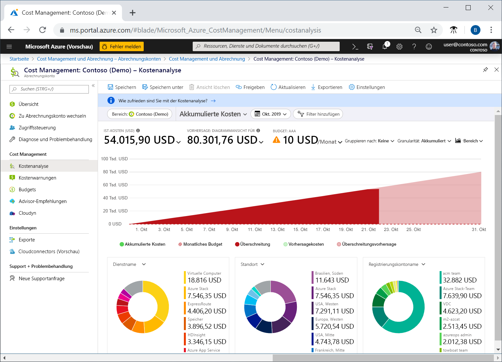
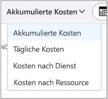
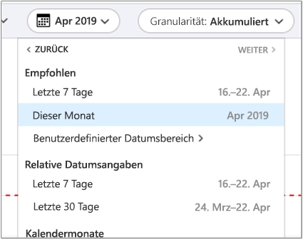
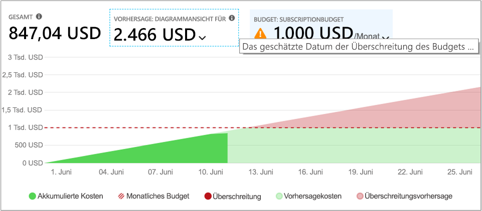
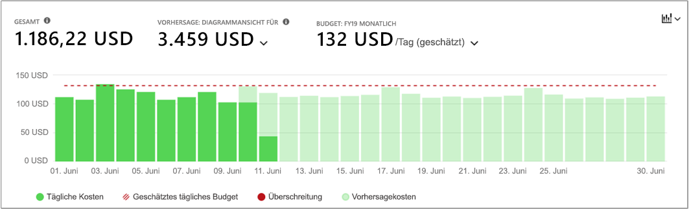
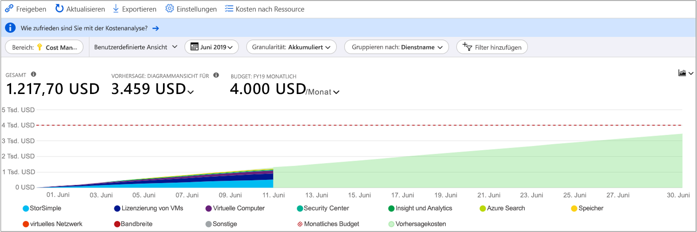
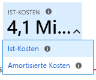
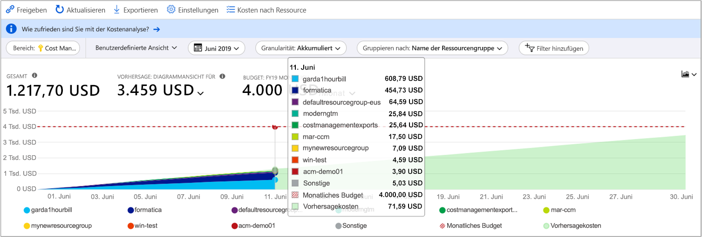
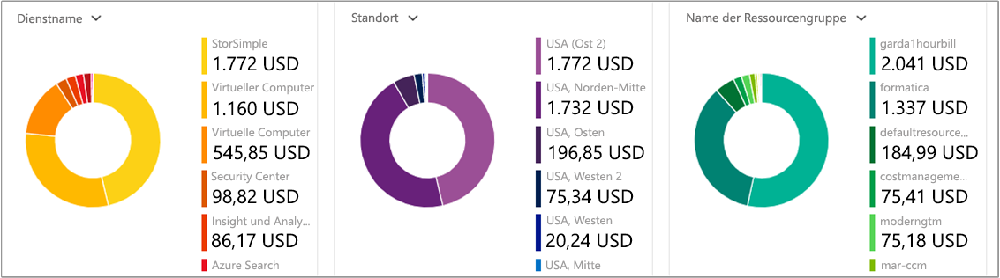
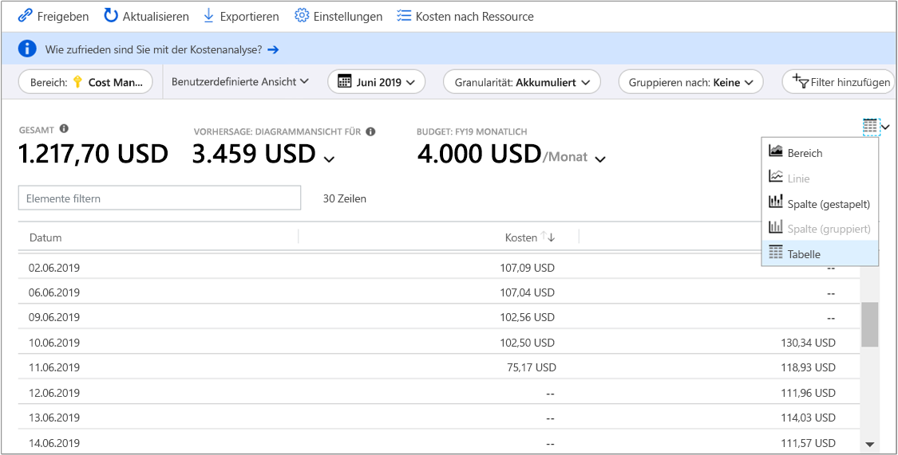

# Schnellstart: Ermitteln und Analysieren von Kosten mit der Kostenanalyse

Voraussetzung für die Kontrolle und Optimierung von Azure-Kosten sind Kenntnisse über die Kostenstellen in Ihrer Organisation. Außerdem sollte bekannt sein, wie hoch die Kosten für Ihre Dienste sind und für welche Umgebungen und Systeme diese Aufwendungen genutzt werden. Der Überblick über sämtliche Kosten ist entscheidend, um Ausgabestrukturen Ihrer Organisation genau nachvollziehen zu können. Sie können Ausgabestrukturen verwenden, um Kontrollmechanismen wie Budgets zu erzwingen.

In diesem Schnellstart ermitteln Sie mithilfe der Kostenanalyse Azure-Kosten, die für Ihre Organisation anfallen, und analysieren diese. Durch die Anzeige aggregierter Kosten nach Organisationen können Sie ermitteln, wo Kosten im Zeitverlauf anfallen, und Ausgabentrends nachvollziehen. Mithilfe der akkumulierten Kosten können Sie unter Berücksichtigung von Budgets Kostenschätzungen für monatliche, vierteljährliche oder jährliche Zeiträume erstellen. Ein Budget trägt zur Einhaltung finanzieller Vorgaben bei. Mithilfe eines Budgets können Sie zudem die täglichen oder monatlichen Kosten anzeigen, um Ausgabenunregelmäßigkeiten zu vermeiden. Des Weiteren können Sie die Daten des aktuellen Berichts herunterladen, um diese noch genauer zu analysieren oder sie in externen Systemen zu verwenden.

In dieser Schnellstartanleitung wird Folgendes vermittelt:

- Überprüfen von Kosten mithilfe der Kostenanalyse
- Anpassen von Kostenansichten
- Herunterladen von Kostenanalysedaten

## Voraussetzungen

Die Kostenanalyse unterstützt verschiedene Arten von Azure-Kontotypen. Die vollständige Liste der unterstützten Kontotypen finden Sie unter [Grundlegendes zu Cost Management-Daten](understand-cost-mgt-data.md). Um Kostendaten anzeigen zu können, müssen Sie mindestens über Lesezugriff auf Ihr Azure-Konto verfügen.

Informationen zum Zuweisen des Zugriffs auf Azure Cost Management-Daten finden Sie unter [Zuweisen des Zugriffs auf Cost Management-Daten](../../cost-management/assign-access-acm-data.md).

Bei einem neuen Abonnement können Cost Management-Features nicht sofort genutzt werden. Es kann bis zu 48 Stunden dauern, bis Sie alle Cost Management-Features verwenden können.

## Anmelden bei Azure

- Melden Sie sich unter https://portal.azure.com beim Azure-Portal an.

## Überprüfen von Kosten mithilfe der Kostenanalyse

Um Ihre Kosten in der Kostenanalyse zu überprüfen, öffnen Sie den Bereich im Azure-Portal und wählen Sie im Menü **Kostenanalyse** aus. Navigieren Sie beispielsweise zu **Abonnements**, und wählen Sie dann ein Abonnement in der Liste und **Kostenanalyse** im Menü aus. Verwenden Sie **Bereich**, um in einen anderen Bereich der Kostenanalyse zu wechseln. Weitere Informationen zu Bereichen finden Sie unter [Verstehen von und Arbeiten mit Bereichen](understand-work-scopes.md).

Der von Ihnen ausgewählte Bereich wird in der gesamten Kostenverwaltung verwendet, um Daten zu konsolidieren und den Zugriff auf Kosteninformationen zu steuern. Wenn Sie Bereiche verwenden, wählen Sie diese nicht mehrfach aus. Wählen Sie stattdessen einen größeren Bereich aus, in dem andere zusammengefasst werden, und filtern Sie diesen dann bis zu den benötigten geschachtelten Bereichen. Es ist wichtig, dieses Vorgehen zu verstehen, da möglicherweise nicht alle Benutzer Zugriff auf einen einzelnen übergeordneten Bereich haben, der mehrere verschachtelte Bereiche abdeckt.

Sehen Sie sich das Video zur [Verwendung von Cost Management im Azure-Portal](https://www.youtube.com/watch?v=mfxysF-kTFA) an, um mehr über die Verwendung der Kostenanalyse zu erfahren. Weitere Videos finden Sie im [YouTube-Kanal zu Cost Management](https://www.youtube.com/c/AzureCostManagement).

>[!VIDEO https://www.youtube.com/embed/mfxysF-kTFA]

Die Kostenanalyseansicht umfasst anfänglich die folgenden Bereiche.

**Akkumulierte Kostenansicht**: Ermöglicht die Konfiguration der vordefinierten Ansicht für die Kostenanalyse. Jede Ansicht enthält den Datumsbereich, die Granularität, „Gruppieren nach“ und Filtereinstellungen. In der Standardansicht werden die akkumulierten Kosten für den aktuellen Abrechnungszeitraum angezeigt, aber dies kann in andere integrierte Ansichten geändert werden. Weitere Informationen finden Sie unter [Anpassen von Kostenansichten](#customize-cost-views).

**Ist-Kosten**: Zeigt die Gesamtkosten für den Verbrauch und die Einkäufe für den aktuellen Monat so an, wie sie anfallen und wie sie in Ihrer Rechnung aufgeführt werden.

**Prognose**: Gibt die prognostizierten Gesamtkosten für den von Ihnen gewählten Zeitraum an.

**Budget**: Zeigt das geplante Ausgabenlimit für den ausgewählten Bereich (falls verfügbar).

**Kumulierte Granularität**: Gibt die aggregierten täglichen Gesamtkosten seit Beginn des Abrechnungszeitraums an. Nachdem Sie für Ihr Abrechnungskonto oder Abonnement [ein Budget erstellt haben](tutorial-acm-create-budgets.md), können Sie sich Ausgabentrends für Ihr Budget anzeigen lassen. Zeigen Sie auf ein Datum, um die akkumulierten Kosten bis zu einem bestimmten Tag anzuzeigen.

**Pivot-/Ringdiagramme**: Stellen Sie dynamische Pivotdiagramme bereit, die die Gesamtkosten nach einem gemeinsamen Satz von Standardeigenschaften aufschlüsseln. Für den aktuellen Monat werden die höchsten bis hin zu den geringsten Kosten angezeigt. Sie können die Pivotdiagramme jederzeit anpassen, indem Sie einen anderen Pivotbereich auswählen. Die Kosten werden standardmäßig nach Dienst (Kategorie der Verbrauchseinheit), Standort (Region) und untergeordnetem Bereich kategorisiert. Beispielsweise befinden sich Registrierungskonten unter Abrechnungskonten, Ressourcengruppen unter Abonnements und Ressourcen unter Ressourcengruppen.

### Grundlegendes zur Vorhersage

Die Kostenvorhersage zeigt eine Projektion der geschätzten Kosten für den ausgewählten Zeitraum. Das Modell basiert auf einem Zeitreihen-Regressionsmodell. Für eine präzise Kostenvorhersage sind mindestens zehn Tage an aktuellen Kosten- und Nutzungsdaten erforderlich. Für einen bestimmten Zeitraum erfordert das Vorhersagemodell den gleichen Anteil von Trainingsdaten für den Vorhersagezeitraum. Für eine Projektion von drei Monaten sind beispielsweise mindestens drei Monate an aktuellen Kosten- und Nutzungsdaten erforderlich.

Das Modell verwendet Trainingsdaten aus maximal sechs Monaten, um Kosten für ein Jahr zu projizieren. Zum Ändern der Vorhersage sind mindestens sieben Tage an Trainingsdaten erforderlich. Die Vorhersage basiert auf tiefgreifenden Änderungen (etwa Spitzen und Abfällen) bei Kosten- und Nutzungsmustern. Die Vorhersage generiert keine einzelnen Projektionen für jedes Element in den Eigenschaften vom Typ **Gruppieren nach**. Es wird nur eine Vorhersage für die kumulierten Gesamtkosten abgegeben. Bei der Verwendung mehrerer Währungen bietet das Modell nur Vorhersagen für Kosten in USD.

## Anpassen von Kostenansichten

Die Kostenanalyse weist vier integrierte Ansichten auf, die für die häufigsten Ziele optimiert sind:

Sicht | Beantworten von Fragen wie
--- | ---
Akkumulierte Kosten | Wie viel habe ich bisher in diesem Monat ausgegeben? Wird mein Budget überschritten?
Kosten pro Tag | Gab es in den letzten 30 Tagen einen Anstieg in den täglichen Kosten?
Kosten nach Dienst | Wie hat meine monatliche Nutzung über die letzten drei Rechnungen variiert?
Kosten nach Ressource | Welche Ressourcen kosten diesen Monat bisher am meisten?

Es gibt jedoch viele Fälle, in denen eine ausführlichere Analyse erforderlich ist. Wählen Sie zur Anpassung der Ansicht oben auf der Seite den Datumsbereich aus.

In der Kostenanalyse werden standardmäßig die Daten für den aktuellen Monat angezeigt. Verwenden Sie die Datumsauswahl, um schnell zu gängigen Datumsbereichen zu wechseln. Beispiele sind die letzten sieben Tage, der letzte Monat, das laufende Jahr oder ein benutzerdefinierter Datumsbereich. Abonnements mit nutzungsbasierter Bezahlung enthalten außerdem Datumsbereiche auf der Grundlage Ihres Abrechnungszeitraums, der nicht an den Kalendermonat gebunden ist, wie der laufende Abrechnungszeitraum oder die letzte Rechnung. Verwenden Sie die Links **<VORHERIGER** und **NÄCHSTER>** oben im Menü, um zum vorherigen bzw. nächsten Zeitraum zu wechseln. Beispielsweise wechselt **<VORHERIGER** von den **letzten 7 Tagen** zum Zeitraum **vor 8–14 Tagen** oder **vor 15–21 Tagen**.

Standardmäßig werden in der Kostenanalyse **akkumulierte** Kosten angezeigt. Diese umfassen die Kosten pro Tag und die summierten Kosten der Vortage. Dadurch wird der Anstieg der aggregierten Kosten pro Tag visualisiert. In dieser Ansicht wird besonders gut dargestellt, in welchem Verhältnis Ausgabentrends und Budget innerhalb eines festgelegten Zeitbereichs stehen.

Verwenden Sie die Diagrammansicht der Prognose, um potenzielle Budgetüberschreitungen zu identifizieren. Wenn eine potenzielle Budgetüberschreitung erkannt wird, wird die projizierte Überschreitung rot angezeigt. Darüber hinaus wird im Diagramm ein Hinweissymbol angezeigt. Oberhalb des Symbols wird das geschätzte Datum der Budgetüberschreitung eingeblendet.

Es gibt auch die **Tagesansicht**, die die Kosten für jeden Tag anzeigt. Die Tagesansicht zeigt keinen Wachstumstrend an. Die Ansicht ist so konzipiert, dass Unregelmäßigkeiten als Kostenspitzen oder -einbrüche von Tag zu Tag dargestellt werden. Wenn Sie ein Budget ausgewählt haben, wird in der Tagesansicht auch das geschätzte Tagesbudget angezeigt.

Wenn die täglichen Kosten dauerhaft über dem geschätzten Tagesbudget liegen, ist davon auszugehen, dass Ihr Monatsbudget überschritten wird. Das geschätzte Tagesbudget ist ein Hilfsmittel, mit dem Sie Ihr Budget auf einer granulareren Ebene visualisieren können. Wenn bei täglichen Kosten Schwankungen auftreten, ist der Vergleich von geschätztem Tagesbudget und Monatsbudget ungenauer.

Hier ist eine Tagesansicht mit den aktuellen Ausgaben und aktivierter Ausgabenprognose dargestellt.

Wenn Sie die Ausgabenprognose deaktivieren, werden keine projizierten Ausgaben für zukünftige Termine angezeigt. Beim Anzeigen von Kosten für vergangene Zeiträume werden keine Kosten für die Kostenprognose eingeblendet.

Im Allgemeinen können Sie erwarten, dass Daten oder Benachrichtigungen zu verbrauchten Ressourcen innerhalb von 8 bis 12 Stunden angezeigt werden.

**Gruppieren nach** allgemeinen Eigenschaften, um Kosten aufzuschlüsseln und die größten Verursacher zu ermitteln. Um beispielsweise nach Ressourcentags zu gruppieren, wählen Sie den Tagschlüssel aus, nach dem Sie gruppieren möchten. Die Kosten werden nach jedem Tagwert aufgeschlüsselt, mit einem Zusatzsegment für Ressourcen, auf die das betreffende Tag nicht angewendet wurde.  Weitere Informationen zu Gruppierungs- und Filteroptionen finden Sie unter [Gruppierungs- und Filteroptionen](https://docs.microsoft.com/azure/cost-management-billing/costs/group-filter).

Die meisten [Azure-Ressourcen unterstützen die Markierung durch Tags](../../azure-resource-manager/management/tag-support.md). Einige Tags sind aber in Cost Management und für die Abrechnung nicht verfügbar. Darüber hinaus werden Ressourcengruppentags nicht unterstützt. Die Tag-Unterstützung betrifft nur die Nutzung, die gemeldet wird, *nachdem* das Tag auf die Ressource angewendet wurde. Tags werden nicht rückwirkend für die Kostenkalkulation angewendet.

Sehen Sie sich das Video [How to review tag policies with Azure Cost Management](https://www.youtube.com/watch?v=nHQYcYGKuyw) (Überprüfen von Tagrichtlinien mithilfe von Azure Cost Management) an, um mehr zur Verwendung von Azure-Tagrichtlinen zum Verbessern der Sichtbarkeit von Kosten zu erfahren.

Hier ist eine Ansicht der Azure-Dienstkosten für den aktuellen Monat dargestellt.

Standardmäßig werden in der Kostenanalyse alle Kosten für Verbrauch und Einkäufe angezeigt, wie sie anfallen und in Ihrer Rechnung erscheinen. Dies wird auch als **Ist-Kosten** bezeichnet. Das Anzeigen der tatsächlichen Kosten ist ideal geeignet, um Ihre Rechnung abzugleichen. Hohe Werte bei den Kosten für Einkäufe können ein Alarmsignal sein, wenn Sie nach Anomalien bei den Ausgaben und anderen Kostenveränderungen suchen. Wechseln Sie zu **Amortisierte Kosten**, um Spitzenwerte auszugleichen, die durch Einkaufskosten für Reservierungen verursacht werden.

Bei den amortisierten Kosten werden Reservierungseinkäufe in tägliche Blöcke unterteilt und auf die Dauer des Reservierungszeitraums aufgeteilt. Beispiel: Anstelle eines Einkaufs in Höhe von 365 USD am 1. Januar sehen Sie für jeden Tag vom 1. Januar bis zum 31. Dezember einen Einkauf in Höhe von 1,00 USD. Zusätzlich zur einfachen Amortisierung werden diese Kosten auch neu zugeteilt und den spezifischen Ressourcen zugeordnet, die die Reservierung genutzt haben. Falls die Kosten von 1,00 USD beispielsweise auf zwei virtuelle Computer aufgeteilt waren, werden für den Tag zwei Gebühren von jeweils 0,50 USD angezeigt. Wenn ein Teil der Reservierung für den Tag nicht genutzt wird, wird eine Gebühr von 0,50 USD für den entsprechenden virtuellen Computer und eine weitere Gebühr von 0,50 USD mit dem Gebührentyp `UnusedReservation` angezeigt. Beachten Sie, dass nicht verwendete Reservierungskosten nur unter den amortisierten Kosten angezeigt werden.

Aufgrund der veränderten Anzeige von Kosten ist es wichtig zu beachten, dass für die Ansicht mit den Ist-Kosten und den amortisierten Kosten unterschiedliche Gesamtwerte angezeigt werden. Im Allgemeinen verringern sich die Gesamtkosten für Monate mit einem Reservierungseinkauf, wenn die amortisierten Kosten angezeigt werden, und sie erhöhen sich für Monate, die auf einen Reservierungseinkauf folgen. Die Amortisierung ist nur für Reservierungseinkäufe verfügbar und gilt derzeit nicht für Azure Marketplace-Einkäufe.

In der folgenden Abbildung sind Ressourcengruppennamen dargestellt. Sie können nach Tag gruppieren, um die Gesamtkosten pro Tag anzuzeigen, oder die Ansicht **Kosten nach Ressource** verwenden, um alle Tags für eine bestimmte Ressource anzuzeigen.

Beim Gruppieren von Kosten nach einem bestimmten Attribut wird die Top-10-Liste der Kostenverursacher angezeigt (von den höchsten zu den niedrigsten Kosten). Bei mehr als 10 Einträgen werden die obersten 9 Kostenverursacher mit einer Gruppe **Weitere** angezeigt, die alle verbleibenden Gruppen zusammen repräsentiert. Beim Gruppieren nach Tags wird eine Gruppe vom Typ **Ohne Markierungen** für Kosten angezeigt, auf die der Tagschlüssel nicht angewendet wurde. **Keine Markierungen** wird immer zuletzt angezeigt, selbst wenn die Kosten ohne Markierungen die Kosten mit Markierungen übersteigen. Kosten ohne Markierungen werden unter **Weitere** angezeigt, wenn 10 oder mehr Tagwerte vorhanden sind. Wechseln Sie zur Tabellenansicht, und ändern Sie die Granularität auf **Keine**, um alle Werte von den höchsten bis zu den niedrigsten Kosten anzuzeigen.

Für klassische virtuelle Computer, Netzwerke und Speicherressourcen werden keine ausführlichen Abrechnungsdaten bereitgestellt. Sie werden beim Gruppieren der Kosten als **Classic services** (Klassische Dienste) gruppiert.

Pivotdiagramme unterhalb des Hauptdiagramms enthalten verschiedene Gruppierungen und bieten damit einen allgemeinen Überblick über die Gesamtkosten für den ausgewählten Zeitraum und die ausgewählten Filter. Wählen Sie eine Eigenschaft oder ein Tag aus, um aggregierte Kosten anhand beliebiger Dimensionen anzuzeigen.

Sie können das vollständige Dataset für eine beliebige Ansicht anzeigen. Auswahlaktionen und angewendete Filter betreffen jeweils die angezeigten Daten. Wenn Sie das gesamte Dataset anzeigen möchten, wählen Sie die Liste **Diagrammtyp** und anschließend die Ansicht **Tabelle** aus.

## Speichern und Freigeben von benutzerdefinierten Ansichten

Speichern Sie benutzerdefinierte Ansichten, und geben Sie sie für andere Benutzer frei, indem Sie die Kostenanalyse im Dashboard des Azure-Portals anheften oder einen Link zur Kostenanalyse kopieren.

Sehen Sie sich das Video zum [Freigeben und Speichern von Ansichten in Azure Cost Management](https://www.youtube.com/watch?v=kQkXXj-SmvQ) an, um mehr darüber zu erfahren, wie Sie das Portal zum Freigeben von Kosteninformationen in Ihrer Organisation verwenden. Weitere Videos finden Sie im [YouTube-Kanal zu Cost Management](https://www.youtube.com/c/AzureCostManagement).

>[!VIDEO https://www.youtube.com/embed/kQkXXj-SmvQ]

Wählen Sie zum Anheften der Kostenanalyse oben rechts das Stecknadelsymbol aus. Beim Anheften der Kostenanalyse wird nur die Diagramm- oder Tabellenhauptansicht gespeichert. Geben Sie das Dashboard frei, um anderen Personen Zugriff auf die Kachel zu gewähren. Beachten Sie, dass hierbei nur die Dashboardkonfiguration freigegeben und anderen Personen kein Zugriff auf die zugrunde liegenden Daten gewährt wird. Wenn Sie nicht für den Zugriff auf die Kosten berechtigt sind, aber über Zugriff auf ein freigegebenes Dashboard verfügen, wird die Meldung „Zugriff verweigert“ angezeigt.

Wählen Sie oben auf dem Blatt den Befehl **Teilen** aus, um einen Link zur Kostenanalyse zu teilen. Eine benutzerdefinierte URL wird angezeigt, über die diese spezifische Ansicht für den jeweiligen Bereich geöffnet wird. Wenn Sie keinen Kostenzugriff besitzen und diese URL abrufen, wird die Meldung „Zugriff verweigert“ angezeigt.

Weitere Informationen zum Gewähren des Zugriffs auf die Kosten für jeden unterstützten Bereich finden Sie unter [Verstehen von und Arbeiten mit Bereichen](understand-work-scopes.md).

## Herunterladen von Nutzungsdaten

Es kann vorkommen, dass Sie die Daten zur weiteren Analyse herunterladen, mit Ihren eigenen Daten zusammenführen oder in Ihre eigenen Systeme integrieren müssen. Cost Management verfügt über verschiedene Optionen. Wenn Sie eine Ad-hoc-Zusammenfassung auf hoher Ebene benötigen (etwa wie bei der Kostenanalyse), erstellen Sie als Ausgangspunkt die erforderliche Ansicht. Laden Sie diese dann herunter, indem Sie **Exportieren** und **Daten in CSV herunterladen** oder **Daten in Excel herunterladen** auswählen. Der Excel-Download liefert zusätzlichen Kontext zu der Ansicht, die Sie zum Generieren des Downloads verwendet haben, z.B. Bereich, Abfragekonfiguration, Summe und Generierungsdatum.

Falls Sie das vollständige nicht aggregierte Dataset benötigen, können Sie es über das Abrechnungskonto herunterladen. Navigieren Sie dann aus der Liste der Dienste im linken Navigationsbereich des Portals zu **Kostenverwaltung und Abrechnung**. Wählen Sie ggf. Ihr Abrechnungskonto aus. Navigieren Sie zu **Nutzung und Gebühren**, und wählen Sie dann das **Downloadsymbol** für den gewünschten Abrechnungszeitraum aus.

## Bereinigen von Ressourcen

- Wenn Sie eine angepasste Ansicht für die Kostenanalyse angeheftet haben und sie nicht mehr benötigen, wechseln Sie zum Dashboard, auf dem Sie sie angeheftet haben, und löschen Sie die angeheftete Ansicht.
- Wenn Sie Nutzungsdatendateien heruntergeladen haben und diese nicht mehr benötigen, sollten Sie sie löschen.

## Nächste Schritte

Im ersten Tutorial erfahren Sie, wie Sie Budgets erstellen und verwalten.

> [!div class="nextstepaction"]
> [Erstellen und Verwalten von Budgets](tutorial-acm-create-budgets.md)
