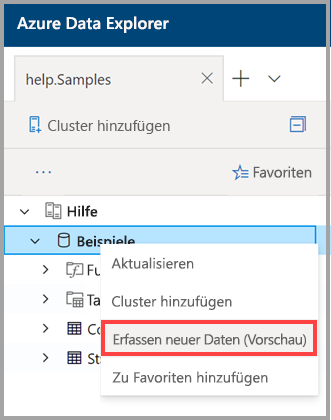

# Erfassen von Daten in Azure Data Explorer mithilfe der 1-Klick-Erfassung

In diesem Artikel wird gezeigt, wie Sie mit der 1-Klick-Erfassung schnell eine neue Tabelle im JSON- oder CSV-Format erfassen. Die Daten können aus dem Speicher oder einer lokalen Datei in einer vorhandenen Tabelle oder einer neuen Tabelle erfasst werden. Verwenden Sie den intuitiven 1-Klick-Assistenten, um Ihre Daten innerhalb weniger Minuten zu erfassen. Anschließend können Sie die Tabelle bearbeiten und Abfragen mithilfe der Webbenutzeroberfläche von Azure Data Explorer ausführen.

## Voraussetzungen

* Wenn Sie über kein Azure-Abonnement verfügen, können Sie ein [kostenloses Azure-Konto](https://azure.microsoft.com/free/) erstellen, bevor Sie beginnen.
* Melden Sie sich bei der [Anwendung](https://dataexplorer.azure.com/) an.
* Erstellen Sie [einen Azure Data Explorer-Cluster und eine Datenbank](create-cluster-database-portal.md).
* Melden Sie sich bei der [Webbenutzeroberfläche](https://dataexplorer.azure.com/) an, und [fügen Sie eine Verbindung mit Ihrem Cluster hinzu](/azure/data-explorer/web-query-data#add-clusters).

## Erfassen neuer Daten

1. Klicken Sie im linken Menü der Webbenutzeroberfläche mit der rechten Maustaste auf die Zeile *Datenbank* oder *Tabelle*, und wählen Sie **Neue Daten erfassen (Vorschau)** aus.

       
 
1. Wählen Sie im Fenster **Neue Daten erfassen (Vorschau)** die Registerkarte **Quelle** aus, und vervollständigen Sie die **Projektdetails**:

    * Wählen Sie bei einer **Tabelle** im Dropdownmenü den Namen einer vorhandenen Tabelle aus, oder wählen Sie **Neu erstellen** aus, um eine neue Tabelle zu erstellen.
    * Wählen Sie als **Erfassungstyp** entweder **Aus Speicher** oder **Aus Datei** aus.
      * Wählen Sie bei Auswahl von **Aus Speicher** die Option **Link zum Speicher** aus, um eine URL hinzuzufügen. Verwenden Sie die [Blob-SAS-URL](/azure/vs-azure-tools-storage-explorer-blobs#get-the-sas-for-a-blob-container) für private Speicherkonten. 
      * Wenn Sie **Aus Datei** ausgewählt haben, klicken Sie auf **Durchsuchen**, und ziehen Sie die Datei in das Feld.
    * Wählen Sie **Schema bearbeiten** aus, um Ihre Tabellenspaltenkonfiguration anzuzeigen und zu bearbeiten.
 
     

    > [!TIP]
    > Wenn Sie **Neue Daten erfassen (Vorschau)** für eine Zeile vom Typ *Tabelle* ausgewählt haben, wird der Name der ausgewählten Tabelle in den **Projektdetails** angezeigt.

1. Wenn Sie eine vorhandene Tabelle ausgewählt haben, wird das Fenster **Spalten zuordnen** geöffnet, um eine Zuordnung zwischen Quelldatenspalten und Zieltabellenspalten durchzuführen. 
    * Verwenden Sie **Spalte auslassen**, um eine Zielspalte aus der Tabelle zu entfernen.
    * Verwenden Sie **Neue Spalte**, um der Tabelle eine neue Spalte hinzuzufügen.

    

1. Auf der Registerkarte **Schema**:

    * Wählen Sie im Dropdownmenü die Option **Komprimierungstyp** und dann entweder **Unkomprimiert** oder **GZip** aus.
    * Wählen Sie im Dropdown die Option **Datenformat** und dann **JSON**, **CSV**, **TSV**, **SCSV**, **SOHSV**, **TSVE** oder **PSV** aus. 
        * Wenn Sie das Format **JSON** auswählen, müssen Sie auch **JSON-Ebenen** zwischen 1 und 10 auswählen. Die Ebene wirkt sich auf die Darstellung der Tabellenspaltendaten aus. 
        * Wenn Sie ein anderes Format als JSON auswählen, müssen Sie das Kontrollkästchen **Spaltennamen einschließen** aktivieren, damit die Überschriftenzeile der Datei ignoriert wird.
    * **Zuordnungsname** wird automatisch festgelegt, kann jedoch bearbeitet werden.
    * Wenn Sie eine vorhandene Tabelle ausgewählt haben, können Sie **Spalten zuordnen** auswählen, um das Fenster **Spalten zuordnen** zu öffnen.

    

1. Wählen Sie über dem Bereich **Editor** die Schaltfläche **v** aus, um den Editor zu öffnen. Im Editor können Sie die aus Ihren Eingaben generierten automatischen Abfragen anzeigen und kopieren. 

1. In der Tabelle: 
    * Klicken Sie mit der rechten Maustaste auf die Überschriften einer neuen Zeile, um eine dieser Aufgaben auszuführen: **Datentyp ändern**, **Spalte umbenennen**, **Spalte löschen**, **Aufsteigend sortieren**, **Absteigend sortieren**. Für vorhandene Spalten steht nur eine Datensortierung zur Verfügung. 
    * Doppelklicken Sie zur Bearbeitung auf den Namen der neuen Spalte.

1. Wählen Sie **Erfassung starten** aus, um Tabelle und Zuordnung zu erstellen und die Datenerfassung zu starten.

     
 
## Daten abfragen

1. Im Fenster **Datenerfassung abgeschlossen** werden alle drei Schritte mit grünen Häkchen markiert, wenn die Datenerfassung erfolgreich abgeschlossen wurde.
 
    

1. Wählen Sie die Schaltfläche **v** aus, um die Abfrage zu öffnen. Kopieren Sie die Abfrage auf die Webbenutzeroberfläche, um sie zu bearbeiten.

1. Das Menü auf der rechten Seite enthält die Optionen **Schnellabfragen** und **Tools**. 

    * **Schnellabfragen** enthält Links zur Webbenutzeroberfläche mit Beispielabfragen.
    * **Tools** enthält einen Link zur Webbenutzeroberfläche mit **Drop-Befehlen**, die Ihnen die Problembehandlung durch Ausführen des entsprechenden `.drop`-Befehls ermöglichen.

    > [!TIP]
    > Wenn Sie `.drop`-Befehle verwenden, gehen möglicherweise Daten verloren. Verwenden Sie sie daher mit Vorsicht.

## Nächste Schritte

* [Abfragen von Daten auf der Azure Data Explorer-Webbenutzeroberfläche](web-query-data.md)
* [Schreiben von Abfragen für Azure Data Explorer mithilfe der Kusto-Abfragesprache](write-queries.md)
