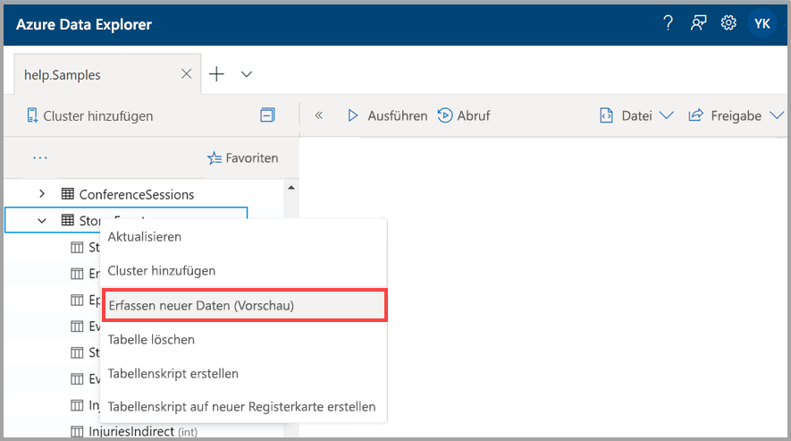
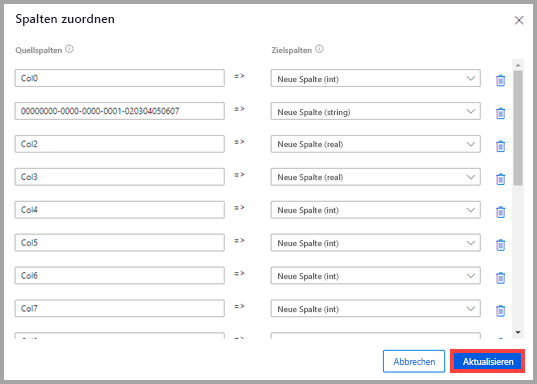
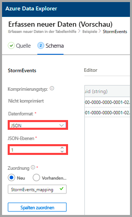
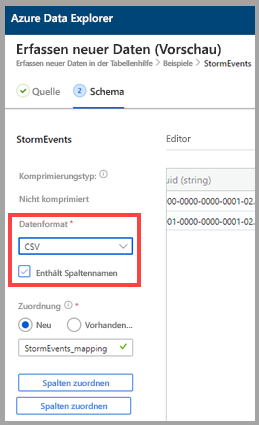
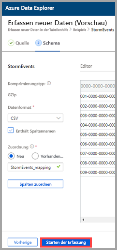

# Erfassen von Daten in einer vorhandenen Tabelle in Azure Data Explorer mithilfe der 1-Klick-Erfassung

Mit der 1-Klick-Erfassung lassen sich Daten im JSON- und CSV-Format sowie in anderen Formaten schnell in einer Tabelle erfassen. Über die Azure Data Explorer-Webbenutzeroberfläche können Sie Daten aus dem Speicher, aus einer lokalen Datei oder aus einem Container erfassen. 

In diesem Dokument erfahren Sie, wie Sie JSON-Daten aus einer Datei mithilfe des intuitiven 1-Klick-Assistenten in einer vorhandenen Tabelle erfassen. Anschließend können Sie die Tabelle bearbeiten und Abfragen über die Webbenutzeroberfläche von Azure Data Explorer ausführen.

Die 1-Klick-Erfassung ist besonders nützlich, wenn Daten erstmalig erfasst werden oder Sie nicht mit dem Schema Ihrer Daten vertraut sind. 

Eine Übersicht über die 1-Klick-Erfassung sowie eine Liste der Voraussetzungen finden Sie unter [Was ist die 1-Klick-Erfassung?](ingest-data-one-click.md)
Informationen zum Erfassen von Daten in einer neuen Tabelle in Azure Data Explorer finden Sie unter [Erfassen von Daten in einer neuen Tabelle in Azure Data Explorer mithilfe der 1-Klick-Erfassung](one-click-ingestion-new-table.md)

## Erfassen neuer Daten

1. Klicken Sie im linken Menü der Webbenutzeroberfläche mit der rechten Maustaste auf eine *Datenbank* oder *Tabelle*, und wählen Sie **Neue Daten erfassen (Vorschau)** aus.

       
 
1. Im Fenster **Neue Daten erfassen (Vorschau)** wird automatisch die Registerkarte **Quelle** ausgewählt.

1. Wenn das Feld **Tabelle** nicht automatisch gefüllt wird, wählen Sie eine vorhandene Tabelle aus dem Dropdownmenü aus.
    > [!TIP]
    > Wenn Sie **Neue Daten erfassen (Vorschau)** für eine Zeile vom Typ *Tabelle* ausgewählt haben, wird der Name der ausgewählten Tabelle in den **Projektdetails** angezeigt.

[!INCLUDE [data-explorer-one-click-ingestion-types](../../includes/data-explorer-one-click-ingestion-types.md)]
    
Wählen Sie **Schema bearbeiten** aus, um Ihre Tabellenspaltenkonfiguration anzuzeigen und zu bearbeiten.

## Bearbeiten des Schemas

1. Das Dialogfeld **Spalten zuordnen** wird geöffnet, in dem Sie Quelldatenspalten zu Zieldatenspalten zuordnen können. 
    * Geben Sie in den Feldern **Quellspalten** die Spaltennamen ein, die den **Zielspalten** zugeordnet werden sollen.
    * Um eine Zuordnung zu löschen, wählen Sie das Papierkorbsymbol aus.

    

1. Wählen Sie **Update** aus.
1. Auf der Registerkarte **Schema**:
    1. Wählen Sie **Komprimierungstyp** und dann entweder **Unkomprimiert** oder **GZip** aus.

        [!INCLUDE [data-explorer-one-click-ingestion-edit-schema](../../includes/data-explorer-one-click-ingestion-edit-schema.md)]
        
    1. Bei Auswahl von **JSON** müssen auch **JSON-Ebenen** (1 bis 10) ausgewählt werden. Die Ebene wirkt sich auf die Darstellung der Tabellenspaltendaten aus.

    

    * Wenn Sie ein anderes Format als JSON auswählen, können Sie das Kontrollkästchen **Spaltennamen einschließen** aktivieren, damit die Überschriftenzeile der Datei ignoriert wird.
        
    

    > [!Note]
    > Bei tabellarischen Formaten können Spaltendaten in nur einer Spalte einer Azure Data Explorer-Tabelle erfasst werden. 

    * Es werden automatisch neue Zuordnungen festgelegt, Sie können diese jedoch ändern und eine vorhandene Zuordnung verwenden. 
    * Sie können **Spalten zuordnen** auswählen, um das Fenster **Spalten zuordnen** zu öffnen.

## Kopieren und Einfügen von Abfragen

1. Wählen Sie über dem Bereich **Editor** die Schaltfläche **v** aus, um den Editor zu öffnen. Im Editor können Sie die aus Ihren Eingaben generierten automatischen Befehle anzeigen und kopieren. 
1. In der Tabelle: 
    * Wählen Sie neue Spaltenüberschriften aus, um eine der folgenden Aufgaben auszuführen: **Neue Spalte** hinzufügen, **Spalte löschen**, **Aufsteigend sortieren** oder **Absteigend sortieren**. Für vorhandene Spalten steht nur eine Datensortierung zur Verfügung.

    > [!Note]
    > * Der Name und Datentyp vorhandener Tabellen kann nicht aktualisiert werden.
    > * Durch Befehle zum Verwerfen werden lediglich die Änderungen durch den Erfassungsfluss (neue Erweiterungen und Spalten) zurückgesetzt. Andere Vorgänge werden nicht verworfen.

 

## Starten der Erfassung

Wählen Sie **Erfassung starten** aus, um Tabelle und Zuordnung zu erstellen und die Datenerfassung zu starten.

## Datenerfassung abgeschlossen

Im Fenster **Datenerfassung abgeschlossen** werden alle drei Schritte mit grünen Häkchen markiert, wenn die Datenerfassung erfolgreich abgeschlossen wurde.
 

[!INCLUDE [data-explorer-one-click-ingestion-query-data](../../includes/data-explorer-one-click-ingestion-query-data.md)]

## Nächste Schritte

* [Abfragen von Daten auf der Azure Data Explorer-Webbenutzeroberfläche](/azure/data-explorer/web-query-data)
* [Schreiben von Abfragen für Azure Data Explorer mithilfe der Kusto-Abfragesprache](/azure/data-explorer/write-queries)
