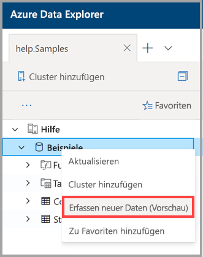
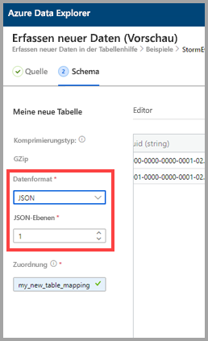
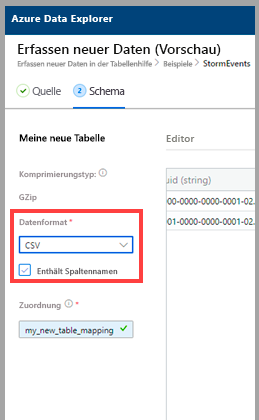
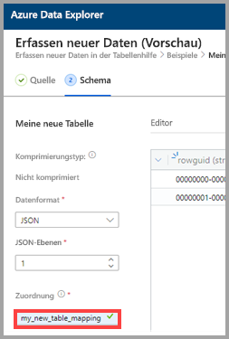
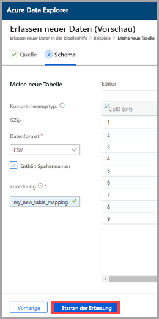
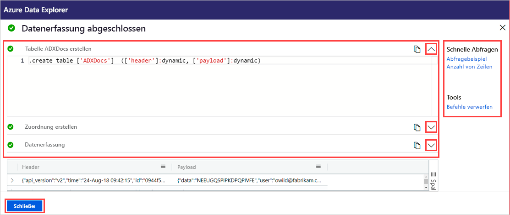

# Erfassen von Daten in einer neuen Tabelle in Azure Data Explorer mithilfe der 1-Klick-Erfassung

Mit der 1-Klick-Erfassung lassen sich Daten im JSON- und CSV-Format sowie in anderen Formaten schnell in einer Tabelle erfassen. Über die Azure Data Explorer-Webbenutzeroberfläche können Sie Daten aus dem Speicher, aus einer lokalen Datei oder aus einem Container erfassen. 

In diesem Dokument erfahren Sie, wie Sie CSV-Daten aus einem Container mithilfe des intuitiven 1-Klick-Assistenten in einer neuen Tabelle erfassen. Anschließend können Sie die Tabelle bearbeiten und Abfragen mithilfe der Webbenutzeroberfläche von Azure Data Explorer ausführen. Sie können auch eine kontinuierliche Erfassung festlegen, um automatisch Daten in der Tabelle zu erfassen, wenn die Quelldaten aktualisiert werden.

Die 1-Klick-Erfassung ist besonders nützlich, wenn Daten erstmalig erfasst werden oder Sie nicht mit dem Schema Ihrer Daten vertraut sind. 

Eine Übersicht über die 1-Klick-Erfassung sowie eine Liste der Voraussetzungen finden Sie unter [Was ist die 1-Klick-Erfassung?](ingest-data-one-click.md).
Informationen zum Erfassen von Daten in einer vorhandenen Tabelle in Azure Data Explorer finden Sie unter [Erfassen von Daten in einer vorhandenen Tabelle in Azure Data Explorer mithilfe der 1-Klick-Erfassung](one-click-ingestion-existing-table.md).

## Erfassen neuer Daten

1. Klicken Sie im linken Menü der Webbenutzeroberfläche mit der rechten Maustaste auf eine *Datenbank*, und wählen Sie **Neue Daten erfassen (Vorschau)** aus.

       
 
1. Im Fenster **Neue Daten erfassen (Vorschau)** wird automatisch die Registerkarte **Quelle** ausgewählt. 

1. Wählen Sie **Neue Tabelle erstellen** aus, und geben Sie einen Namen für die neue Tabelle ein. Sie können alphanumerische Zeichen, Bindestriche und Unterstriche verwenden. Sonderzeichen werden nicht unterstützt.

 

[!INCLUDE [data-explorer-one-click-ingestion-types](../../includes/data-explorer-one-click-ingestion-types.md)]

Wählen Sie **Schema bearbeiten** aus, um Ihre Tabellenspaltenkonfiguration anzuzeigen und zu bearbeiten. Vom System wird willkürlich eines der Blobs ausgewählt, und das Schema wird auf der Grundlage dieses Blobs generiert. Anhand des Namens der Quelle identifiziert der Dienst automatisch, ob sie komprimiert ist.

## Bearbeiten des Schemas

1. Auf der Registerkarte **Schema**:

    1. Wählen Sie **Datenformat** aus:

        [!INCLUDE [data-explorer-one-click-ingestion-edit-schema](../../includes/data-explorer-one-click-ingestion-edit-schema.md)]

    1. Bei Verwendung von **JSON** müssen auch **JSON-Ebenen** (zwischen „1“ und „10“) ausgewählt werden. Die Ebene wirkt sich auf die Darstellung der Tabellenspaltendaten aus. 

    

    * Wenn Sie ein anderes Format als JSON auswählen, können Sie das Kontrollkästchen **Include column names** (Spaltennamen einschließen) aktivieren, damit die Überschriftenzeile der Datei ignoriert wird.

        
        
1. Geben Sie im Feld **Mapping name** (Zuordnungsname) einen Zuordnungsnamen ein. Sie können alphanumerische Zeichen und Unterstriche verwenden. Leerzeichen, Sonderzeichen und Bindestriche werden nicht unterstützt.
    
    

## Kopieren und Einfügen von Abfragen

1. Wählen Sie über dem Bereich **Editor** die Schaltfläche **v** aus, um den Editor zu öffnen. Im Editor können Sie die aus Ihren Eingaben generierten automatischen Abfragen anzeigen und kopieren. 
1. In der Tabelle: 
    * Doppelklicken Sie zur Bearbeitung auf den Namen der neuen Spalte.
    * Wählen Sie neue Spaltenüberschriften aus, und führen Sie beliebige der folgenden Aktionen aus:
    
|Aktion         |Beschreibung                                  |
|-----------------|-------------------------------------------|
|Datentyp ändern |Ermöglicht das Ändern des automatisch vom Dienst ausgewählten Datentyps in einen der anderen [unterstützten Datentypen](#edit-the-schema)|
|Spalte umbenennen    |Ermöglicht das Ändern des Spaltennamens. |
|Neue Spalte       |Ermöglicht das Hinzufügen einer neuen Spalte.|
|Spalte löschen    |Ermöglicht das Löschen der ausgewählten Spalte.|
|Aufsteigend sortieren   |Ermöglicht das Sortieren der Tabelle nach der ausgewählten Spalte in aufsteigender Reihenfolge (nur vorhandene Spalten).|
|Absteigend sortieren  |Ermöglicht das Sortieren der Tabelle nach der ausgewählten Spalte in absteigender Reihenfolge (nur vorhandene Spalten). |

> [!Note]
> Bei Tabellenformaten kann jede Spalte in einer Spalte in Azure Data Explorer erfasst werden.
> Neue Spalten können auf der Grundlage verschiedener JSON-Ebenen erstellt werden.

 

## Starten der Erfassung

Wählen Sie **Erfassung starten** aus, um Tabelle und Zuordnung zu erstellen und die Datenerfassung zu starten.

## Datenerfassung abgeschlossen

Im Fenster **Datenerfassung abgeschlossen** werden alle drei Schritte mit grünen Häkchen markiert, wenn die Datenerfassung erfolgreich abgeschlossen wurde.
 

[!INCLUDE [data-explorer-one-click-ingestion-query-data](../../includes/data-explorer-one-click-ingestion-query-data.md)]

**Kontinuierliche Erfassung**

Mithilfe der kontinuierlichen Erfassung können Sie eine Event Grid-Instanz erstellen, die auf den Quellcontainer lauscht. Alle neuen Blobs, die die Kriterien der vordefinierten Parameter (Präfix, Suffix usw.) erfüllen, werden automatisch in der Zieltabelle erfasst.

> [!Note]
> Die kontinuierliche Erfassung ist nur bei der containerbasierten Erfassung relevant.

1. Wählen Sie **Continuous ingestion** (Kontinuierliche Erfassung) aus, um das Azure-Portal zu öffnen. Daraufhin wird die Datenverbindungsseite mit dem Event Grid-Datenconnector und bereits eingegebenen Quell- und Zielparametern (Quellcontainer, Tabellen und Zuordnungen) geöffnet.

1. Wählen Sie **Erstellen** aus, um eine Datenverbindung zu erstellen, die auf Änderungen in diesem Container lauscht. 

## Nächste Schritte

* [Abfragen von Daten auf der Azure Data Explorer-Webbenutzeroberfläche](/azure/data-explorer/web-query-data)
* [Schreiben von Abfragen für Azure Data Explorer mithilfe der Kusto-Abfragesprache](/azure/data-explorer/write-queries)
