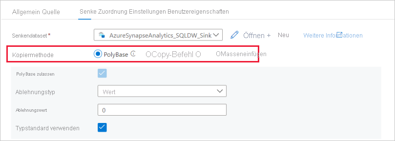

# <a name="copy-and-transform-data-in-azure-synapse-analytics-formerly-azure-sql-data-warehouse-by-using-azure-data-factory"></a>Kopieren und Transformieren von Daten in Azure Synapse Analytics (früher Azure SQL Data Warehouse) mithilfe von Azure Data Factory 

> [!div class="op_single_selector" title1="Wählen Sie die von Ihnen verwendete Version des Data Factory-Diensts aus:"]
> * [Version1](v1/data-factory-azure-sql-data-warehouse-connector.md)
> * [Aktuelle Version](connector-azure-sql-data-warehouse.md)

In diesem Artikel wird beschrieben, wie Sie Daten mithilfe der Kopieraktivität in Azure Data Factory aus und in Azure Synapse Analytics kopieren sowie Daten mithilfe von Datenfluss in Azure Data Lake Storage Gen2 transformieren. Informationen zu Azure Data Factory finden Sie im [Einführungsartikel](introduction.md).

## <a name="supported-capabilities"></a>Unterstützte Funktionen

Dieser Connector von Azure Synapse Analytics wird für die folgenden Aktivitäten unterstützt:

- [Kopieraktivität](copy-activity-overview.md) mit [unterstützter Quellen/Senken-Matrix](copy-activity-overview.md)-Tabelle
- [Mapping Data Flow](concepts-data-flow-overview.md)
- [Lookup-Aktivität](control-flow-lookup-activity.md)
- [GetMetadata-Aktivität](control-flow-get-metadata-activity.md)

Für die Kopieraktivität unterstützt dieser Connector von Azure Synapse Analytics folgende Funktionen:

- Kopieren von Daten mit SQL-Authentifizierung und Azure Active Directory-Anwendungstokenauthentifizierung (Azure AD) mit einem Dienstprinzipal oder verwalteten Identitäten für Azure-Ressourcen.
- Als Quelle das Abrufen von Daten mithilfe einer SQL-Abfrage oder gespeicherten Prozedur
- Als Senke das Laden von Daten mithilfe von [PolyBase](#use-polybase-to-load-data-into-azure-sql-data-warehouse), einer [COPY-Anweisung](#use-copy-statement) (Vorschau) oder BULK INSERT. Wir empfehlen PolyBase oder die COPY-Anweisung (Vorschau) für eine bessere Kopierleistung.

> [!IMPORTANT]
> Wenn Sie Daten mithilfe der Azure Data Factory Integration Runtime kopieren, konfigurieren Sie die [Azure SQL Server-Firewall](https://msdn.microsoft.com/library/azure/ee621782.aspx#ConnectingFromAzure), damit Azure-Dienste Zugriff auf den Server erhalten.
> Wenn Sie Daten mithilfe einer selbstgehosteten Integration Runtime kopieren, konfigurieren Sie die Azure SQL-Server-Firewall, um den entsprechenden IP-Adressbereich zuzulassen. Dieser Bereich schließt die IP-Adresse des Computers ein, der für die Verbindung mit Azure Synapse Analytics verwendet wird.

## <a name="get-started"></a>Erste Schritte

> [!TIP]
> Das beste Ergebnis erzielen Sie, indem Sie Daten mithilfe von PolyBase in Azure Synapse Analytics laden. Weitere Informationen finden Sie im Abschnitt [Laden der Daten unter Verwendung von PolyBase in Azure Synapse Analytics](#use-polybase-to-load-data-into-azure-sql-data-warehouse). Eine exemplarische Vorgehensweise mit einem Anwendungsfall finden Sie unter [Laden von 1 TB in Azure Synapse Analytics in weniger als 15 Minuten mit Azure Data Factory](load-azure-sql-data-warehouse.md).

[!INCLUDE [data-factory-v2-connector-get-started](../../includes/data-factory-v2-connector-get-started.md)]

Die folgenden Abschnitte enthalten Details zu Eigenschaften für das Definieren von Data Factory-Entitäten speziell für den Connector von Azure Synapse Analytics.

## <a name="linked-service-properties"></a>Eigenschaften des verknüpften Diensts

Folgende Eigenschaften werden für einen mit Azure Synapse Analytics verknüpften Dienst unterstützt:

| Eigenschaft            | BESCHREIBUNG                                                  | Erforderlich                                                     |
| :------------------ | :----------------------------------------------------------- | :----------------------------------------------------------- |
| type                | Die „type“-Eigenschaft muss auf **AzureSqlDW** festgelegt sein.             | Ja                                                          |
| connectionString    | Geben Sie Informationen, die zur Verbindung mit der Instanz von Azure Synapse Analytics erforderlich sind, für die Eigenschaft **connectionString** ein. <br/>Markieren Sie dieses Feld als „SecureString“, um es sicher in Data Factory zu speichern. Sie können auch das Kennwort/den Dienstprinzipalschlüssel in Azure Key Vault speichern und bei Verwendung der SQL-Authentifizierung die `password`-Konfiguration aus der Verbindungszeichenfolge pullen. Ausführlichere Informationen finden Sie im JSON-Beispiel unter der Tabelle und im Artikel [Speichern von Anmeldeinformationen in Azure Key Vault](store-credentials-in-key-vault.md). | Ja                                                          |
| servicePrincipalId  | Geben Sie die Client-ID der Anwendung an.                         | Ja, bei Azure AD-Authentifizierung mit einem Dienstprinzipal |
| servicePrincipalKey | Geben Sie den Schlüssel der Anwendung an. Markieren Sie dieses Feld als SecureString, um es sicher in Data Factory zu speichern, oder [verweisen Sie auf ein in Azure Key Vault gespeichertes Geheimnis](store-credentials-in-key-vault.md). | Ja, bei Azure AD-Authentifizierung mit einem Dienstprinzipal |
| tenant              | Geben Sie die Mandanteninformationen (Domänenname oder Mandanten-ID) für Ihre Anwendung an. Diese können Sie abrufen, indem Sie den Mauszeiger über den rechten oberen Bereich im Azure-Portal bewegen. | Ja, bei Azure AD-Authentifizierung mit einem Dienstprinzipal |
| connectVia          | Die [Integration Runtime](concepts-integration-runtime.md), die zum Herstellen einer Verbindung mit dem Datenspeicher verwendet werden soll. Sie können die Azure Integration Runtime oder eine selbstgehostete Integration Runtime verwenden (sofern sich Ihr Datenspeicher in einem privaten Netzwerk befindet). Wenn keine Option angegeben ist, wird die standardmäßige Azure Integration Runtime verwendet. | Nein                                                           |

Weitere Voraussetzungen und JSON-Beispiele für die verschiedenen Authentifizierungstypen finden Sie in den folgenden Abschnitten:

- [SQL-Authentifizierung](#sql-authentication)
- Azure AD-Anwendungstokenauthentifizierung: [Dienstprinzipal](#service-principal-authentication)
- Azure AD-Anwendungstokenauthentifizierung: [Verwaltete Identitäten für Azure-Ressourcen](#managed-identity)

>[!TIP]
>Wenn ein Fehler mit dem Fehlercode „UserErrorFailedToConnectToSqlServer“ auftritt und eine Meldung wie „Das Sitzungslimit für die Datenbank ist XXX und wurde erreicht“ angezeigt wird, fügen Sie `Pooling=false` zu Ihrer Verbindungszeichenfolge hinzu, und versuchen Sie es erneut.

### <a name="sql-authentication"></a>SQL-Authentifizierung

#### <a name="linked-service-example-that-uses-sql-authentication"></a>Beispiel eines verknüpften Diensts mit SQL-Authentifizierung

```json
{
    "name": "AzureSqlDWLinkedService",
    "properties": {
        "type": "AzureSqlDW",
        "typeProperties": {
            "connectionString": "Server=tcp:<servername>.database.windows.net,1433;Database=<databasename>;User ID=<username>@<servername>;Password=<password>;Trusted_Connection=False;Encrypt=True;Connection Timeout=30"
        },
        "connectVia": {
            "referenceName": "<name of Integration Runtime>",
            "type": "IntegrationRuntimeReference"
        }
    }
}
```

**Kennwort in Azure Key Vault:**

```json
{
    "name": "AzureSqlDWLinkedService",
    "properties": {
        "type": "AzureSqlDW",
        "typeProperties": {
            "connectionString": "Server=tcp:<servername>.database.windows.net,1433;Database=<databasename>;User ID=<username>@<servername>;Trusted_Connection=False;Encrypt=True;Connection Timeout=30",
            "password": { 
                "type": "AzureKeyVaultSecret", 
                "store": { 
                    "referenceName": "<Azure Key Vault linked service name>", 
                    "type": "LinkedServiceReference" 
                }, 
                "secretName": "<secretName>" 
            }
        },
        "connectVia": {
            "referenceName": "<name of Integration Runtime>",
            "type": "IntegrationRuntimeReference"
        }
    }
}
```

### <a name="service-principal-authentication"></a>Dienstprinzipalauthentifizierung

Um die Azure AD-Anwendungstokenauthentifizierung basierend auf dem Dienstprinzipal zu verwenden, gehen Sie folgendermaßen vor:

1. **[Erstellen Sie eine Azure Active Directory-Anwendung](../active-directory/develop/howto-create-service-principal-portal.md#create-an-azure-active-directory-application)** im Azure-Portal. Notieren Sie sich den Anwendungsnamen und die folgenden Werte zum Definieren des verknüpften Diensts:

    - Anwendungs-ID
    - Anwendungsschlüssel
    - Mandanten-ID

2. **[Stellen Sie einen Azure Active Directory-Administrator für Ihren Azure SQL-Server im Azure-Portal bereit](../sql-database/sql-database-aad-authentication-configure.md#provision-an-azure-active-directory-administrator-for-your-azure-sql-database-server)** , wenn dies noch nicht geschehen ist. Der Azure AD-Administrator kann ein Azure AD-Benutzer oder eine Azure AD-Gruppe sein. Wenn Sie der Gruppe mit der verwalteten Identität eine Administratorrolle zuweisen, überspringen Sie die Schritte 3 und 4. Der Administrator hat vollen Zugriff auf die Datenbank.

3. **[Erstellen Sie eigenständige Datenbankbenutzer](../sql-database/sql-database-aad-authentication-configure.md#create-contained-database-users-in-your-database-mapped-to-azure-ad-identities)** für den Dienstprinzipal. Stellen Sie eine Verbindung mit dem Data Warehouse her, aus dem bzw. in das Sie Daten mithilfe von Tools wie SSMS kopieren möchten. Verwenden Sie dazu eine Azure AD-Identität, die mindestens die Berechtigung ALTER ANY USER aufweist. Führen Sie folgenden T-SQL-Code aus:
  
    ```sql
    CREATE USER [your application name] FROM EXTERNAL PROVIDER;
    ```

4. **Gewähren Sie dem Dienstprinzipal die notwendigen Berechtigungen**, wie bei SQL- oder anderen Benutzern üblich. Führen Sie den folgenden Code aus, oder machen Sie sich mit [weiteren Optionen](https://docs.microsoft.com/sql/relational-databases/system-stored-procedures/sp-addrolemember-transact-sql?view=sql-server-2017) vertraut. Wenn Sie PolyBase zum Laden der Daten verwenden möchten, machen Sie sich mit der [benötigten Datenbankberechtigung](#required-database-permission) vertraut.

    ```sql
    EXEC sp_addrolemember db_owner, [your application name];
    ```

5. **Konfigurieren Sie einen mit Azure Synapse Analytics verknüpften Dienst** in Azure Data Factory.


#### <a name="linked-service-example-that-uses-service-principal-authentication"></a>Beispiel eines verknüpften Diensts mit Dienstprinzipalauthentifizierung

```json
{
    "name": "AzureSqlDWLinkedService",
    "properties": {
        "type": "AzureSqlDW",
        "typeProperties": {
            "connectionString": "Server=tcp:<servername>.database.windows.net,1433;Database=<databasename>;Connection Timeout=30",
            "servicePrincipalId": "<service principal id>",
            "servicePrincipalKey": {
                "type": "SecureString",
                "value": "<service principal key>"
            },
            "tenant": "<tenant info, e.g. microsoft.onmicrosoft.com>"
        },
        "connectVia": {
            "referenceName": "<name of Integration Runtime>",
            "type": "IntegrationRuntimeReference"
        }
    }
}
```

### <a name="managed-identities-for-azure-resources-authentication"></a><a name="managed-identity"></a>Verwaltete Identitäten für Azure-Ressourcenauthentifizierung

Eine Data Factory kann einer [verwalteten Identität für Azure-Ressourcen](data-factory-service-identity.md) zugeordnet werden, die diese spezielle Factory darstellt. Sie können diese verwaltete Identität für die Authentifizierung von Azure Synapse Analytics verwenden. Die angegebene Factory kann mithilfe dieser Identität auf Daten in Ihrem Data Warehouse zugreifen und diese kopieren.

Führen Sie die folgenden Schritte aus, um die Authentifizierung mit einer verwalteten Identität zu verwenden:

1. **[Stellen Sie einen Azure Active Directory-Administrator für Ihren Azure SQL-Server im Azure-Portal bereit](../sql-database/sql-database-aad-authentication-configure.md#provision-an-azure-active-directory-administrator-for-your-azure-sql-database-server)** , wenn dies noch nicht geschehen ist. Der Azure AD-Administrator kann ein Azure AD-Benutzer oder eine Azure AD-Gruppe sein. Wenn Sie der Gruppe mit der verwalteten Identität eine Administratorrolle zuweisen, überspringen Sie die Schritte 3 und 4. Der Administrator hat vollen Zugriff auf die Datenbank.

2. **[Erstellen Sie für eine eigenständige Datenbank Benutzer](../sql-database/sql-database-aad-authentication-configure.md#create-contained-database-users-in-your-database-mapped-to-azure-ad-identities)** für die verwaltete Data Factory-Identität. Stellen Sie eine Verbindung mit dem Data Warehouse her, aus dem bzw. in das Sie Daten mithilfe von Tools wie SSMS kopieren möchten. Verwenden Sie dazu eine Azure AD-Identität, die mindestens die Berechtigung ALTER ANY USER aufweist. Führen Sie den folgenden T-SQL-Befehl aus. 
  
    ```sql
    CREATE USER [your Data Factory name] FROM EXTERNAL PROVIDER;
    ```

3. **Gewähren Sie der verwalteten Data Factory-Identität die notwendigen Berechtigungen**, und gehen Sie dabei so vor wie für SQL-Benutzer und andere Benutzer. Führen Sie den folgenden Code aus, oder machen Sie sich mit [weiteren Optionen](https://docs.microsoft.com/sql/relational-databases/system-stored-procedures/sp-addrolemember-transact-sql?view=sql-server-2017) vertraut. Wenn Sie PolyBase zum Laden der Daten verwenden möchten, machen Sie sich mit der [benötigten Datenbankberechtigung](#required-database-permission) vertraut.

    ```sql
    EXEC sp_addrolemember db_owner, [your Data Factory name];
    ```

5. **Konfigurieren Sie einen mit Azure Synapse Analytics verknüpften Dienst** in Azure Data Factory.

**Beispiel:**

```json
{
    "name": "AzureSqlDWLinkedService",
    "properties": {
        "type": "AzureSqlDW",
        "typeProperties": {
            "connectionString": "Server=tcp:<servername>.database.windows.net,1433;Database=<databasename>;Connection Timeout=30"
        },
        "connectVia": {
            "referenceName": "<name of Integration Runtime>",
            "type": "IntegrationRuntimeReference"
        }
    }
}
```

## <a name="dataset-properties"></a>Dataset-Eigenschaften

Eine vollständige Liste mit den Abschnitten und Eigenschaften, die zum Definieren von Datasets zur Verfügung stehen, finden Sie im Artikel zu [Datasets](concepts-datasets-linked-services.md). 

Die folgenden Eigenschaften werden beim Dataset von Azure Synapse Analytics unterstützt:

| Eigenschaft  | BESCHREIBUNG                                                  | Erforderlich                    |
| :-------- | :----------------------------------------------------------- | :-------------------------- |
| type      | Die **type**-Eigenschaft des Datasets muss auf **AzureSqlDWTable** festgelegt sein. | Ja                         |
| schema | Name des Schemas. |Quelle: Nein, Senke: Ja  |
| table | Name der Tabelle/Ansicht. |Quelle: Nein, Senke: Ja  |
| tableName | Name der Tabelle/Ansicht mit Schema. Diese Eigenschaft wird aus Gründen der Abwärtskompatibilität weiterhin unterstützt. Verwenden Sie für eine neue Workload `schema` und `table`. | Quelle: Nein, Senke: Ja |

#### <a name="dataset-properties-example"></a>Beispiel für Dataseteigenschaften

```json
{
    "name": "AzureSQLDWDataset",
    "properties":
    {
        "type": "AzureSqlDWTable",
        "linkedServiceName": {
            "referenceName": "<Azure Synapse Analytics linked service name>",
            "type": "LinkedServiceReference"
        },
        "schema": [ < physical schema, optional, retrievable during authoring > ],
        "typeProperties": {
            "schema": "<schema_name>",
            "table": "<table_name>"
        }
    }
}
```

## <a name="copy-activity-properties"></a>Eigenschaften der Kopieraktivität

Eine vollständige Liste mit den Abschnitten und Eigenschaften zum Definieren von Aktivitäten finden Sie im Artikel [Pipelines](concepts-pipelines-activities.md). Dieser Abschnitt enthält eine Liste der Eigenschaften, die von der Quelle und Senke von Azure Synapse Analytics unterstützt werden.

### <a name="azure-synapse-analytics-as-the-source"></a>Azure Synapse Analytics als Quelle

Legen Sie zum Kopieren von Daten aus Azure Synapse Analytics die Eigenschaft **type** der Quelle der Kopieraktivität auf **SqlDWSource** fest. Die folgenden Eigenschaften werden im Abschnitt **source** der Kopieraktivität unterstützt:

| Eigenschaft                     | BESCHREIBUNG                                                  | Erforderlich |
| :--------------------------- | :----------------------------------------------------------- | :------- |
| type                         | Die **type**-Eigenschaft der Quelle der Kopieraktivität muss auf **SqlDWSource** festgelegt sein. | Ja      |
| sqlReaderQuery               | Verwendet die benutzerdefinierte SQL-Abfrage zum Lesen von Daten. Beispiel: `select * from MyTable`. | Nein       |
| sqlReaderStoredProcedureName | Name der gespeicherten Prozedur, die Daten aus der Quelltabelle liest. Die letzte SQL-Anweisung muss eine SELECT-Anweisung in der gespeicherten Prozedur sein. | Nein       |
| storedProcedureParameters    | Parameter für die gespeicherte Prozedur.<br/>Zulässige Werte sind Namen oder Name-Wert-Paare. Die Namen und die Groß-/Kleinschreibung von Parametern müssen denen der Parameter der gespeicherten Prozedur entsprechen. | Nein       |
| isolationLevel | Gibt das Sperrverhalten für Transaktionen für die SQL-Quelle an. Zulässige Werte sind: **ReadCommitted** (Standard), **ReadUncommitted**, **RepeatableRead**, **Serializable**, **Snapshot**. Weitere Informationen finden Sie in [dieser Dokumentation](https://docs.microsoft.com/dotnet/api/system.data.isolationlevel). | Nein |

**Beispiel: Verwenden von SQL-Abfragen**

```json
"activities":[
    {
        "name": "CopyFromAzureSQLDW",
        "type": "Copy",
        "inputs": [
            {
                "referenceName": "<Azure SQL DW input dataset name>",
                "type": "DatasetReference"
            }
        ],
        "outputs": [
            {
                "referenceName": "<output dataset name>",
                "type": "DatasetReference"
            }
        ],
        "typeProperties": {
            "source": {
                "type": "SqlDWSource",
                "sqlReaderQuery": "SELECT * FROM MyTable"
            },
            "sink": {
                "type": "<sink type>"
            }
        }
    }
]
```

**Beispiel: Verwenden von gespeicherten Prozeduren**

```json
"activities":[
    {
        "name": "CopyFromAzureSQLDW",
        "type": "Copy",
        "inputs": [
            {
                "referenceName": "<Azure SQL DW input dataset name>",
                "type": "DatasetReference"
            }
        ],
        "outputs": [
            {
                "referenceName": "<output dataset name>",
                "type": "DatasetReference"
            }
        ],
        "typeProperties": {
            "source": {
                "type": "SqlDWSource",
                "sqlReaderStoredProcedureName": "CopyTestSrcStoredProcedureWithParameters",
                "storedProcedureParameters": {
                    "stringData": { "value": "str3" },
                    "identifier": { "value": "$$Text.Format('{0:yyyy}', <datetime parameter>)", "type": "Int"}
                }
            },
            "sink": {
                "type": "<sink type>"
            }
        }
    }
]
```

**Gespeicherte Beispielprozedur:**

```sql
CREATE PROCEDURE CopyTestSrcStoredProcedureWithParameters
(
    @stringData varchar(20),
    @identifier int
)
AS
SET NOCOUNT ON;
BEGIN
    select *
    from dbo.UnitTestSrcTable
    where dbo.UnitTestSrcTable.stringData != stringData
    and dbo.UnitTestSrcTable.identifier != identifier
END
GO
```

### <a name="azure-synapse-analytics-as-sink"></a><a name="azure-sql-data-warehouse-as-sink"></a> Azure Synapse Analytics als Senke

Azure Data Factory unterstützt drei Methoden, um Daten in SQL Data Warehouse zu laden.



- [Verwenden von PolyBase](#use-polybase-to-load-data-into-azure-sql-data-warehouse) 
- [Verwenden der COPY-Anweisung (Vorschau)](#use-copy-statement)
- Verwenden von BULK INSERT

Über [PolyBase](https://docs.microsoft.com/sql/relational-databases/polybase/polybase-guide) oder die [COPY-Anweisung](https://docs.microsoft.com/sql/t-sql/statements/copy-into-transact-sql?view=azure-sqldw-latest) (Vorschau) können Sie Daten am schnellsten laden und am besten skalieren.

Legen Sie zum Kopieren von Daten nach Azure SQL Data Warehouse den Senkentyp in der Kopieraktivität auf **SqlDWSink** fest. Die folgenden Eigenschaften werden im Abschnitt **sink** der Kopieraktivität unterstützt:

| Eigenschaft          | BESCHREIBUNG                                                  | Erforderlich                                      |
| :---------------- | :----------------------------------------------------------- | :-------------------------------------------- |
| type              | Die **type**-Eigenschaft der Senke der Kopieraktivität muss auf **SqlDWSink** festgelegt sein. | Ja                                           |
| allowPolyBase     | Gibt an, ob Sie PolyBase zum Laden von Daten in SQL Data Warehouse verwenden sollten. `allowCopyCommand` und `allowPolyBase` können nicht beide auf „true“ festgelegt sein. <br/><br/>Einschränkungen und Einzelheiten finden Sie im Abschnitt [Daten unter Verwendung von PolyBase in Azure SQL Data Warehouse laden](#use-polybase-to-load-data-into-azure-sql-data-warehouse) .<br/><br/>Zulässige Werte sind **true** und **false** (Standard). | Nein.<br/>Beim Verwenden von PolyBase anwenden.     |
| polyBaseSettings  | Eine Gruppe von Eigenschaften, die angegeben werden können, wenn die Eigenschaft `allowPolybase` auf **true** festgelegt ist. | Nein.<br/>Beim Verwenden von PolyBase anwenden. |
| allowCopyCommand | Gibt an, ob Sie die [COPY-Anweisung](https://docs.microsoft.com/sql/t-sql/statements/copy-into-transact-sql?view=azure-sqldw-latest) (Vorschau) zum Laden von Daten in SQL Data Warehouse verwenden sollten. `allowCopyCommand` und `allowPolyBase` können nicht beide auf „true“ festgelegt sein. <br/><br/>Einschränkungen und Einzelheiten finden Sie im Abschnitt [Laden von Daten unter Verwendung der COPY-Anweisung in Azure SQL Data Warehouse](#use-copy-statement).<br/><br/>Zulässige Werte sind **true** und **false** (Standard). | Nein.<br>Beim Verwenden von COPY anwenden. |
| copyCommandSettings | Eine Gruppe von Eigenschaften, die angegeben werden können, wenn die Eigenschaft `allowCopyCommand` auf TRUE festgelegt ist. | Nein.<br/>Beim Verwenden von COPY anwenden. |
| writeBatchSize    | Anzahl der Zeilen, die in die SQL-Tabelle **pro Batch** eingefügt werden sollen.<br/><br/>Zulässiger Wert: **integer** (Anzahl der Zeilen) Standardmäßig bestimmt Data Factory die geeignete Batchgröße dynamisch anhand der Zeilengröße. | Nein.<br/>Beim Verwenden von BULK INSERT anwenden.     |
| writeBatchTimeout | Wartezeit für den Abschluss der Batcheinfügung, bis das Timeout wirksam wird.<br/><br/>Zulässiger Wert: **timespan**. Beispiel: „00:30:00“ (30 Minuten). | Nein.<br/>Beim Verwenden von BULK INSERT anwenden.        |
| preCopyScript     | Geben Sie eine auszuführende SQL-Abfrage für die Kopieraktivität an, ehe Sie bei der jeder Ausführung Daten in Azure SQL Data Warehouse schreiben. Sie können diese Eigenschaft nutzen, um vorab geladene Daten zu bereinigen. | Nein                                            |
| tableOption | Gibt an, ob die Senkentabelle auf Basis des Quellschemas automatisch erstellt werden soll, wenn sie nicht vorhanden ist. Die automatische Tabellenerstellung wird nicht unterstützt, wenn das gestaffelte Kopieren in der Kopieraktivität konfiguriert ist. Zulässige Werte: `none` (Standard), `autoCreate`. |Nein |
| disableMetricsCollection | Data Factory sammelt Metriken wie SQL Data Warehouse-DWUs für die Leistungsoptimierung von Kopiervorgängen und Empfehlungen. Wenn Sie sich wegen dieses Verhaltens Gedanken machen, geben Sie `true` an, um es zu deaktivieren. | Nein (Standard = `false`) |

#### <a name="sql-data-warehouse-sink-example"></a>Beispiel für eine SQL Data Warehouse-Senke

```json
"sink": {
    "type": "SqlDWSink",
    "allowPolyBase": true,
    "polyBaseSettings":
    {
        "rejectType": "percentage",
        "rejectValue": 10.0,
        "rejectSampleValue": 100,
        "useTypeDefault": true
    }
}
```

## <a name="use-polybase-to-load-data-into-azure-sql-data-warehouse"></a>Daten unter Verwendung von PolyBase in Azure SQL Data Warehouse laden

Mit [PolyBase](https://docs.microsoft.com/sql/relational-databases/polybase/polybase-guide) lassen sich große Datenmengen effizient und mit hohem Durchsatz in Azure Synapse Analytics laden. Wenn Sie PolyBase anstelle des standardmäßigen BULKINSERT-Mechanismus verwenden, wird der Durchsatz erheblich gesteigert. Eine exemplarische Vorgehensweise mit einem Anwendungsfall finden Sie unter [Laden von 1 TB in Azure Synapse Analytics](v1/data-factory-load-sql-data-warehouse.md).

* Wenn sich Ihre Quelldaten in **Azure Blob, Azure Data Lake Storage Gen1 oder Azure Data Lake Storage Gen2** befinden und das **Format PolyBase-kompatibel ist**, können Sie mithilfe der Copy-Aktivität PolyBase direkt aufrufen, damit Azure SQL Data Warehouse die Daten aus der Quelle abrufen kann. Details finden Sie unter **[Direktes Kopieren mithilfe von PolyBase](#direct-copy-by-using-polybase)** .
* Wenn der Speicher und das Format der Quelldaten von PolyBase ursprünglich nicht unterstützt werden, können Sie stattdessen das Feature **[Gestaffeltes Kopieren mit PolyBase](#staged-copy-by-using-polybase)** verwenden. Das gestaffelte Kopieren bietet auch einen höheren Durchsatz. Es konvertiert Daten automatisch in ein Format, das mit PolyBase kompatibel ist, speichert die Daten in Azure Blob Storage und ruft anschließend PolyBase auf, um die Daten in SQL Data Warehouse zu laden.

>[!TIP]
>Weitere Informationen finden Sie unter [Bewährte Methoden für die Verwendung von PolyBase](#best-practices-for-using-polybase).

Die folgenden PolyBase-Eigenschaften werden unter `polyBaseSettings` in der Kopieraktivität unterstützt:

| Eigenschaft          | BESCHREIBUNG                                                  | Erforderlich                                      |
| :---------------- | :----------------------------------------------------------- | :-------------------------------------------- |
| rejectValue       | Gibt die Anzahl oder den Prozentsatz von Zeilen an, die abgelehnt werden können, bevor für die Abfrage ein Fehler auftritt.<br/><br/>Weitere Informationen zu den PolyBase-Ablehnungsoptionen finden Sie im Abschnitt „Argumente“ in [CREATE EXTERNAL TABLE (Transact-SQL)](https://msdn.microsoft.com/library/dn935021.aspx). <br/><br/>Zulässige Werte sind „0“ (Standard), „1“, „2“ usw. | Nein                                            |
| rejectType        | Gibt an, ob die **rejectValue**-Option als Literalwert oder Prozentsatz angegeben ist.<br/><br/>Zulässige Werte sind **Value** (Standard) und **Percentage**. | Nein                                            |
| rejectSampleValue | Gibt die Anzahl von Zeilen an, die abgerufen werden, bevor PolyBase den Prozentsatz der abgelehnten Zeilen neu berechnet.<br/><br/>Zulässige Werte sind „1“, „2“ usw. | Ja, wenn für **rejectType** der Wert **percentage** festgelegt ist. |
| useTypeDefault    | Gibt an, wie fehlende Werte in durch Trennzeichen getrennten Textdateien behandelt werden sollen, wenn PolyBase Daten aus der Textdatei abruft.<br/><br/>Weitere Informationen zu dieser Eigenschaft finden Sie im Abschnitt zu Argumenten im Thema [CREATE EXTERNAL FILE FORMAT (Transact-SQL)](https://msdn.microsoft.com/library/dn935026.aspx)verwenden können.<br/><br/>Zulässige Werte sind **true** und **false** (Standard).<br><br> | Nein                                            |

### <a name="direct-copy-by-using-polybase"></a>Direktes Kopieren mithilfe von PolyBase

Für SQL Data Warehouse unterstützt PolyBase Azure Blob, Azure Data Lake Storage Gen1 und Azure Data Lake Storage Gen2 direkt. Wenn Ihre Daten die in diesem Abschnitt beschriebenen Kriterien erfüllen, können Sie mithilfe von PolyBase direkt aus dem Quelldatenspeicher in Azure Synapse Analytics kopieren. Andernfalls können Sie das [gestaffelte Kopieren mit PolyBase](#staged-copy-by-using-polybase) verwenden.

> [!TIP]
> Weitere Informationen zum effizienten Kopieren von Daten nach SQL Data Warehouse finden Sie unter [Wenn Data Lake Store mit SQL Data Warehouse verwendet wird, lassen sich mit Azure Data Factory noch einfacher Erkenntnisse aus Daten gewinnen](https://blogs.msdn.microsoft.com/azuredatalake/2017/04/08/azure-data-factory-makes-it-even-easier-and-convenient-to-uncover-insights-from-data-when-using-data-lake-store-with-sql-data-warehouse/).

Falls die Anforderungen nicht erfüllt werden, überprüft Azure Data Factory die Einstellungen und greift bei der Datenverschiebung automatisch auf den BULKINSERT-Mechanismus zurück.

1. Der **mit der Quelle verknüpfte Dienst** verfügt über die folgenden Typen und Authentifizierungsmethoden:

    | Unterstützter Quelldatenspeichertyp                             | Unterstützter Quellauthentifizierungstyp                        |
    | :----------------------------------------------------------- | :---------------------------------------------------------- |
    | [Azure-Blob](connector-azure-blob-storage.md)                | Kontoschlüsselauthentifizierung, Authentifizierung mit einer verwalteten Identität |
    | [Azure Data Lake Storage Gen1](connector-azure-data-lake-store.md) | Dienstprinzipalauthentifizierung                            |
    | [Azure Data Lake Storage Gen2](connector-azure-data-lake-storage.md) | Kontoschlüsselauthentifizierung, Authentifizierung mit einer verwalteten Identität |

    >[!IMPORTANT]
    >Wenn Ihre Azure Storage-Instanz mit einem VNET-Dienstendpunkt konfiguriert ist, müssen Sie die Authentifizierung per verwalteter Identität verwenden. Informationen hierzu finden Sie unter [Auswirkungen der Verwendung von VNET-Dienstendpunkten mit Azure Storage](../sql-database/sql-database-vnet-service-endpoint-rule-overview.md#impact-of-using-vnet-service-endpoints-with-azure-storage). Informationen zu den erforderlichen Konfigurationen in Data Factory finden Sie im Abschnitt zum Thema [Azure-Blob: Authentifizierung per verwalteter Identität](connector-azure-blob-storage.md#managed-identity) bzw. [Azure Data Lake Storage Gen2: Authentifizierung per verwalteter Identität](connector-azure-data-lake-storage.md#managed-identity).

2. Das **Quelldatenformat** lautet **Parquet**, **ORC** oder **Durch Trennzeichen getrennter Text** – mit den folgenden Konfigurationen:

   1. Der Ordnerpfad enthält keinen Platzhalterfilter.
   2. Der Dateiname wurde entweder nicht angegeben oder verweist auf eine einzelne Datei. Wenn Sie in der Kopieraktivität einen Platzhalter-Dateinamen angeben, kann dies nur `*` oder `*.*` sein.
   3. `rowDelimiter` entspricht **Standard**, **\n**, **\r\n** oder **\r**.
   4. `nullValue` wird als Standardwert übernommen oder ist auf eine **leere Zeichenfolge** („“) festgelegt, und `treatEmptyAsNull` wird als Standardwert übernommen oder ist auf „true“ festgelegt.
   5. `encodingName` wird als Standardwert übernommen oder ist auf **utf-8** festgelegt.
   6. `quoteChar`, `escapeChar` und `skipLineCount` wurden nicht angegeben. PolyBase unterstützt das Überspringen der Kopfzeile, dies kann in ADF als `firstRowAsHeader` konfiguriert werden.
   7. `compression` kann auf **keine Komprimierung** oder auf **Gzip** oder **Deflate** (Verkleinern) festgelegt sein.

3. Wenn es sich bei der Quelle um einen Ordner handelt, muss `recursive` in der Kopieraktivität auf „true“ festgelegt werden.

4. `wildcardFolderPath`, `wildcardFilename`, `modifiedDateTimeStart`, `modifiedDateTimeEnd` und `additionalColumns` werden nicht angegeben.

>[!NOTE]
>Wenn es sich bei der Quelle um einen Ordner handelt, beachten Sie, dass PolyBase Dateien aus dem Ordner und seinen Unterordnern und keine Daten aus Dateien abruft, bei denen der Dateiname mit einem Unterstrich (_) oder einem Punkt (.) beginnt, wie [hier dokumentiert – LOCATION-Argument](https://docs.microsoft.com/sql/t-sql/statements/create-external-table-transact-sql?view=azure-sqldw-latest#arguments-2).

```json
"activities":[
    {
        "name": "CopyFromAzureBlobToSQLDataWarehouseViaPolyBase",
        "type": "Copy",
        "inputs": [
            {
                "referenceName": "ParquetDataset",
                "type": "DatasetReference"
            }
        ],
        "outputs": [
            {
                "referenceName": "AzureSQLDWDataset",
                "type": "DatasetReference"
            }
        ],
        "typeProperties": {
            "source": {
                "type": "ParquetSource",
                "storeSettings":{
                    "type": "AzureBlobStorageReadSettings",
                    "recursive": true
                }
            },
            "sink": {
                "type": "SqlDWSink",
                "allowPolyBase": true
            }
        }
    }
]
```

### <a name="staged-copy-by-using-polybase"></a>Gestaffeltes Kopieren mit PolyBase

Wenn Ihre Quelldaten nicht nativ mit PolyBase kompatibel sind, können Sie die Daten über eine zwischengeschaltete Azure Blob Storage-Instanz mit Staging kopieren. In diesem Fall konvertiert Azure Data Factory die Daten automatisch, damit das Datenformat dem von PolyBase entspricht. Anschließend werden die Daten mithilfe von PolyBase in SQL Data Warehouse geladen. Abschließend werden Sie die temporären Daten in Blob Storage bereinigt. Unter [Gestaffeltes Kopieren](copy-activity-performance-features.md#staged-copy) finden Sie ausführliche Informationen zum Kopieren von Daten über eine Azure Blob Storage-Instanz mit Staging.

Um dieses Feature verwenden zu können, erstellen Sie einen [mit Azure Blob Storage verknüpften Dienst](connector-azure-blob-storage.md#linked-service-properties), der auf das Azure Storage-Konto mit der zwischengeschalteten Blob Storage-Instanz verweist. Geben Sie dann die Eigenschaften `enableStaging` und `stagingSettings` für die Kopieraktivität wie im folgenden Code gezeigt an.

>[!IMPORTANT]
>Wenn Ihre Azure Storage-Staginginstanz mit VNET-Dienstendpunkt konfiguriert ist, müssen Sie die Authentifizierung per verwalteter Identität verwenden. Informationen hierzu finden Sie unter [Auswirkungen der Verwendung von VNET-Dienstendpunkten mit Azure Storage](../sql-database/sql-database-vnet-service-endpoint-rule-overview.md#impact-of-using-vnet-service-endpoints-with-azure-storage). Informieren Sie sich im Abschnitt zum Thema [Azure-Blob: Authentifizierung per verwalteter Identität](connector-azure-blob-storage.md#managed-identity) über die erforderlichen Konfigurationen in Data Factory.

```json
"activities":[
    {
        "name": "CopyFromSQLServerToSQLDataWarehouseViaPolyBase",
        "type": "Copy",
        "inputs": [
            {
                "referenceName": "SQLServerDataset",
                "type": "DatasetReference"
            }
        ],
        "outputs": [
            {
                "referenceName": "AzureSQLDWDataset",
                "type": "DatasetReference"
            }
        ],
        "typeProperties": {
            "source": {
                "type": "SqlSource",
            },
            "sink": {
                "type": "SqlDWSink",
                "allowPolyBase": true
            },
            "enableStaging": true,
            "stagingSettings": {
                "linkedServiceName": {
                    "referenceName": "MyStagingBlob",
                    "type": "LinkedServiceReference"
                }
            }
        }
    }
]
```

### <a name="best-practices-for-using-polybase"></a>Bewährte Methoden für die Verwendung von PolyBase

Die folgenden Abschnitte enthalten bewährte Methoden zusätzlich zu den in [Bewährte Methoden für Azure Synapse Analytics](../synapse-analytics/sql-data-warehouse/sql-data-warehouse-best-practices.md) aufgeführten Vorgängen.

#### <a name="required-database-permission"></a>Erforderliche Datenbankberechtigungen

Um PolyBase verwenden zu können, muss der zum Laden von Daten in SQL Data Warehouse verwendete Benutzer über die [Berechtigung „CONTROL“](https://msdn.microsoft.com/library/ms191291.aspx) für die Zieldatenbank verfügen. Sie können dies beispielsweise erreichen, indem Sie diesen Benutzer als Mitglied der Rolle **db_owner** hinzufügen. Die Vorgehensweise finden Sie in der [Übersicht über SQL Data Warehouse](../synapse-analytics/sql-data-warehouse/sql-data-warehouse-overview-manage-security.md#authorization).

#### <a name="row-size-and-data-type-limits"></a>Beschränkungen hinsichtlich Zeilengröße und Datentyp

In PolyBase sind Ladevorgänge auf Zeilen beschränkt, die kleiner als 1 MB sind. Die Anwendung kann nicht für das Laden von VARCHR(MAX), NVARCHAR(MAX) oder VARBINARY(MAX) genutzt werden. Weitere Informationen finden Sie unter [SQL Data Warehouse – Dienstkapazitätslimits](../synapse-analytics/sql-data-warehouse/sql-data-warehouse-service-capacity-limits.md#loads).

Wenn die Quelldaten Zeilen enthalten, die größer als 1 MB sind, empfiehlt es sich, die Quelltabellen vertikal in mehrere kleine Tabellen zu teilen. Stellen Sie sicher, dass die längste Zeile den Grenzwert nicht überschreitet. Die kleineren Tabellen können dann mit PolyBase geladen und in Azure Synapse Analytics zusammengeführt werden.

Alternativ können Sie für Daten mit breiten Spalten dieser Art eine andere Anwendung als PolyBase nutzen, um die Daten per ADF zu laden. Deaktivieren Sie hierzu die Einstellung „allow PolyBase“.

#### <a name="sql-data-warehouse-resource-class"></a>SQL Data Warehouse-Ressourcenklasse

Um einen optimalen Durchsatz zu erzielen, sollten Sie dem Benutzer, der zum Laden von Daten in SQL Data Warehouse über PolyBase verwendet wird, eine größere Ressourcenklasse zuweisen.

#### <a name="polybase-troubleshooting"></a>Problembehandlung in PolyBase

**Laden in die Spalte „Decimal“**

Wenn Ihre Quelldaten im Textformat vorliegen oder sich in anderen nicht mit PolyBase kompatiblen Speichern befinden (unter Verwendung von gestaffeltem Kopieren und PolyBase) und einen leeren Wert enthalten, der in die Spalte „Decimal“ von SQL Data Warehouse geladen werden soll, tritt ggf. der folgende Fehler auf:

```
ErrorCode=FailedDbOperation, ......HadoopSqlException: Error converting data type VARCHAR to DECIMAL.....Detailed Message=Empty string can't be converted to DECIMAL.....
```

Die Lösung besteht darin, die Option „**Use type default**“ in der Senke der Kopieraktivität unter den PolyBase-Einstellungen zu deaktivieren (Festlegung auf „false“). „[USE_TYPE_DEFAULT](https://docs.microsoft.com/sql/t-sql/statements/create-external-file-format-transact-sql?view=azure-sqldw-latest#arguments
)“ ist eine native PolyBase-Konfiguration, mit der die Behandlung von fehlenden Werten in durch Trennzeichen getrennten Textdateien angegeben wird, wenn PolyBase Daten aus der Textdatei abruft. 

**`tableName` in Azure Synapse Analytics**

Die folgende Tabelle enthält Beispiele zum Angeben der **tableName**-Eigenschaft im JSON-Dataset. Es zeigt verschiedene Kombinationen von Schema und Tabellennamen.

| Datenbankschema | Tabellenname | JSON-Eigenschaft **tableName**               |
| --------- | ---------- | ----------------------------------------- |
| dbo       | MyTable    | MyTable oder dbo.MyTable oder [dbo].[MyTable] |
| dbo1      | MyTable    | dbo1.MyTable oder [dbo1].[MyTable]          |
| dbo       | My.Table   | [My.Table] oder [dbo].[My.Table]            |
| dbo1      | My.Table   | [dbo1].[My.Table]                         |

Sollte der folgende Fehler auftreten, liegt dies unter Umständen am Wert für die **tableName**-Eigenschaft. Informationen zur korrekten Angabe von Werten für die JSON-Eigenschaft **tableName** finden Sie in der Tabelle oben.

```
Type=System.Data.SqlClient.SqlException,Message=Invalid object name 'stg.Account_test'.,Source=.Net SqlClient Data Provider
```

**Spalten mit Standardwerten**

Das PolyBase-Feature in Data Factory akzeptiert aktuell lediglich dieselbe Anzahl von Spalten wie in der Zieltabelle. Beispiel: Sie verfügen über eine Tabelle mit vier Spalten, von denen eine mit einem Standardwert definiert ist. Die Eingabedaten müssen weiterhin vier Spalten aufweisen. Bei Bereitstellung eines Eingabedatasets mit drei Spalten tritt ein Fehler wie der folgende auf:

```
All columns of the table must be specified in the INSERT BULK statement.
```

Der NULL-Wert ist eine Sonderform des Standardwerts. Wenn die Spalte NULL-Werte zulässt, können die Eingabedaten im Blob für diese Spalte leer sein. Sie dürfen im Eingabedataset aber nicht fehlen. PolyBase fügt für fehlende Daten in Azure Synapse Analytics einen NULL-Wert ein.

## <a name="use-copy-statement-to-load-data-into-azure-sql-data-warehouse-preview"></a><a name="use-copy-statement"></a> Laden von Daten unter Verwendung der COPY-Anweisung (Vorschau) in Azure SQL Data Warehouse

Die [COPY-Anweisung](https://docs.microsoft.com/sql/t-sql/statements/copy-into-transact-sql?view=azure-sqldw-latest) (Vorschau) von SQL Data Warehouse unterstützt direkt das Laden von Daten aus **Azure Blob und Azure Data Lake Storage Gen2**. Wenn Ihre Daten die in diesem Abschnitt beschriebenen Kriterien erfüllen, können Sie Daten mithilfe der COPY-Anweisung von Azure Data Factory in Azure SQL Data Warehouse kopieren. Azure Data Factory überprüft die Einstellungen und lässt die Ausführung der Kopieraktivität scheitern, wenn die Kriterien nicht erfüllt werden.

>[!NOTE]
>Derzeit unterstützt Data Factory nur das Kopieren aus nachfolgend aufgeführten Quellen, die mit der COPY-Anweisung kompatibel sind.

Das Verwenden der COPY-Anweisung unterstützt die folgende Konfiguration:

1. Der **mit der Quelle verknüpfte Dienst und das Format** verfügen über die folgenden Typen und Authentifizierungsmethoden:

    | Unterstützter Quelldatenspeichertyp                             | Unterstütztes Format:           | Unterstützter Quellauthentifizierungstyp                         |
    | :----------------------------------------------------------- | -------------------------- | :----------------------------------------------------------- |
    | [Azure-Blob](connector-azure-blob-storage.md)                | [Text mit Trennzeichen](format-delimited-text.md)             | Kontoschlüsselauthentifizierung, SAS-Authentifizierung (Shared Access Signature), Dienstprinzipalauthentifizierung, Authentifizierung der verwalteten Identität |
    | &nbsp;                                                       | [Parquet](format-parquet.md)                    | Kontoschlüsselauthentifizierung, SAS-Authentifizierung (Shared Access Signature) |
    | &nbsp;                                                       | [ORC](format-orc.md)                        | Kontoschlüsselauthentifizierung, SAS-Authentifizierung (Shared Access Signature) |
    | [Azure Data Lake Storage Gen2](connector-azure-data-lake-storage.md) | [Text mit Trennzeichen](format-delimited-text.md)<br/>[Parquet](format-parquet.md)<br/>[ORC](format-orc.md) | Kontoschlüsselauthentifizierung, Dienstprinzipalauthentifizierung, Authentifizierung der verwalteten Identität |

    >[!IMPORTANT]
    >Wenn Ihre Azure Storage-Instanz mit einem VNET-Dienstendpunkt konfiguriert ist, müssen Sie die Authentifizierung per verwalteter Identität verwenden. Informationen hierzu finden Sie unter [Auswirkungen der Verwendung von VNET-Dienstendpunkten mit Azure Storage](../sql-database/sql-database-vnet-service-endpoint-rule-overview.md#impact-of-using-vnet-service-endpoints-with-azure-storage). Informationen zu den erforderlichen Konfigurationen in Data Factory finden Sie im Abschnitt zum Thema [Azure-Blob: Authentifizierung per verwalteter Identität](connector-azure-blob-storage.md#managed-identity) bzw. [Azure Data Lake Storage Gen2: Authentifizierung per verwalteter Identität](connector-azure-data-lake-storage.md#managed-identity).

2. Die Formateinstellungen lauten folgendermaßen:

   1. Bei **Parquet**: `compression` kann auf **Keine Komprimierung**, **Snappy** oder **GZip** festgelegt sein.
   2. Bei **ORC**: kann `compression` auf **Keine Komprimierung**, **```zlib```** oder **Snappy** festgelegt sein.
   3. Bei **Text mit Trennzeichen**:
      1. `rowDelimiter` ist explizit festgelegt auf **einzelnes Zeichen** oder **\r\n**. Der Standardwert wird nicht unterstützt.
      2. `nullValue` wird als Standardwert übernommen oder ist auf **leere Zeichenfolge** („“) festgelegt.
      3. `encodingName` wird als Standardwert übernommen oder ist auf **utf-8 oder utf-16** festgelegt.
      4. `escapeChar` muss `quoteChar` entsprechen und darf nicht leer sein.
      5. `skipLineCount` wird als Standardwert übernommen oder ist auf 0 festgelegt.
      6. `compression` kann auf **Keine Komprimierung** oder **GZip** festgelegt sein.

3. Wenn es sich bei der Quelle um einen Ordner handelt, muss `recursive` in der Kopieraktivität auf „true“ festgelegt werden.

4. `wildcardFolderPath`, `wildcardFilename`, `modifiedDateTimeStart`, `modifiedDateTimeEnd` und `additionalColumns` werden nicht angegeben.

Die folgenden Einstellungen der COPY-Anweisung werden unter `allowCopyCommand` in der Kopieraktivität unterstützt:

| Eigenschaft          | BESCHREIBUNG                                                  | Erforderlich                                      |
| :---------------- | :----------------------------------------------------------- | :-------------------------------------------- |
| defaultValues | Gibt die Standardwerte für die einzelnen Zielspalten in SQL DW an.  Die Standardwerte in der Eigenschaft überschreiben die in Data Warehouse festgelegte DEFAULT-Einschränkung, und die Identitätsspalte darf keinen Standardwert haben. | Nein |
| additionalOptions | Zusätzliche Optionen, die direkt in der WITH-Klausel in der [COPY-Anweisung](https://docs.microsoft.com/sql/t-sql/statements/copy-into-transact-sql?view=azure-sqldw-latest) an die COPY-Anweisung in SQL DW weitergegeben werden. Geben Sie den Wert so an, wie er gemäß den Anforderungen der COPY-Anweisung erforderlich ist. | Nein |

```json
"activities":[
    {
        "name": "CopyFromAzureBlobToSQLDataWarehouseViaCOPY",
        "type": "Copy",
        "inputs": [
            {
                "referenceName": "ParquetDataset",
                "type": "DatasetReference"
            }
        ],
        "outputs": [
            {
                "referenceName": "AzureSQLDWDataset",
                "type": "DatasetReference"
            }
        ],
        "typeProperties": {
            "source": {
                "type": "ParquetSource",
                "storeSettings":{
                    "type": "AzureBlobStorageReadSettings",
                    "recursive": true
                }
            },
            "sink": {
                "type": "SqlDWSink",
                "allowCopyCommand": true, 
                "copyCommandSettings": {
                    "defaultValues": [ 
                        { 
                            "columnName": "col_string", 
                            "defaultValue": "DefaultStringValue" 
                        }
                    ],
                    "additionalOptions": { 
                        "MAXERRORS": "10000", 
                        "DATEFORMAT": "'ymd'" 
                    }
                }
            },
            "enableSkipIncompatibleRow": true
        }
    }
]
```


## <a name="lookup-activity-properties"></a>Eigenschaften der Lookup-Aktivität

Ausführliche Informationen zu den Eigenschaften finden Sie unter [Lookup-Aktivität](control-flow-lookup-activity.md).

## <a name="getmetadata-activity-properties"></a>Eigenschaften der GetMetadata-Aktivität

Ausführliche Informationen zu den Eigenschaften finden Sie unter [GetMetadata-Aktivität](control-flow-get-metadata-activity.md). 

## <a name="data-type-mapping-for-azure-sql-data-warehouse"></a>Datentypzuordnung für Azure SQL Data Warehouse

## <a name="mapping-data-flow-properties"></a>Eigenschaften von Mapping Data Flow

Beim Transformieren von Daten im Zuordnungsdatenfluss können Sie Tabellen in Azure Synapse Analytics lesen und in diese schreiben. Weitere Informationen finden Sie unter [Quellentransformation](data-flow-source.md) und [Senkentransformation](data-flow-sink.md) in Zuordnungsdatenflüssen.

### <a name="source-transformation"></a>Quellentransformation

Spezifische Einstellungen für Azure Synapse Analytics sind auf der Registerkarte **Quellenoptionen** der Quellentransformation verfügbar. 

**Eingabe**: Wählen Sie aus, ob Sie Ihre Quelle auf eine Tabelle verweisen (Äquivalent von ```Select * from <table-name>```) oder eine benutzerdefinierte SQL-Abfrage eingeben.

**Query** (Abfrage): Wenn Sie im Eingabefeld „Abfrage“ auswählen, geben Sie eine SQL-Abfrage für die Quelle ein. Diese Einstellung überschreibt jede Tabelle, die Sie im Dataset ausgewählt haben. **Order By**-Klauseln werden hier nicht unterstützt. Sie können aber eine vollständige SELECT FROM-Anweisung festlegen. Sie können auch benutzerdefinierte Tabellenfunktionen verwenden. **select * from udfGetData()** ist eine benutzerdefinierte Funktion in SQL, die eine Tabelle zurückgibt. Diese Abfrage generiert eine Quelltabelle, die Sie in Ihrem Datenfluss verwenden können. Die Verwendung von Abfragen stellt auch eine gute Möglichkeit dar, um die Zeilen für Tests oder Suchvorgänge zu verringern. 

* SQL-Beispiel: ```Select * from MyTable where customerId > 1000 and customerId < 2000```

**Batchgröße**: Geben Sie eine Batchgröße ein, um große Datenmengen in Leseblöcke zu segmentieren. In Datenflüssen wird diese Einstellung von ADF verwendet, um die Spark-Zwischenspeicherung in Spalten festzulegen. Dies ist ein Optionsfeld, in dem Spark-Standardwerte verwendet werden, wenn kein Wert eingegeben wurde.

**Isolationsstufe**: Der Standardwert für SQL-Quellen in Mapping Data Flow lautet „Lesen nicht zugesichert“. Sie können die Isolationsstufe hier in einen der folgenden Werte ändern:
* Lesen zugesichert
* Lesen nicht zugesichert
* Wiederholbarer Lesevorgang
* Serialisierbar
* Keine (Isolationsstufe ignorieren)


### <a name="sink-transformation"></a>Senkentransformation

Spezifische Einstellungen für Azure Synapse Analytics sind auf der Registerkarte **Einstellungen** der Senkentransformation verfügbar.

**Updatemethode:** Bestimmt, welche Vorgänge für das Datenbankziel zulässig sind. Standardmäßig sind lediglich Einfügevorgänge zulässig. Wenn Sie für Zeilen Update-, Upsert- oder Löschvorgänge verwenden möchten, fügen Sie zunächst eine Transformation zur Änderung von Zeilen hinzu, um Zeilen für diese Aktionen zu kennzeichnen. Für Update-, Upsert- und Löschvorgänge muss mindestens eine Schlüsselspalte festgelegt werden, um die Zeile zu bestimmen, die geändert werden soll.

**Tabellenaktion:** Bestimmt, ob die Zieltabelle vor dem Schreiben neu erstellt werden soll oder alle Zeilen aus der Zieltabelle entfernt werden sollen.
* Keine: Es wird keine Aktion an der Tabelle vorgenommen.
* Neu erstellen: Die Tabelle wird gelöscht und neu erstellt. Erforderlich, wenn eine neue Tabelle dynamisch erstellt wird.
* Abschneiden: Alle Zeilen werden aus der Zieltabelle entfernt.

**Enable staging:** (Staging aktivieren:) Ermittelt, ob [PolyBase](https://docs.microsoft.com/sql/relational-databases/polybase/polybase-guide?view=sql-server-ver15) beim Schreiben in Azure Synapse Analytics verwendet werden soll.

**Batchgröße**: Steuert, wie viele Zeilen in die einzelnen Buckets geschrieben werden. Durch größere Batches werden zwar Komprimierung und Arbeitsspeicheroptimierung verbessert, beim Zwischenspeichern von Daten besteht aber die Gefahr, dass Ausnahmen wegen unzureichenden Arbeitsspeichers auftreten.

**Pre- und Post SQL-Skripts**: Geben Sie mehrzeilige SQL-Skripts ein, die ausgeführt werden, bevor Daten in die Senkendatenbank geschrieben werden (Vorverarbeitung) und danach (Nachbearbeitung).


## <a name="data-type-mapping-for-azure-synapse-analytics"></a>Datentypzuordnung für Azure Synapse Analytics

Beim Kopieren von Daten aus bzw. nach Azure Synapse Analytics werden die folgenden Zuordnungen von Azure Synapse Analytics-Datentypen zu Azure Data Factory-Zwischendatentypen verwendet. Unter [Schema- und Datentypzuordnungen](copy-activity-schema-and-type-mapping.md) erfahren Sie, wie Sie Aktivitätszuordnungen für Quellschema und Datentyp in die Senke kopieren.

>[!TIP]
>Der Artikel [Tabellendatentypen in Azure Synapse Analytics](../synapse-analytics/sql-data-warehouse/sql-data-warehouse-tables-data-types.md) enthält Informationen zu den von SQL DW unterstützten Datentypen und zu den Problemumgehungen für Datentypen, die nicht unterstützt werden.

| Datentyp von Azure Synapse Analytics    | Data Factory-Zwischendatentyp |
| :------------------------------------ | :----------------------------- |
| BIGINT                                | Int64                          |
| BINARY                                | Byte[]                         |
| bit                                   | Boolean                        |
| char                                  | String, Char[]                 |
| date                                  | Datetime                       |
| Datetime                              | Datetime                       |
| datetime2                             | Datetime                       |
| Datetimeoffset                        | DateTimeOffset                 |
| Decimal                               | Decimal                        |
| FILESTREAM attribute (varbinary(max)) | Byte[]                         |
| Float                                 | Double                         |
| image                                 | Byte[]                         |
| INT                                   | Int32                          |
| money                                 | Decimal                        |
| NCHAR                                 | String, Char[]                 |
| NUMERIC                               | Decimal                        |
| NVARCHAR                              | String, Char[]                 |
| real                                  | Single                         |
| rowversion                            | Byte[]                         |
| smalldatetime                         | Datetime                       |
| SMALLINT                              | Int16                          |
| SMALLMONEY                            | Decimal                        |
| time                                  | TimeSpan                       |
| TINYINT                               | Byte                           |
| UNIQUEIDENTIFIER                      | Guid                           |
| varbinary                             | Byte[]                         |
| varchar                               | String, Char[]                 |

## <a name="next-steps"></a>Nächste Schritte
Eine Liste der Datenspeicher, die als Quellen und Senken für die Kopieraktivität in Azure Data Factory unterstützt werden, finden Sie unter [Unterstützte Datenspeicher und -formate](copy-activity-overview.md#supported-data-stores-and-formats).
