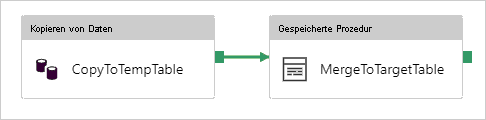

# <a name="copy-data-to-and-from-sql-server-by-using-azure-data-factory"></a>Kopieren von Daten in und aus SQL Server mithilfe von Azure Data Factory

> [!div class="op_single_selector" title1="Wählen Sie die von Ihnen verwendete Version von Azure Data Factory aus:"]
> * [Version 1](v1/data-factory-sqlserver-connector.md)
> * [Aktuelle Version](connector-sql-server.md)
[!INCLUDE[appliesto-adf-asa-md](includes/appliesto-adf-asa-md.md)]

In diesem Artikel wird beschrieben, wie Sie die Kopieraktivität in Azure Data Factory verwenden, um Daten in eine und aus einer SQL Server-Datenbank zu kopieren. Dieser Artikel baut auf dem Artikel [Kopieraktivität in Azure Data Factory](copy-activity-overview.md) auf, der eine allgemeine Übersicht über die Kopieraktivität enthält.

## <a name="supported-capabilities"></a>Unterstützte Funktionen

Der SQL Server-Connector wird für die folgenden Aktivitäten unterstützt:

- [Kopieraktivität](copy-activity-overview.md) mit [unterstützter Quellen/Senken-Matrix](copy-activity-overview.md)
- [Lookup-Aktivität](control-flow-lookup-activity.md)
- [GetMetadata-Aktivität](control-flow-get-metadata-activity.md)

Sie können Daten aus einer SQL Server-Datenbank in jeden unterstützten Senkendatenspeicher kopieren. Zudem können Sie Daten aus jedem unterstützten Quelldatenspeicher in eine SQL Server-Datenbank kopieren. Eine Liste der Datenspeicher, die als Quellen oder Senken für die Kopieraktivität unterstützt werden, finden Sie in der Tabelle [Unterstützte Datenspeicher](copy-activity-overview.md#supported-data-stores-and-formats).

Dieser SQL Server-Connector unterstützt insbesondere Folgendes:

- SQL Server, Version 2005 und höher.
- Kopieren von Daten unter Verwendung der SQL- oder Windows-Authentifizierung
- Als Quelle das Abrufen von Daten mithilfe einer SQL-Abfrage oder gespeicherten Prozedur Sie können sich auch für das parallele Kopieren aus der SQL Server-Quelle entscheiden. Einzelheiten finden Sie im Abschnitt [Paralleles Kopieren aus SQL-Datenbank](#parallel-copy-from-sql-database).
- Als Senke das automatische Erstellen einer Zieltabelle (sofern nicht vorhanden) basierend auf dem Quellschema. Außerdem das Anfügen von Daten an eine Tabelle oder das Aufrufen einer gespeicherten Prozedur mit benutzerdefinierter Logik während des Kopiervorgangs. 

[SQL Server Express LocalDB](https://docs.microsoft.com/sql/database-engine/configure-windows/sql-server-express-localdb) wird nicht unterstützt.

>[!NOTE]
>SQL Server [Always Encrypted](https://docs.microsoft.com/sql/relational-databases/security/encryption/always-encrypted-database-engine) wird von diesem Connector aktuell nicht unterstützt. Um dieses Problem zu umgehen, können Sie einen [generischen ODBC-Connector](connector-odbc.md) und einen ODBC-Treiber für SQL Server verwenden. Befolgen Sie [diese Anleitung](https://docs.microsoft.com/sql/connect/odbc/using-always-encrypted-with-the-odbc-driver) zum Herunterladen des ODBC-Treibers und zum Konfigurieren der Verbindungszeichenfolgen.

## <a name="prerequisites"></a>Voraussetzungen

[!INCLUDE [data-factory-v2-integration-runtime-requirements](../../includes/data-factory-v2-integration-runtime-requirements.md)]

## <a name="get-started"></a>Erste Schritte

[!INCLUDE [data-factory-v2-connector-get-started](../../includes/data-factory-v2-connector-get-started.md)]

Die folgenden Abschnitte enthalten Details zu Eigenschaften, die zum Definieren von Data Factory-Entitäten speziell für den SQL Server-Datenbankconnector verwendet werden.

## <a name="linked-service-properties"></a>Eigenschaften des verknüpften Diensts

Die folgenden Eigenschaften werden für den mit SQL Server verknüpften Dienst unterstützt:

| Eigenschaft | BESCHREIBUNG | Erforderlich |
|:--- |:--- |:--- |
| type | Die type-Eigenschaft muss auf **SqlServer** festgelegt sein. | Ja |
| connectionString |Geben Sie **connectionString**-Informationen an, die zum Herstellen einer Verbindung mit der SQL Server-Datenbank mithilfe der SQL- oder Windows-Authentifizierung benötigt werden. Sehen Sie sich die folgenden Beispiele an.<br/>Sie können auch ein Kennwort in Azure Key Vault speichern. Bei Verwendung der SQL-Authentifizierung pullen Sie die `password`-Konfiguration aus der Verbindungszeichenfolge. Weitere Informationen finden Sie im JSON-Beispiel unter der Tabelle sowie unter [Speichern von Anmeldeinformationen in Azure Key Vault](store-credentials-in-key-vault.md). |Ja |
| userName |Geben Sie einen Benutzernamen an, wenn Sie die Windows-Authentifizierung verwenden. Ein Beispiel lautet **domainname\\username**. |Nein |
| password |Geben Sie das Kennwort für das Benutzerkonto an, das Sie für den Benutzernamen angegeben haben. Markieren Sie dieses Feld als **SecureString**, um es sicher in Azure Data Factory zu speichern. Alternativ können Sie [auf ein in Azure Key Vault gespeichertes Geheimnis verweisen](store-credentials-in-key-vault.md). |Nein |
| connectVia | Diese [Integration Runtime](concepts-integration-runtime.md) wird zum Herstellen einer Verbindung mit dem Datenspeicher verwendet. Weitere Informationen finden Sie im Abschnitt [Voraussetzungen](#prerequisites). Wenn kein Wert angegeben ist, wird die standardmäßige Azure Integration Runtime verwendet. |Nein |

>[!TIP]
>Wenn ein Fehler mit dem Fehlercode „UserErrorFailedToConnectToSqlServer“ auftritt und eine Meldung wie „Das Sitzungslimit für die Datenbank ist XXX und wurde erreicht“ angezeigt wird, fügen Sie `Pooling=false` zu Ihrer Verbindungszeichenfolge hinzu, und versuchen Sie es erneut.

**Beispiel 1: SQL-Authentifizierung verwenden**

```json
{
    "name": "SqlServerLinkedService",
    "properties": {
        "type": "SqlServer",
        "typeProperties": {
            "connectionString": "Data Source=<servername>\\<instance name if using named instance>;Initial Catalog=<databasename>;Integrated Security=False;User ID=<username>;Password=<password>;"
        },
        "connectVia": {
            "referenceName": "<name of Integration Runtime>",
            "type": "IntegrationRuntimeReference"
        }
    }
}
```

**Beispiel 2: Verwenden der SQL-Authentifizierung mit einem Kennwort in Azure Key Vault**

```json
{
    "name": "SqlServerLinkedService",
    "properties": {
        "type": "SqlServer",
        "typeProperties": {
            "connectionString": "Data Source=<servername>\\<instance name if using named instance>;Initial Catalog=<databasename>;Integrated Security=False;User ID=<username>;",
            "password": { 
                "type": "AzureKeyVaultSecret", 
                "store": { 
                    "referenceName": "<Azure Key Vault linked service name>", 
                    "type": "LinkedServiceReference" 
                }, 
                "secretName": "<secretName>" 
            }
        },
        "connectVia": {
            "referenceName": "<name of Integration Runtime>",
            "type": "IntegrationRuntimeReference"
        }
    }
}
```

**Beispiel 3: Windows-Authentifizierung verwenden**

```json
{
    "name": "SqlServerLinkedService",
    "properties": {
        "type": "SqlServer",
        "typeProperties": {
            "connectionString": "Data Source=<servername>\\<instance name if using named instance>;Initial Catalog=<databasename>;Integrated Security=True;",
            "userName": "<domain\\username>",
            "password": {
                "type": "SecureString",
                "value": "<password>"
            }
        },
        "connectVia": {
            "referenceName": "<name of Integration Runtime>",
            "type": "IntegrationRuntimeReference"
        }
     }
}
```

## <a name="dataset-properties"></a>Dataset-Eigenschaften

Eine vollständige Liste mit den Abschnitten und Eigenschaften, die zum Definieren von Datasets zur Verfügung stehen, finden Sie im Artikel zu [Datasets](concepts-datasets-linked-services.md). Dieser Abschnitt enthält eine Liste der Eigenschaften, die vom SQL Server-Dataset unterstützt werden.

Zum Kopieren von Daten aus einer und in eine SQL Server-Datenbank werden die folgenden Eigenschaften unterstützt:

| Eigenschaft | BESCHREIBUNG | Erforderlich |
|:--- |:--- |:--- |
| type | Die type-Eigenschaft des Datasets muss auf **SqlServerTable** festgelegt werden. | Ja |
| schema | Name des Schemas. |Quelle: Nein, Senke: Ja  |
| table | Name der Tabelle/Ansicht. |Quelle: Nein, Senke: Ja  |
| tableName | Name der Tabelle/Ansicht mit Schema. Diese Eigenschaft wird aus Gründen der Abwärtskompatibilität weiterhin unterstützt. Verwenden Sie für eine neue Workload `schema` und `table`. | Quelle: Nein, Senke: Ja |

**Beispiel**

```json
{
    "name": "SQLServerDataset",
    "properties":
    {
        "type": "SqlServerTable",
        "linkedServiceName": {
            "referenceName": "<SQL Server linked service name>",
            "type": "LinkedServiceReference"
        },
        "schema": [ < physical schema, optional, retrievable during authoring > ],
        "typeProperties": {
            "schema": "<schema_name>",
            "table": "<table_name>"
        }
    }
}
```

## <a name="copy-activity-properties"></a>Eigenschaften der Kopieraktivität

Eine vollständige Liste mit den Abschnitten und Eigenschaften zum Definieren von Aktivitäten finden Sie im Artikel [Pipelines](concepts-pipelines-activities.md). Dieser Abschnitt enthält eine Liste der Eigenschaften, die von der SQL Server-Quelle und -Senke unterstützt werden.

### <a name="sql-server-as-a-source"></a>SQL Server als Quelle

>[!TIP]
>Weitere Informationen zum effizienten Laden von Daten aus SQL Server mittels Datenpartitionierung finden Sie unter [Paralleles Kopieren aus SQL-Datenbank](#parallel-copy-from-sql-database).

Legen Sie zum Kopieren von Daten aus SQL Server den Quellentyp in der Kopieraktivität auf **SqlSource** fest. Die folgenden Eigenschaften werden im Abschnitt „source“ der Kopieraktivität unterstützt:

| Eigenschaft | BESCHREIBUNG | Erforderlich |
|:--- |:--- |:--- |
| type | Die type-Eigenschaft der Quelle der Kopieraktivität muss auf **SqlSource** festgelegt sein. | Ja |
| sqlReaderQuery |Verwendet die benutzerdefinierte SQL-Abfrage zum Lesen von Daten. z. B. `select * from MyTable`. |Nein |
| sqlReaderStoredProcedureName |Diese Eigenschaft ist der Name der gespeicherten Prozedur, die Daten aus der Quelltabelle liest. Die letzte SQL-Anweisung muss eine SELECT-Anweisung in der gespeicherten Prozedur sein. |Nein |
| storedProcedureParameters |Diese Parameter werden für die gespeicherte Prozedur verwendet.<br/>Zulässige Werte sind Namen oder Name-Wert-Paare. Die Namen und die Groß-/Kleinschreibung von Parametern müssen den Namen und der Groß-/Kleinschreibung der Parameter der gespeicherten Prozedur entsprechen. |Nein |
| isolationLevel | Gibt das Sperrverhalten für Transaktionen für die SQL-Quelle an. Zulässige Werte sind: **ReadCommitted**, **ReadUncommitted**, **RepeatableRead**, **Serializable**, **Snapshot**. Ohne Angabe wird die Standardisolationsstufe der Datenbank verwendet. Weitere Informationen finden Sie in [dieser Dokumentation](https://docs.microsoft.com/dotnet/api/system.data.isolationlevel). | Nein |
| partitionOptions | Gibt die Datenpartitionierungsoptionen an, mit denen Daten aus SQL Server geladen werden. <br>Zulässige Werte sind: **None** (Standardwert), **PhysicalPartitionsOfTable** und **DynamicRange**.<br>Wenn eine Partitionsoption aktiviert ist (nicht `None`), wird der Grad an Parallelität zum gleichzeitigen Laden von Daten von SQL Server durch die Einstellung [`parallelCopies`](copy-activity-performance-features.md#parallel-copy) für die Kopieraktivität gesteuert. | Nein |
| partitionSettings | Geben Sie die Gruppe der Einstellungen für die Datenpartitionierung an. <br>Verwenden Sie diese Option, wenn die Partitionsoption nicht `None` lautet. | Nein |
| ***Unter `partitionSettings`:*** | | |
| partitionColumnName | Geben Sie den Namen der Quellspalte als **integer** oder „date/datetime“ an, der von der Bereichspartitionierung für das parallele Kopieren verwendet wird. Ohne Angabe wird der Index oder der Primärschlüssel der Tabelle automatisch erkannt und als Partitionsspalte verwendet.<br>Verwenden Sie diese Option, wenn die Partitionsoption `DynamicRange` lautet. Wenn Sie die Quelldaten mithilfe einer Abfrage abrufen, integrieren Sie `?AdfDynamicRangePartitionCondition ` in die WHERE-Klausel. Ein Beispiel finden Sie im Abschnitt [Paralleles Kopieren aus SQL-Datenbank](#parallel-copy-from-sql-database). | Nein |
| partitionUpperBound | Der maximale Wert der Partitionsspalte für das Teilen des Partitionsbereichs. Dieser Wert wird zur Entscheidung über den Partitionssprung verwendet, nicht zum Filtern der Zeilen in der Tabelle. Alle Zeilen in der Tabelle oder im Abfrageergebnis werden partitioniert und kopiert. Wenn nicht angegeben, wird der Wert für die Kopieraktivität automatisch erkannt.  <br>Verwenden Sie diese Option, wenn die Partitionsoption `DynamicRange` lautet. Ein Beispiel finden Sie im Abschnitt [Paralleles Kopieren aus SQL-Datenbank](#parallel-copy-from-sql-database). | Nein |
| partitionLowerBound | Der minimale Wert der Partitionsspalte für das Teilen des Partitionsbereichs. Dieser Wert wird zur Entscheidung über den Partitionssprung verwendet, nicht zum Filtern der Zeilen in der Tabelle. Alle Zeilen in der Tabelle oder im Abfrageergebnis werden partitioniert und kopiert. Wenn nicht angegeben, wird der Wert für die Kopieraktivität automatisch erkannt.<br>Verwenden Sie diese Option, wenn die Partitionsoption `DynamicRange` lautet. Ein Beispiel finden Sie im Abschnitt [Paralleles Kopieren aus SQL-Datenbank](#parallel-copy-from-sql-database). | Nein |

**Beachten Sie Folgendes:**

- Wenn **sqlReaderQuery** für **SqlSource** angegeben ist, führt die Kopieraktivität diese Abfrage für die SQL Server-Quelle aus, um die Daten abzurufen. Sie können auch eine gespeicherte Prozedur angeben, indem Sie **sqlReaderStoredProcedureName** und **storedProcedureParameters** angeben, sofern die gespeicherten Prozeduren Parameter verwenden.
- Ohne Angabe von **sqlReaderQuery** oder **sqlReaderStoredProcedureName** werden die im Abschnitt „structure“ des JSON-Codes des Datasets definierten Spalten zum Erstellen einer Abfrage verwendet. Die Abfrage `select column1, column2 from mytable` wird für die SQL Server-Instanz ausgeführt. Falls die Datasetdefinition keinen Abschnitt „structure“ enthält, werden alle Spalten der Tabelle ausgewählt.

**Beispiel: Verwenden einer SQL-Abfrage**

```json
"activities":[
    {
        "name": "CopyFromSQLServer",
        "type": "Copy",
        "inputs": [
            {
                "referenceName": "<SQL Server input dataset name>",
                "type": "DatasetReference"
            }
        ],
        "outputs": [
            {
                "referenceName": "<output dataset name>",
                "type": "DatasetReference"
            }
        ],
        "typeProperties": {
            "source": {
                "type": "SqlSource",
                "sqlReaderQuery": "SELECT * FROM MyTable"
            },
            "sink": {
                "type": "<sink type>"
            }
        }
    }
]
```

**Beispiel: Verwenden einer gespeicherten Prozedur**

```json
"activities":[
    {
        "name": "CopyFromSQLServer",
        "type": "Copy",
        "inputs": [
            {
                "referenceName": "<SQL Server input dataset name>",
                "type": "DatasetReference"
            }
        ],
        "outputs": [
            {
                "referenceName": "<output dataset name>",
                "type": "DatasetReference"
            }
        ],
        "typeProperties": {
            "source": {
                "type": "SqlSource",
                "sqlReaderStoredProcedureName": "CopyTestSrcStoredProcedureWithParameters",
                "storedProcedureParameters": {
                    "stringData": { "value": "str3" },
                    "identifier": { "value": "$$Text.Format('{0:yyyy}', <datetime parameter>)", "type": "Int"}
                }
            },
            "sink": {
                "type": "<sink type>"
            }
        }
    }
]
```

**Definition der gespeicherten Prozedur**

```sql
CREATE PROCEDURE CopyTestSrcStoredProcedureWithParameters
(
    @stringData varchar(20),
    @identifier int
)
AS
SET NOCOUNT ON;
BEGIN
    select *
    from dbo.UnitTestSrcTable
    where dbo.UnitTestSrcTable.stringData != stringData
    and dbo.UnitTestSrcTable.identifier != identifier
END
GO
```

### <a name="sql-server-as-a-sink"></a>SQL Server als Senke

> [!TIP]
> Weitere Informationen zum unterstützten Schreibverhalten, zu unterstützten Konfigurationen und bewährten Methoden finden Sie unter [Bewährte Methode zum Laden von Daten in SQL Server](#best-practice-for-loading-data-into-sql-server).

Legen Sie zum Kopieren von Daten in SQL Server den Senkentyp in der Kopieraktivität auf **SqlSink** fest. Die folgenden Eigenschaften werden im Abschnitt „sink“ der Kopieraktivität unterstützt:

| Eigenschaft | BESCHREIBUNG | Erforderlich |
|:--- |:--- |:--- |
| type | Die type-Eigenschaft der Senke der Kopieraktivität muss auf **SqlSink** festgelegt sein. | Ja |
| preCopyScript |Diese Eigenschaft gibt eine SQL-Abfrage für die Kopieraktivität an, die vor dem Schreiben von Daten in SQL Server ausgeführt wird. Sie wird pro Ausführung der Kopieraktivität nur einmal aufgerufen. Sie können diese Eigenschaft nutzen, um die vorab geladenen Daten zu bereinigen. |Nein |
| tableOption | Gibt an, ob die [Senkentabelle auf Basis des Quellschemas automatisch erstellt werden soll](copy-activity-overview.md#auto-create-sink-tables), wenn sie nicht vorhanden ist. Die automatische Tabellenerstellung wird nicht unterstützt, wenn die Senke eine gespeicherte Prozedur angibt. Zulässige Werte: `none` (Standard), `autoCreate`. |Nein |
| sqlWriterStoredProcedureName | Der Name der gespeicherten Prozedur, die definiert, wie Quelldaten auf eine Zieltabelle angewandt werden. <br/>Diese gespeicherte Prozedur wird *pro Batch aufgerufen*. Für nur einmalig ausgeführte Vorgänge, die nicht mit Quelldaten in Zusammenhang stehen (etwa Löschen/Kürzen), verwenden Sie die `preCopyScript`-Eigenschaft.<br>Ein Beispiel finden Sie unter [Aufrufen einer gespeicherten Prozedur aus einer SQL-Senke](#invoke-a-stored-procedure-from-a-sql-sink). | Nein |
| storedProcedureTableTypeParameterName |Der Parametername des Tabellentyps, der in der gespeicherten Prozedur angegeben ist.  |Nein |
| sqlWriterTableType |Der Tabellentypname, der in der gespeicherten Prozedur verwendet werden soll. Die Kopieraktivität macht die verschobenen Daten in einer temporären Tabelle mit diesem Tabellentyp verfügbar. Der gespeicherte Prozedurcode kann dann die kopierten Daten mit vorhandenen Daten zusammenführen. |Nein |
| storedProcedureParameters |Parameter für die gespeicherte Prozedur.<br/>Zulässige Werte: Name-Wert-Paare. Die Namen und die Groß-/Kleinschreibung von Parametern müssen denen der Parameter der gespeicherten Prozedur entsprechen. | Nein |
| writeBatchSize |Anzahl der Zeilen, die *pro Batch* in die SQL-Tabelle eingefügt werden sollen.<br/>Zulässige Werte sind Integer-Werte für die Anzahl der Zeilen. Standardmäßig bestimmt Azure Data Factory die geeignete Batchgröße dynamisch anhand der Zeilengröße. |Nein |
| writeBatchTimeout |Diese Eigenschaft gibt die Wartezeit für den Abschluss der Batcheinfügung an, bevor ein Timeout auftritt.<br/>Zulässige Werte werden für den Zeitraum verwendet. Beispiel: „00:30:00“ für 30 Minuten. Wenn kein Wert festgelegt ist, wird für das Timeout der Standardwert „02:00:00“ verwendet. |Nein |

**Beispiel 1: Anfügen von Daten**

```json
"activities":[
    {
        "name": "CopyToSQLServer",
        "type": "Copy",
        "inputs": [
            {
                "referenceName": "<input dataset name>",
                "type": "DatasetReference"
            }
        ],
        "outputs": [
            {
                "referenceName": "<SQL Server output dataset name>",
                "type": "DatasetReference"
            }
        ],
        "typeProperties": {
            "source": {
                "type": "<source type>"
            },
            "sink": {
                "type": "SqlSink",
                "tableOption": "autoCreate",
                "writeBatchSize": 100000
            }
        }
    }
]
```

**Beispiel 2: Aufrufen einer gespeicherten Prozedur während des Kopiervorgangs**

Weitere Informationen finden Sie unter [Aufrufen einer gespeicherten Prozedur aus einer SQL-Senke](#invoke-a-stored-procedure-from-a-sql-sink).

```json
"activities":[
    {
        "name": "CopyToSQLServer",
        "type": "Copy",
        "inputs": [
            {
                "referenceName": "<input dataset name>",
                "type": "DatasetReference"
            }
        ],
        "outputs": [
            {
                "referenceName": "<SQL Server output dataset name>",
                "type": "DatasetReference"
            }
        ],
        "typeProperties": {
            "source": {
                "type": "<source type>"
            },
            "sink": {
                "type": "SqlSink",
                "sqlWriterStoredProcedureName": "CopyTestStoredProcedureWithParameters",
                "storedProcedureTableTypeParameterName": "MyTable",
                "sqlWriterTableType": "MyTableType",
                "storedProcedureParameters": {
                    "identifier": { "value": "1", "type": "Int" },
                    "stringData": { "value": "str1" }
                }
            }
        }
    }
]
```

## <a name="parallel-copy-from-sql-database"></a>Paralleles Kopieren aus SQL-Datenbank

Der SQL Server-Connector in der Kopieraktivität verfügt über eine integrierte Datenpartitionierung zum parallelen Kopieren von Daten. Die Datenpartitionierungsoptionen befinden sich auf der Registerkarte **Quelle** der Kopieraktivität.


Wenn Sie partitioniertes Kopieren aktivieren, führt die Kopieraktivität parallele Abfragen für Ihre SQL Server-Quelle aus, um Daten anhand von Partitionen zu laden. Der Parallelitätsgrad wird über die Einstellung [`parallelCopies`](copy-activity-performance-features.md#parallel-copy) der Kopieraktivität gesteuert. Wenn Sie zum Beispiel `parallelCopies` auf vier festlegen, generiert Data Factory vier Abfragen gleichzeitig und führt diese gemäß den angegebenen Partitionsoptionen und -einstellungen aus. Jede dieser Abfragen ruft einen Teil der Daten von Ihrer SQL Server-Instanz ab.

Es wird empfohlen, das parallele Kopieren mit Datenpartitionierung zu aktivieren. Das gilt insbesondere, wenn Sie große Datenmengen aus Ihrer SQL Server-Instanz laden. Im Anschluss finden Sie empfohlene Konfigurationen für verschiedene Szenarien. Beim Kopieren von Daten in einen dateibasierten Datenspeicher wird empfohlen, mehrere Dateien in einen Ordner zu schreiben (nur den Ordnernamen anzugeben). In diesem Fall ist die Leistung besser als beim Schreiben in eine einzelne Datei.

| Szenario                                                     | Empfohlene Einstellungen                                           |
| ------------------------------------------------------------ | ------------------------------------------------------------ |
| Vollständiges Laden aus einer großen Tabelle mit physischen Partitionen        | **Partitionsoption:** Physische Partitionen der Tabelle. <br><br/>Während der Ausführung erkennt Data Factory automatisch die physischen Partitionen und kopiert Daten nach Partitionen. <br><br/>Um zu überprüfen, ob Ihre Tabelle eine physische Partition besitzt oder nicht, können Sie auf [diese Abfrage](#sample-query-to-check-physical-partition) verweisen. |
| Vollständiges Laden aus einer großen Tabelle ohne physische Partitionen, aber mit einer integer- oder datetime-Spalte für die Datenpartitionierung. | **Partitionsoptionen:** Dynamische Bereichspartitionierung<br>**Partitionsspalte** (optional): Geben Sie die Spalte für die Datenpartitionierung an. Ohne Angabe wird der Index oder die Primärschlüsselspalte verwendet.<br/>**Obergrenze der Partition** und **Untergrenze der Partition** (optional): Geben Sie an, ob Sie den Partitionssprung bestimmen möchten. Dies dient nicht zum Filtern der Zeilen in der Tabelle; alle Zeilen in der Tabelle werden partitioniert und kopiert. Wenn nicht angegeben, werden die Werte für die Kopieraktivität automatisch erkannt.<br><br>Wenn Ihre Partitionsspalte „ID“ also beispielsweise Werte zwischen 1 und 100 enthält, und Sie als Untergrenze „20“ und als Obergrenze „80“ konfigurieren und das parallele Kopieren auf „4“ festgelegt ist, ruft Data Factory Daten anhand von vier Partitionen ab: IDs im Bereich <=20, [21, 50], [51, 80] und >=81. |
| Laden einer großen Datenmenge unter Verwendung einer benutzerdefinierten Abfrage ohne physische Partitionen, aber mit einer integer- oder date/datetime-Spalte für die Datenpartitionierung. | **Partitionsoptionen:** Dynamische Bereichspartitionierung<br>**Abfrage**: `SELECT * FROM <TableName> WHERE ?AdfDynamicRangePartitionCondition AND <your_additional_where_clause>`<br>**Partitionsspalte:** Geben Sie die Spalte für die Datenpartitionierung an.<br>**Obergrenze der Partition** und **Untergrenze der Partition** (optional): Geben Sie an, ob Sie den Partitionssprung bestimmen möchten. Dies dient nicht zum Filtern der Zeilen in der Tabelle; alle Zeilen im Abfrageergebnis werden partitioniert und kopiert. Wenn nicht angegeben, wird der Wert für die Kopieraktivität automatisch erkannt.<br><br>Data Factory ersetzt während der Ausführung `?AdfRangePartitionColumnName` durch den tatsächlichen Spaltennamen und die Wertebereiche für die jeweilige Partition und sendet die Daten dann an SQL Server. <br>Wenn Ihre Partitionsspalte „ID“ also beispielsweise Werte von 1 bis 100 enthält und Sie als Untergrenze „20“, als Obergrenze „80“ und für das parallele Kopieren „4“ festlegen, ruft Data Factory Daten nach vier Partitions-IDs im Bereich zwischen <=20, [21, 50], [51, 80] und >=81 ab. <br><br>Hier finden Sie weitere Beispiele für verschiedene Szenarien:<br> 1. Abfrage der gesamten Tabelle: <br>`SELECT * FROM <TableName> WHERE ?AdfDynamicRangePartitionCondition`<br> 2. Abfrage aus einer Tabelle mit Spaltenauswahl und zusätzlichen Where-Klausel-Filtern: <br>`SELECT <column_list> FROM <TableName> WHERE ?AdfDynamicRangePartitionCondition AND <your_additional_where_clause>`<br> 3. Abfragen mit Unterabfragen: <br>`SELECT <column_list> FROM (<your_sub_query>) AS T WHERE ?AdfDynamicRangePartitionCondition AND <your_additional_where_clause>`<br> 4. Abfrage mit Partition in Unterabfrage: <br>`SELECT <column_list> FROM (SELECT <your_sub_query_column_list> FROM <TableName> WHERE ?AdfDynamicRangePartitionCondition) AS T`
|

Bewährte Methoden zum Laden von Daten mit Partitionierungsoption:

1. Wählen Sie eine aussagekräftige Spalte als Partitionsspalte (wie Primärschlüssel oder eindeutiger Schlüssel), um Datenabweichungen zu vermeiden. 
2. Wenn die Tabelle eine integrierte Partition aufweist, verwenden Sie die Partitionsoption „Physikalische Partitionen der Tabelle“, um eine bessere Leistung zu erzielen.  
3. Wenn Sie Azure Integration Runtime zum Kopieren von Daten verwenden, können Sie größere „[Data Integration Units (DIU)](copy-activity-performance-features.md#data-integration-units)“ festlegen (> 4), um mehr Computingressourcen zu nutzen. Prüfen Sie dort die anwendbaren Szenarien.
4. „[Grad der Kopierparallelität](copy-activity-performance-features.md#parallel-copy)“ steuert die Partitionsnummern. Ein zu großer Wert schadet manchmal der Leistung. Deshalb wird empfohlen, diesen Wert wie folgt festzulegen: (DIU oder Anzahl der selbstgehosteten IR-Knoten) × (2 bis 4).

**Beispiel: Vollständiges Laden aus einer großen Tabelle mit physischen Partitionen**

```json
"source": {
    "type": "SqlSource",
    "partitionOption": "PhysicalPartitionsOfTable"
}
```

**Beispiel: Abfrage mit dynamischer Bereichspartition**

```json
"source": {
    "type": "SqlSource",
    "query": "SELECT * FROM <TableName> WHERE ?AdfDynamicRangePartitionCondition AND <your_additional_where_clause>",
    "partitionOption": "DynamicRange",
    "partitionSettings": {
        "partitionColumnName": "<partition_column_name>",
        "partitionUpperBound": "<upper_value_of_partition_column (optional) to decide the partition stride, not as data filter>",
        "partitionLowerBound": "<lower_value_of_partition_column (optional) to decide the partition stride, not as data filter>"
    }
}
```

### <a name="sample-query-to-check-physical-partition"></a>Beispielabfrage zur Überprüfung der physischen Partition

```sql
SELECT DISTINCT s.name AS SchemaName, t.name AS TableName, pf.name AS PartitionFunctionName, c.name AS ColumnName, iif(pf.name is null, 'no', 'yes') AS HasPartition
FROM sys.tables AS t
LEFT JOIN sys.objects AS o ON t.object_id = o.object_id
LEFT JOIN sys.schemas AS s ON o.schema_id = s.schema_id
LEFT JOIN sys.indexes AS i ON t.object_id = i.object_id 
LEFT JOIN sys.index_columns AS ic ON ic.partition_ordinal > 0 AND ic.index_id = i.index_id AND ic.object_id = t.object_id 
LEFT JOIN sys.columns AS c ON c.object_id = ic.object_id AND c.column_id = ic.column_id 
LEFT JOIN sys.partition_schemes ps ON i.data_space_id = ps.data_space_id 
LEFT JOIN sys.partition_functions pf ON pf.function_id = ps.function_id 
WHERE s.name='[your schema]' AND t.name = '[your table name]'
```

Wenn die Tabelle eine physische Partition besitzt, würde „HasPartition“ wie folgt als „Yes“ (Ja) angezeigt werden.


## <a name="best-practice-for-loading-data-into-sql-server"></a>Bewährte Methode zum Laden von Daten in SQL Server

Wenn Sie Daten in SQL Server kopieren, ist möglicherweise ein anderes Schreibverhalten erforderlich:

- [Anfügen:](#append-data) Meine Quelldaten enthalten nur neue Datensätze.
- [Upsert:](#upsert-data) Meine Quelldaten umfassen sowohl Einfügungen als auch Aktualisierungen.
- [Überschreiben:](#overwrite-the-entire-table) Ich möchte die gesamte Dimensionstabelle jedes Mal neu laden.
- [Schreiben von Daten mit benutzerdefinierter Logik:](#write-data-with-custom-logic) Ich benötige eine zusätzliche Verarbeitung vor dem endgültigen Einfügen in die Zieltabelle.

Informationen zur Konfiguration in Azure Data Factory und zu bewährten Methoden finden Sie in den entsprechenden Abschnitten.

### <a name="append-data"></a>Anfügen von Daten

Das Anfügen von Daten stellt das Standardverhalten dieses SQL Server-Senkenconnectors dar. Azure Data Factory führt eine Masseneinfügung aus, um Daten effizient in Ihre Tabelle zu schreiben. Sie können die Quelle und Senke in der Kopieraktivität entsprechend konfigurieren.

### <a name="upsert-data"></a>Durchführen von Upsert für Daten

**Option 1:** Wenn Sie große Datenmengen kopieren möchten, können Sie mithilfe der Kopieraktivität für alle Datensätze einen Massenladevorgang in eine Stagingtabelle ausführen. Führen Sie anschließend eine Aktivität einer gespeicherten Prozedur aus, um eine [MERGE](https://docs.microsoft.com/sql/t-sql/statements/merge-transact-sql)- oder INSERT/UPDATE-Anweisung in einem Schritt anzuwenden. 

Das Laden von Daten in eine temporäre Datenbanktabelle wird derzeit nicht nativ von der Kopieraktivität unterstützt. Ein erweitertes Verfahren für die Einrichtung mit mehreren Aktivitäten finden Sie unter [Optimize SQL Database Bulk Upsert scenarios](https://github.com/scoriani/azuresqlbulkupsert) (Optimieren von Szenarien mit upsert-Massenvorgängen in einer SQL-Datenbank). Das nachfolgende Beispiel veranschaulicht die Verwendung einer permanenten Tabelle als Stagingtabelle.

Sie können beispielsweise in Azure Data Factory eine Pipeline mit einer **Kopieraktivität** erstellen, die mit einer **Aktivität der gespeicherten Prozedur** verkettet ist. Dabei kopiert die Kopieraktivität Daten aus Ihrem Quellspeicher in eine SQL Server-Stagingtabelle (z. B. **UpsertStagingTable** als Tabellenname im Dataset). Die Aktivität der gespeicherten Prozedur ruft dann eine gespeicherte Prozedur auf, um die Quelldaten aus der Stagingtabelle mit der Zieltabelle zusammenzuführen und die Stagingtabelle zu bereinigen.



Definieren Sie in Ihrer Datenbank eine gespeicherte Prozedur mit MERGE-Logik (wie im folgenden Beispiel), auf die über die vorherige Aktivität der gespeicherten Prozedur gezeigt wird. Angenommen, das Ziel ist die Tabelle **Marketing** mit den drei Spalten: **ProfileID**, **State** und **Category**. Führen Sie den Upsert-Vorgang basierend auf der Spalte **ProfileID** aus.

```sql
CREATE PROCEDURE [dbo].[spMergeData]
AS
BEGIN
    MERGE TargetTable AS target
    USING UpsertStagingTable AS source
    ON (target.[ProfileID] = source.[ProfileID])
    WHEN MATCHED THEN
        UPDATE SET State = source.State
    WHEN NOT matched THEN
        INSERT ([ProfileID], [State], [Category])
      VALUES (source.ProfileID, source.State, source.Category);
    
    TRUNCATE TABLE UpsertStagingTable
END
```

**Option 2:** Sie können [eine gespeicherte Prozedur in der Kopieraktivität aufrufen](#invoke-a-stored-procedure-from-a-sql-sink). Dabei wird jeder Batch in der Quelltabelle (entsprechend der `writeBatchSize`-Eigenschaft) ausgeführt, statt Masseneinfügen als Standardansatz in der Kopieraktivität zu verwenden.

### <a name="overwrite-the-entire-table"></a>Überschreiben der gesamten Tabelle

Sie können die **preCopyScript**-Eigenschaft in einer Kopieraktivitätssenke konfigurieren. In diesem Fall führt Azure Data Factory für jede ausgeführte Kopieraktivität zuerst das Skript aus. Dann wird der Kopiervorgang ausgeführt, um die Daten einzufügen. Beispiel: Um die gesamte Tabelle mit den neuesten Daten zu überschreiben, geben Sie ein Skript an, um zunächst alle Datensätze zu löschen, bevor die neuen Daten durch Massenladen aus der Quelle eingefügt werden.

### <a name="write-data-with-custom-logic"></a>Schreiben von Daten mit benutzerdefinierter Logik

Die Schritte zum Schreiben von Daten mit benutzerdefinierter Logik ähneln den im Abschnitt [Durchführen von Upsert für Daten](#upsert-data) beschriebenen Schritten. Wenn vor dem Einfügen von Quelldaten in die Zieltabelle weitere Verarbeitungsschritte erforderlich sind, können Sie die Daten in eine Stagingtabelle laden und dann Aktivitäten einer gespeicherten Prozedur oder eine gespeicherte Prozedur in der Kopieraktivität der Senke aufrufen, um die Daten anzuwenden.

## <a name="invoke-a-stored-procedure-from-a-sql-sink"></a><a name="invoke-a-stored-procedure-from-a-sql-sink"></a> Aufrufen der gespeicherten Prozedur von der SQL-Senke

Beim Kopieren von Daten in eine SQL Server-Datenbank können Sie auch eine vom Benutzer angegebene gespeicherte Prozedur mit zusätzlichen Parametern für jeden Batch der Quelltabelle konfigurieren und aufrufen. Das Feature der gespeicherten Prozedur nutzt [Tabellenwertparameter](https://msdn.microsoft.com/library/bb675163.aspx).

Sie können eine gespeicherte Prozedur nutzen, wenn integrierte Kopiermechanismen nicht den Zweck erfüllen. Ein Beispiel hierfür ist ein Szenario, in dem Sie vor dem endgültigen Einfügen von Quelldaten in die Zieltabelle eine zusätzliche Verarbeitung anwenden möchten. Beispiele für eine zusätzliche Verarbeitung sind das Zusammenführen von Spalten, das Suchen nach zusätzlichen Werten und das Einfügen in mehr als eine Tabelle.

Das folgende Beispiel zeigt, wie Sie eine gespeicherte Prozedur verwenden, um einen einfachen Upsert-Vorgang in eine Tabelle in der SQL Server-Datenbank auszuführen. Im Beispiel wird angenommen, dass Eingabedaten vorhanden sind und die Senkentabelle **Marketing** drei Spalten enthält: **ProfileID**, **State** und **Category**. Führen Sie den Upsert-Vorgang basierend auf der Spalte **ProfileID** aus, und wenden Sie ihn nur auf die Kategorie „ProductA“ an.

1. Definieren Sie in Ihrer Datenbank den Tabellentyp mit dem gleichen Namen wie **sqlWriterTableType**. Das Schema des Tabellentyps muss mit dem Schema übereinstimmen, das von den Eingabedaten zurückgegeben wird.

    ```sql
    CREATE TYPE [dbo].[MarketingType] AS TABLE(
        [ProfileID] [varchar](256) NOT NULL,
        [State] [varchar](256) NOT NULL,
        [Category] [varchar](256) NOT NULL
    )
    ```

2. Definieren Sie die gespeicherte Prozedur in Ihrer Datenbank mit demselben Namen wie **SqlWriterStoredProcedureName**. Sie verarbeitet die Eingabedaten aus der angegebenen Quelle und führt sie mit der Ausgabetabelle zusammen. Der Parametername des Tabellentyps in der gespeicherten Prozedur entspricht dem im Dataset definierten **tableName**.

    ```sql
    CREATE PROCEDURE spOverwriteMarketing @Marketing [dbo].[MarketingType] READONLY, @category varchar(256)
    AS
    BEGIN
    MERGE [dbo].[Marketing] AS target
    USING @Marketing AS source
    ON (target.ProfileID = source.ProfileID and target.Category = @category)
    WHEN MATCHED THEN
        UPDATE SET State = source.State
    WHEN NOT MATCHED THEN
        INSERT (ProfileID, State, Category)
        VALUES (source.ProfileID, source.State, source.Category);
    END
    ```

3. Definieren Sie in Azure Data Factory den Abschnitt **SQL-Senke** in der Kopieraktivität wie folgt:

    ```json
    "sink": {
        "type": "SqlSink",
        "sqlWriterStoredProcedureName": "spOverwriteMarketing",
        "storedProcedureTableTypeParameterName": "Marketing",
        "sqlWriterTableType": "MarketingType",
        "storedProcedureParameters": {
            "category": {
                "value": "ProductA"
            }
        }
    }
    ```

## <a name="data-type-mapping-for-sql-server"></a>Datentypzuordnung für SQL Server

Beim Kopieren von Daten aus und in SQL Server werden die folgenden Zuordnungen von SQL Server-Datentypen zu Azure Data Factory-Zwischendatentypen verwendet. Informationen dazu, wie die Kopieraktivität das Quellschema und den Datentyp zur Senke zuordnet, finden Sie unter [Schema- und Datentypzuordnungen](copy-activity-schema-and-type-mapping.md).

| SQL Server-Datentyp | Azure Data Factory-Zwischendatentyp |
|:--- |:--- |
| BIGINT |Int64 |
| BINARY |Byte[] |
| bit |Boolean |
| char |String, Char[] |
| date |Datetime |
| Datetime |Datetime |
| datetime2 |Datetime |
| Datetimeoffset |DateTimeOffset |
| Decimal |Decimal |
| FILESTREAM attribute (varbinary(max)) |Byte[] |
| Float |Double |
| image |Byte[] |
| INT |Int32 |
| money |Decimal |
| NCHAR |String, Char[] |
| ntext |String, Char[] |
| NUMERIC |Decimal |
| NVARCHAR |String, Char[] |
| real |Single |
| rowversion |Byte[] |
| smalldatetime |Datetime |
| SMALLINT |Int16 |
| SMALLMONEY |Decimal |
| sql_variant |Object |
| text |String, Char[] |
| time |TimeSpan |
| timestamp |Byte[] |
| TINYINT |Int16 |
| UNIQUEIDENTIFIER |Guid |
| varbinary |Byte[] |
| varchar |String, Char[] |
| Xml |String |

>[!NOTE]
> Für Datentypen, die dem Zwischendatentyp „Decimal“ zugeordnet sind, unterstützt die Kopieraktivität derzeit eine Genauigkeit von bis zu 28. Wenn Ihre Daten eine höhere Genauigkeit als 28 erfordern, erwägen Sie, sie per SQL-Abfrage in eine Zeichenfolge zu konvertieren.

## <a name="lookup-activity-properties"></a>Eigenschaften der Lookup-Aktivität

Ausführliche Informationen zu den Eigenschaften finden Sie unter [Lookup-Aktivität](control-flow-lookup-activity.md).

## <a name="getmetadata-activity-properties"></a>Eigenschaften der GetMetadata-Aktivität

Ausführliche Informationen zu den Eigenschaften finden Sie unter [GetMetadata-Aktivität](control-flow-get-metadata-activity.md). 

## <a name="using-always-encrypted"></a>Verwenden von Always Encrypted

Verwenden Sie zum Kopieren von Daten mit [Always Encrypted](https://docs.microsoft.com/sql/relational-databases/security/encryption/always-encrypted-database-engine) aus/in SQL Server den [generischen ODBC-Connector](connector-odbc.md) und den ODBC-Treiber für SQL Server über die selbstgehostete Integration Runtime. Always Encrypted wird von diesem SQL Server-Connector derzeit nicht unterstützt. 

Dies gilt insbesondere in folgenden Fällen:

1. Richten Sie eine selbstgehostete Integration Runtime ein, sofern noch nicht vorhanden. Im Artikel [Selbstgehostete Integration Runtime](create-self-hosted-integration-runtime.md) finden Sie Details.

2. Laden Sie [hier](https://docs.microsoft.com/sql/connect/odbc/download-odbc-driver-for-sql-server) den 64-Bit-ODBC-Treiber für SQL Server herunter, und installieren Sie ihn auf dem Computer mit der Integration Runtime. Weitere Informationen zur Funktionsweise dieses Treibers finden Sie unter [Verwenden von Always Encrypted mit dem ODBC-Treiber for SQL Server](https://docs.microsoft.com/sql/connect/odbc/using-always-encrypted-with-the-odbc-driver#using-the-azure-key-vault-provider).

3. Erstellen Sie einen verknüpften Dienst mit dem ODBC-Typ, um eine Verbindung mit Ihrer SQL-Datenbank herzustellen. Zur Verwendung der SQL-Authentifizierung geben Sie die ODBC-Verbindungszeichenfolge wie im folgenden Beispiel gezeigt an, und wählen Sie die Option **Standardauthentifizierung** aus, um den Benutzernamen und das Kennwort festzulegen.

    ```
    Driver={ODBC Driver 17 for SQL Server};Server=<serverName>;Database=<databaseName>;ColumnEncryption=Enabled;KeyStoreAuthentication=KeyVaultClientSecret;KeyStorePrincipalId=<servicePrincipalKey>;KeyStoreSecret=<servicePrincipalKey>
    ```

4. Erstellen Sie ein Dataset und eine Kopieraktivität mit dem ODBC-Typ. Weitere Informationen finden Sie im Artikel [ODBC-Connector](connector-odbc.md).

## <a name="troubleshoot-connection-issues"></a>Beheben von Verbindungsproblemen

1. Konfigurieren Sie Ihre SQL Server-Instanz für das Zulassen von Remoteverbindungen. Starten Sie **SQL Server Management Studio**, klicken Sie mit der rechten Maustaste auf **Server**, und wählen Sie **Eigenschaften** aus. Wählen Sie in der Liste den Eintrag **Verbindungen** aus, und aktivieren Sie das Kontrollkästchen **Remoteverbindungen mit diesem Server zulassen**.

    

    Ausführliche Schritte finden Sie unter [Konfigurieren der Serverkonfigurationsoption „Remotezugriff“](https://msdn.microsoft.com/library/ms191464.aspx).

2. Starten Sie den **SQL Server-Konfigurations-Manager**. Erweitern Sie **SQL Server-Netzwerkkonfiguration** für die gewünschte Instanz, und wählen Sie **Protokolle für MSSQLSERVER** aus. Die Protokolle werden im rechten Bereich angezeigt. Aktivieren Sie TCP/IP, indem Sie mit der rechten Maustaste auf **TCP/IP** klicken und **Aktivieren** auswählen.

    

    Weitere Informationen und alternative Methoden zum Aktivieren von TCP/IP finden Sie unter [Aktivieren oder Deaktivieren eines Servernetzwerkprotokolls](https://msdn.microsoft.com/library/ms191294.aspx).

3. Doppelklicken Sie im gleichen Fenster auf **TCP/IP**, um das Fenster **TCP/IP-Eigenschaften** zu öffnen.
4. Wechseln Sie zur Registerkarte **IP-Adressen** . Scrollen Sie nach unten zum Abschnitt **IPAll**. Notieren Sie sich den **TCP-Port**. Der Standardport ist **1433**.
5. Erstellen Sie auf dem Computer eine **Regel für die Windows-Firewall** , um eingehenden Datenverkehr über diesen Port zuzulassen. 
6. **Überprüfen der Verbindung**: Verwenden Sie SQL Server Management Studio auf einem anderen Computer, um mit dem vollqualifizierten Namen eine Verbindung mit der SQL Server-Instanz herzustellen. z. B. `"<machine>.<domain>.corp.<company>.com,1433"`.

## <a name="next-steps"></a>Nächste Schritte
Eine Liste der Datenspeicher, die als Quellen und Senken für die Kopieraktivität in Azure Data Factory unterstützt werden, finden Sie unter [Unterstützte Datenspeicher](copy-activity-overview.md#supported-data-stores-and-formats).
