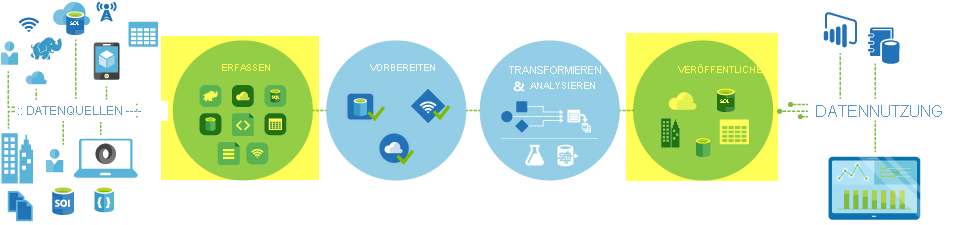

# <a name="copy-activity-in-azure-data-factory"></a>Kopieraktivität in Azure Data Factory

> [!div class="op_single_selector" title1="Wählen Sie die von Ihnen verwendete Data Factory-Version aus:"]
> * [Version 1](v1/data-factory-data-movement-activities.md)
> * [Aktuelle Version](copy-activity-overview.md)

In Azure Data Factory können Sie die Kopieraktivität verwenden, um Daten zwischen lokalen Datenspeichern und Clouddatenspeichern zu kopieren. Nach dem Kopieren können Sie andere Aktivitäten verwenden, um die Daten weiter zu transformieren und zu analysieren. Sie können die Kopieraktivität auch zum Veröffentlichen von Transformations- und Analyseergebnissen verwenden, um sie für Business Intelligence (BI) und Anwendungen zu nutzen.



Die Kopieraktivität wird in einer [Integration Runtime](concepts-integration-runtime.md) ausgeführt. Sie können unterschiedliche Integration Runtime-Typen für unterschiedliche Datenkopierszenarien verwenden:

* Beim Kopieren von Daten zwischen zwei Datenspeichern, die über das Internet von einer beliebigen IP-Adresse aus öffentlich zugänglich sind, können Sie die Azure Integration Runtime für die Kopieraktivität verwenden. Diese Integration Runtime ist sicher, zuverlässig, skalierbar und [weltweit verfügbar](concepts-integration-runtime.md#integration-runtime-location).
* Beim Kopieren von Daten zwischen lokalen Datenspeichern oder Datenspeichern in einem Netzwerk mit Zugriffssteuerung (z. B. Azure Virtual Network) müssen Sie eine selbstgehostete Integration Runtime einrichten.

Eine Integration Runtime muss mit jedem Quell- und Senkendatenspeicher verknüpft werden. Informationen dazu, wie die zu verwendende Integration Runtime von der Kopieraktivität bestimmt wird, finden Sie unter [Bestimmen der zu verwendenden IR](concepts-integration-runtime.md#determining-which-ir-to-use).

Um Daten aus einer Quelle in eine Senke zu kopieren, führt der Dienst, der die Kopieraktivität ausführt, folgende Schritte durch:

1. Er liest Daten aus einem Quelldatenspeicher.
2. Er führt die Serialisierung/Deserialisierung, Komprimierung/Dekomprimierung, Spaltenzuordnung usw. durch. Diese Vorgänge erfolgen basierend auf den Konfigurationen von Eingabedataset, Ausgabedataset und Kopieraktivität.
3. Er schreibt Daten in den Senken-/Zieldatenspeicher.


## <a name="supported-data-stores-and-formats"></a>Unterstützte Datenspeicher und Formate

[!INCLUDE [data-factory-v2-supported-data-stores](../../includes/data-factory-v2-supported-data-stores.md)]

### <a name="supported-file-formats"></a>Unterstützte Dateiformate

[!INCLUDE [data-factory-v2-file-formats](../../includes/data-factory-v2-file-formats.md)] 

Sie können die Kopieraktivität verwenden, um Dateien unverändert zwischen zwei dateibasierten Datenspeichern zu kopieren. In diesem Fall werden die Daten effizient ohne Serialisierung oder Deserialisierung kopiert. Darüber hinaus können Sie Dateien eines bestimmten Formats analysieren oder generieren. Sie können beispielsweise folgende Vorgänge durchführen:

* Kopieren von Daten aus einer lokalen SQL Server-Datenbank und Schreiben in Azure Data Lake Storage Gen2 im Parquet-Format
* Kopieren von Dateien im Textformat (CSV) aus einem lokalen Dateisystem und Schreiben in Azure Blob Storage im Avro-Format
* Kopieren von ZIP-Dateien aus einem lokalen Dateisystem, direktes Dekomprimieren und Schreiben der extrahierten Dateien in Azure Data Lake Storage Gen2
* Kopieren von Daten im Gzip-komprimierten Textformat (CSV) aus Azure Blob Storage und Schreiben in Azure SQL-Datenbank
* Viele weitere Aktivitäten, die eine Serialisierung/Deserialisierung oder Komprimierung/Dekomprimierung erfordern

## <a name="supported-regions"></a>Unterstützte Regionen

Der Dienst, der die Kopieraktivität unterstützt, ist weltweit in den Regionen und Ländern verfügbar, die unter [Standorte der Azure Integration Runtime](concepts-integration-runtime.md#integration-runtime-location) aufgeführt sind. Die global verfügbare Topologie gewährleistet effiziente Datenverschiebungen, die regionsübergreifende Hops in der Regel vermeiden. Unter [Produkte nach Region](https://azure.microsoft.com/regions/#services) können Sie die Verfügbarkeit von Data Factory und der Datenverschiebung in einer bestimmten Region überprüfen.

## <a name="configuration"></a>Konfiguration

[!INCLUDE [data-factory-v2-connector-get-started](../../includes/data-factory-v2-connector-get-started.md)]

Wenn Sie die Kopieraktivität in Azure Data Factory verwenden möchten, müssen Sie generell folgende Schritte ausführen:

1. **Erstellen Sie verknüpfte Dienste für den Quell- und Senkendatenspeicher.** Sie finden die Liste der unterstützten Connectors im Abschnitt [Unterstützte Datenspeicher und Formate](#supported-data-stores-and-formats) dieses Artikels. Im Abschnitt „Eigenschaften des verknüpften Diensts“ im Connectorartikel finden Sie Informationen zur Konfiguration und zu unterstützten Eigenschaften. 
2. **Erstellen Sie Datasets für die Quelle und die Senke.** In den Abschnitten zu Dataset-Eigenschaften in den Artikeln zu Quell- und Senkenconnectors finden Sie Informationen zur Konfiguration und zu unterstützten Eigenschaften.
3. **Erstellen Sie eine Pipeline mit der Kopieraktivität.** Der nächste Abschnitt enthält ein Beispiel.

### <a name="syntax"></a>Syntax

Die folgende Vorlage einer Kopieraktivität enthält eine vollständige Liste unterstützter Eigenschaften. Geben Sie diejenigen an, die zu Ihrem Szenario passen.

```json
"activities":[
    {
        "name": "CopyActivityTemplate",
        "type": "Copy",
        "inputs": [
            {
                "referenceName": "<source dataset name>",
                "type": "DatasetReference"
            }
        ],
        "outputs": [
            {
                "referenceName": "<sink dataset name>",
                "type": "DatasetReference"
            }
        ],
        "typeProperties": {
            "source": {
                "type": "<source type>",
                <properties>
            },
            "sink": {
                "type": "<sink type>"
                <properties>
            },
            "translator":
            {
                "type": "TabularTranslator",
                "columnMappings": "<column mapping>"
            },
            "dataIntegrationUnits": <number>,
            "parallelCopies": <number>,
            "enableStaging": true/false,
            "stagingSettings": {
                <properties>
            },
            "enableSkipIncompatibleRow": true/false,
            "redirectIncompatibleRowSettings": {
                <properties>
            }
        }
    }
]
```

#### <a name="syntax-details"></a>Syntaxdetails

| Eigenschaft | BESCHREIBUNG | Erforderlich? |
|:--- |:--- |:--- |
| type | Legen Sie für eine Kopieraktivität `Copy` fest. | Ja |
| inputs | Geben Sie das Dataset an, das Sie erstellt haben und das auf die Quelldaten verweist. Die Kopieraktivität unterstützt nur eine einzelne Eingabe. | Ja |
| outputs | Geben Sie das Dataset an, das Sie erstellt haben und das auf die Senkendaten verweist. Die Kopieraktivität unterstützt nur eine einzelne Ausgabe. | Ja |
| typeProperties | Geben Sie Eigenschaften zum Konfigurieren der Kopieraktivität an. | Ja |
| source | Geben Sie den Quelltyp für den Kopiervorgang und die zugehörigen Eigenschaften zum Abrufen von Daten an.<br/>Weitere Informationen finden Sie im Abschnitt „Eigenschaften der Kopieraktivität“ im Connectorartikel unter [Unterstützte Datenspeicher und Formate](#supported-data-stores-and-formats). | Ja |
| sink | Geben Sie den Senkentyp für den Kopiervorgang und die zugehörigen Eigenschaften zum Schreiben von Daten an.<br/>Weitere Informationen finden Sie im Abschnitt „Eigenschaften der Kopieraktivität“ im Connectorartikel unter [Unterstützte Datenspeicher und Formate](#supported-data-stores-and-formats). | Ja |
| translator | Geben Sie explizite Spaltenzuordnungen von der Quelle zur Senke an. Diese Eigenschaft wird angewendet, wenn das standardmäßige Kopierverhalten nicht Ihren Anforderungen entspricht.<br/>Weitere Informationen finden Sie unter [Schemazuordnung in Kopieraktivität](copy-activity-schema-and-type-mapping.md). | Nein |
| dataIntegrationUnits | Geben Sie eine Maßeinheit an, die festlegt, wie viel Leistung der [Azure Integration Runtime](concepts-integration-runtime.md) für das Kopieren von Daten zur Verfügung steht. Diese Einheiten wurden früher als Einheiten für Clouddatenverschiebungen bezeichnet. <br/>Weitere Informationen finden Sie unter [Datenintegrationseinheiten](copy-activity-performance-features.md#data-integration-units). | Nein |
| parallelCopies | Geben Sie die Parallelität an, die die Kopieraktivität beim Lesen von Daten aus der Quelle und beim Schreiben von Daten in die Senke verwenden soll.<br/>Weitere Informationen finden Sie unter [Paralleles Kopieren](copy-activity-performance-features.md#parallel-copy). | Nein |
| Reservat | Legen Sie fest, ob Metadaten/Zugriffssteuerungsliste beim Kopieren von Daten beibehalten werden sollen. <br/>Weitere Informationen finden Sie unter [Beibehalten von Metadaten](copy-activity-preserve-metadata.md). |Nein |
| enableStaging<br/>stagingSettings | Geben Sie an, ob die vorläufigen Daten im Blob Storage bereitgestellt werden, anstatt sie direkt aus der Quelle in die Senke zu kopieren.<br/>Informationen zu nützlichen Szenarien und Konfigurationsdetails finden Sie unter [Gestaffeltes Kopieren](copy-activity-performance-features.md#staged-copy). | Nein |
| enableSkipIncompatibleRow<br/>redirectIncompatibleRowSettings| Wählen Sie aus, wie nicht kompatible Zeilen beim Kopieren von Daten aus der Quelle in die Senke behandelt werden sollen.<br/>Weitere Informationen finden Sie unter [Fehlertoleranz](copy-activity-fault-tolerance.md). | Nein |

## <a name="monitoring"></a>Überwachung

Sie können die Ausführung der Kopieraktivität in Azure Data Factory sowohl visuell überwachen als auch programmgesteuert überwachen lassen. Einzelheiten dazu finden Sie unter [Überwachen der Kopieraktivität](copy-activity-monitoring.md).

## <a name="incremental-copy"></a>Inkrementelles Kopieren

Data Factory unterstützt das inkrementelle Kopieren von Deltadaten von einem Quelldatenspeicher in einen Senkendatenspeicher. Weitere Informationen finden Sie unter [Tutorial: Inkrementelles Kopieren von Daten](tutorial-incremental-copy-overview.md).

## <a name="performance-and-tuning"></a>Leistung und Optimierung

In der Benutzeroberfläche zur [Überwachung der Kopieraktivität](copy-activity-monitoring.md) werden Ihnen die Statistiken zur Kopierleistung für jede Ihrer Aktivitätsausführungen angezeigt. Im [Handbuch zur Leistung und Optimierung der Kopieraktivität](copy-activity-performance.md) werden wichtige Faktoren beschrieben, die sich auf die Leistung der Kopieraktivität beim Verschieben von Daten in Azure Data Factory auswirken. Außerdem finden Sie dort in Tests ermittelte Leistungswerte und Möglichkeiten, die Leistung der Kopieraktivität zu optimieren.

## <a name="resume-from-last-failed-run"></a>Fortsetzen ab der letzten fehlgeschlagenen Ausführung

Die Kopieraktivität unterstützt das Fortsetzen ab der letzten fehlgeschlagenen Ausführung, wenn Sie große Dateien unverändert im Binärformat zwischen dateibasierten Speichern kopieren und sich dafür entscheiden, die Ordner-/Dateistruktur beim Kopieren von der Quelle zur Senke beizubehalten, z. B. beim Migrieren von Daten aus Amazon S3 zu Azure Data Lake Storage Gen2. Dies gilt für die folgenden dateibasierten Connectors: [Amazon S3](connector-amazon-simple-storage-service.md), [Azure Blob](connector-azure-blob-storage.md), [Azure Data Lake Storage Gen1](connector-azure-data-lake-store.md), [Azure Data Lake Storage Gen2](connector-azure-data-lake-storage.md), [Azure File Storage](connector-azure-file-storage.md), [File System](connector-file-system.md), [FTP](connector-ftp.md), [Google Cloud Storage](connector-google-cloud-storage.md), [HDFS](connector-hdfs.md) und [SFTP](connector-sftp.md).

Sie können die zwei folgenden Methoden zum Fortsetzen der Kopieraktivität nutzen:

- **Wiederholung auf Aktivitätsebene:** Sie können eine Wiederholungsanzahl für Kopieraktivitäten festlegen. Wenn die Ausführung der Kopieraktivität während der Pipelineausführung fehlschlägt, beginnt der nächste automatische Wiederholungsversuch ab dem Fehlerpunkt des letzten Versuchs.
- **Erneute Ausführung ab fehlgeschlagener Aktivität:** Nach Abschluss der Pipelineausführung können Sie eine erneute Ausführung ab der fehlgeschlagenen Aktivität auch über die Überwachungsansicht der ADF-Benutzeroberfläche oder programmgesteuert auslösen. Wenn es sich bei der fehlerhaften Aktivität um eine Kopieraktivität handelt, wird die Pipeline nicht nur ab dieser Aktivität noch mal ausgeführt, sie wird auch ab dem Fehlerpunkt der vorherigen Ausführung fortgesetzt.

    

Beachten Sie Folgendes:

- Die Fortsetzung erfolgt auf Dateiebene. Wenn die Kopieraktivität beim Kopieren einer Datei fehlschlägt, wird diese Datei bei der nächsten Ausführung erneut kopiert.
- Ändern Sie die Einstellungen der Kopieraktivität zwischen wiederholten Ausführungen nicht, damit die Fortsetzung ordnungsgemäß funktioniert.
- Beim Kopieren von Daten aus Amazon S3, Azure Blob Storage, Azure Data Lake Storage Gen2 und Google Cloud Storage kann die Kopieraktivität ab einer beliebigen Anzahl kopierter Dateien fortgesetzt werden. Die Kopieraktivität unterstützt die Fortsetzung bei Verwendung der restlichen dateibasierten Connectors als Quelle zwar bis zu einer begrenzten Anzahl von Dateien, jedoch handelt es sich dabei meist um Zehntausende Dateien, je nachdem, wie lang die Dateipfade sind. Dateien ab diesem Schwellenwert werden bei wiederholten Ausführungen erneut kopiert.

Bei anderen Szenarios als beim Kopieren von Binärdateien beginnt die erneute Ausführung der Kopieraktivität von Anfang an.

## <a name="preserve-metadata-along-with-data"></a>Beibehalten von Metadaten zusammen mit Daten

Beim Kopieren von Daten aus einer Quelle in eine Senke können Sie in Szenarios wie der Data Lake-Migration festlegen, dass Metadaten und Zugriffssteuerungslisten bei der Kopieraktivität mit den Daten beibehalten werden sollen. Ausführliche Informationen hierzu finden Sie unter [Beibehalten von Metadaten](copy-activity-preserve-metadata.md).

## <a name="schema-and-data-type-mapping"></a>Schema- und Datentypzuordnung

Informationen dazu, wie die Quelldaten von der Kopieraktivität der Senke zugeordnet werden, finden Sie unter [Schema- und Datentypzuordnung](copy-activity-schema-and-type-mapping.md).

## <a name="add-additional-columns-during-copy"></a>Hinzufügen zusätzlicher Spalten während des Kopiervorgangs

Über das Kopieren von Daten aus dem Quelldatenspeicher in die Senke hinaus können Sie auch so konfigurieren, dass zusätzliche Datenspalten zum Kopieren in die Senke hinzugefügt werden. Beispiel:

- Beim Kopieren aus einer dateibasierten Quelle speichern Sie den relativen Dateipfad als zusätzliche Spalte, in der Sie verfolgen können, aus welcher Datei die Daten stammen.
- Fügen Sie eine Spalte mit ADF-Ausdruck hinzu, um ADF-Systemvariablen wie „pipeline name/pipeline id“ anzufügen oder einen anderen dynamischen Wert aus der Ausgabe der Upstreamaktivität zu speichern.
- Fügen Sie eine Spalte mit statischem Wert hinzu, um Ihren Bedarf an Downstreamnutzung zu erfüllen.

Auf der Registerkarte „Quelle der Kopieraktivität“ finden Sie die folgende Konfiguration: 


>[!TIP]
>Dieses Feature funktioniert nur beim neuesten Datasetmodell. Wenn diese Option auf der Benutzeroberfläche nicht angezeigt wird, versuchen Sie, ein neues Dataset zu erstellen.

Wenn es programmgesteuert konfiguriert werden soll, fügen Sie in Ihrer Quelle für die Kopieraktivität die Eigenschaft `additionalColumns` hinzu:

| Eigenschaft | BESCHREIBUNG | Erforderlich |
| --- | --- | --- |
| additionalColumns | Fügen Sie zusätzliche Datenspalten zum Kopieren in die Senke hinzu.<br><br>Jedes Objekt unter dem Array `additionalColumns` stellt eine zusätzliche Spalte dar. `name` definiert den Spaltennamen, und `value` gibt den Datenwert dieser Spalte an.<br><br>Zulässige Datenwerte sind:<br>-  **`$$FILEPATH`** – eine reservierte Variable, die angibt, dass der relative Pfad der Quelldateien in dem im Dataset angegebenen Ordnerpfad gespeichert werden soll. Auf dateibasierte Quelle anwenden.<br>- **Ausdruck**<br>- **Statischer Wert** | Nein |

**Beispiel:**

```json
"activities":[
    {
        "name": "CopyWithAdditionalColumns",
        "type": "Copy",
        "inputs": [...],
        "outputs": [...],
        "typeProperties": {
            "source": {
                "type": "<source type>",
                "additionalColumns": [
                    {
                        "name": "filePath",
                        "value": "$$FILEPATH"
                    },
                    {
                        "name": "pipelineName",
                        "value": {
                            "value": "@pipeline().Pipeline",
                            "type": "Expression"
                        }
                    },
                    {
                        "name": "staticValue",
                        "value": "sampleValue"
                    }
                ],
                ...
            },
            "sink": {
                "type": "<sink type>"
            }
        }
    }
]
```

## <a name="fault-tolerance"></a>Fehlertoleranz

Wenn Datenzeilen in der Quelle und in der Senke nicht kompatibel sind, wird ein Fehler zurückgegeben, und der Kopiervorgang wird von der Kopieraktivität standardmäßig beendet. Damit der Kopiervorgang erfolgreich verläuft, können Sie die Kopieraktivität so konfigurieren, dass nicht kompatible Zeilen übersprungen und protokolliert werden und nur die kompatiblen Daten kopiert werden. Weitere Details finden Sie unter [Fehlertoleranz der Kopieraktivität](copy-activity-fault-tolerance.md).

## <a name="next-steps"></a>Nächste Schritte
Weitere Informationen finden Sie in den folgenden Schnellstartanleitungen, Tutorials und Beispielen:

- [Kopieren von Daten zwischen Speicherorten unter demselben Azure Blob Storage-Konto](quickstart-create-data-factory-dot-net.md)
- [Kopieren von Daten aus Azure Blob Storage nach Azure SQL-Datenbank](tutorial-copy-data-dot-net.md)
- [Kopieren von Daten aus einer lokalen SQL Server-Datenbank nach Azure](tutorial-hybrid-copy-powershell.md)
