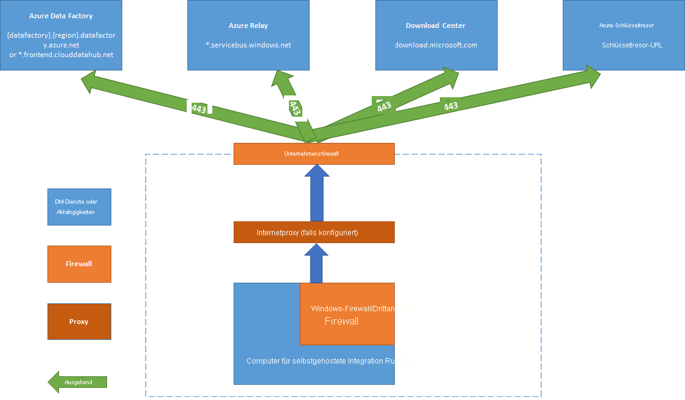

# <a name="create-and-configure-a-self-hosted-integration-runtime"></a>Erstellen und Konfigurieren einer selbstgehosteten Integration Runtime

[!INCLUDE[appliesto-adf-asa-md](includes/appliesto-adf-asa-md.md)]

Bei der Integration Runtime (IR) handelt es sich um die Computeinfrastruktur, mit der Azure Data Factory Datenintegrationsfunktionen übergreifend für verschiedene Netzwerkumgebungen bereitstellt. Weitere Informationen zur Integration Runtime finden Sie unter [Integrationslaufzeit in Azure Data Factory](concepts-integration-runtime.md).

Mit einer selbstgehosteten Integration Runtime können Kopieraktivitäten zwischen einem Clouddatenspeicher und einem Datenspeicher in einem privaten Netzwerk ausgeführt werden. Darüber hinaus können Transformationsaktivitäten für Computeressourcen in einem lokalen Netzwerk oder einem virtuellen Azure-Netzwerk verteilt werden. Für die Installation einer selbstgehosteten Integration Runtime ist ein lokaler Computer oder ein virtueller Computer in einem privaten Netzwerk erforderlich.  

In diesem Artikel wird beschrieben, wie Sie die selbstgehostete IR erstellen und konfigurieren können.

[!INCLUDE [updated-for-az](../../includes/updated-for-az.md)]

## <a name="setting-up-a-self-hosted-integration-runtime"></a>Einrichten einer selbstgehosteten Integration Runtime

Verwenden Sie die folgenden Verfahren, um eine selbstgehostete Integration Runtime zu erstellen und einzurichten.

### <a name="create-a-self-hosted-ir-via-azure-powershell"></a>Erstellen einer selbstgehosteten IR mit Azure PowerShell

1. Sie können Azure PowerShell für diese Aufgabe verwenden. Beispiel:

    ```powershell
    Set-AzDataFactoryV2IntegrationRuntime -ResourceGroupName $resourceGroupName -DataFactoryName $dataFactoryName -Name $selfHostedIntegrationRuntimeName -Type SelfHosted -Description "selfhosted IR description"
    ```
  
2. [Laden](https://www.microsoft.com/download/details.aspx?id=39717) Sie die selbstgehostete Integration Runtime herunter, und installieren Sie sie auf dem lokalen Computer.

3. Rufen Sie den Authentifizierungsschlüssel ab, und registrieren Sie die selbstgehostete Integration Runtime mit dem Schlüssel. Hier ist ein PowerShell-Beispiel angegeben:

    ```powershell

    Get-AzDataFactoryV2IntegrationRuntimeKey -ResourceGroupName $resourceGroupName -DataFactoryName $dataFactoryName -Name $selfHostedIntegrationRuntimeName  

    ```

### <a name="create-a-self-hosted-ir-via-azure-data-factory-ui"></a>Erstellen einer selbstgehosteten IR über die Azure Data Factory-Benutzeroberfläche

Führen Sie die unten angegebenen Schritte aus, um über die Azure Data Factory-Benutzeroberfläche eine selbstgehostete IR zu erstellen.

1. Wählen Sie in der Azure Data Factory-Benutzeroberfläche auf der Seite **Erste Schritte** im Bereich ganz links die Registerkarte [Verwalten](https://docs.microsoft.com/azure/data-factory/author-management-hub) aus.

   

1. Wählen Sie im linken Bereich **Integration Runtime** und dann **+Neu** aus.

   

1. Wählen Sie auf der Seite **Integration Runtime-Setup** die Option **Azure, Selbstgehostet** und dann **Weiter** aus. 

1. Wählen Sie auf der daraufhin angezeigten Seite **Selbstgehostet** aus, um eine selbstgehostete IR zu erstellen, und wählen Sie dann **Weiter**aus.
   

1. Geben Sie einen Namen für Ihre IR ein, und wählen Sie **Erstellen** aus.

1. Wählen Sie auf der Seite **Integration Runtime-Setup** den Link unter **Option 1** aus, um das Express-Setup auf Ihrem Computer zu öffnen. Oder führen Sie die Schritte unter **Option 2** aus, um die Einrichtung manuell vorzunehmen. Die folgende Anleitung basiert auf dem manuellen Setup:

   

    1. Kopieren Sie den Authentifizierungsschlüssel, und fügen Sie ihn ein. Wählen Sie die Option **Integration Runtime herunterladen und installieren** aus.

    1. Führen Sie den Download der selbstgehosteten Integration Runtime auf einen lokalen Windows-Computer durch. Führen Sie das Installationsprogramm aus.

    1. Fügen Sie auf der Seite **Integration Runtime (selbstgehostet) registrieren** den Schlüssel ein, den Sie zuvor gespeichert haben, und wählen Sie **Registrieren** aus.
    
       

    1. Klicken Sie auf der Seite **Neuer Knoten der Integrationslaufzeit (selbstgehostet)** auf **Fertig stellen**.

1. Nachdem die selbstgehostete Integration Runtime erfolgreich registriert wurde, wird das folgende Fenster angezeigt:

    

### <a name="set-up-a-self-hosted-ir-on-an-azure-vm-via-an-azure-resource-manager-template"></a>Einrichten einer selbstgehosteten IR auf einer Azure-VM über eine Azure Resource Manager-Vorlage

Sie können das Setup der selbstgehosteten IR auf einem virtuellen Azure-Computer mit der [Vorlage zum Erstellen einer selbstgehosteten Integration Runtime](https://github.com/Azure/azure-quickstart-templates/tree/master/101-vms-with-selfhost-integration-runtime) automatisieren. Die Vorlage ist eine einfache Möglichkeit, um eine voll funktionsfähige selbstgehostete Integration Runtime in einem virtuellen Azure-Netzwerk zu erstellen. Die IR verfügt über Features für Hochverfügbarkeit und Skalierbarkeit, sofern Sie die Knotenanzahl mindestens auf „2“ festlegen.

### <a name="set-up-an-existing-self-hosted-ir-via-local-powershell"></a>Einrichten einer vorhandenen selbstgehosteten IR über eine lokale PowerShell-Instanz

Sie können eine Befehlszeile verwenden, um eine vorhandene selbstgehostete IR einzurichten oder zu verwalten. Dies kann besonders hilfreich sein, um die Installation und Registrierung von Knoten für die selbstgehostete IR zu automatisieren.

Die Datei „dmgcmd.exe“ ist im selbstgehosteten Installationsprogramm enthalten. Normalerweise befindet sie sich im Ordner „C:\Programme\Microsoft Integration Runtime\4.0\Shared\“. Diese Anwendung unterstützt verschiedene Parameter und kann über eine Befehlszeile mithilfe von Batchskripts für die Automatisierung aufgerufen werden.

Nutzen Sie die Anwendung wie folgt:

```powershell
dmgcmd [ -RegisterNewNode "<AuthenticationKey>" -EnableRemoteAccess "<port>" ["<thumbprint>"] -EnableRemoteAccessInContainer "<port>" ["<thumbprint>"] -DisableRemoteAccess -Key "<AuthenticationKey>" -GenerateBackupFile "<filePath>" "<password>" -ImportBackupFile "<filePath>" "<password>" -Restart -Start -Stop -StartUpgradeService -StopUpgradeService -TurnOnAutoUpdate -TurnOffAutoUpdate -SwitchServiceAccount "<domain\user>" ["<password>"] -Loglevel <logLevel> ]
```

Hier sind die Details zu den Parametern und Eigenschaften der Anwendung angegeben: 

| Eigenschaft                                                    | BESCHREIBUNG                                                  | Erforderlich |
| ----------------------------------------------------------- | ------------------------------------------------------------ | -------- |
| **RegisterNewNode** "`<AuthenticationKey>`"                     | Knoten einer selbstgehosteten Integration Runtime mit dem angegebenen Authentifizierungsschlüssel registrieren | Nein       |
| **RegisterNewNode** "`<AuthenticationKey>`" "`<NodeName>`"      | Knoten einer selbstgehosteten Integration Runtime mit dem angegebenen Authentifizierungsschlüssel und Knotennamen registrieren | Nein       |
| **EnableRemoteAccess** "`<port>`" ["`<thumbprint>`"]            | Remotezugriff auf den aktuellen Knoten zum Einrichten eines Hochverfügbarkeitsclusters aktivieren. Oder Aktivierung des direkten Festlegens von Anmeldeinformationen für die selbstgehostete IR ohne Umweg über Azure Data Factory. Für Letzteres verwenden Sie das Cmdlet **New-AzDataFactoryV2LinkedServiceEncryptedCredential** auf einem Remotecomputer in demselben Netzwerk. | Nein       |
| **EnableRemoteAccessInContainer** "`<port>`" ["`<thumbprint>`"] | Remotezugriff auf den aktuellen Knoten aktivieren, wenn der Knoten in einem Container ausgeführt wird | Nein       |
| **DisableRemoteAccess**                                         | Remotezugriff auf den aktuellen Knoten deaktivieren. Der Remotezugriff ist zum Einrichten von mehreren Knoten erforderlich. Das PowerShell-Cmdlet **New-AzDataFactoryV2LinkedServiceEncryptedCredential** funktioniert auch, wenn der Remotezugriff deaktiviert ist. Dies ist der Fall, sofern das Cmdlet auf demselben Computer ausgeführt wird, auf dem sich auch der Knoten für die selbstgehostete IR befindet. | Nein       |
| **Key** "`<AuthenticationKey>`"                                 | Vorherigen Authentifizierungsschlüssel überschreiben oder aktualisieren. Verwenden Sie diese Aktion mit Bedacht. Ihr Knoten der selbstgehostete IR wird ggf. in den Offlinezustand versetzt, wenn der Schlüssel von einer neuen Integration Runtime stammt. | Nein       |
| **GenerateBackupFile** "`<filePath>`" "`<password>`"            | Generiert eine Sicherungsdatei für den aktuellen Knoten. Die Sicherungsdatei enthält den Knotenschlüssel und die Anmeldeinformationen für den Datenspeicher. | Nein       |
| **ImportBackupFile** "`<filePath>`" "`<password>`"              | Knoten aus einer Sicherungsdatei wiederherstellen                          | Nein       |
| **Neu starten**                                                     | Hostdienst der selbstgehosteten Integration Runtime neu starten   | Nein       |
| **Starten**                                                       | Hostdienst der selbstgehosteten Integration Runtime starten     | Nein       |
| **Beenden**                                                        | Hostdienst der selbstgehosteten Integration Runtime beenden        | Nein       |
| **StartUpgradeService**                                         | Upgradedienst der selbstgehosteten Integration Runtime starten       | Nein       |
| **StopUpgradeService**                                          | Upgradedienst der selbstgehosteten Integration Runtime beenden        | Nein       |
| **TurnOnAutoUpdate**                                            | Automatische Aktualisierung der selbstgehosteten Integration Runtime aktivieren        | Nein       |
| **TurnOffAutoUpdate**                                           | Automatische Aktualisierung der selbstgehosteten Integration Runtime deaktivieren       | Nein       |
| **SwitchServiceAccount** "`<domain\user>`" ["`<password>`"]           | Legen Sie fest, dass DIAHostService als neues Konto ausgeführt wird. Verwenden Sie ein leeres Kennwort („“) für Systemkonten und virtuelle Konten. | Nein       |


## <a name="command-flow-and-data-flow"></a>Befehls- und Datenfluss

Wenn Sie Daten zwischen der lokalen Umgebung und der Cloud verschieben, wird für die Aktivität eine selbstgehostete Integration Runtime verwendet, um die Daten zwischen einer lokalen Datenquelle und der Cloud zu übertragen.

Hier ist eine allgemeine Zusammenfassung der Datenflussschritte zum Kopieren per selbstgehosteter IR angegeben:


1. Ein Datenentwickler erstellt eine selbstgehostete Integration Runtime in einer Azure Data Factory per PowerShell-Cmdlet. Derzeit wird dieses Feature vom Azure-Portal nicht unterstützt.
1. Der Datenentwickler erstellt einen verknüpften Dienst für einen lokalen Datenspeicher. Der Entwickler gibt hierfür die Instanz der selbstgehosteten Integration Runtime an, die vom Dienst zum Verbinden der Datenspeicher verwendet werden soll.
1. Über den Knoten der selbstgehosteten Integration Runtime werden die Anmeldeinformationen per DPAPI (Windows Data Protection Application Programming Interface) verschlüsselt und lokal gespeichert. Falls mehrere Knoten festgelegt sind, um Hochverfügbarkeit zu erzielen, werden die Anmeldeinformationen für andere Knoten weiter synchronisiert. Jeder Knoten verschlüsselt die Anmeldeinformationen mithilfe von DPAPI und speichert sie lokal. Die Synchronisierung der Anmeldeinformationen ist für den Datenentwickler transparent und wird von der selbstgehosteten IR verarbeitet.
1. Azure Data Factory kommuniziert mit der selbstgehosteten Integration Runtime, um Aufträge zu planen und zu verwalten. Die Kommunikation erfolgt über einen Steuerkanal, für den eine freigegebene [Azure Service Bus Relay](https://docs.microsoft.com/azure/service-bus-relay/relay-what-is-it#wcf-relay)-Verbindung verwendet wird. Wenn ein Aktivitätsauftrag ausgeführt werden muss, reiht Data Factory die Anforderung zusammen mit den Anmeldeinformationen in die Warteschlange ein. Dies wird durchgeführt, falls die Anmeldeinformationen nicht bereits unter der selbstgehosteten Integration Runtime gespeichert sind. Die selbstgehostete Integration Runtime startet den Auftrag, nachdem die Warteschlange abgefragt wurde.
1. Die selbstgehostete Integration Runtime kopiert Daten zwischen einem lokalen Speicher und Cloudspeicher. Die Richtung des Kopiervorgangs hängt davon ab, wie die Kopieraktivität in der Datenpipeline konfiguriert ist. Für diesen Schritt kommuniziert die selbstgehostete Integration Runtime über einen sicheren HTTPS-Kanal direkt mit einem cloudbasierten Speicherdienst, z. B. Azure Blob Storage.

## <a name="considerations-for-using-a-self-hosted-ir"></a>Aspekte der Nutzung einer selbstgehosteten IR

- Sie können eine einzelne selbstgehostete Integration Runtime für mehrere lokale Datenquellen verwenden. Außerdem haben Sie die Möglichkeit, sie für eine andere Data Factory auf demselben Azure AD-Mandanten (Azure Active Directory) freizugeben. Weitere Informationen finden Sie unter [Freigeben der selbstgehosteten Integration Runtime (IR) für mehrere Data Factorys](#create-a-shared-self-hosted-integration-runtime-in-azure-data-factory).
- Sie können auf einem Computer nur jeweils eine Instanz der selbstgehosteten Integration Runtime installieren. Wenn Sie über zwei Data Factorys verfügen, die auf lokale Datenquellen zugreifen müssen, verwenden Sie entweder die [Funktion für selbstgehostete IR-Freigabe](#create-a-shared-self-hosted-integration-runtime-in-azure-data-factory), um die selbstgehostete IR freizugeben, oder Sie installieren die selbstgehostete IR auf zwei lokalen Computern (eine Instanz für jede Data Factory).  
- Die selbstgehostete Integration Runtime muss sich nicht auf demselben Computer wie die Datenquelle befinden. Wenn sich die selbstgehostete Integration Runtime in der Nähe der Datenquelle befindet, dauert es weniger lange, bis die selbstgehostete Integration Runtime eine Verbindung mit der Datenquelle hergestellt hat. Wir empfehlen Ihnen, die selbstgehostete Integration Runtime nicht auf dem Computer zu installieren, auf dem die lokale Datenquelle gehostet wird. Wenn sich die selbstgehostete Integration Runtime und die Datenquelle auf unterschiedlichen Computern befinden, steht die selbstgehostete Integration Runtime mit der Datenquelle nicht im Wettbewerb um Ressourcen.
- Sie können über mehrere selbstgehostete Integration Runtimes auf verschiedenen Computern verfügen, die eine Verbindung mit der gleichen lokalen Datenquelle herstellen. Wenn Sie beispielsweise über zwei selbstgehostete Integration Runtimes verfügen, die zwei Data Factorys mit Daten versorgen, kann dieselbe lokale Datenquelle für beide Data Factorys registriert werden.
- Falls Sie auf Ihrem Computer bereits ein Gateway installiert haben, das für ein Power BI-Szenario verwendet wird, sollten Sie auf einem anderen Computer eine separate selbstgehostete Integration Runtime für Data Factory installieren.
- Verwenden Sie eine selbstgehostete Integration Runtime, um die Datenintegration in einem virtuellen Azure-Netzwerk zu unterstützen.
- Behandeln Sie Ihre Datenquelle wie eine lokale Datenquelle (die sich hinter einer Firewall befindet), selbst wenn Sie Azure ExpressRoute verwenden. Verwenden Sie die selbstgehostete Integration Runtime, um den Dienst mit der Datenquelle zu verbinden.
- Verwenden Sie die selbstgehostete Integration Runtime auch, wenn sich der Datenspeicher in der Cloud auf einem virtuellen Azure IaaS-Computer (Infrastructure-as-a-Service) befindet.
- Bei einer selbstgehosteten Integration Runtime-Instanz, die Sie auf einem Windows Server-Computer mit aktivierter FIPS-konformer Verschlüsselung installiert haben, treten für Aufgaben unter Umständen Fehler auf. Deaktivieren Sie die FIPS-konforme Verschlüsselung auf dem Server, um dieses Problem zu umgehen. Zum Deaktivieren der FIPS-konformen Verschlüsselung ändern Sie den folgenden Wert des Registrierungsschlüssels „1“ (aktiviert) in „0“ (deaktiviert): `HKLM\System\CurrentControlSet\Control\Lsa\FIPSAlgorithmPolicy\Enabled`.

## <a name="prerequisites"></a>Voraussetzungen

- Die unterstützten Versionen von Windows lauten:
  + Windows 7 Service Pack 1
  + Windows 8.1
  + Windows 10
  + Windows Server 2008 R2 SP1
  + Windows Server 2012
  + Windows Server 2012 R2
  + Windows Server 2016
  + Windows Server 2019
   
   Die Installation der selbstgehosteten Integration Runtime auf einem Domänencontroller wird nicht unterstützt.
- .NET Framework 4.6.1 oder höher ist erforderlich. Wenn Sie die selbstgehostete Integration Runtime auf einem Windows 7-Computer installieren, sollten Sie .NET Framework 4.6.1 oder höher installieren. Ausführlichere Informationen finden Sie unter [Systemanforderungen für .NET Framework](/dotnet/framework/get-started/system-requirements) .
- Die empfohlene Mindestkonfiguration für den Computer mit der selbstgehosteten Integration Runtime ist ein 2-GHz-Prozessor mit 4 Kernen, 8 GB RAM und 80 GB verfügbarem Speicherplatz auf dem Datenträger.
- Wenn sich der Hostcomputer im Ruhezustand befindet, reagiert die selbstgehostete Integration Runtime nicht auf Datenanforderungen. Konfigurieren Sie vor der Installation der selbstgehosteten Integration Runtime einen entsprechenden Energiesparplan auf dem Computer. Wenn für den Computer der Ruhezustand konfiguriert ist, wird im Installationsprogramm für die selbstgehostete Integration Runtime eine Meldung angezeigt.
- Sie müssen der Administrator des Computers sein, um die selbstgehostete Integration Runtime erfolgreich installieren und konfigurieren zu können.
- Ausführungen der Kopieraktivität werden mit einer bestimmten Häufigkeit durchgeführt. Die Prozessor- und RAM-Nutzung auf dem Computer folgt dem gleichen Muster mit Spitzen- und Leerlaufzeiten. Außerdem ist die Ressourcenverwendung auch stark von der Menge der Daten abhängig, die verschoben werden. Wenn mehrere Kopieraufträge in Bearbeitung sind, steigt die Ressourcenverwendung zu Spitzenzeiten an.
- Unter Umständen tritt für Aufgaben während der Extraktion von Daten in den Formaten Parquet, ORC oder Avro ein Fehler auf. Weitere Informationen zu Parquet finden Sie im Artikel [Parquet-Format in Azure Data Factory](https://docs.microsoft.com/azure/data-factory/format-parquet#using-self-hosted-integration-runtime). Die Dateierstellung wird auf dem Computer mit der selbstgehosteten Integration Runtime ausgeführt. Damit die Dateierstellung wie erwartet funktioniert, müssen die folgenden Voraussetzungen erfüllt sein:
    - Paket mit [Visual C++ 2010 Redistributable](https://download.microsoft.com/download/3/2/2/3224B87F-CFA0-4E70-BDA3-3DE650EFEBA5/vcredist_x64.exe) (x64)
    - Version 8 der Java Runtime (JRE) von einem JRE-Anbieter, z. B. [Adopt OpenJDK](https://adoptopenjdk.net/). Stellen Sie sicher, dass die Umgebungsvariable `JAVA_HOME` festgelegt ist.

## <a name="installation-best-practices"></a>Bewährte Methoden für die Installation

Sie können die selbstgehostete Integration Runtime installieren, indem Sie aus dem [Microsoft Download Center](https://www.microsoft.com/download/details.aspx?id=39717) ein Setuppaket des Typs „Verwaltete Identität“ herunterladen. Eine Schritt-für-Schritt-Anleitung finden Sie im Artikel [Verschieben von Daten zwischen lokalen Quellen und der Cloud](tutorial-hybrid-copy-powershell.md).

- Konfigurieren Sie den Energiesparplan auf dem Hostcomputer für die selbstgehostete Integration Runtime, damit der Computer nicht in den Ruhezustand versetzt wird. Wenn der Hostcomputer in den Ruhezustand versetzt wird, wechselt die selbstgehostete Integration Runtime in den Offlinemodus.
- Sichern Sie regelmäßig die Anmeldeinformationen, die der selbstgehosteten Integration Runtime zugeordnet sind.
- Informationen zur Automatisierung der Einrichtungsvorgänge für die selbstgehostete IR finden Sie unter [Einrichten einer vorhandenen selbstgehosteten IR über eine lokale PowerShell-Instanz](#setting-up-a-self-hosted-integration-runtime).  

## <a name="install-and-register-a-self-hosted-ir-from-microsoft-download-center"></a>Installieren und Registrieren einer selbstgehosteten IR über das Microsoft Download Center

1. Navigieren Sie zur [Downloadseite für die Microsoft-Integration Runtime](https://www.microsoft.com/download/details.aspx?id=39717).
1. Wählen Sie die Option **Herunterladen**, die 64-Bit-Version und dann **Weiter** aus. Die 32-Bit-Version wird nicht unterstützt.
1. Führen Sie die Datei für „Verwaltete Identität“ direkt aus, oder speichern Sie sie zur späteren Ausführung auf Ihrer Festplatte.
1. Wählen Sie im Fenster **Willkommen** eine Sprache und dann **Weiter** aus.
1. Akzeptieren Sie die Microsoft-Software-Lizenzbedingungen, und wählen Sie **Weiter** aus.
1. Wählen Sie den **Ordner** für die Installation der selbstgehosteten Integration Runtime und dann **Weiter** aus.
1. Wählen Sie auf der Seite **Bereit zur Installation** die Option **Installieren** aus.
1. Wählen Sie **Fertig stellen** aus, um die Installation abzuschließen.
1. Rufen Sie den Authentifizierungsschlüssel über PowerShell ab. Hier ist ein PowerShell-Beispiel zum Abrufen des Authentifizierungsschlüssels:

    ```powershell
    Get-AzDataFactoryV2IntegrationRuntimeKey -ResourceGroupName $resourceGroupName -DataFactoryName $dataFactoryName -Name $selfHostedIntegrationRuntime
    ```

1. Führen Sie im Konfigurations-Manager für Microsoft Integration Runtime, der auf Ihrem Computer ausgeführt wird, im Fenster **Integration Runtime (selbstgehostet) registrieren** die folgenden Schritte aus:

    1. Fügen Sie im Textbereich den Authentifizierungsschlüssel ein.

    1. Optional: Wählen Sie **Authentifizierungsschlüssel anzeigen**, um den Schlüsseltext anzuzeigen.

    1. Wählen Sie **Registrieren**.

## <a name="high-availability-and-scalability"></a>Hohe Verfügbarkeit und Skalierbarkeit

Sie können eine selbstgehostete Integration Runtime mehreren lokalen Computern oder virtuellen Computern in Azure zuordnen. Diese Computer werden als Knoten bezeichnet. Einer selbstgehosteten Integration Runtime können bis zu vier Knoten zugeordnet sein. Die Vorteile der Nutzung mehrerer Knoten auf lokalen Computern mit installiertem Gateway für ein logisches Gateway sind:

* Höhere Verfügbarkeit der selbstgehosteten Integration Runtime, damit es sich nicht mehr um die einzige Fehlerquelle (Single Point of Failure) in Ihrer Big Data-Lösung oder Clouddatenintegration mit Data Factory handelt. Auf diese Weise wird die Kontinuität mit bis zu vier Knoten sichergestellt.
* Verbesserung in Bezug auf die Leistung und den Durchsatz während der Datenverschiebung zwischen lokalen und Clouddatenspeichern. Informieren Sie sich über [Leistungsvergleiche](copy-activity-performance.md).

Sie können mehrere Knoten zuordnen, indem Sie die Software für die selbstgehostete Integration Runtime aus dem [Downloadcenter](https://www.microsoft.com/download/details.aspx?id=39717) installieren. Registrieren Sie sie dann – wie im [Tutorial](tutorial-hybrid-copy-powershell.md) beschrieben – mit einem der vom Cmdlet **New-AzDataFactoryV2IntegrationRuntimeKey** abgerufenen Authentifizierungsschlüssel.

> [!NOTE]
> Für die Zuordnung zu den einzelnen Knoten müssen Sie nicht jeweils eine neue selbstgehostete Integration Runtime erstellen. Sie können die selbstgehostete Integration Runtime auf einem anderen Computer installieren und mit dem gleichen Authentifizierungsschlüssel registrieren.

> [!NOTE]
> Vergewissern Sie sich vor dem Hinzufügen eines weiteren Knotens zur Erzielung von Hochverfügbarkeit und Skalierbarkeit, dass die Option **Remote access to intranet** (Remotezugriff auf das Intranet) für den ersten Knoten aktiviert ist. Navigieren Sie hierzu zu **Konfigurations-Manager für Microsoft Integration Runtime** > **Einstellungen** > **Remote access to intranet** (Remotezugriff auf das Intranet).

### <a name="scale-considerations"></a>Aspekte der Skalierung

#### <a name="scale-out"></a>Aufskalieren

Wenn die Prozessorauslastung hoch und für die selbstgehostete Integration Runtime nur wenig Arbeitsspeicher verfügbar ist, sollten Sie einen neuen Knoten hinzufügen, um das Aufskalieren für die Computer zu unterstützen. Falls für Aktivitäten ein Fehler auftritt, weil das Zeitlimit erreicht ist oder die selbstgehostete IR offline ist, ist es hilfreich, wenn Sie dem Gateway einen Knoten hinzufügen.

#### <a name="scale-up"></a>Hochskalieren

Wenn der Prozessor und der verfügbare RAM keine gute Auslastung aufweisen, die Ausführung von gleichzeitigen Aufträgen aber in die Nähe des Grenzwerts eines Knotens kommt, sollten Sie hochskalieren. Erhöhen Sie hierzu die Anzahl von gleichzeitigen Aufträgen, die von einem Knoten ausgeführt werden können. Es kann auch hilfreich sein, hochzuskalieren, wenn für Aktivitäten eine Zeitüberschreitung auftritt, weil die selbstgehostete IR überlastet ist. Wie in der folgenden Abbildung gezeigt, können Sie die maximale Kapazität für einen Knoten erhöhen:  


### <a name="tlsssl-certificate-requirements"></a>TLS/SSL-Zertifikatanforderungen

Hier sind die Anforderungen für das TLS/SSL-Zertifikat angegeben, das Sie zum Schützen der Kommunikation zwischen Integration Runtime-Knoten verwenden:

- Das Zertifikat muss ein öffentlich vertrauenswürdiges Zertifikat vom Typ „X509 v3“ sein. Wir empfehlen Ihnen die Verwendung von Zertifikaten, die von einer öffentlichen Zertifizierungsstelle für Partner ausgestellt werden.
- Jeder Integration Runtime-Knoten muss diesem Zertifikat vertrauen.
- SAN-Zertifikate (Subject Alternative Name, alternativer Antragstellername) sind nicht empfehlenswert, da nur das letzte SAN-Element verwendet wird. Alle anderen SAN-Elemente werden ignoriert. Wenn Sie beispielsweise ein SAN-Zertifikat mit den SANs **node1.domain.contoso.com** und **node2.domain.contoso.com** verwenden, können Sie dieses Zertifikat nur auf dem Computer nutzen, dessen vollqualifizierter Domänenname (FQDN) **node2.domain.contoso.com** lautet.
- Für das Zertifikat können alle Schlüsselgrößen verwendet werden, die von Windows Server 2012 R2 für TLS/SSL-Zertifikate unterstützt werden.
- Zertifikate, die CNG-Schlüssel verwenden, werden nicht unterstützt.  

> [!NOTE]
> Dieses Zertifikat wird für folgende Zwecke verwendet:
>
> - Zum Verschlüsseln von Ports auf dem Knoten einer selbstgehosteten IR.
> - Für die Knoten-zu-Knoten-Kommunikation bei der Statussynchronisierung, einschließlich der knotenübergreifenden Synchronisierung der Anmeldeinformationen von verknüpften Diensten.
> - Bei Verwendung eines PowerShell-Cmdlets für die Einstellungen für die Anmeldeinformationen von verknüpften Diensten in einem lokalen Netzwerk.
>
> Wir empfehlen Ihnen, dieses Zertifikat zu verwenden, wenn Ihre private Netzwerkumgebung nicht sicher ist oder Sie die Kommunikation zwischen Knoten in Ihrem privaten Netzwerk schützen möchten.
>
> Die Datenverschiebung während der Übertragung von einer selbstgehosteten IR in andere Datenspeicher erfolgt immer über einen verschlüsselten Kanal – unabhängig davon, ob dieses Zertifikat festgelegt ist.

## <a name="create-a-shared-self-hosted-integration-runtime-in-azure-data-factory"></a>Erstellen einer freigegebenen selbstgehosteten Integration Runtime in Azure Data Factory

Sie können eine vorhandene selbstgehostete Integration Runtime-Infrastruktur wiederverwenden, die Sie bereits in einer Data Factory eingerichtet haben. Diese Wiederverwendung ermöglicht Ihnen das Erstellen einer verknüpften selbstgehosteten Integration Runtime in einer anderen Data Factory durch Verweisen auf eine vorhandene freigegebene selbstgehostete IR.

Sehen Sie sich das folgende zwölfminütige Video an, um eine Einführung und Demonstration dieses Features zu erhalten:

> [!VIDEO https://channel9.msdn.com/Shows/Azure-Friday/Hybrid-data-movement-across-multiple-Azure-Data-Factories/player]

### <a name="terminology"></a>Begriff

- **Freigegebene IR**: Eine ursprüngliche selbstgehostete IR, die in einer physischen Infrastruktur ausgeführt wird.  
- **Verknüpfte IR**: Eine IR, die auf eine andere freigegebene IR verweist. Diese verknüpfte IR ist eine logische IR. Sie nutzt die Infrastruktur einer anderen freigegebenen selbstgehosteten IR.

### <a name="methods-to-share-a-self-hosted-integration-runtime"></a>Verfahren zum Freigeben einer selbstgehosteten Integration Runtime

Ausführliche Informationen zum Freigeben einer selbstgehosteten Integration Runtime mit mehreren Data Factorys finden Sie unter [Erstellen einer freigegebenen selbstgehosteten Integration Runtime in Azure Data Factory](create-shared-self-hosted-integration-runtime-powershell.md).

### <a name="monitoring"></a>Überwachung

#### <a name="shared-ir"></a>Freigegebene IR


#### <a name="linked-ir"></a>Verknüpfte IR


### <a name="known-limitations-of-self-hosted-ir-sharing"></a>Bekannte Einschränkungen der Freigabe selbstgehosteter IRs

* Die Data Factory, in der eine verknüpfte IR erstellt wird, muss über eine [verwaltete Identität](https://docs.microsoft.com/azure/active-directory/managed-service-identity/overview) verfügen. Standardmäßig verfügen die im Azure-Portal oder mit PowerShell-Cmdlets erstellten Data Factorys über eine implizit erstellte verwaltete Identität. Wenn eine Data Factory aber mit einer Azure Resource Manager-Vorlage oder mit einem SDK erstellt wird, müssen Sie die **Identity**-Eigenschaft explizit festlegen. Mit dieser Einstellung wird sichergestellt, dass Resource Manager eine Data Factory mit einer verwalteten Identität erstellt.

* Sie müssen mindestens Version 1.1.0 des Data Factory .NET SDK verwenden, damit dieses Feature unterstützt wird.

* Zum Gewähren von Berechtigungen müssen Sie über die Rolle „Besitzer“ oder die geerbte Rolle „Besitzer“ in der Data Factory verfügen, in der die freigegebene IR vorhanden ist.

* Die Freigabefunktion kann nur für Data Factorys unter demselben Azure Active Directory-Mandanten verwendet werden.

* Für Azure AD-[Gastbenutzer](https://docs.microsoft.com/azure/active-directory/governance/manage-guest-access-with-access-reviews) ist zu beachten, dass die Suchfunktion auf der Benutzeroberfläche, bei der alle Data Factorys per Suchschlüsselwort aufgelistet werden, [nicht funktioniert](https://msdn.microsoft.com/library/azure/ad/graph/howto/azure-ad-graph-api-permission-scopes#SearchLimits). Aber sofern der Gastbenutzer der Besitzer der Data Factory ist, können Sie die IR ohne Suchfunktion freigeben. Geben Sie für die verwaltete Identität der Data Factory, für die die IR freigegeben werden muss, diese verwaltete Identität in das Feld **Berechtigung zuweisen** ein. Wählen Sie auf der Data Factory-Benutzeroberfläche **Hinzufügen** aus.

  > [!NOTE]
  > Dieses Feature steht nur in Data Factory V2 zur Verfügung.

## <a name="notification-area-icons-and-notifications"></a>Symbole des Benachrichtigungsbereichs und Benachrichtigungen

Wenn Sie Ihren Cursor auf das Symbol bzw. die Nachricht im Benachrichtigungsbereich bewegen, können Sie die Details zum Status der selbstgehosteten Integration Runtime anzeigen.


## <a name="ports-and-firewalls"></a>Ports und Firewalls

Zwei Firewalls müssen berücksichtigt werden:

- Die *Unternehmensfirewall*, die auf dem zentralen Router der Organisation ausgeführt wird
- Die *Windows-Firewall*, die als Daemon auf dem lokalen Computer konfiguriert ist, auf dem die selbstgehostete Integration Runtime installiert ist



Auf Ebene der Unternehmensfirewall müssen Sie die folgenden Domänen und ausgehenden Ports konfigurieren:

[!INCLUDE [domain-and-outbound-port-requirements](../../includes/domain-and-outbound-port-requirements.md)]


Auf Ebene der Windows-Firewall bzw. auf Computerebene sind diese ausgehenden Ports normalerweise aktiviert. Falls nicht, können Sie die Domänen und Ports auf dem Computer mit der selbstgehosteten Integration Runtime konfigurieren.

> [!NOTE]
> Basierend auf Ihren Quellen und Senken müssen Sie unter Umständen zusätzliche Domänen und ausgehende Ports in Ihrer Unternehmens- oder Windows-Firewall zulassen.
>
> Für einige Clouddatenbanken, z. B. Azure SQL-Datenbank und Azure Data Lake, müssen Sie ggf. IP-Adressen der Computer mit der selbstgehosteten Integration Runtime für die Firewallkonfiguration zulassen.

### <a name="copy-data-from-a-source-to-a-sink"></a>Kopieren von Daten von einer Quelle in eine Senke

Stellen Sie sicher, dass Sie die Firewallregeln der Unternehmensfirewall, der Windows-Firewall auf dem Computer mit der selbstgehosteten Integration Runtime und des Datenspeichers selbst richtig aktivieren. Bei Aktivierung dieser Regeln kann die selbstgehostete Integration Runtime erfolgreich eine Verbindung mit der Quelle und der Senke herstellen. Aktivieren Sie die Regeln für jeden Datenspeicher, der am Kopiervorgang beteiligt ist.

Führen Sie beispielsweise die folgenden Schritte aus, um Daten aus einem lokalen Datenspeicher in eine SQL-Datenbank-Senke oder eine Azure Synapse Analytics-Senke (ehemals SQL Data Warehouse) zu kopieren:

1. Lassen Sie ausgehende TCP-Kommunikation an Port 1433 sowohl für die Windows-Firewall als auch für die Unternehmensfirewall zu.
1. Konfigurieren Sie die Firewalleinstellungen der SQL-Datenbank-Instanz, um die IP-Adresse des Computers mit der selbstgehosteten Integration Runtime der Liste mit den zulässigen IP-Adressen hinzuzufügen.

> [!NOTE]
> Falls Ihre Firewall den ausgehenden Port 1433 nicht zulässt, kann die selbstgehostete Integration Runtime nicht direkt auf die SQL Datenbank zugreifen. In diesem Fall können Sie das [gestaffelte Kopieren](copy-activity-performance.md) in SQL-Datenbank und Azure Synapse Analytics verwenden. Sie benötigen bei einem Szenario dieser Art nur HTTPS (Port 443) für die Datenverschiebung.

## <a name="proxy-server-considerations"></a>Proxyserver-Aspekte

Konfigurieren Sie die selbstgehostete Integration Runtime mit den geeigneten Proxyeinstellungen, wenn die Netzwerkumgebung Ihres Unternehmens einen Proxyserver für den Internetzugriff verwendet. Sie können den Proxy während der anfänglichen Registrierungsphase festlegen.


Wenn die selbstgehostete Integration Runtime konfiguriert ist, verwendet sie den Proxyserver zum Herstellen der Verbindung mit der Quelle und dem Ziel des Clouddiensts (für die das HTTP- oder HTTPS-Protokoll verwendet wird). Aus diesem Grund wählen Sie beim anfänglichen Setup die Option **Verknüpfung ändern** aus.


Es gibt drei Konfigurationsoptionen:

- **Proxy nicht verwenden**: Für die selbstgehostete IR wird nicht explizit ein Proxy verwendet, um eine Verbindung mit Clouddiensten herzustellen.
- **Systemproxy verwenden**: Die selbstgehostete IR verwendet die in „diahost.exe.config“ und „diawp.exe.config“ konfigurierten Proxyeinstellungen. Wenn für diese Dateien keine Proxykonfiguration angegeben wird, stellt die selbstgehostete Integration Runtime eine direkte Verbindung mit dem Clouddienst her, ohne einen Proxy zu durchlaufen.
- **Benutzerdefinierten Proxy verwenden**: Konfigurieren Sie hier die HTTP-Proxyeinstellungen, die für die selbstgehostete Integration Runtime verwendet werden sollen, anstatt die Konfigurationen in den Dateien „diahost.exe.config“ und „diawp.exe.config“ zu nutzen. Die Werte für **Adresse** und **Port** sind erforderlich. Die Werte für **Benutzername** und **Kennwort** sind je nach den Authentifizierungseinstellungen Ihres Proxys optional. Alle Einstellungen werden für die selbstgehostete Integrationslaufzeit per Windows DPAPI verschlüsselt und lokal auf dem Computer gespeichert.

Der Hostdienst der Integration Runtime wird automatisch neu gestartet, nachdem Sie die aktualisierten Proxyeinstellungen gespeichert haben.

Wenn Sie nach der Registrierung der selbstgehosteten Integration Runtime die Proxyeinstellungen anzeigen oder aktualisieren möchten, können Sie den Konfigurations-Manager für die Microsoft Integration Runtime verwenden.

1. Öffnen Sie den **Konfigurations-Manager für Microsoft Integration Runtime**.
1. Wählen Sie die Registerkarte **Einstellungen** aus.
1. Wählen Sie unter **HTTP-Proxy** den Link **Ändern** aus, um das Dialogfeld **HTTP-Proxy festlegen** zu öffnen.
1. Wählen Sie **Weiter** aus. Eine Warnung wird angezeigt, die Sie zur Bestätigung auffordert, dass die Proxyeinstellung gespeichert und der Hostdienst der Integration Runtime neu gestartet werden soll.

Sie können das Konfigurations-Manager-Tool verwenden, um den HTTP-Proxy anzuzeigen und zu aktualisieren.


> [!NOTE]
> Wenn Sie einen Proxyserver mit NTLM-Authentifizierung einrichten, wird der Hostdienst der Integration Runtime unter dem Domänenkonto ausgeführt. Wenn Sie später das Kennwort für das Domänenkonto ändern, sollten Sie daran denken, die Konfigurationseinstellungen für den Dienst entsprechend zu aktualisieren und den Dienst neu zu starten. Aufgrund dieser Anforderung empfehlen wir Ihnen, mit einem dedizierten Domänenkonto auf den Proxyserver zuzugreifen, für das das Kennwort nicht regelmäßig aktualisiert werden muss.

### <a name="configure-proxy-server-settings"></a>Konfigurieren von Proxyservereinstellungen

Wenn Sie die Option **Systemproxy verwenden** für den HTTP-Proxy auswählen, verwendet die selbstgehostete Integration Runtime die Proxyeinstellungen in „diahost.exe.config“ und „diawp.exe.config“. Falls für diese Dateien kein Proxy angegeben wird, stellt die selbstgehostete Integration Runtime eine direkte Verbindung mit dem Clouddienst her, ohne einen Proxy zu durchlaufen. Das folgende Verfahren enthält Anweisungen für die Aktualisierung der Datei „diahost.exe.config“:

1. Erstellen Sie im Datei-Explorer eine sichere Kopie von „C:\Programme\Microsoft Integration Runtime\4.0\Shared\diahost.exe.config“ als Sicherung der Originaldatei.
1. Öffnen Sie den Editor als Administrator.
1. Öffnen Sie im Editor die Textdatei „C:\Programme\Microsoft Integration Runtime\4.0\Shared\diahost.exe.config“.
1. Suchen Sie wie im folgenden Code gezeigt nach dem Standardtag **system.net**:

    ```xml
    <system.net>
        <defaultProxy useDefaultCredentials="true" />
    </system.net>
    ```
    Anschließend können Sie die Informationen zum Proxyserver wie im folgenden Beispiel gezeigt hinzufügen:

    ```xml
    <system.net>
        <defaultProxy enabled="true">
              <proxy bypassonlocal="true" proxyaddress="http://proxy.domain.org:8888/" />
        </defaultProxy>
    </system.net>
    ```

    Mit dem Proxytag können zusätzliche Eigenschaften verwendet werden, um erforderliche Einstellungen wie `scriptLocation` anzugeben. Informationen zur Syntax finden Sie unter dem [\<proxy\>-Element (Netzwerkeinstellungen)](https://msdn.microsoft.com/library/sa91de1e.aspx).

    ```xml
    <proxy autoDetect="true|false|unspecified" bypassonlocal="true|false|unspecified" proxyaddress="uriString" scriptLocation="uriString" usesystemdefault="true|false|unspecified "/>
    ```
1. Speichern Sie die Konfigurationsdatei am ursprünglichen Speicherort. Starten Sie dann den Hostdienst für die selbstgehostete Integration Runtime, der die Änderungen übernimmt.

   Starten Sie den Dienst mit dem Dienste-Applet in der Systemsteuerung neu. Alternativ wählen Sie im Konfigurations-Manager für Integration Runtime die Schaltfläche **Dienst beenden** und dann **Dienst starten** aus.

   Wenn der Dienst nicht gestartet wird, haben Sie wahrscheinlich in der von Ihnen bearbeiteten Konfigurationsdatei eine fehlerhafte XML-Tagsyntax hinzugefügt.

> [!IMPORTANT]
> Vergessen Sie nicht, beide Dateien – „diahost.exe.config“ und „diawp.exe.config“ – zu aktualisieren.

Sie müssen auch sicherstellen, dass Microsoft Azure in der Zulassungsliste Ihres Unternehmens aufgeführt ist. Sie können die Liste mit den gültigen Azure-IP-Adressen im [Microsoft Download Center](https://www.microsoft.com/download/details.aspx?id=41653) herunterladen.

### <a name="possible-symptoms-for-issues-related-to-the-firewall-and-proxy-server"></a>Mögliche Symptome für Probleme im Zusammenhang mit der Firewall und dem Proxyserver

Falls Fehlermeldungen wie in der Liste unten angezeigt werden, ist die Ursache wahrscheinlich eine falsche Konfiguration der Firewall oder des Proxyservers. Eine falsche Konfiguration verhindert, dass die selbstgehostete Integration Runtime eine Verbindung mit Data Factory herstellen kann, um sich zu authentifizieren. Um sicherzustellen, dass die Firewall und der Proxyserver richtig konfiguriert sind, überprüfen Sie den vorherigen Abschnitt.

* Wenn Sie versuchen, die selbstgehostete Integration Runtime zu registrieren, erhalten Sie die folgende Fehlermeldung: „Fehler beim Registrieren dieses Knotens der Integrationslaufzeit. Stellen Sie sicher, dass der Authentifizierungsschlüssel gültig ist und der Hostdienst des Integrationsdiensts auf diesem Computer ausgeführt wird.“
* Wenn Sie den Konfigurations-Manager für die Integration Runtime öffnen, wird der Status als **Getrennt** oder **Verbindung wird hergestellt** angezeigt. Beim Anzeigen der Windows-Ereignisprotokolle sehen Sie unter **Ereignisanzeige** > **Anwendungs- und Dienstprotokolle** > **Microsoft Integration Runtime** beispielsweise folgende Fehlermeldung:

    ```
    Unable to connect to the remote server
    A component of Integration Runtime has become unresponsive and restarts automatically. Component name: Integration Runtime (Self-hosted).
    ```

### <a name="enable-remote-access-from-an-intranet"></a>Aktivieren des Remotezugriffs über ein Intranet

Wenn Sie PowerShell verwenden, um Anmeldeinformationen eines anderen Computers im Netzwerk zu verschlüsseln, auf dem Sie die selbstgehostete Integration Runtime nicht installiert haben, können Sie die Option **Remotezugriff über das Intranet** aktivieren. Wenn Sie PowerShell verwenden, um Anmeldeinformationen auf dem Computer zu verschlüsseln, auf dem Sie die selbstgehostete Integration Runtime installiert haben, können Sie **Remotezugriff über das Intranet** nicht aktivieren.

Aktivieren Sie die Option **Remotezugriff über das Intranet**, bevor Sie einen weiteren Knoten für Hochverfügbarkeit und Skalierbarkeit hinzufügen.  

Wenn Sie mindestens Version 3.3 der selbstgehosteten Integration Runtime ausführen, wird **Remotezugriff über das Intranet** durch das Installationsprogramm der selbstgehosteten Integration Runtime auf dem entsprechenden Computer deaktiviert.

Wenn Sie eine Firewall von einem Partner oder anderen Anbietern verwenden, können Sie manuell Port 8060 oder den vom Benutzer konfigurierten Port öffnen. Falls beim Einrichten der selbstgehosteten Integration Runtime Firewallprobleme auftreten, sollten Sie den folgenden Befehl verwenden, um die selbstgehostete Integration Runtime zu installieren, ohne die Firewall zu konfigurieren:

```
msiexec /q /i IntegrationRuntime.msi NOFIREWALL=1
```

Falls Sie Port 8060 auf dem Computer für die selbstgehostete Integration Runtime nicht öffnen, sollten Sie andere Verfahren als die Anwendung „Anmeldeinformationen festlegen“ nutzen, um Anmeldeinformationen für den Datenspeicher zu konfigurieren. Beispielsweise können Sie das **New-AzDataFactoryV2LinkedServiceEncryptCredential**-PowerShell-Cmdlet verwenden.

## <a name="next-steps"></a>Nächste Schritte

Eine Schritt-für-Schritt-Anleitung finden Sie unter [Tutorial: Kopieren von lokalen Daten in die Cloud](tutorial-hybrid-copy-powershell.md).
