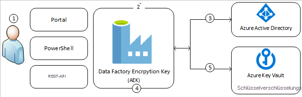
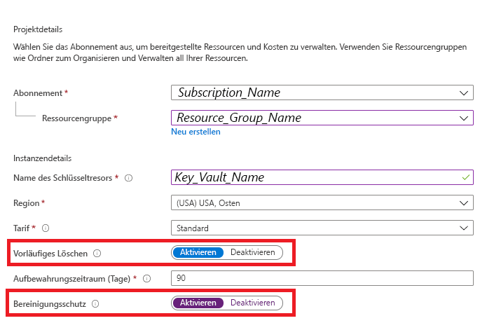
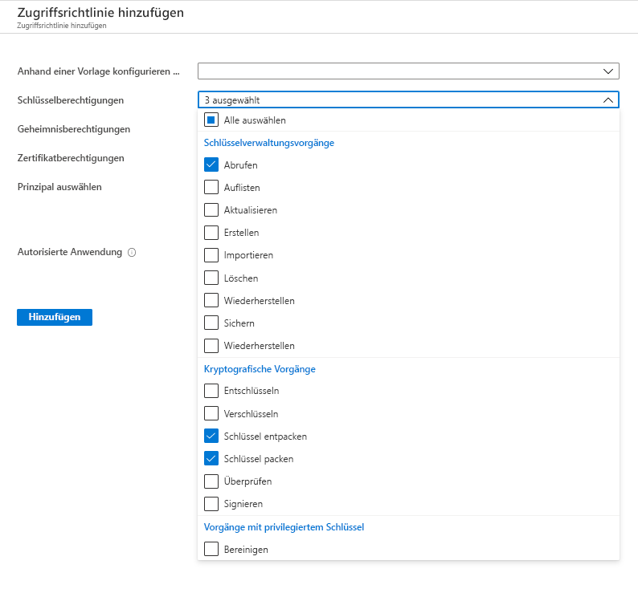
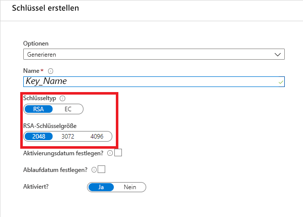
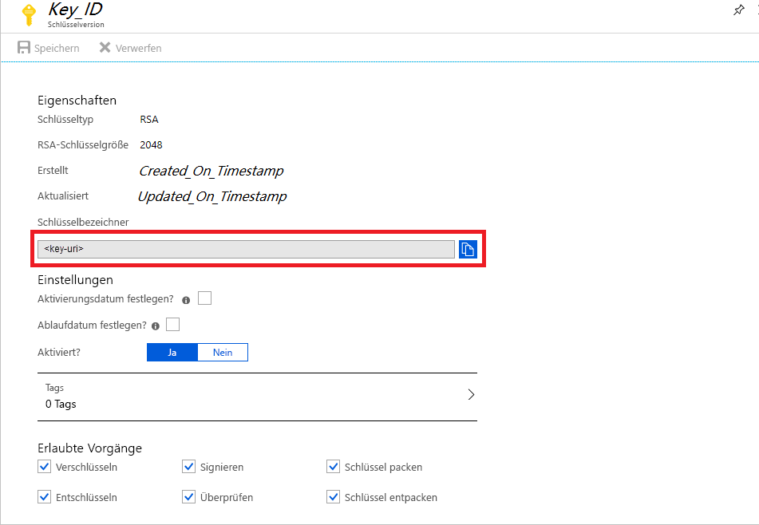
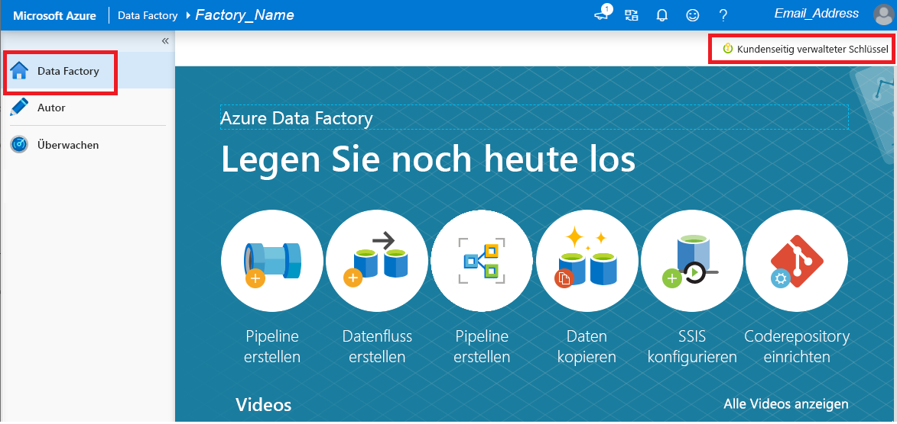

# Verschlüsseln von Azure Data Factory mit vom Kunden verwalteten Schlüsseln

[!INCLUDE[appliesto-adf-xxx-md](includes/appliesto-adf-xxx-md.md)]

Azure Data Factory verschlüsselt ruhende Daten (einschließlich Entitätsdefinitionen) und zwischengespeicherte Daten während der Ausführung von Vorgängen. Standardmäßig werden Daten mit einem zufällig generierten und von Microsoft verwalteten Schlüssel verschlüsselt, der Ihrer Data Factory eindeutig zugewiesen ist. Um zusätzliche Sicherheitsgarantien zu erhalten, können Sie jetzt Bring Your Own Key (BYOK) mit vom Kunden verwalteten Schlüsseln in Azure Data Factory aktivieren. Wenn Sie einen vom Kunden verwalteten Schlüssel angeben, verwendet Data Factory zum Verschlüsseln von Kundendaten __sowohl__ den Factory-Systemschlüssel als auch den vom Kunden verwalteten Schlüssel. Wenn einer der Schlüssel fehlt, wird der Zugriff auf die Daten und auf die Data Factory verweigert.

Zum Speichern von kundenseitig verwalteten Schlüsseln ist Azure Key Vault erforderlich. Sie können entweder Ihre eigenen Schlüssel erstellen und in einem Schlüsseltresor speichern oder mit den Azure Key Vault-APIs Schlüssel generieren. Der Schlüsseltresor und Data Factory müssen sich im selben Azure Active Directory-Mandanten (Azure AD-Mandanten) und in derselben Region befinden, aber sie können sich in verschiedenen Abonnements befinden. Weitere Informationen zum Azure-Schlüsseltresor finden Sie unter [Was ist der Azure-Schlüsseltresor?](../key-vault/general/overview.md)

> [!NOTE]
> Ein vom Kunden verwalteter Schlüssel kann nur für eine leere Data Factory konfiguriert werden. Die Data Factory darf keine Ressourcen wie z. B. verknüpfte Dienste, Pipelines und Datenflüsse enthalten. Es wird empfohlen, den vom Kunden verwalteten Schlüssel direkt nach der Erstellung der Factory zu aktivieren.

## Informationen zu kundenseitig verwalteten Schlüsseln

Im folgenden Diagramm ist dargestellt, wie Azure Active Directory und Azure Key Vault von Data Factory verwendet werden, um Anforderungen mit dem vom Kunden verwalteten Schlüssel zu senden:

  

In der folgenden Liste werden die nummerierten Schritte im Diagramm erläutert:

1. Ein Azure Key Vault-Administrator erteilt der verwalteten Identität, die der Data Factory zugeordnet ist, Berechtigungen für Verschlüsselungsschlüssel.
1. Ein Data Factory-Administrator aktiviert die Funktion für vom Kunden verwaltete Schlüssel in der Factory.
1. Data Factory verwendet die der Factory zugeordnete verwaltete Identität, um den Zugriff auf Azure Key Vault über Azure Active Directory zu authentifizieren.
1. Data Factory umschließt den Verschlüsselungsschlüssel der Factory mit dem Kundenschlüssel in Azure Key Vault.
1. Bei Lese-/Schreibvorgängen sendet Data Factory Anforderungen an Azure Key Vault, um die Umschließung für den Kontoverschlüsselungsschlüssel aufzuheben und so Verschlüsselungs- und Entschlüsselungsvorgänge durchzuführen.

## Voraussetzungen: Konfigurieren von Azure Key Vault und Generieren von Schlüsseln

### Aktivieren des vorläufigen Löschens und des Bereinigungsschutzes für Azure Key Vault

Wenn Sie vom Kunden verwaltete Schlüssel mit Data Factory verwenden, müssen Sie für den Schlüsseltresor zwei Eigenschaften (__Vorläufiges Löschen__ und __Nicht Bereinigen__) festlegen. Diese Eigenschaften können entweder mit PowerShell oder der Azure-Befehlszeilenschnittstelle (Azure CLI) für einen neuen oder vorhandenen Schlüsseltresor aktiviert werden. Informationen zum Aktivieren dieser Eigenschaften für einen vorhandenen Schlüsseltresor finden Sie in den Abschnitten _Aktivieren des vorläufigen Löschens_ und _Aktivieren des Bereinigungsschutzes_ in einem der folgenden Artikel:

- [Verwenden des vorläufigen Löschens mit PowerShell](../key-vault/general/soft-delete-powershell.md)
- [Verwenden des vorläufigen Löschens mit der CLI](../key-vault/general/soft-delete-cli.md)

Wenn Sie im Azure-Portal eine neue Azure Key Vault-Instanz erstellen, können __Vorläufiges Löschen__ und __Nicht bereinigen__ wie folgt aktiviert werden:

  

### Gewähren des Zugriffs auf Azure Key Vault durch Data Factory

Stellen Sie sicher, dass sich Azure Key Vault und Azure Data Factory im selben Azure Active Directory-Mandanten und in _derselben Region_ befinden. Erteilen Sie der verwalteten Dienstidentität (Managed Service Identity, MSI) der Data Factory über die Azure Key Vault-Zugriffssteuerung die folgenden Berechtigungen: _Abrufen_, _Schlüssel entpacken_ und _Schlüssel packen_. Diese Berechtigungen sind erforderlich, um vom Kunden verwaltete Schlüssel in Data Factory aktivieren zu können.

  

### Generieren oder Hochladen eines vom Kunden verwalteten Schlüssels in Azure Key Vault

Sie können entweder Ihre eigenen Schlüssel erstellen und in einem Schlüsseltresor speichern oder mit den Azure Key Vault-APIs Schlüssel generieren. Für die Data Factory-Verschlüsselung werden nur 2048-Bit-RSA-Schlüssel unterstützt. Weitere Informationen finden Sie im Artikel [Informationen zu Schlüsseln, Geheimnissen und Zertifikaten](../key-vault/general/about-keys-secrets-certificates.md).

  

## Aktivieren von vom Kunden verwalteten Schlüsseln

1. Stellen Sie sicher, dass die Data Factory leer ist. Die Data Factory darf keine Ressourcen wie z. B. verknüpfte Dienste, Pipelines und Datenflüsse enthalten. Derzeit führt das Bereitstellen eines vom Kunden verwalteten Schlüssels in einer nicht leeren Factory zu einem Fehler.

1. Um den Schlüssel-URI im Azure-Portal zu ermitteln, navigieren Sie zu Azure Key Vault, und wählen Sie die Einstellung „Schlüssel“ aus. Wählen Sie den gewünschten Schlüssel aus, und klicken Sie dann auf den Schlüssel, um dessen Versionen anzuzeigen. Wählen Sie eine Schlüsselversion aus, um die Einstellungen anzuzeigen.

1. Kopieren Sie den Wert im Feld „Schlüsselbezeichner“, das den URI enthält.

    

1. Starten Sie das Azure Data Factory-Portal, und wechseln Sie über die Navigationsleiste auf der linken Seite zum Data Factory-Verwaltungsportal.

1. Klicken Sie auf das Symbol __Vom Kunden verwalteter Schlüssel__.

    

1. Geben Sie den zuvor kopierten URI für den vom Kunden verwalteten Schlüssel ein.

1. Klicken Sie auf __Speichern__. Dann wird die vom Kunden verwaltete Schlüsselverschlüsselung für Data Factory aktiviert.

## Aktualisieren der Schlüsselversion

Wenn Sie eine neue Version eines Schlüssels erstellen, aktualisieren Sie die Data Factory, damit sie die neue Version verwendet. Führen Sie ähnliche Schritte aus, wie im Abschnitt _Aktivieren von vom Kunden verwalteten Schlüsseln_ beschrieben, einschließlich:

1. Ermitteln Sie den URI für die neue Schlüsselversion über das Azure Key Vault-Portal.

1. Navigieren Sie zur Einstellung __Vom Kunden verwalteter Schlüssel__.

1. Ersetzen Sie den URI für den neuen Schlüssel, indem Sie ihn einfügen.

1. Klicken Sie auf __Speichern__. Data Factory verschlüsselt jetzt mit der neuen Schlüsselversion.

## Verwenden eines anderen Schlüssels

Wenn Sie den für die Data Factory-Verschlüsselung verwendeten Schlüssel ändern möchten, müssen Sie die Einstellungen in Data Factory manuell aktualisieren. Führen Sie ähnliche Schritte aus, wie im Abschnitt _Aktivieren von vom Kunden verwalteten Schlüsseln_ beschrieben, einschließlich:

1. Ermitteln Sie den URI für den neuen Schlüssel über das Azure Key Vault-Portal.

1. Navigieren Sie zur Einstellung __Vom Kunden verwalteter Schlüssel__.

1. Ersetzen Sie den URI für den neuen Schlüssel, indem Sie ihn einfügen.

1. Klicken Sie auf __Speichern__. Data Factory verschlüsselt jetzt mit dem neuen Schlüssel.

## Deaktivieren der vom Kunden verwalteten Schlüssel

Nach der Aktivierung der Funktion für vom Kunden verwaltete Schlüssel können Sie den zusätzlichen Sicherheitsschritt nicht mehr entfernen. Zum Verschlüsseln der Factory und der Daten wird immer ein vom Kunden bereitgestellter Schlüssel erwartet.

## Nächste Schritte

Arbeiten Sie die [Tutorials](tutorial-copy-data-dot-net.md) durch, um zu erfahren, wie Sie Data Factory in anderen Szenarien verwenden können.
