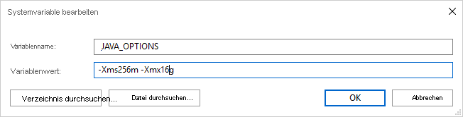

# <a name="orc-format-in-azure-data-factory"></a>ORC-Format in Azure Data Factory

[!INCLUDE[appliesto-adf-asa-md](includes/appliesto-adf-asa-md.md)]

Nutzen Sie diesen Artikel, wenn Sie die **ORC-Dateien analysieren oder Daten im ORC-Format schreiben** möchten. 

Das ORC-Format wird für folgende Connectors unterstützt: [Amazon S3](connector-amazon-simple-storage-service.md), [Azure Blob](connector-azure-blob-storage.md), [Azure Data Lake Storage Gen1](connector-azure-data-lake-store.md), [Azure Data Lake Storage Gen2](connector-azure-data-lake-storage.md), [Azure File Storage](connector-azure-file-storage.md), [Dateisystem](connector-file-system.md), [FTP](connector-ftp.md), [Google Cloud Storage](connector-google-cloud-storage.md), [HDFS](connector-hdfs.md), [HTTP](connector-http.md) und [SFTP](connector-sftp.md).

## <a name="dataset-properties"></a>Dataset-Eigenschaften

Eine vollständige Liste mit den Abschnitten und Eigenschaften, die zum Definieren von Datasets zur Verfügung stehen, finden Sie im Artikel zu [Datasets](concepts-datasets-linked-services.md). Dieser Abschnitt enthält eine Liste der Eigenschaften, die vom ORC-Dataset unterstützt werden.

| Eigenschaft         | BESCHREIBUNG                                                  | Erforderlich |
| ---------------- | ------------------------------------------------------------ | -------- |
| type             | Die type-Eigenschaft des Datasets muss auf **Orc** festgelegt werden. | Ja      |
| location         | Speicherorteinstellungen der Datei(en) Jeder dateibasierte Connector verfügt unter `location` über seinen eigenen Speicherorttyp und unterstützte Eigenschaften. **Informationen hierzu finden Sie im Abschnitt „Dataset-Eigenschaften“ des Artikels über Connectors**. | Ja      |
| compressionCodec         | Der Komprimierungscodec, der beim Schreiben in ORC-Dateien verwendet werden soll. Beim Lesen aus ORC-Dateien bestimmen Data Factorys den Codec für die Komprimierung automatisch anhand der Dateimetadaten.<br>Unterstützte Typen sind **none**, **zlib**, **snappy** (Standard) und **lzo**. Hinweis: LZO wird derzeit von der Kopieraktivität nicht für das Lesen/Schreiben von ORC-Dateien unterstützt. | Nein      |

Nachfolgend sehen Sie ein Beispiel für ein ORC-Dataset in Azure Blob Storage:

```json
{
    "name": "OrcDataset",
    "properties": {
        "type": "Orc",
        "linkedServiceName": {
            "referenceName": "<Azure Blob Storage linked service name>",
            "type": "LinkedServiceReference"
        },
        "schema": [ < physical schema, optional, retrievable during authoring > ],
        "typeProperties": {
            "location": {
                "type": "AzureBlobStorageLocation",
                "container": "containername",
                "folderPath": "folder/subfolder",
            }
        }
    }
}
```

Beachten Sie folgende Punkte:

* Komplexe Datentypen (z. B. MAP, LIST, STRUCT) werden derzeit nur in Datenflüssen, aber nicht in der Kopieraktivität unterstützt. Wenn Sie komplexe Typen in Datenflüssen verwenden möchten, importieren Sie das Dateischema nicht in das Dataset und lassen das Schema im Dataset leer. Importieren Sie dann die Projektion in die Quelltransformation.
* Ein Leerzeichen im Spaltennamen wird nicht unterstützt.

## <a name="copy-activity-properties"></a>Eigenschaften der Kopieraktivität

Eine vollständige Liste mit den Abschnitten und Eigenschaften zum Definieren von Aktivitäten finden Sie im Artikel [Pipelines](concepts-pipelines-activities.md). Dieser Abschnitt enthält eine Liste der Eigenschaften, die von der ORC-Quelle und -Senke unterstützt werden.

### <a name="orc-as-source"></a>ORC als Quelle

Die folgenden Eigenschaften werden im Abschnitt ***\*source\**** der Kopieraktivität unterstützt.

| Eigenschaft      | BESCHREIBUNG                                                  | Erforderlich |
| ------------- | ------------------------------------------------------------ | -------- |
| type          | Die type-Eigenschaft der Quelle der Kopieraktivität muss auf **OrcSource** festgelegt werden. | Ja      |
| storeSettings | Eine Gruppe von Eigenschaften für das Lesen von Daten aus einem Datenspeicher. Jeder dateibasierte Connector verfügt unter `storeSettings` über eigene unterstützte Leseeinstellungen. **Informationen hierzu finden Sie im Abschnitt über die Eigenschaften der Kopieraktivität im Artikel über Connectors**. | Nein       |

### <a name="orc-as-sink"></a>ORC als Senke

Die folgenden Eigenschaften werden im Abschnitt ***\*sink\**** der Kopieraktivität unterstützt:

| Eigenschaft      | BESCHREIBUNG                                                  | Erforderlich |
| ------------- | ------------------------------------------------------------ | -------- |
| type          | Die type-Eigenschaft der Senke der Kopieraktivität muss auf **OrcSink** festgelegt werden. | Ja      |
| formatSettings | Eine Gruppe von Eigenschaften. Weitere Informationen zu **ORC-Schreibeinstellungen** finden Sie in der Tabelle unten. |    Nein      |
| storeSettings | Eine Gruppe von Eigenschaften für das Schreiben von Daten in einen Datenspeicher. Jeder dateibasierte Connector verfügt unter `storeSettings` über eigene unterstützte Schreibeinstellungen. **Informationen hierzu finden Sie im Abschnitt über die Eigenschaften der Kopieraktivität im Artikel über Connectors**. | Nein       |

Unterstützte **ORC-Schreibeinstellungen** unter `formatSettings`:

| Eigenschaft      | BESCHREIBUNG                                                  | Erforderlich                                              |
| ------------- | ------------------------------------------------------------ | ----------------------------------------------------- |
| Typ          | Der Typ von „formatSettings“ muss auf **OrcWriteSettings** festgelegt werden. | Ja                                                   |
| maxRowsPerFile | Wenn Sie Daten in einen Ordner schreiben, können Sie in mehrere Dateien zu schreiben und die maximale Anzahl von Zeilen pro Datei angeben.  | Nein |
| fileNamePrefix | Gilt, wenn `maxRowsPerFile` konfiguriert ist.<br> Geben Sie das Dateinamenpräfix beim Schreiben von Daten in mehrere Dateien an, das zu diesem Muster führt: `<fileNamePrefix>_00000.<fileExtension>`. Wenn keine Angabe erfolgt, wird das Dateinamenpräfix automatisch generiert. Diese Eigenschaft findet keine Anwendung, wenn die Quelle ein dateibasierter Speicher oder ein [Datenspeicher mit aktivierter Partitionsoption](copy-activity-performance-features.md) ist.  | Nein |

## <a name="mapping-data-flow-properties"></a>Eigenschaften von Mapping Data Flow

Bei Zuordnungsdatenflüssen können Sie in den folgenden Datenspeichern das ORC-Format lesen und schreiben: [Azure Blob Storage](connector-azure-blob-storage.md#mapping-data-flow-properties), [Azure Data Lake Storage Gen1](connector-azure-data-lake-store.md#mapping-data-flow-properties) und [Azure Data Lake Storage Gen2](connector-azure-data-lake-storage.md#mapping-data-flow-properties).

Sie können auf ORC-Dateien mit einem ORC-Dataset oder einem [Inlinedataset](data-flow-source.md#inline-datasets) verweisen.

### <a name="source-properties"></a>Quelleigenschaften

In der folgenden Tabelle sind die von einer ORC-Quelle unterstützten Eigenschaften aufgeführt. Sie können diese Eigenschaften auf der Registerkarte **Quelloptionen** bearbeiten.

Bei Verwendung eines Inlinedatasets werden zusätzliche Dateieinstellungen angezeigt. Diese entsprechen den Eigenschaften, die im Abschnitt zu den [Dataseteigenschaften](#dataset-properties) beschrieben sind.

| Name | BESCHREIBUNG | Erforderlich | Zulässige Werte | Datenflussskript-Eigenschaft |
| ---- | ----------- | -------- | -------------- | ---------------- |
| Format | Das Format muss `orc` sein | ja | `orc` | format |
| Platzhalterpfade | Alle Dateien, die dem Platzhalterpfad entsprechen, werden verarbeitet. Überschreibt den Ordner und den Dateipfad, die im Dataset festgelegt sind. | nein | String[] | wildcardPaths |
| Partitionsstammpfad | Für partitionierte Dateidaten können Sie einen Partitionsstammpfad eingeben, um partitionierte Ordner als Spalten zu lesen. | nein | String | partitionRootPath |
| Liste mit den Dateien | Gibt an, ob Ihre Quelle auf eine Textdatei verweist, in der die zu verarbeitenden Dateien aufgelistet sind. | nein | `true` oder `false` | fileList |
| Spalte, in der der Dateiname gespeichert wird | Erstellt eine neue Spalte mit dem Namen und Pfad der Quelldatei. | nein | String | rowUrlColumn |
| Nach Abschluss | Löscht oder verschiebt die Dateien nach der Verarbeitung. Dateipfad beginnt mit dem Containerstamm | nein | Löschen: `true` oder `false` <br> Verschieben: `[<from>, <to>]` | purgeFiles <br> moveFiles |
| Nach der letzten Änderung filtern | Filtern Sie Dateien nach dem Zeitpunkt ihrer letzten Änderung. | nein | Timestamp | modifiedAfter <br> modifiedBefore |
| Finden keiner Dateien zulässig | „true“ gibt an, dass kein Fehler ausgelöst wird, wenn keine Dateien gefunden werden. | nein | `true` oder `false` | ignoreNoFilesFound |

### <a name="source-example"></a>Quellbeispiel

Das zugehörige Datenflussskript einer ORC-Quellkonfiguration lautet wie folgt:

```
source(allowSchemaDrift: true,
    validateSchema: false,
    rowUrlColumn: 'fileName',
    format: 'orc') ~> OrcSource
```

### <a name="sink-properties"></a>Senkeneigenschaften

In der folgenden Tabelle sind die von einer ORC-Senke unterstützten Eigenschaften aufgeführt. Sie können diese Eigenschaften auf der Registerkarte **Einstellungen** bearbeiten.

Bei Verwendung eines Inlinedatasets werden zusätzliche Dateieinstellungen angezeigt. Diese entsprechen den Eigenschaften, die im Abschnitt zu den [Dataseteigenschaften](#dataset-properties) beschrieben sind.

| Name | BESCHREIBUNG | Erforderlich | Zulässige Werte | Datenflussskript-Eigenschaft |
| ---- | ----------- | -------- | -------------- | ---------------- |
| Format | Das Format muss `orc` sein | ja | `orc` | format |
| Ordner löschen | Wenn der Zielordner vor dem Schreiben gelöscht wird. | nein | `true` oder `false` | truncate |
| Dateinamenoption | Das Namensformat der geschriebenen Daten. Standardmäßig eine Datei pro Partition im Format `part-#####-tid-<guid>`. | nein | Muster: String <br> Pro Partition: String[] <br> Wie Daten in Spalte: String <br> Ausgabe in eine einzelne Datei: `['<fileName>']` | filePattern <br> partitionFileNames <br> rowUrlColumn <br> partitionFileNames |

### <a name="sink-example"></a>Senkenbeispiel

Das zugehörige Datenflussskript einer ORC-Senkenkonfiguration lautet wie folgt:

```
OrcSource sink(
    format: 'orc',
    filePattern:'output[n].orc',
    truncate: true,
    allowSchemaDrift: true,
    validateSchema: false,
    skipDuplicateMapInputs: true,
    skipDuplicateMapOutputs: true) ~> OrcSink
```

## <a name="using-self-hosted-integration-runtime"></a>Verwendung der selbstgehosteten Integration Runtime

> [!IMPORTANT]
> Wenn Sie ORC-Dateien bei Kopiervorgängen mithilfe einer selbstgehosteten Integration Runtime (etwa zwischen lokalen Datenspeichern und der Cloud) nicht **unverändert** kopieren, müssen Sie auf Ihrem IR-Computer die **64-Bit-Version der JRE 8 (Java Runtime Environment) oder OpenJDK** sowie **Microsoft Visual C++ 2010 Redistributable Package** installieren. Weitere Details finden Sie im nächsten Absatz.

Für Kopiervorgänge in der selbstgehosteten Integration Runtime mit Serialisierung/Deserialisierung von ORC-Dateien sucht ADF die Java Runtime Environment, indem es zunächst die Registrierung *`(SOFTWARE\JavaSoft\Java Runtime Environment\{Current Version}\JavaHome)`* auf JRE überprüft. Wird diese nicht gefunden, wird im nächsten Versuch die Systemvariable *`JAVA_HOME`* auf OpenJDK überprüft.

- **Für JRE:** Die 64-Bit-Integration Runtime erfordert die 64-Bit-JRE. Diese steht [hier](https://go.microsoft.com/fwlink/?LinkId=808605) zur Verfügung.
- **Für OpenJDK:** Die Unterstützung ist seit der IR-Version 3.13 verfügbar. Packen Sie die Datei „jvm.dll“ zusammen mit allen anderen erforderlichen OpenJDK-Assemblys in einem selbstgehosteten IR-Computer, und legen Sie die Umgebungsvariable JAVA_HOME des Systems entsprechend fest.
- **So installieren Sie Microsoft Visual C++ 2010 Redistributable Package:** Visual C++ 2010 Redistributable Package ist bei Installationen mit selbstgehosteter Integration Runtime nicht installiert. Diese steht [hier](https://www.microsoft.com/download/details.aspx?id=14632) zur Verfügung.

> [!TIP]
> Wenn Sie Daten mit der selbstgehosteten Integration Runtime in das/aus dem ORC-Format kopieren und ein Fehler mit dem Text „Fehler beim Aufrufen von Java, Meldung: **java.lang.OutOfMemoryError:Java-Heapspeicher**“ auftritt, können Sie auf dem Computer, auf dem sich die selbstgehostete IR befindet, eine Umgebungsvariable `_JAVA_OPTIONS` hinzufügen, um die min./max. Heapgröße für JVM anzupassen, sodass eine solche Kopie möglich ist, und dann die Pipeline erneut ausführen.



Beispiel: Legen Sie für die Variable `_JAVA_OPTIONS` den Wert `-Xms256m -Xmx16g` fest. Das Flag `Xms` gibt den anfänglichen Speicherzuweisungspool für eine Java Virtual Machine (JVM) an, während `Xmx` den maximalen Speicherzuweisungspool angibt. Das bedeutet, dass die JVM mit einer Speichergröße von `Xms` gestartet wird und eine maximale Speichergröße von `Xmx` verwenden kann. Standardmäßig verwendet ADF zwischen 64 MB und 1 GB.

## <a name="next-steps"></a>Nächste Schritte

- [Kopieraktivität – Übersicht](copy-activity-overview.md)
- [Lookup-Aktivität](control-flow-lookup-activity.md)
- [GetMetadata-Aktivität](control-flow-get-metadata-activity.md)
