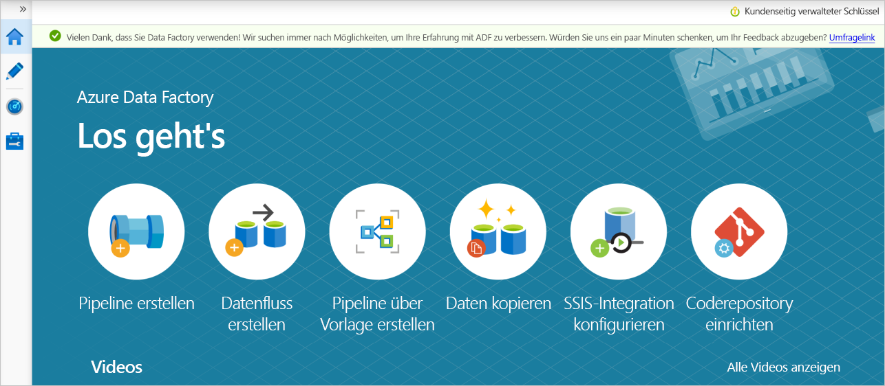

# <a name="transform-data-securely-by-using-mapping-data-flow"></a>Sicheres Transformieren von Daten mithilfe von Zuordnungsdatenflüssen

[!INCLUDE[appliesto-adf-xxx-md](includes/appliesto-adf-xxx-md.md)]

Falls Sie noch nicht mit Azure Data Factory vertraut sind, ist es ratsam, den Artikel [Einführung in Azure Data Factory](https://docs.microsoft.com/azure/data-factory/introduction) zu lesen.

In diesem Tutorial erstellen Sie auf der Benutzeroberfläche von Data Factory eine Pipeline, die Daten *aus einer Azure Data Lake Storage Gen2-Quelle in eine Data Lake Storage Gen2-Senke kopiert und transformiert (wobei beide den Zugriff nur auf ausgewählte Netzwerke erlauben)* , indem in einem von [Data Factory verwalteten virtuellen Netzwerk](managed-virtual-network-private-endpoint.md) der Zuordnungsdatenfluss verwendet wird. Sie können das Konfigurationsmuster in diesem Tutorial erweitern, wenn Sie Daten mithilfe des Zuordnungsdatenflusses transformieren.

In diesem Tutorial führen Sie die folgenden Schritte aus:

> [!div class="checklist"]
>
> * Erstellen einer Data Factory
> * Erstellen einer Pipeline mit einer Datenflussaktivität
> * Erstellen einer Mapping Data Flow-Funktion mit vier Transformationen
> * Ausführen eines Testlaufs für die Pipeline
> * Überwachen einer Datenflussaktivität

## <a name="prerequisites"></a>Voraussetzungen
* **Azure-Abonnement**. Wenn Sie über kein Azure-Abonnement verfügen, können Sie ein [kostenloses Azure-Konto](https://azure.microsoft.com/free/) erstellen, bevor Sie beginnen.
* **Azure-Speicherkonto**. Sie verwenden Data Lake Storage als *Quell-* und *Senkendatenspeicher*. Wenn Sie kein Speicherkonto besitzen, finden Sie unter [Informationen zu Azure-Speicherkonten](https://docs.microsoft.com/azure/storage/common/storage-account-create?tabs=azure-portal) Schritte zum Erstellen eines solchen Kontos. *Stellen Sie sicher, dass das Speicherkonto nur den Zugriff aus ausgewählten Netzwerken zulässt.* 

Die Datei, die wir in diesem Tutorial transformieren, heißt „moviesDB.csv“, die auf dieser [GitHub-Inhaltswebsite](https://raw.githubusercontent.com/djpmsft/adf-ready-demo/master/moviesDB.csv) zu finden ist. Zum Abrufen der Datei aus GitHub kopieren Sie den Inhalt in einen Text-Editor Ihrer Wahl und speichern ihn lokal als CSV-Datei. Wenn Sie die Datei in Ihr Speicherkonto hochladen möchten, finden Sie Informationen dazu unter [Hochladen von Blobs mit dem Azure-Portal](https://docs.microsoft.com/azure/storage/blobs/storage-quickstart-blobs-portal). In den Beispielen wird auf einen Container mit dem Namen **sample-data** verwiesen.

## <a name="create-a-data-factory"></a>Erstellen einer Data Factory

In diesem Schritt erstellen Sie eine Data Factory und öffnen die Data Factory-Benutzeroberfläche, um eine Pipeline in der Data Factory zu erstellen.

1. Öffnen Sie Microsoft Edge oder Google Chrome. Die Data Factory-Benutzeroberfläche wird derzeit nur in den Webbrowsern Microsoft Edge und Google Chrome unterstützt.
1. Klicken Sie im Menü auf der linken Seite auf **Ressource erstellen** > **Analytics** > **Data Factory**.
1. Geben Sie auf der Seite **Neue Data Factory** unter **Name** den Namen **ADFTutorialDataFactory** ein.

   Der Name der Data Factory muss *global eindeutig* sein. Wenn eine Fehlermeldung zum Namenswert angezeigt wird, geben Sie einen anderen Namen für die Data Factory ein (z. B. IhrNameADFTutorialDataFactory). Benennungsregeln für Data Factory-Artefakte finden Sie im Thema [Azure Data Factory – Benennungsregeln](naming-rules.md).

1. Wählen Sie das **Azure-Abonnement** aus, in dem die Data Factory erstellt werden soll.
1. Führen Sie unter **Ressourcengruppe** einen der folgenden Schritte aus:

    * Wählen Sie die Option **Use existing**(Vorhandene verwenden) und dann in der Dropdownliste eine vorhandene Ressourcengruppe.
    * Wählen Sie **Neu erstellen**, und geben Sie den Namen einer Ressourcengruppe ein. 
         
    Weitere Informationen zu Ressourcengruppen finden Sie unter [Verwenden von Ressourcengruppen zum Verwalten von Azure-Ressourcen](../azure-resource-manager/management/overview.md). 
1. Wählen Sie unter **Version** die Option **V2**.
1. Wählen Sie unter **Standort** einen Standort für die Data Factory aus. In der Dropdownliste werden nur unterstützte Standorte angezeigt. Datenspeicher (etwa Azure Storage und Azure SQL-Datenbank) und Computes (etwa Azure HDInsight), die von der Data Factory genutzt werden, können sich in anderen Regionen befinden.

1. Klicken Sie auf **Erstellen**.
1. Nach Abschluss der Erstellung wird der Hinweis im Benachrichtigungscenter angezeigt. Wählen Sie **Zu Ressource wechseln** aus, um zur Seite **Data Factory** zu navigieren.
1. Klicken Sie auf **Erstellen und überwachen**, um die Data Factory-Benutzeroberfläche auf einer separaten Registerkarte zu starten.

## <a name="create-an-azure-ir-in-data-factory-managed-virtual-network"></a>Erstellen einer Azure Integration Runtime-Instanz in vom Data Factory verwalteten virtuellen Netzwerk
In diesem Schritt erstellen Sie eine Azure Integration Runtime-Instanz und aktivieren ein von Data Factory verwaltetes virtuelles Netzwerk.

1. Navigieren Sie im Data Factory-Portal zu **Verwalten**, und wählen Sie **Neu** aus, um eine neue Azure Integration Runtime-Instanz zu erstellen.

   
1. Wählen Sie die Option **Azure Integration Runtime** aus.

   

1. Wählen Sie unter **Konfiguration des virtuellen Netzwerks (Vorschau)** die Option **Aktivieren** aus.

   

1. Klicken Sie auf **Erstellen**.

## <a name="create-a-pipeline-with-a-data-flow-activity"></a>Erstellen einer Pipeline mit einer Datenflussaktivität

In diesem Schritt erstellen Sie eine Pipeline mit einer Datenflussaktivität.

1. Wählen Sie auf der Seite **Erste Schritte** die Option **Pipeline erstellen** aus.

   

1. Geben Sie im Bereich „Eigenschaften“ der Pipeline als ihren Namen **TransformMovies** ein.
1. Legen Sie auf der oberen Leiste der Data Factory den Schieberegler **Datenfluss debuggen** auf „Ein“ fest. Der Debugmodus ermöglicht das interaktive Testen von Transformationslogik mit einem aktiven Spark-Cluster. Das Aufwärmen von Datenflussclustern dauert 5 bis 7 Minuten. Aktivieren Sie **Datenfluss debuggen** zuerst, wenn Sie beabsichtigen, eine Datenflussentwicklung zu planen. Weitere Informationen finden Sie unter [Debugmodus](https://docs.microsoft.com/azure/data-factory/concepts-data-flow-debug-mode).

    
1. Klappen Sie im Bereich **Aktivitäten** das Element **Verschieben und transformieren** auf. Ziehen Sie die Aktivität **Datenfluss** per Drag & Drop aus dem Bereich auf die Canvas der Pipeline.

1. Wählen Sie im Popupfenster **Datenfluss hinzufügen** die Option **Neuen Datenfluss erstellen** und dann **Zuordnungsdatenfluss** aus. Wählen Sie **OK** aus, wenn Sie fertig sind.

    

1. Geben Sie Ihrem Datenfluss im Bereich „Eigenschaften“ den Namen **TransformMovies**.

## <a name="build-transformation-logic-in-the-data-flow-canvas"></a>Erstellen von Transformationslogik auf der Datenflusscanvas

Nachdem Sie den Datenfluss erstellt haben, werden Sie automatisch zur Datenflusscanvas geleitet. In diesem Schritt erstellen Sie einen Datenfluss, der die Datei „moviesDB.csv“ aus Data Lake Storage abruft und die durchschnittliche Bewertung von Komödien von 1910 bis 2000 aggregiert. Anschließend schreiben Sie diese Datei zurück in Data Lake Storage.

### <a name="add-the-source-transformation"></a>Hinzufügen der Quelltransformation

In diesem Schritt richten Sie Data Lake Storage Gen2 als Quelle ein.

1. Fügen Sie auf der Datenflusscanvas eine Quelle hinzu, indem Sie das Feld **Quelle hinzufügen** auswählen.

1. Geben Sie der Quelle den Namen **MoviesDB**. Wählen Sie **Neu** aus, um ein neues Quelldataset zu erstellen.

1. Wählen Sie **Azure Data Lake Storage Gen2** und dann **Weiter** aus.

1. Wählen Sie **DelimitedText** und dann **Weiter** aus.

1. Geben Sie dem Dataset den Namen **MoviesDB**. Wählen Sie in der Dropdownliste „Verknüpfter Dienst“ **Neu** aus.

1. Geben Sie auf dem Bildschirm zum Erstellen eines verknüpften Diensts dem verknüpften Data Lake Storage Gen2-Dienst den Namen **ADLSGen2** und die Authentifizierungsmethode an. Dann geben Sie Ihre Verbindungsanmeldeinformationen ein. In diesem Tutorial wird **Kontoschlüssel** zum Herstellen einer Verbindung mit dem Speicherkonto verwendet. 

1. Aktivieren Sie unbedingt **Interaktive Erstellung**. Die Aktivierung kann ungefähr 1 Minute dauern.

    

1. Klicken Sie auf **Verbindung testen**. Es sollte ein Verbindungsfehler auftreten, weil  ohne Erstellung und Genehmigung eines privaten Endpunkts nicht auf das Speicherkonto zugegriffen werden kann. In der Fehlermeldung sollte ein Link zum Erstellen eines privaten Endpunkts angezeigt werden, dem Sie folgen können, um einen verwalteten privaten Endpunkt zu erstellen. Alternativ dazu können Sie direkt zur Registerkarte **Verwalten** navigieren und die Anweisungen in diesem [Abschnitt](#create-a-managed-private-endpoint) befolgen, um einen verwalteten privaten Endpunkt zu erstellen.

1. Lassen Sie das Dialogfeld geöffnet, und navigieren Sie dann zu Ihrem Speicherkonto.

1. Befolgen Sie die Anweisungen in [diesem Abschnitt](#approval-of-a-private-link-in-a-storage-account), um die private Verbindung zu genehmigen.

1. Gehen Sie zurück zum Dialogfeld. Wählen Sie erneut **Verbindung testen** und anschließend **Erstellen** aus, um den verknüpften Dienst bereitzustellen.

1. Geben Sie auf dem Bildschirm zum Erstellen von Datasets unter dem Feld **Dateipfad** den Speicherort Ihrer Datei ein. In diesem Tutorial befindet sich die Datei „moviesDB.csv“ im Container **sample-data**. Da die Datei Kopfzeilen enthält, aktivieren Sie das Kontrollkästchen **Erste Zeile als Kopfzeile**. Wählen Sie **Aus Verbindung/Speicher** aus, um das Headerschema direkt aus der Datei in den Speicher zu importieren. Wählen Sie **OK** aus, wenn Sie fertig sind.

    

1. Nachdem Ihr Debugcluster gestartet wurde, wechseln Sie zur Registerkarte **Datenvorschau** der Quelltransformation, und wählen Sie **Aktualisieren** aus, um eine Momentaufnahme der Daten zu erhalten. Mithilfe der Datenvorschau können Sie überprüfen, ob die Transformation ordnungsgemäß konfiguriert ist.

    

#### <a name="create-a-managed-private-endpoint"></a>Erstellen eines verwalteten privaten Endpunkts

Wenn Sie beim Testen der vorhergehenden Verbindung nicht den Link ausgewählt haben, folgen Sie dem Pfad. Jetzt müssen Sie einen verwalteten privaten Endpunkt erstellen, den Sie mit dem erstellten verknüpften Dienst verbinden.

1. Wechseln Sie zur Registerkarte **Verwalten**.

   > [!NOTE]
   > Die Registerkarte **Verwalten** ist möglicherweise nicht für alle Data Factory-Instanzen verfügbar. Wenn Sie diese Option nicht sehen, können Sie auf private Endpunkte zugreifen, indem Sie **Autor** > **Verbindungen** > **Privater Endpunkt** auswählen.

1. Navigieren Sie zum Abschnitt **Verwaltete private Endpunkte**.
1. Wählen Sie unter **Verwaltete private Endpunkte** die Option **+ Neu** aus.

     

1. Wählen Sie in der Liste die Kachel **Azure Data Lake Storage Gen2** und dann **Weiter** aus.
1. Geben Sie den Namen des von Ihnen erstellten Speicherkontos ein.
1. Klicken Sie auf **Erstellen**.
1. Nach einigen Sekunden sollten Sie sehen, dass für die erstellte Private Link-Instanz eine Genehmigung erforderlich ist.
1. Wählen Sie den zuvor erstellten privaten Endpunkt aus. Ein Link wird angezeigt, über den Sie den privaten Endpunkt auf Speicherkontoebene genehmigen können.

     

#### <a name="approval-of-a-private-link-in-a-storage-account"></a>Genehmigung einer Private Link-Instanz in einem Speicherkonto

1. Navigieren Sie im Speicherkonto im Abschnitt **Einstellungen** zu **Verbindungen mit privatem Endpunkt**.

1. Aktivieren Sie das Kontrollkästchen für den privaten Endpunkt, den Sie oben erstellt haben, und wählen Sie **Genehmigen** aus.

    

1. Fügen Sie eine Beschreibung hinzu, und wählen Sie **Ja** aus.
1. Gehen Sie in Data Factory auf der Registerkarte **Verwalten** zurück zum Abschnitt **Verwaltete private Endpunkte**.
1. Nach ca. einer Minute sollten Sie die erteilte Genehmigung für Ihren privaten Endpunkt sehen.

### <a name="add-the-filter-transformation"></a>Hinzufügen der Filtertransformation

1. Wählen Sie auf der Datenflusscanvas neben dem Quellknoten das Pluszeichen aus, um eine neue Transformation hinzuzufügen. Als erste Transformation fügen Sie einen **Filter** hinzu.

    
1. Geben Sie der Filtertransformation den Namen **FilterYears**. Wählen Sie auf das Ausdrucksfeld neben **Filtern nach** aus, um den Ausdrucks-Generator zu öffnen. Hier geben Sie dann die Filterbedingung an.

    
1. Mit dem Datenfluss-Ausdrucks-Generator können Sie Ausdrücke interaktiv erstellen, die dann in verschiedenen Transformationen verwendet werden können. Ausdrücke können integrierte Funktionen, Spalten aus dem Eingabeschema und benutzerdefinierte Parameter enthalten. Weitere Informationen zum Erstellen von Ausdrücken finden Sie unter [Erstellen von Ausdrücken im Zuordnungsdatenfluss](https://docs.microsoft.com/azure/data-factory/concepts-data-flow-expression-builder).

    * In diesem Tutorial möchten Sie Filme des Genres „Komödie“ filtern, die von 1910 bis 2000 entstanden sind. Da die Jahresangabe derzeit eine Zeichenfolge ist, müssen Sie sie mithilfe der Funktion ```toInteger()``` in eine ganze Zahl konvertieren. Verwenden Sie die Operatoren „Größer oder gleich (>=)“ und „Kleiner oder gleich (<=)“ für einen Vergleich mit den Literalwerten für die Jahre 1910 und 2000. Verbinden Sie diese Ausdrücke mit dem Und-Operator (&&). Der Ausdruck sieht wie folgt aus:

        ```toInteger(year) >= 1910 && toInteger(year) <= 2000```

    * Um zu ermitteln, welche Filme Komödien sind, können Sie mithilfe der Funktion ```rlike()``` in der Spalte „genres“ nach dem Muster „Comedy“ suchen. Verbinden Sie den rlike-Ausdruck mit dem Jahresvergleich, um Folgendes zu erhalten:

        ```toInteger(year) >= 1910 && toInteger(year) <= 2000 && rlike(genres, 'Comedy')```

    * Wenn ein Debugcluster aktiv ist, können Sie die Logik überprüfen. Wählen Sie dazu **Aktualisieren** aus, um die Ausdrucksausgabe im Vergleich zu den verwendeten Eingaben anzuzeigen. Es gibt mehrere Möglichkeiten, wie Sie diese Logik mithilfe der Ausdruckssprache für Datenflüsse erzielen können.

        

    * Wählen Sie **Speichern und beenden** aus, nachdem Sie den Ausdruck fertig gestellt haben.

1. Rufen Sie eine **Datenvorschau** ab, um zu überprüfen, ob der Filter ordnungsgemäß funktioniert.

    

### <a name="add-the-aggregate-transformation"></a>Hinzufügen der Transformation für das Aggregieren

1. Als nächste Transformation fügen Sie eine **Aggregat**-Transformation unter **Schemamodifizierer** hinzu.

    
1. Geben Sie der Aggregattransformation den Namen **AggregateComedyRating**. Wählen Sie auf der Registerkarte **Gruppieren nach** in der Dropdownliste **year** aus, um die Aggregationen nach dem Jahr zu gruppieren, in dem der Film in die Kinos kam.

    
1. Wechseln Sie zur Registerkarte **Aggregate**. Geben Sie im linken Textfeld der Aggregatspalte den Namen **AverageComedyRating**. Wählen Sie das rechte Ausdrucksfeld aus, um den Aggregatausdruck über den Ausdrucks-Generator einzugeben.

    
1. Verwenden Sie die Aggregatfunktion ```avg()```, um den Durchschnitt der Spalte **Rating** zu erhalten. Da **Rating** eine Zeichenfolge ist und ```avg()``` eine numerische Eingabe benötigt, muss der Wert über die Funktion ```toInteger()``` in eine Zahl konvertiert werden. Dieser Ausdruck sieht wie folgt aus:

    ```avg(toInteger(Rating))```

1. Wählen Sie **Speichern und beenden** aus, wenn Sie fertig sind.

    
1. Wechseln Sie zur Registerkarte **Datenvorschau**, um die Transformationsausgabe anzuzeigen. Es sind nur zwei Spalten vorhanden: **year** und **AverageComedyRating**.

### <a name="add-the-sink-transformation"></a>Hinzufügen der Senkentransformation

1. Als Nächstes fügen Sie eine Transformation vom Typ **Senke** unter **Ziel** hinzu.

    
1. Geben Sie der Senke den Namen **Sink**. Wählen Sie **Neu** aus, um das Senkendataset zu erstellen.

    
1. Wählen Sie auf der Seite **Neues Dataset** die Option **Azure Data Lake Storage Gen2** und dann **Weiter** aus.

1. Wählen Sie auf der Seite **Format auswählen** die Option **DelimitedText** und dann **Weiter** aus.

1. Geben Sie dem Senkendataset den Namen **MoviesSink**. Wählen Sie als verknüpften Dienst denselben verknüpften Dienst **ADLSGen2** aus, den Sie für die Quelltransformation erstellt haben. Geben Sie einen Ausgabeordner ein, in den die Daten geschrieben werden sollen. In diesem Tutorial werden Daten in den Ordner **output** im Container **sample-data** geschrieben. Der Ordner muss nicht vorab vorhanden sein und kann dynamisch erstellt werden. Aktivieren Sie das Kontrollkästchen **Erste Zeile als Kopfzeile**, und wählen Sie **Kein** für **Schema importieren** aus. Klicken Sie auf **OK**.

    

Sie haben nun die Erstellung des Datenflusses beendet. Jetzt können Sie ihn in ihrer Pipeline ausführen.

## <a name="run-and-monitor-the-data-flow"></a>Ausführen und Überwachen des Datenflusses

Sie können eine Pipeline vor der Veröffentlichung debuggen. In diesem Schritt lösen Sie eine Debugausführung der Datenflusspipeline aus. Während bei der Datenvorschau keine Daten geschrieben werden, werden bei einer Debugausführung Daten in das Senkenziel geschrieben.

1. Wechseln Sie zur Pipelinecanvas. Klicken Sie auf **Debuggen**, um eine Debugausführung auszulösen.

1. Für das Debuggen der Pipeline von Datenflussaktivitäten wird der aktive Debugcluster verwendet. Allerdings dauert die Initialisierung mindestens eine Minute. Sie können den Fortschritt über die Registerkarte **Ausgabe** verfolgen. Wählen Sie nach erfolgreicher Ausführung das Brillensymbol aus, um Ausführungsdetails anzuzeigen.

1. Auf der Detailseite werden die Anzahl der Zeilen und Dauer der einzelnen Transformationsschritte angezeigt.

    
1. Wählen Sie eine Transformation aus, um ausführliche Informationen über die Spalten und Partitionierung der Daten zu erhalten.

Wenn Sie dieses Tutorial richtig durchgeführt haben, sollten 83 Zeilen und 2 Spalten in den Senkenordner geschrieben worden sein. Sie können sich von der Richtigkeit der Daten überzeugen, indem Sie den Blobspeicher überprüfen.

## <a name="summary"></a>Zusammenfassung

In diesem Tutorial haben Sie auf der Benutzeroberfläche von Data Factory eine Pipeline erstellt, die Daten aus einer Azure Data Lake Storage Gen2-Quelle in eine Data Lake Storage Gen2-Senke kopiert und transformiert (wobei beide den Zugriff nur auf ausgewählte Netzwerke erlauben), indem in einem von [Data Factory verwalteten virtuellen Netzwerk](managed-virtual-network-private-endpoint.md) der Zuordnungsdatenfluss verwendet wird.
