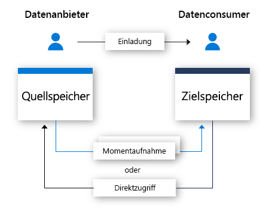

# Was ist Azure Data Share?

Heutzutage werden Daten als wichtige strategische Ressource angesehen, die von vielen Organisationen auf einfache und sichere Weise für Kunden und Partner freigegeben werden müssen. Es gibt viele Möglichkeiten, wie Kunden dies heutzutage durchführen, z. B. per FTP, E-Mail oder API, um nur einige zu nennen. Es kann leicht passieren, dass Organisationen den Überblick darüber verlieren, für wen Daten freigegeben wurden. Das Freigeben von Daten per FTP oder durch die Einrichtung einer eigenen API-Infrastruktur ist häufig mit hohen Kosten für die Bereitstellung und Verwaltung verbunden. Wenn diese Freigabemethoden in größerem Umfang angewendet werden, kommt es zu einem Mehraufwand bei der Verwaltung. 

Viele Organisationen sind für die von ihnen freigegebenen Daten verantwortlich, und sie müssen der Organisation zurechenbar sein. Zusätzlich zur Sicherstellung der Zurechenbarkeit möchten viele Organisationen ihre gesamte Datenfreigabe auch leicht steuern, verwalten und überwachen können. In der heutigen Welt, in der in Bezug auf die Datennutzung ein weiterer exponentieller Anstieg zu erwarten ist, benötigen Organisationen eine einfache Möglichkeit zum Freigeben großer Datenmengen. Kunden fordern Daten, die immer auf dem aktuellen Stand sind, um sicher zu sein, dass Erkenntnisse ohne Zeitverlust gewonnen werden können.

Mit Azure Data Share können Organisationen Daten für viele Kunden und Partner auf einfache und sichere Weise freigeben. Mit nur wenigen Klicks können Sie ein neues Konto für die Datenfreigabe bereitstellen, Datasets hinzufügen und Kunden und Partner für Ihre Datenfreigabe einladen. Datenanbieter haben jederzeit die Kontrolle über die Daten, die sie freigegeben haben. Mit Azure Data Share können Sie leicht verwalten und überwachen, welche Daten zu welchem Zeitpunkt und von wem freigegeben wurden. 

Ein Datenanbieter kann steuern, wie seine Daten verarbeitet werden, indem er Nutzungsbedingungen für die Datenfreigabe angibt. Der Datenconsumer muss diese Bedingungen akzeptieren, bevor er Daten empfangen kann. Datenanbieter können die Häufigkeit angeben, mit der Datenconsumer Updates erhalten. Der Zugriff auf neue Updates kann vom Datenanbieter jederzeit widerrufen werden. 

Mit Azure Data Share können bessere Erkenntnisse gewonnen werden, da es leicht möglich ist, Daten von Drittanbietern zu kombinieren, um Analyse- und KI-Szenarien zu erweitern. Nutzen Sie die Leistungsstärke von Azure-Analysetools, um Daten vorzubereiten, zu verarbeiten und zu analysieren, die mit Azure Data Share freigegeben werden. 

Sowohl der Datenanbieter als auch der Datenconsumer müssen über ein Azure-Abonnement verfügen, um Daten freigeben und empfangen zu können. Wenn Sie kein Azure-Abonnement besitzen, können Sie ein [kostenloses Konto](https://azure.microsoft.com/free/) erstellen.

## Szenarien für Azure Data Share

Azure Data Share kann in unterschiedlichen Branchen eingesetzt werden. Es kann beispielsweise sein, dass ein Einzelhändler aktuelle Point of Sale-Daten für seine Lieferanten freigeben möchte. Mit Azure Data Share kann der Einzelhändler eine Datenfreigabe einrichten, die Point of Sales-Daten für alle Lieferanten enthält und über die die Verkaufsdaten stündlich oder täglich freigegeben werden. 

Azure Data Share kann auch genutzt werden, um einen Datenmarktplatz für eine bestimmte Branche einzurichten. Ein Beispiel hierfür ist eine Behörde oder ein Forschungsunternehmen, die bzw. das regelmäßig anonymisierte Daten zum Bevölkerungswachstum für Dritte freigibt. 

Ein anderer Anwendungsfall für Azure Data Share ist die Einrichtung eines Datenkonsortiums. Beispielsweise können verschiedene Forschungsunternehmen Daten für eine gemeinsame vertrauenswürdige Stelle freigeben. Die Daten werden analysiert, aggregiert oder verarbeitet, indem Azure-Analysetools genutzt werden, und anschließend werden sie für Interessenten freigegeben. 

## Funktionsweise

Azure Data Share ermöglicht derzeit die auf Momentaufnahmen basierende Freigabe und die direkte Freigabe. 

Bei der auf Momentaufnahmen basierenden Freigabe werden Daten aus dem Azure-Abonnement des Datenanbieters in das Azure-Abonnement des Datenconsumers verschoben. Als Datenanbieter stellen Sie eine Datenfreigabe bereit und laden Empfänger zur Nutzung der Datenfreigabe ein. Datenconsumer erhalten per E-Mail eine Einladung für Ihre Datenfreigabe. Nachdem ein Datenconsumer die Einladung angenommen hat, kann er eine vollständige Momentaufnahme der Daten auslösen, die für ihn freigegeben werden. Diese Daten werden über das Speicherkonto des Datenconsumers empfangen. Datenconsumer können regelmäßige inkrementelle Updates der freigegebenen Daten erhalten, damit sie immer über die aktuelle Version der Daten verfügen. 

Datenanbieter können ihren Datenconsumern inkrementelle Updates der freigegebenen Daten anbieten, indem sie einen Zeitplan für Momentaufnahmen verwenden. Es gibt Zeitpläne für die stündliche und tägliche Bereitstellung von Momentaufnahmen. Wenn ein Datenconsumer die Datenfreigabe akzeptiert und konfiguriert, kann er einen Zeitplan für Momentaufnahmen abonnieren. Dies eignet sich gut für Szenarien, in denen die freigegebenen Daten regelmäßig aktualisiert werden und der Datenconsumer den aktuellsten Stand der Daten benötigt. 

Wenn ein Datenconsumer eine Datenfreigabe akzeptiert, kann er die Daten in einem Datenspeicher seiner Wahl empfangen. Wenn der Datenanbieter beispielsweise Daten mit Azure Blob Storage freigibt, kann der Datenconsumer diese Daten in Azure Data Lake Store empfangen. Analog gilt Folgendes: Wenn der Datenanbieter Daten aus einer Azure Synapse Analytics-Instanz freigibt, kann der Datenconsumer wählen, ob er die Daten in einer Azure Data Lake Store-, Azure SQL-Datenbank- oder Azure Synapse Analytics-Instanz erhalten möchte. Bei der Freigabe über SQL-basierte Quellen kann der Datenconsumer auch auswählen, ob er Daten im Parquet- oder CSV-Format empfangen möchte. 

Mit der direkten Freigabe können Datenanbieter Daten direkt an ihrem Speicherort freigeben, ohne die Daten zu kopieren. Nachdem die Freigabebeziehung durch den Einladungsflow hergestellt wurde, wird eine symbolische Verbindung zwischen dem Quelldatenspeicher des Datenanbieters und dem Zieldatenspeicher des Datenconsumers hergestellt. Der Datenconsumer kann die Daten unter Verwendung seines eigenen Datenspeichers lesen und abfragen. Änderungen am Quelldatenspeicher sind sofort für den Datenconsumer verfügbar. Die direkte Freigabe ist aktuell für Azure Data Explorer verfügbar.

## Wichtige Funktionen

Mit Azure Data Share haben Datenanbieter folgende Möglichkeiten:

* Freigeben von Daten über die Liste mit den [unterstützten Datenspeichern](supported-data-stores.md) mit Kunden und Partnern außerhalb Ihrer Organisation

* Nachverfolgen, für wen Sie Ihre Daten freigegeben haben

* Wahl zwischen der Momentaufnahmefreigabe oder der direkten Freigabe

* Verfolgen, wie häufig Ihre Datenconsumer Updates Ihrer Daten erhalten

* Zulassen des Abrufens der aktuellen Version Ihrer Daten per Pullvorgang nach Bedarf oder Zulassen des automatischen Empfangs von inkrementellen Änderungen Ihrer Daten gemäß einem von Ihnen definierten Intervall

Mit Azure Data Share haben Datenconsumer folgende Möglichkeiten: 

* Anzeigen einer Beschreibung des Typs der freigegebenen Daten

* Anzeigen der Nutzungsbedingungen für die Daten

* Annehmen oder Ablehnen einer Azure Data Share-Einladung

* Akzeptieren von Daten, die für Sie in einem [unterstützten Datenspeicher](supported-data-stores.md) freigegeben werden

* Direktes Zugreifen auf Daten oder Auslösen einer vollständigen oder inkrementellen Momentaufnahme der freigegebenen Daten

Alle wichtigen Funktionen, die oben aufgeführt sind, werden über das Azure-Portal oder REST-APIs unterstützt. Weitere Informationen zur Verwendung von Azure Data Share mit REST-APIs finden Sie in unserer Referenzdokumentation. 

## Unterstützte Regionen

Eine Liste mit Azure-Regionen, in denen Azure Data Share verfügbar ist, finden Sie auf der [Seite mit den verfügbaren Produkten nach Region](https://azure.microsoft.com/global-infrastructure/services/?products=data-share), wenn Sie nach Azure Data Share suchen. 

Metadaten, die von Azure Data Share gespeichert werden, werden in der Region „Asien, Südosten“ (Singapur) innerhalb der Region und für alle anderen Regionen am geografischen Standort gespeichert. Von Azure Data Share selbst wird keine Kopie der freigegebenen Daten gespeichert. Die Daten werden im zugrunde liegenden Datenspeicher gespeichert, der freigegeben wird. Wenn ein Datenanbieter seine Daten beispielsweise unter einem Azure Data Lake Storage-Konto in der Region „USA, Westen“ speichert, werden die Daten auch dort gespeichert. Falls Daten für ein Azure Storage-Konto in der Region „Europa, Westen“ über eine Momentaufnahme freigegeben werden, werden die Daten in der Regel direkt an das Azure Storage-Konto übertragen, das sich in „Europa, Westen“ befindet. 

Der Dienst Azure Data Share muss in Ihrer Region nicht verfügbar sein, um den Dienst nutzen zu können. Wenn Sie beispielsweise Daten unter einem Azure Storage-Konto in einer Region gespeichert haben, in der Azure Data Share noch nicht verfügbar ist, können Sie den Dienst trotzdem zum Freigeben Ihrer Daten nutzen. 

## Nächste Schritte

Informationen zum Freigeben von Daten finden Sie im Tutorial zum [Freigeben Ihrer Daten](share-your-data.md).
