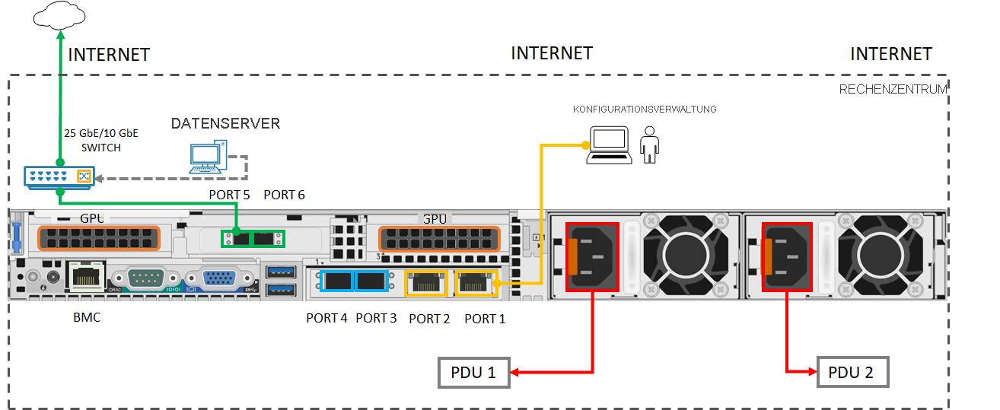

# Schnellstart: Erste Schritte mit Azure Stack Edge Pro mit GPU 

In dieser Schnellstartanleitung werden die Voraussetzungen und die erforderlichen Schritte zum Bereitstellen Ihres Azure Stack Edge Pro-GPU-Geräts erläutert. Die Schritte der Schnellstartanleitung werden im Azure-Portal und auf der lokalen Webbenutzeroberfläche des Geräts ausgeführt. 

Der gesamte Vorgang sollte ungefähr 1,5 Stunden dauern. Eine detaillierte Schritt-für-Schritt-Anleitung finden Sie unter [Tutorial: Vorbereiten der Bereitstellung von Azure Stack Edge Pro GPU](azure-stack-edge-gpu-deploy-prep.md#deployment-configuration-checklist). 

## Voraussetzungen

Sorgen Sie vor der Bereitstellung dafür, dass die folgenden Voraussetzungen erfüllt werden:

1. Das Azure Stack Edge Pro-GPU-Gerät wurde an Ihren Standort geliefert, [ausgepackt](azure-stack-edge-gpu-deploy-install.md#unpack-the-device) und [in ein Rack eingebaut](azure-stack-edge-gpu-deploy-install.md#rack-the-device). 
1. Konfigurieren Sie Ihr Netzwerk so, dass Ihr Gerät die [aufgelisteten URL-Muster und -Ports](azure-stack-edge-gpu-system-requirements.md#networking-port-requirements) erreichen kann. 
1. Sie haben als Besitzer oder Mitwirkender Zugriff auf Ihr Azure-Abonnement.
1. Wechseln Sie im Azure-Portal zu **Home > Abonnements > Ihr-Abonnement > Ressourcenanbieter**. Suchen Sie nach `Microsoft.DataBoxEdge`, und registrieren Sie den Ressourcenanbieter. Wenn Sie eine IoT Hub-Ressource zur Bereitstellung von Computeworkloads erstellen, wiederholen Sie die Registrierung von `Microsoft.Devices`.
1. Sorgen Sie dafür, dass Sie mindestens zwei freie, statische und zusammenhängende IP-Adressen für Kubernetes-Knoten und mindestens eine statische IP-Adresse für den IoT Edge-Dienst haben. Für jedes Modul oder jeden externen Dienst, das bzw. den Sie bereitstellen, benötigen Sie eine zusätzliche IP-Adresse.
1. In der [Bereitstellungsprüfliste](azure-stack-edge-gpu-deploy-checklist.md) finden Sie alles, was Sie für die Gerätebereitstellung benötigen. 

## Bereitstellungsschritte

1. **Installieren:** Verbinden Sie PORT 1 über ein Crossover-Kabel oder einen USB-Ethernet-Adapter mit einem Clientcomputer. Verbinden Sie mindestens einen weiteren Geräteport für Daten – vorzugsweise 25 GbE – über mindestens einen GbE-Switch und SFP+-Kupferkabel (von PORT 3 bis PORT 6) mit dem Internet. Verbinden Sie die bereitgestellten Netzkabel mit den Netzteilen und separaten Stromverteilungssteckdosen. Drücken Sie den Netzschalter auf der Vorderseite zum Einschalten des Geräts.  

    Kompatible Netzwerkkabel und Switches finden Sie unter [Interoperabilitätsmatrix für die Cavium FastlinQ 41000-Reihe](https://www.marvell.com/documents/xalflardzafh32cfvi0z/) und [Mit Mellanox Dual Port 25G ConnectX-4-Kanal-Netzwerkadapter kompatible Produkte](https://docs.mellanox.com/display/ConnectX4LxFirmwarev14271016/Firmware+Compatible+Products).

    Hier ist die Mindestkonfiguration für die Verkabelung, die zur Bereitstellung Ihres Geräts erforderlich ist:  

2. **Verbinden:** Konfigurieren Sie die IPv4-Einstellungen für den Ethernet-Adapter auf Ihrem Computer mit der statischen IP-Adresse **192.168.100.5** und dem Subnetz **255.255.255.0**. Öffnen Sie Ihren Browser, und stellen Sie unter https://192.168.100.10 eine Verbindung mit der lokalen Webbenutzeroberfläche des Geräts her. Dies kann einige Minuten dauern. Wenn die Warnung zum Sicherheitszertifikat angezeigt wird, setzen Sie den Vorgang auf der Webseite fort.

3. **Anmelden**: Melden Sie sich beim Gerät mit dem Standardkennwort *Password1* an. Ändern Sie das Geräteadministratorkennwort. Das Kennwort muss 8 bis 16 Zeichen und 3 der Großbuchstaben, Kleinbuchstaben, Ziffern und Sonderzeichen enthalten.

4. **Netzwerk konfigurieren**: Übernehmen Sie die DHCP-Standardkonfiguration für den verbundenen Datenport, wenn es in Ihrem Netzwerk einen DHCP-Server gibt. Wenn dies nicht zutrifft, geben Sie eine IP-Adresse, einen DNS-Server und ein Standardgateway an. Weitere Informationen finden Sie unter [Netzwerkeinstellungen](azure-stack-edge-gpu-deploy-configure-network-compute-web-proxy.md#configure-network).

5. **Computenetzwerk konfigurieren**: Erstellen Sie einen virtuellen Switch durch Aktivieren eines Ports auf Ihrem Gerät. Geben Sie zwei freie, zusammenhängende statische IP-Adressen für Kubernetes-Knoten in demselben Netzwerk ein, in dem Sie den Switch erstellt haben. Geben Sie mindestens eine statische IP-Adresse für den IoT Edge Hub-Dienst an, um auf Computemodule zuzugreifen, und eine statische IP-Adresse für jeden zusätzlichen Dienst oder Container, auf den Sie von außerhalb des Kubernetes-Clusters zugreifen möchten. 

    Kubernetes ist zum Bereitstellen aller Workloads in Containern erforderlich. Weitere Informationen finden Sie unter [Compute-Netzwerkeinstellungen](azure-stack-edge-gpu-deploy-configure-network-compute-web-proxy.md#enable-compute-network).

6. **Webproxy konfigurieren**: Wenn Sie den Webproxy in Ihrer Umgebung verwenden, geben Sie in `http://<web-proxy-server-FQDN>:<port-id>` die IP-Adresse des Webproxyservers ein. Legen Sie für „Authentifizierung“ **Keine** fest. Weitere Informationen finden Sie unter [Webproxyeinstellungen](azure-stack-edge-gpu-deploy-configure-network-compute-web-proxy.md#configure-web-proxy).

7. **Gerät konfigurieren**: Geben Sie einen Gerätenamen und eine DNS-Domäne ein, oder übernehmen Sie die Standardeinstellungen. 

8. **Updateserver konfigurieren**: Übernehmen Sie den Microsoft Update-Standardserver, oder geben Sie einen Windows Server Update Services (WSUS)-Server und den Pfad zum Server an. 

9. **Uhrzeiteinstellungen konfigurieren**: Übernehmen Sie die Standardzeiteinstellungen, oder legen Sie Zeitzone, primären NTP-Server und sekundären NTP-Server im lokalen Netzwerk oder als öffentliche Server fest.

10. **Zertifikate konfigurieren**: Wenn Sie den Gerätenamen und/oder die DNS-Domäne geändert haben, müssen Sie zum Aktivieren des Geräts Zertifikate generieren oder Zertifikate hinzufügen. 

    - Zum Testen von nicht produktiven Workloads verwenden Sie die Option [Zertifikate generieren](azure-stack-edge-gpu-deploy-configure-certificates.md#generate-device-certificates). 
    - Wenn Sie eigene Zertifikate einschließlich der Signaturkette(n) bereitstellen, [fügen Sie Zertifikate](azure-stack-edge-gpu-deploy-configure-certificates.md#bring-your-own-certificates) im entsprechenden Format hinzu. Zuerst müssen Sie die Signaturkette hochladen. Weitere Informationen finden Sie unter [Erstellen von Zertifikaten](azure-stack-edge-j-series-create-certificates-tool.md) und [Hochladen von Zertifikaten über die lokale Benutzeroberfläche](azure-stack-edge-gpu-deploy-configure-certificates.md#bring-your-own-certificates).

11. **Aktivieren**: So rufen Sie den Aktivierungsschlüssel ab: 

    1. Wechseln Sie im Azure-Portal zu Ihrer **Azure Stack Edge-Ressource > Übersicht > Geräteeinrichtung > Aktivieren > Schlüssel generieren**. Kopieren Sie den Schlüssel. 
    1. Wechseln Sie auf der lokalen Webbenutzeroberfläche zu **Erste Schritte > Aktivieren**, und geben Sie den Aktivierungsschlüssel ein. Wenn der Schlüssel angewendet wurde, dauert es einige Minuten, bis das Gerät aktiviert wird. Wenn Sie aufgefordert werden, die für eine zukünftige Wiederherstellung benötigten Geräteschlüssel sicher zu speichern, laden Sie die Datei „`<device-serial-number>`.json“ herunter. 

12. **Compute konfigurieren**: Wechseln Sie im Azure-Portal zu **Übersicht > Geräte**. Überprüfen Sie, ob das Gerät **Online** ist. Wechseln Sie im linken Bereich zu **Edgecomputing > Erste Schritte > Edgecomputing konfigurieren > Compute**. Stellen Sie einen vorhandenen oder neuen IoT Hub-Dienst bereit, und warten Sie ca. 20 Minuten, bis der Computeserver konfiguriert ist. Weitere Informationen finden Sie im [Tutorial: Konfigurieren von Compute auf einem Azure Stack Edge Pro-Gerät mit GPU](azure-stack-edge-gpu-deploy-configure-compute.md)

Sie sind bereit, Computeworkloads auf Ihrem Gerät [über IoT Edge](azure-stack-edge-gpu-deploy-sample-module-marketplace.md), [über `kubectl`](azure-stack-edge-gpu-create-kubernetes-cluster.md) oder [über Kubernetes mit Azure Arc-Aktivierung](azure-stack-edge-gpu-deploy-arc-kubernetes-cluster.md) bereitzustellen! Wenn während des Setups Probleme auftreten, wechseln Sie zu [Beheben von Geräteproblemen](), [Bestellprobleme](azure-stack-edge-gpu-troubleshoot.md), [Zertifikatprobleme](azure-stack-edge-j-series-certificate-troubleshooting.md) oder „Kubernetes-Probleme“. 

## Nächste Schritte

[Installieren von Azure Stack Edge Pro GPU](./azure-stack-edge-gpu-deploy-install.md)

