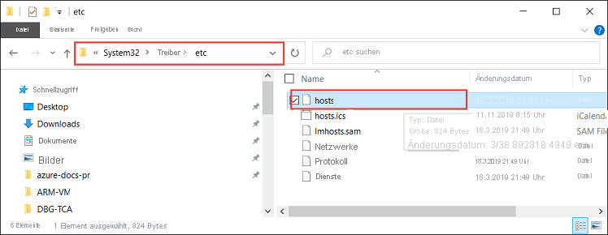

# <a name="deploy-vms-on-your-azure-stack-edge-gpu-device-via-azure-powershell-script"></a>Bereitstellen von VMs auf Ihrem Azure Stack Edge GPU-Gerät mithilfe eines Azure PowerShell-Skripts

<!--[!INCLUDE [applies-to-skus](../../includes/azure-stack-edge-applies-to-all-sku.md)]-->

In diesem Tutorial wird beschrieben, wie Sie eine VM auf Ihrem Azure Stack Edge-Gerät mithilfe eines Azure PowerShell-Skripts erstellen und verwalten.

## <a name="prerequisites"></a>Voraussetzungen

Bevor Sie mit dem Erstellen und Verwalten einer VM auf Ihrem Azure Stack Edge-Gerät mit diesem Skript beginnen, müssen Sie sicherstellen, dass Sie die in den folgenden Schritten aufgeführten Voraussetzungen erfüllt haben:

### <a name="for-azure-stack-edge-device-via-the-local-web-ui"></a>Für Azure Stack Edge-Gerät über die lokale Webbenutzeroberfläche

1. Sie haben die Netzwerkeinstellungen auf dem Azure Stack Edge-Gerät wie in [Schritt 1: Konfigurieren des Azure Stack Edge-Geräts](azure-stack-edge-j-series-connect-resource-manager.md#step-1-configure-azure-stack-edge-device) angegeben durchgeführt.

2. Sie haben eine Netzwerkschnittstelle für Compute erstellt. Diese IP-Adresse der Netzwerkschnittstelle wird verwendet, um einen virtuellen Switch für die VM-Bereitstellung zu erstellen. Die folgenden Schritte führen Sie durch den Prozess:

    1. Wechseln Sie zu den **Computeeinstellungen**. Wählen Sie die Netzwerkschnittstelle aus, die Sie verwenden möchten, um einen virtuellen Switch zu erstellen.

        > [!IMPORTANT] 
        > Sie können nur einen Port für Compute konfigurieren.

    2. Aktivieren Sie Compute für die Netzwerkschnittstelle. Azure Stack Edge erstellt und verwaltet einen virtuellen Switch, der dieser Netzwerkschnittstelle entspricht.

3. Sie haben alle Zertifikate auf Ihrem Azure Stack Edge-Gerät und im vertrauenswürdigen Stammspeicher des Clients erstellt und installiert. Führen Sie das unter [Schritt 2: Erstellen und Installieren von Zertifikaten](azure-stack-edge-j-series-connect-resource-manager.md#step-2-create-and-install-certificates) beschriebene Verfahren aus.

### <a name="for-your-windows-client"></a>Für den Windows-Client

1. Sie haben auf der lokalen Webbenutzeroberfläche des Geräts auf der Seite **Netzwerk** die virtuelle IP-Adresse (VIP) der Azure-konsistenten Dienste definiert. Sie müssen diese virtuelle IP-Adresse Folgendem hinzufügen:

    - Der Hostdatei auf dem Client oder
    - Der DNS-Serverkonfiguration
    
    > [!IMPORTANT]
    > Es wird empfohlen, dass Sie die DNS-Serverkonfiguration für die Endpunktnamensauflösung ändern.

    1. Starten Sie **Editor** als Administrator (Administratorrechte sind erforderlich, um die Datei zu speichern), und öffnen Sie anschließend die Datei **hosts** unter `C:\Windows\System32\Drivers\etc`.
    
        
    
    2. Fügen Sie die folgenden Einträge zur Datei **hosts** hinzu, und fügen Sie die entsprechenden Werte für Ihr Gerät ein:
    
        ```
        <Azure consistent services VIP> login.<appliance name>.<DNS domain>
        <Azure consistent services VIP> management.<appliance name>.<DNS domain>
        <Azure consistent services VIP> <storage name>.blob.<appliance name>.<DNS domain>
        ```
        Für das Speicherkonto können Sie einen Namen angeben, den das Skript später verwenden soll, um ein neues Speicherkonto zu erstellen. Das Skript prüft nicht, ob das Speicherkonto vorhanden ist.

    3. Verwenden Sie die folgende Abbildung als Referenz. Speichern Sie die Datei **hosts**.

        

2. [Laden Sie das PowerShell-Skript](https://aka.ms/ase-vm-powershell) herunter, das in diesem Verfahren verwendet wird.

3. Stellen Sie sicher, dass auf dem Windows-Client mindestens PowerShell 5.0 ausgeführt wird.

4. Stellen Sie sicher, dass die `Azure.Storage Module version 4.5.0` auf Ihrem System installiert ist. Sie können dieses Modul [aus dem PowerShell-Katalog](https://www.powershellgallery.com/packages/Azure.Storage/4.5.0) abrufen. Geben Sie zum Installieren dieses Modul Folgendes ein:

    `Install-Module -Name Azure.Storage -RequiredVersion 4.5.0`

    Um die Version des installierten Moduls zu überprüfen, geben Sie Folgendes ein:

    `Get-InstalledModule -name Azure.Storage`

    Um Module anderer Versionen zu deinstallieren, geben Sie Folgendes ein:

    `Uninstall-Module -Name Azure.Storage`

5. [Laden Sie AzCopy 10](https://docs.microsoft.com/azure/storage/common/storage-use-azcopy-v10#download-azcopy) auf Ihren Windows-Client herunter. Notieren Sie sich diesen Speicherort, da Sie ihn beim Ausführen des Skripts als Parameter übergeben.

6. Stellen Sie sicher, dass auf dem Windows-Client mindestens TLS 1.2 ausgeführt wird.


## <a name="create-a-vm"></a>Erstellen einer VM

1. Führen Sie PowerShell als Administrator aus.
2. Wechseln Sie zum Ordner, in den Sie das Skript auf Ihrem Client heruntergeladen haben.  
3. Verwenden Sie den folgenden Befehl, um das Skript auszuführen:
 
    `.\ArmPowershellClient.ps1 -VNetAddressSpace <AddressSpace> -NicPrivateIp <Private IP> -VHDPath <Path> -VHDFile <VHD File, with extension> -StorageAccountName <Name> -OS <Windows/Linux> -VMSize <Supported VM Size> -VMUserName <UserName to be used to login into VM> -VMPassword <Password for the VM login> --AzCopy10Path <Absolute Path>`

    Hier sind die Beispiele, wenn das Skript ausgeführt wird, um eine Windows-VM und eine Linux-VM zu erstellen.

    **Für eine Windows-VM:**

    `.\ArmPowershellClient.ps1 -VNetAddressSpace 5.5.0.0/16 -NicPrivateIp 5.5.168.73 -VHDPath \\intel01\d$\vm_vhds\AzureWindowsVMmode -VHDFile WindowsServer2016Datacenter.vhd -StorageAccountName teaaccount1 -OS Windows -VMSize Standard_D1_v2 -VMUserName Administrator -VMPassword Password1 -AzCopy10Path C:\azcopy10\azcopy.exe`

    **Für eine Linux-VM:**

    `.\ArmPowershellClient.ps1 -VNetAddressSpace 5.5.0.0/16 -NicPrivateIp 5.5.168.83 -VHDPath \\intel01\d$\vm_vhds\AzurestackLinux -VHDFile ubuntu13.vhd -StorageAccountName sa2 -OS Linux -VMSize Standard_D1_v2 -VMUserName Administrator -VMPassword Password1 -AzCopy10Path C:\azcopy10\azcopy.exe`
    
4. Mit den folgenden Befehlen können Sie die vom Skript erstellten Ressourcen bereinigen:
    
    ```powershell
    Get-AzureRmVM | Remove-AzureRmVM -Force
    Get-AzureRmNetworkInterface | Remove-AzureRmNetworkInterface -Force
    Get-AzureRmResource | Remove-AzureRmResource -f
    Get-AzureRmResourceGroup | Remove-AzureRmResourceGroup -f
    ```


## <a name="next-steps"></a>Nächste Schritte

[Bereitstellen von VMs mithilfe von Azure PowerShell-Cmdlets](azure-stack-edge-j-series-deploy-virtual-machine-powershell.md)
