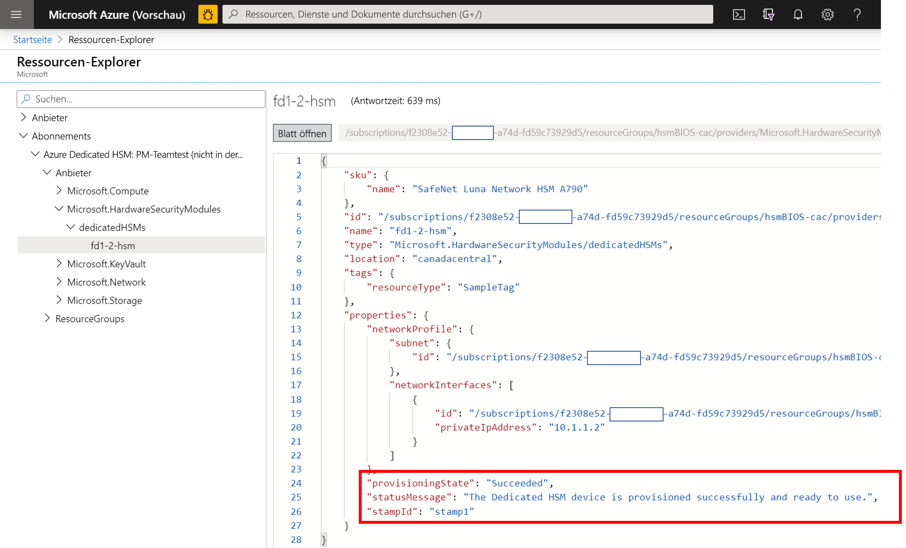
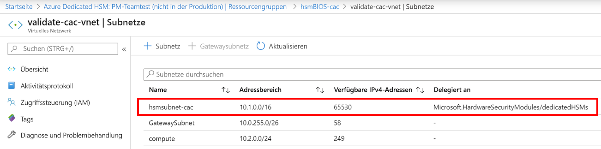
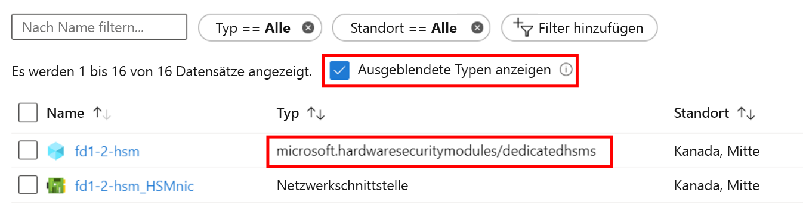

# <a name="troubleshooting-the-azure-dedicated-hsm-service"></a>Behandeln von Problemen mit dem Azure Dedicated HSM-Dienst

Der Dienst „Azure Dedicated HSM“ verfügt über zwei besondere Facetten. Die erste Facette ist die Registrierung und Bereitstellung der HSM-Geräte mit den zugrunde liegenden Netzwerkkomponenten in Azure. Die zweite Facette ist die Konfiguration der HSM-Geräte als Vorbereitung auf die Nutzung bzw. Integration mit einer bestimmten Workload oder Anwendung. Die [Thales Luna 7-HSM](https://cpl.thalesgroup.com/encryption/hardware-security-modules/network-hsms)-Geräte sind in Azure mit den Geräten identisch, die Sie direkt bei Thales erhalten. Aber die Tatsache, dass es sich um eine Ressource in Azure handelt, macht dies zu einem Spezialfall mit besonderen Aspekten. Diese Aspekte und die sich daraus ergebenden Erkenntnisse in Bezug auf die Problembehandlung oder die bewährten Methoden sind hier dokumentiert, um eine hohe Transparenz und den Zugang zu wichtigen Informationen sicherzustellen. Wenn der Dienst verwendet wird, können Sie definitive Informationen erhalten, indem Sie Supportanfragen an Microsoft oder direkt an Thales senden. 

> [!NOTE]
> Beachten Sie, dass für ein neu bereitgestelltes HSM-Gerät eine Aktualisierung mit allen relevanten Patches durchgeführt werden sollte, bevor die Konfiguration erfolgt. Ein spezifischer erforderlicher Patch ist [KB0019789](https://supportportal.gemalto.com/csm?id=kb_article_view&sys_kb_id=19a81c8bdb9a1fc8d298728dae96197d&sysparm_article=KB0019789) im Portal des Thales-Supports, mit dem ein Problem behoben wird, bei dem das System beim Neustart nicht mehr reagiert.

## <a name="hsm-registration"></a>HSM-Registrierung

Dedicated HSM ist nicht frei für die Nutzung zugänglich, weil bei diesem Dienst Hardwareressourcen in der Cloud bereitgestellt werden und es sich daher um eine wertvolle Ressource handelt, die geschützt werden muss. Aus diesem Grund nutzen Sie einen Positivlistenprozess per E-Mail über HSMrequest@microsoft.com. 

### <a name="getting-access-to-dedicated-hsm"></a>Anfordern des Zugriffs auf Dedicated HSM

Überlegen Sie zunächst, für welche Ihrer Anwendungsfälle weder [Azure Key Vault](../key-vault/general/overview.md) noch [Azure Managed HSM](../key-vault/managed-hsm/overview.md) verwendet werden kann. Wenn Sie dann der Meinung sind, dass nur Dedicated HSM Ihre Schlüsselspeicheranforderungen erfüllt, können Sie eine E-Mail an HSMrequest@microsoft.com senden und den Zugriff anfordern. Beschreiben Sie Ihre Anwendung und Anwendungsfälle, die gewünschten Regionen für HSMs und den gewünschten HSM-Umfang. Falls Sie mit einem Microsoft-Vertreter zusammenarbeiten, z. B. einem Kundenbetreuer oder Cloud Solution Architect, sollten Sie diese Person bei Anfragen auf Kopie setzen.

## <a name="hsm-provisioning"></a>HSM-Bereitstellung

Die Bereitstellung eines HSM-Geräts in Azure kann per CLI oder PowerShell erfolgen. Beim Registrieren für den Dienst wird eine ARM-Beispielvorlage bereitgestellt und Hilfe bei der erstmaligen Anpassung geleistet. 

### <a name="hsm-deployment-failure-information"></a>Informationen zu Fehlern bei der HSM-Bereitstellung

Dedicated HSM unterstützt die CLI und PowerShell für die Bereitstellung. Die auf dem Portal basierenden Fehlerinformationen sind daher begrenzt und nicht ausführlich. Sie können bessere Informationen finden, indem Sie den Ressourcen-Explorer verwenden. Die Startseite des Portals enthält hierfür ein Symbol, und es sind ausführlichere Informationen verfügbar. Diese Informationen sind sehr hilfreich, wenn sei bei der Erstellung einer Supportanfrage zu Bereitstellungsproblemen eingefügt werden.



### <a name="hsm-subnet-delegation"></a>HSM-Subnetzdelegierung
Der häufigste Grund für Bereitstellungsfehler ist, dass die Einrichtung einer passenden Delegierung für das vom Kunden definierte Subnetz, in dem die HSMs bereitgestellt werden sollen, vergessen wird. Die Festlegung dieser Delegierung gehört zu den Voraussetzungen für das VNET und die Subnetze der Bereitstellung. Ausführlichere Informationen hierzu finden Sie in den Tutorials.



### <a name="hsm-deployment-race-condition"></a>Racebedingung für die HSM-Bereitstellung

Die ARM-Standardvorlage für die Bereitstellung verfügt über Ressourcen für HSMs und das ExpressRoute-Gateway. Netzwerkressourcen stellen eine Abhängigkeit in Bezug auf die erfolgreiche HSM-Bereitstellung dar, und das Timing kann entscheidend sein.  Gelegentlich ist es zu Bereitstellungsfehlern aufgrund von Abhängigkeitsproblemen gekommen, und Probleme können häufig behoben werden, indem die Bereitstellung erneut durchgeführt wird. Falls dies nicht hilft, ist das Löschen und anschließende Bereitstellen von Ressourcen häufig eine erfolgreiche Lösung. Wenn Sie dies probiert haben und trotzdem noch Probleme auftreten, sollten Sie im Azure-Portal eine Supportanfrage erstellen und den Problemtyp „Probleme beim Konfigurieren der Azure-Einrichtung“ auswählen.

### <a name="hsm-deployment-using-terraform"></a>HSM-Bereitstellung mit Terraform

Einige Kunden haben Terraform als Automatisierungslösung anstelle der ARM-Vorlagen verwendet, die beim Registrieren für diesen Dienst bereitgestellt werden. Die HSMs können auf diese Weise nicht bereitgestellt werden, aber für die abhängigen Netzwerkressourcen ist dies möglich. Terraform verfügt über ein Modul für die Kontaktaufnahme mit einer minimal ausgestatteten ARM-Vorlage, die nur die HSM-Bereitstellung umfasst.  In dieser Situation sollten Sie sorgfältig darauf achten, dass vor der Bereitstellung von HSMs die Netzwerkressourcen, z. B. das erforderliche ExpressRoute-Gateway, vollständig bereitgestellt werden. Mit dem folgenden CLI-Befehl kann getestet werden, ob die Bereitstellung abgeschlossen und richtig integriert wurde. Ersetzen Sie die Platzhalter in den spitzen Klammern durch Ihre jeweiligen Benennungen. Achten Sie auf ein Ergebnis der Art „provisioningState is Succeeded“ (provisioningState: Erfolgreich).

```azurecli
az resource show --ids /subscriptions/<subid>/resourceGroups/<myresourcegroup>/providers/Microsoft.Network/virtualNetworkGateways/<myergateway>
```

### <a name="deployment-failure-based-on-quota"></a>Bereitstellungsfehler aufgrund des Kontingents
Für Bereitstellungen kann ein Fehler auftreten, wenn Sie zwei HSMs pro Stempel und vier HSMs pro Region überschreiten. Stellen Sie zur Vermeidung dieser Situation sicher, dass Sie die Ressourcen der vorherigen fehlgeschlagenen Bereitstellungen gelöscht haben, bevor Sie eine erneute Bereitstellung durchführen. Informationen zum Überprüfen der Ressourcen finden Sie unten unter „Anzeigen von HSMs nach der Bereitstellung“. Falls Sie dieses Kontingent, das hauptsächlich aus Sicherheitsgründen eingerichtet wurde, überschreiten möchten, können Sie eine E-Mail mit den Details an HSMrequest@microsoft.com senden.

### <a name="deployment-failure-based-on-capacity"></a>Bereitstellungsfehler aufgrund der Kapazität
Wenn die Kapazitätsgrenze für einen bestimmten Stempel oder eine Region nahezu erreicht ist (also fast alle verfügbaren HSMs bereitgestellt wurden), kann dies zu Bereitstellungsfehlern führen. Jeder Stempel verfügt über 12 HSMs für Kunden. Dies sind also 24 pro Region. Pro Stempel sind zudem zwei Ersatzgeräte und ein Testgerät vorhanden. Wenn Sie der Meinung sind, dass Sie ggf. eine Grenze erreicht haben, können Sie eine E-Mail an HSMrequest@microsoft.com senden, um Informationen zum Stand bestimmter Stempel zu erhalten.

###  <a name="how-do-i-see-hsms-when-provisioned"></a>Anzeigen von HSMs nach der Bereitstellung
Da Dedicated HSM ein auf die Positivliste gesetzter Dienst ist, wird er im Azure-Portal als „Ausgeblendeter Typ“ angesehen. Zum Anzeigen der HSM-Ressourcen müssen Sie das Kontrollkästchen „Ausgeblendete Typen anzeigen“ wie unten dargestellt aktivieren. Die NIC-Ressource folgt immer auf das HSM und ist ein guter Ort, um die IP-Adresse des HSM zu ermitteln, bevor SSH für die Verbindungsherstellung genutzt wird.



## <a name="networking-resources"></a>Netzwerkressourcen

Für die Bereitstellung von Dedicated HSM besteht eine Abhängigkeit von Netzwerkressourcen, aus der sich einige Einschränkungen ergeben, die beachtet werden sollten.

### <a name="provisioning-expressroute"></a>Bereitstellung von ExpressRoute

Für Dedicated HSM wird das ExpressRoute-Gateway als „Tunnel“ für die Kommunikation zwischen dem privaten IP-Adressraum des Kunden und dem physischen HSM in einem Azure-Rechenzentrum verwendet.  Da eine Beschränkung von einem Gateway pro VNET besteht, müssen Kunden, die eine Verbindung mit ihren lokalen Ressourcen per ExpressRoute benötigen, ein anderes VNET für diese Verbindung nutzen.  

### <a name="hsm-private-ip-address"></a>Private HSM-IP-Adresse

In den für Dedicated HSM bereitgestellten Beispielvorlagen wird angenommen, dass die HSM-IP-Adresse automatisch aus dem jeweiligen Subnetzbereich stammt. Sie können eine explizite IP-Adresse für das HSM per „NetworkInterfaces“-Attribut in der ARM-Vorlage angeben. 


## <a name="hsm-initialization"></a>HSM-Initialisierung

Bei der Initialisierung wird ein neues HSM für die Verwendung bzw. ein vorhandenes HSM für die Wiederverwendung vorbereitet. Die Initialisierung des HSM muss abgeschlossen sein, bevor Sie Objekte generieren oder speichern, für Clients die Verbindungsherstellung zulassen oder kryptografische Vorgänge durchführen können.

### <a name="lost-credentials"></a>Verlorene Anmeldeinformationen

Der Verlust des Shell-Administratorkennworts führt zu einem Verlust von HSM-Schlüsselmaterial. Es sollte eine Supportanfrage erstellt werden, um das HSM zurücksetzen zu lassen.
Speichern Sie die Anmeldeinformationen beim Initialisieren des HSM auf sichere Weise. Shell- und HSM-Anmeldeinformationen sollten gemäß den Richtlinien Ihres Unternehmens aufbewahrt werden.

### <a name="failed-logins"></a>Fehlgeschlagene Anmeldungen

Die Angabe falscher Anmeldeinformationen für HSMs kann sehr negative Folgen haben. Unten ist das Standardverhalten für HSM-Rollen angegeben.

| Role | Schwellenwert (Anzahl von Wiederholungsversuchen) | Ergebnis bei zu vielen fehlerhaften Anmeldeversuchen | Wiederherstellung |
|--|--|--|--|
| HSM-Anmeldung | 3 |  HSM wird auf Null zurückgesetzt (alle HSM-Objektidentitäten und alle Partitionen sind verloren)  |  Das HSM muss neu initialisiert werden. Inhalte können aus Sicherungen wiederhergestellt werden. | 
| Partitionsanmeldung | 10 |  Die Partition wird auf Null zurückgesetzt. |  Die Partition muss neu initialisiert werden. Inhalte können aus der Sicherung wiederhergestellt werden. |  
| Audit | 10 | Sperrung | Die Entsperrung erfolgt nach zehn Minuten automatisch. |  
| Kryptoverantwortlicher | 10 (kann verringert werden) | Bei HSM-Richtlinie 15: Anmeldungszurücksetzung für Partitions-PIN ist auf „1“ festgelegt (aktiviert), Rollen „Kryptoverantwortlicher“ und „Kryptobenutzer“ sind gesperrt.<br>Bei HSM-Richtlinie 15: Anmeldungszurücksetzung für Partitions-PIN ist auf „0“ festgelegt (deaktiviert), Rollen „Kryptoverantwortlicher“ und „Kryptobenutzer“ sind dauerhaft gesperrt, und die Partitionsinhalte sind nicht mehr zugänglich. Dies ist die Standardeinstellung. | Die Rolle „Kryptoverantwortlicher“ muss entsperrt werden, und die Anmeldeinformationen für die Partitionsanmeldung müssen zurückgesetzt werden, indem `role resetpw -name co` verwendet wird.<br>Die Partition muss neu initialisiert werden, und das Schlüsselmaterial muss von einem Sicherungsgerät wiederhergestellt werden. |  

## <a name="hsm-configuration"></a>HSM-Konfiguration 

Die folgenden Punkte beschreiben eine Situation, in der Konfigurationsfehler entweder häufig auftreten oder eine zu beachtende Auswirkung haben:

### <a name="hsm-documentation-and-software"></a>HSM-Dokumentation und -Software
Software und Dokumentation für die [Thales Luna 7-HSM](https://cpl.thalesgroup.com/encryption/hardware-security-modules/network-hsms)-Geräte ist nicht bei Microsoft erhältlich, sondern muss direkt von Thales heruntergeladen werden. Die Registrierung mit der Thales-Kunden-ID, die während des Registrierungsvorgangs erzeugt wurde, ist erforderlich. Die von Microsoft bereitgestellten Geräte verfügen über Softwareversion 7.2 und Firmwareversion 7.0.3. Anfang 2020 hat Thales seine Dokumentation veröffentlicht, die Sie [hier](https://thalesdocs.com/gphsm/luna/7.2/docs/network/Content/Home_network.htm) finden.  

### <a name="hsm-networking-configuration"></a>HSM-Netzwerkkonfiguration

Gehen Sie beim Konfigurieren des Netzwerks auf dem HSM mit Bedacht vor.  Das HSM verfügt über eine Verbindung, die aus einem privaten IP-Adressraum des Kunden über das ExpressRoute-Gateway direkt mit dem HSM besteht.  Dieser Kommunikationskanal ist nur für die Kundenkommunikation bestimmt, und Microsoft hat keinen Zugriff darauf. Wenn das HSM so konfiguriert ist, dass dieser Netzwerkpfad beeinträchtigt wird, wird die gesamte Kommunikation mit dem HSM eingestellt.  In dieser Situation besteht die einzige Möglichkeit darin, über das Azure-Portal eine Microsoft-Supportanfrage zu erstellen, um das Gerät zurücksetzen zu lassen. Bei diesem Zurücksetzungsvorgang wird das HSM in den Anfangszustand versetzt, und die gesamte Konfiguration und das Schlüsselmaterial geht verloren.  Die Konfiguration muss neu erstellt werden, und wenn das Gerät in die Hochverfügbarkeitsgruppe eingebunden wird, wird das Schlüsselmaterial repliziert.  

### <a name="hsm-device-reboot"></a>Neustart des HSM-Geräts

Für einige Konfigurationsänderungen muss das HSM aus- und wieder eingeschaltet bzw. neu gestartet werden. Bei von Microsoft durchgeführten Tests des HSM in Azure stellte sich heraus, dass ein Neustart in einigen Fällen zum Ausbleiben einer Reaktion führen kann. Zur Behebung muss im Azure-Portal eine Supportanfrage erstellt werden, um einen „harten Neustart“ durchführen zu lassen. Die Erledigung kann hierbei bis zu 48 Stunden dauern, weil es sich um einen manuellen Prozess in einem Azure-Rechenzentrum handelt.  Stellen Sie zur Vermeidung dieser Situation sicher, dass Sie den Neustartpatch direkt von Thales verwenden. Unter [KB0019789](https://supportportal.gemalto.com/csm?sys_kb_id=d66911e2db4ffbc0d298728dae9619b0&id=kb_article_view&sysparm_rank=1&sysparm_tsqueryId=d568c35bdb9a4850d6b31f3b4b96199e&sysparm_article=KB0019789) im Downloadabschnitt zu Thales Luna 7 HSM 7.2 finden Sie einen empfohlenen Patch zur Behebung eines Problems, bei dem das System beim Neustart nicht mehr reagiert. (Hinweis: Sie müssen im [Thales-Portal für den Kundensupport](https://supportportal.thalesgroup.com/csm) registriert sein, um den Download durchführen zu können.)

### <a name="ntls-certificates-out-of-sync"></a>Fehlende Synchronisierung von NTLS-Zertifikaten
Unter Umständen verliert ein Client die Konnektivität mit einem HSM, wenn ein Zertifikat abläuft oder bei Konfigurationsaktualisierungen überschrieben wurde. Die Clientkonfiguration für den Zertifikataustausch sollte für jedes HSM neu angewendet werden.
Beispiel für NTLS-Protokollierung mit ungültigem Zertifikat:

> NTLS[8508]: info : 0 : Incoming connection request... : 192.168.50.2/59415 NTLS[8508]: Error message from SSLAccept is : error:14094418:SSL routines:ssl3_read_bytes:tlsv1 alert unknown ca NTLS[8508]: Error during SSL accept ( RC_SSL_ERROR ) NTLS[8508]: info : 0xc0000711 : Fail to establish a secure channel with client : 192.168.50.2/59415 : RC_SSL_FAILED_HANDSHAKE NTLS[8508]: info : 0 : NTLS Client "Unknown host name" Connection instance removed : 192.168.50.2/59415

### <a name="failed-tcp-communication"></a>Fehler bei der TCP-Kommunikation

Für die Kommunikation von der Luna-Clientinstallation mit dem HSM ist mindestens TCP-Port 1792 erforderlich. Beachten Sie dies, falls Netzwerkkonfigurationen in der Umgebung geändert werden.

### <a name="failed-ha-group-member-doesnt-recover"></a>Wiederherstellung für fehlerhaftes Mitglied der Hochverfügbarkeitsgruppe nicht möglich

Falls die Wiederherstellung für ein fehlerhaftes Mitglied der Hochverfügbarkeitsgruppe nicht möglich ist, muss die Wiederherstellung manuell über den Luna-Client durchgeführt werden, indem der Befehl „hagroup recover“ verwendet wird.
Es ist erforderlich, eine Wiederholungsanzahl für eine Hochverfügbarkeitsgruppe zu konfigurieren, um die automatische Wiederherstellung zu ermöglichen. Standardmäßig wird von einer Hochverfügbarkeitsgruppe bei der Wiederherstellung nicht versucht, ein Mitglied der Gruppe wiederherzustellen.

### <a name="ha-group-doesnt-sync"></a>Keine Synchronisierung der Hochverfügbarkeitsgruppe

Falls Mitgliedspartitionen nicht über dieselbe Klondomäne verfügen, wird mit dem Befehl „ha synchronize“ Folgendes angezeigt: Warnung: Es kann sein, dass die Synchronisierung nicht erfolgreich ist.  Die Mitglieder in Slot 0 und Slot 1 verfügen über in Konflikt stehende Einstellungen für das Klonen privater Schlüssel.
Eine neue Partition mit der richtigen Klondomäne sollte der Hochverfügbarkeitsgruppe hinzugefügt werden, und anschließend sollte die falsch konfigurierte Partition entfernt werden.

## <a name="hsm-deprovisioning"></a>Aufhebung der HSM-Bereitstellung 

Die Aufhebung der Bereitstellung kann nur erfolgen, wenn alle HSM-Vorgänge vollständig abgeschlossen wurden. Microsoft führt anschließend das Zurücksetzen und die erneute Einbindung in einen freien Pool durch. 

### <a name="how-to-delete-an-hsm-resource"></a>Löschen einer HSM-Ressource

Die Azure-Ressource für ein HSM kann nur gelöscht werden, wenn das HSM auf Null zurückgesetzt wurde.  Aus diesem Grund muss das gesamte Schlüsselmaterial gelöscht werden, bevor versucht wird, die Ressource zu löschen. Die schnellste Möglichkeit zum Zurücksetzen auf Null besteht darin, das HSM-Administratorkennwort dreimal falsch einzugeben. (Hinweis: Dies bezieht sich auf die HSM-Administratorebene, nicht auf die Appliance-Administratorebene). Die Luna-Shell verfügt über den Befehl `hsm -factoryreset`, mit dem das Zurücksetzen auf Null durchgeführt werden kann. Er kann aber nur über die Konsole am seriellen Port ausgeführt werden, und Kunden haben hierauf keinen Zugriff.

## <a name="next-steps"></a>Nächste Schritte

In diesem Artikel wurden verschiedene Bereiche des Lebenszyklus der HSM-Bereitstellung beschrieben, in denen Probleme auftreten können oder für die eine Problembehandlung bzw. eine besondere Beachtung erforderlich ist. Wir hoffen, dass Sie mit den Informationen in diesem Artikel unnötige Verzögerungen und ärgerliche Vorkommnisse verhindern können. Falls Sie Vorschläge für relevante Ergänzungen oder Änderungen haben, sollten Sie eine Supportanfrage für Microsoft erstellen und uns die entsprechenden Informationen zukommen lassen.