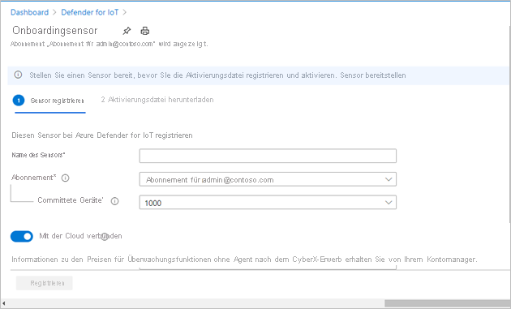
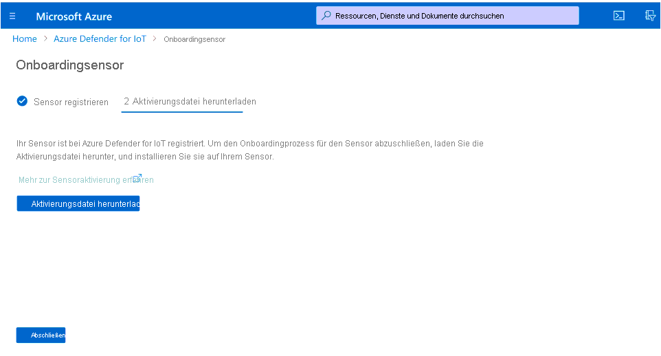
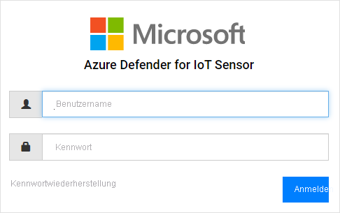
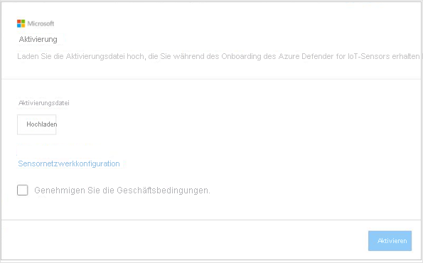
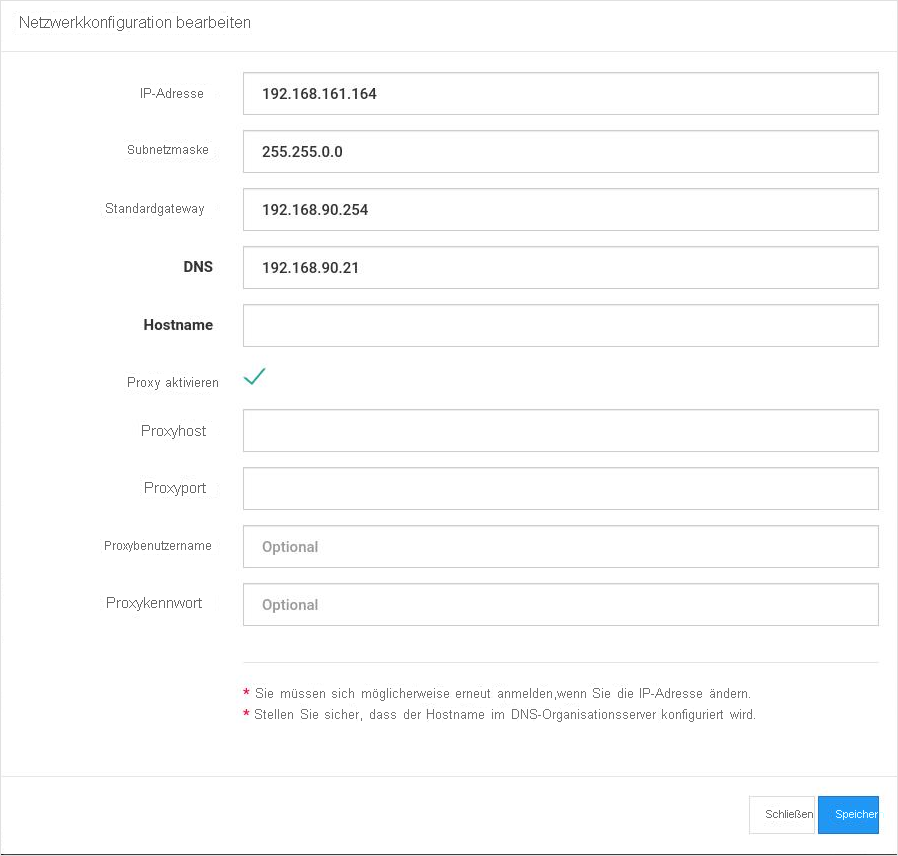

# Schnellstart: Bereitstellen und Integrieren eines Sensors

Dieser Artikel bietet eine Übersicht über den Prozess der Sensorbereitstellung. Sensoren müssen in das Azure Defender für IoT-Portal integriert werden.

Dieser Prozess erfordert es, dass Sie einen vorkonfigurierten Sensor kaufen oder eine zertifizierte Sensorappliance abrufen und die Sensorsoftware selbst installieren.

Wenn Sie mit einer zertifizierten Sensorappliance arbeiten, sollten Sie erst den [Azure Defender for IoT hardware specifications guide](https://aka.ms/AzureDefenderforIoTBareMetalAppliance) (Leitfaden zu den Hardwarespezifikationen für Azure Defender für IoT) lesen, bevor Sie beginnen.

> [!NOTE]
> Die lokale Verwaltungskonsole von Azure Defender für IoT muss nicht integriert werden.

Das Integrieren von Sensoren ermöglicht Ihnen Folgendes:

|||
|------ | ----------- |
| **Definieren eines Sensornamens** | Benennen Sie den Sensor, den Sie integrieren, und ordnen Sie ihn einem IoT Hub oder einem Abonnement zu.  Weitere Informationen finden Sie unter **integrieren von Sensoren**.|
|**Auswählen eines Abonnements und einer Anzahl von committeten Geräten**|Wählen Sie ein Abonnement und die Anzahl der Geräte aus, die vom Abonnement abgedeckt werden. Geben Sie die Zahl in Inkrementen von 1.000 ein.|
| **Definieren eines Sensorverwaltungsmodus** | Definieren Sie, wo Ressource, Warnung und andere vom Sensor erkannte Informationen angezeigt werden sollen. Dies wird basierend auf dem von Ihnen definierten **Sensorverwaltungsmodus** bestimmt.  **Lokal verwalteter Modus**: Die vom Sensor erkannten Informationen werden in der Sensorkonsole angezeigt. Erkennungsinformationen werden auch für die lokale Verwaltungskonsole freigegeben, wenn der Sensor damit verbunden ist.  **Über die Cloud verwalteter Modus**: Die vom Sensor erkannten Informationen werden in der Sensorkonsole angezeigt. Außerdem werden Warnungsinformationen über einen IoT Hub übermittelt und können für andere Azure-Dienste, z. B. Azure Sentinel, freigegeben werden. Weitere Informationen finden Sie unter **Integrieren von Sensoren**. |
| **Abrufen einer Sensoraktivierungsdatei** | Bei **lokal verwalteten** Sensoren wird eine Aktivierungsdatei zum Verwalten von autorisierten Aktivierungszeiträumen für Sensoren verwendet.  Bei **über die Cloud verwalteten** Sensoren wird eine Aktivierungsdatei als Verbindung zwischen dem Sensor und einem IoT Hub verwendet. Weitere Informationen finden Sie unter **Integrieren von Sensoren**. |
| **Hochladen einer Aktivierungsdatei auf Ihren Sensor** | Aktivierungsdateien müssen auf Ihre Unternehmenssensoren hochgeladen werden. Netzwerküberwachung und Zugriff auf die Features von Sensorkonsolen stehen erst dann zur Verfügung, nachdem die Aktivierungsdatei hochgeladen wurde. Weitere Informationen finden Sie unter **Hochladen von Sensoraktivierungsdateien**. |
| **Aktualisieren von Sensornetzwerkparametern vor der Aktivierung** | Aktualisieren Sie Parameter, die während der Sensorinstallation definiert wurden. Weitere Informationen finden Sie unter **Fehler! Verweisquelle nicht gefunden**.|

**So stellen Sie einen Sensor bereit:**

1. Wechseln Sie im Azure-Portal zu Azure Defender für IoT.

2. Wählen Sie **Erste Schritte** aus.

3. Wählen Sie im Abschnitt **Discover your network** (Ermitteln Ihres Netzwerks) die Option **Einrichten** aus.

   

4. Wählen Sie eine Option zum Abrufen eines Sensors aus.

   

  - **Kaufen eines vorkonfigurierten Sensors**: Microsoft ist eine Partnerschaft mit Arrow eingegangen, um vorkonfigurierte Sensoren bereitstellen zu können. Wenn Sie einen vorkonfigurierten Sensor kaufen möchten, wenden Sie sich an Arrow unter: <hardware.sales@arrow.com>. Der Sensor wird an Ihre Einrichtung geliefert. Die aktuellste Version ist installiert.

  - **Bring your own appliance (ISO-Installation)** : Die Lösung wird auf zertifizierten Appliances ausgeführt. Informationen beim Kauf Ihrer zertifizierten Appliance finden Sie im [Azure Defender for IoT hardware specifications guide](https://aka.ms/AzureDefenderforIoTBareMetalAppliance) (Leitfaden zu den Hardwarespezifikationen für Azure Defender für IoT).

    - Wählen Sie im Menü **Version auswählen** die gewünschte Version aus.

    - Wählen Sie **Herunterladen** aus, und speichern Sie die Datei. Ausführliche Informationen zum Herunterladen des ISO-Images und Installieren der Sensorsoftware finden Sie im **Azure Defender for IoT Installation Guide** (Azure Defender für IoT-Installationshandbuch).

5. Nachdem die Software auf Ihrem Sensor installiert wurde oder Sie einen vorkonfigurierten Sensor erhalten haben, führen Sie die Aufgaben zur Netzwerkeinrichtung aus. Ausführliche Informationen finden Sie im [Network Setup Guide](https://aka.ms/AzureDefenderForIoTNetworkSetup) (Anleitung zur Netzwerkeinrichtung).

## Integrieren eines Sensors

Sensoren müssen in das Azure Defender für IoT-Portal integriert werden. Die Integration erfolgt in zwei Phasen:

1. Registrieren Sie den Sensor beim Azure Defender für IoT-Portal.

2. Laden Sie eine Aktivierungsdatei für den Sensor herunter. Die Datei wird später auf Ihren Sensor hochgeladen.

**So greifen Sie auf die Seite „Integrieren“ zu:**

1. Navigieren Sie zur Microsoft Azure Defender für IoT-Seite **Erste Schritte**.

2. Wählen Sie unter „Azure Defender für IoT“ **2) Integrieren** aus.

   

3. Die Seite **Onboard sensor** (Sensor integrieren) wird geöffnet. Sie enthält Optionen zum Registrieren des Sensors und Herunterladen der Aktivierungsdatei.

   

**So registrieren Sie den Sensor:**

1. Wählen Sie einen Sensornamen aus. Bei über die Cloud verwalteten Sensoren wird der hier definierte Name auf den Namen angewendet, der in der Sensorkonsole angezeigt wird: Dieser Name kann in der Konsole nicht geändert werden. Bei lokal verwalteten Sensoren wird der hier angewendete Name in Azure gespeichert, kann aber in der Sensorkonsole geändert werden. Es wird empfohlen, die IP-Adresse des installierten Sensors als Teil des Namens anzugeben oder einen leicht identifizierbaren Namen zu verwenden. Dadurch wird eine einfachere Nachverfolgung und konsistente Benennung zwischen dem Registrierungsnamen im Azure Defender für IoT-Portal und der IP-Adresse des bereitgestellten Sensors, der in der Sensorkonsole angezeigt wird, sichergestellt.

2. Wählen Sie in der Dropdownliste „Abonnement“ ein Abonnement aus.
3. Geben Sie im Feld **Committed devices** (Committete Geräte) die Anzahl von Geräten ein, die vom Abonnement abgedeckt werden. Sie sollten diese Anzahl für jeden Sensor, den Sie integrieren und der demselben Abonnement zugeordnet ist, erneut eingeben.  Wenn das Abonnement „A“ beispielsweise 6.000 Geräten zugeordnet ist, geben Sie für jeden dem Abonnement „A“ zugeordneten Sensor den Wert „6000“ ein.   
4. Wählen Sie mithilfe des Umschalters **Cloud Connect** einen Sensorverwaltungsmodus aus. Wenn der Umschalter auf „Ein“ festgelegt ist, wird der Sensor **Über die Cloud verwaltet**. Wenn der Umschalter auf „Aus“ festgelegt ist, wird der Sensor **Lokal verwaltet**.

| Sensorverwaltungsmodus | BESCHREIBUNG                                                |
| ---------------------- | ---------------------------------------------------------  |
| **Über die Cloud verwaltet**          | Vom Sensor erkannte Informationen werden in der Sensorkonsole angezeigt. Außerdem werden Warnungsinformationen über einen IoT Hub übermittelt und können für andere Azure-Dienste, z. B. Azure Sentinel, freigegeben werden.  Wählen Sie einen IoT Hub aus, der diesem Sensor zugeordnet werden soll.  Sie müssen eine über die Cloud verwaltete Aktivierungsdatei auf Sensoren hochladen, die über die Cloud verwaltet werden.  Ausführliche Informationen finden Sie unter **Hochladen von Sensoraktivierungsdateien**. |
| **Lokal verwaltet**        | Informationen, die von lokal verwalteten Sensoren erkannt wurden, werden in der Sensorkonsole angezeigt. Wenn Sie in einem Air-Gap-Netzwerk arbeiten und eine einheitliche Ansicht aller Informationen haben möchten, die von mehreren lokal verwalteten Sensoren erkannt wurden, arbeiten Sie mit der lokalen Verwaltungskonsole.  *Lokal verwaltete* Sensoren werden einem Azure-Abonnement zugeordnet und enthalten Anweisungen zum Ablaufzeitraum der Sensoraktivierung.  Wählen Sie ein Abonnement aus, das diesem Sensor zugeordnet werden soll.  Sie müssen eine lokal verwaltete Aktivierungsdatei auf jeden Sensor hochladen. Ausführliche Informationen finden Sie unter **Hochladen von Sensoraktivierungsdateien**. |

5. Wählen Sie **Registrieren**.

6. Wählen Sie auf der Seite zum Herunterladen der Aktivierungsdatei **Download activation file** (Aktivierungsdatei herunterladen) aus.

   

7. Speichern Sie die Datei. Das Format des Dateinamens lautet: `<hub_name>_<sensor_name>`. Der Sensorname verweist auf den Namen, den Sie weiter oben definiert haben.

8. Wählen Sie **Fertig stellen** aus.

9. Zum Abschließen des Prozesses der Sensorintegration laden Sie die Datei aus der Azure Defender für IoT-Konsole auf Ihren Sensor hoch.
 
## Hochladen einer Sensoraktivierungsdatei

In diesem Artikel wird beschrieben, wie Sie eine Aktivierungsdatei auf den Sensor hochladen. Sie sollten diese Datei beim Integrieren des Sensors erhalten haben.

**Lokal verwaltete Aktivierungsdateien**

Lokal verwaltete Sensoren werden einem Azure-Abonnement zugeordnet.  Die Aktivierungsdatei für Ihre lokal verwalteten Sensoren enthält ein Ablaufdatum. Einen Monat vor diesem Datum wird oben in der Sensorkonsole eine Warnmeldung angezeigt. Die Warnung wird so lange beibehalten, bis Sie die Aktivierungsdatei aktualisiert haben.

Nach Ablauf der Aktivierungsdatei können Sie weiterhin mit den Features von Azure Defender für IoT arbeiten.

**Über die Cloud verwaltete Aktivierungsdateien**

Über die Cloud verwaltete Sensoren werden einem Azure IoT Hub zugeordnet. Diese Sensoren werden nicht durch Zeiträume für Aktivierungsdateien einschränkt. Die Aktivierungsdatei für über die Cloud verwaltete Sensoren wird zum Herstellen einer Verbindung mit dem IoT Hub verwendet.

Ausführliche Informationen zu IoT Hubs finden Sie unter [About IoT Hub](../iot-hub/about-iot-hub.md) (Informationen zu IoT Hub).

**So laden Sie die Aktivierungsdatei hoch:**

1. Vergewissern Sie sich, dass Sie Folgendes zur Hand haben:

   - IP-Adresse für den Sensor – definiert während der Installation

   - Anmeldeinformationen für Benutzer, die für den Sensor erforderlich sind

2. Greifen Sie in Ihrem Browser unter Angabe der IP-Adresse für diesen Sensor auf die Azure Defender für IoT-Konsole zu.

3. Melden Sie sich bei der Sensorkonsole von Azure Defender für IoT an.

   

4. Nach erfolgreicher Anmeldung wird der Bildschirm „Aktivierung“ geöffnet. Wählen Sie „Hochladen“ und dann die gespeicherte Aktivierungsdatei aus.

   

5. Genehmigen Sie die Geschäftsbedingungen.

6. Wählen Sie **Aktivieren**aus. Die Netzwerkkonfigurationsparameter für den Sensor wurden während der Softwareinstallation oder beim Kauf eines vorkonfigurierten Sensors definiert. Die folgenden Parameter wurden definiert:
   - IP-Adresse
   - DNS  
   - Standardgateway
   - Subnetzmaske
   - Hostname
 
   Möglicherweise möchten Sie diese Informationen aus folgenden Gründen vor dem Aktivieren des Sensors aktualisieren:
   - Sie müssen die definierten vorkonfigurierten Parameter ändern.  
   - Sie möchten Netzwerkparameter nach der Installation neu konfigurieren. Sie können auch Proxyeinstellungen definieren, bevor Sie Ihren Sensor aktivieren.

7. Wählen Sie im Dialogfeld „Aktivierung“ den Link **Sensor Network Configuration** (Sensornetzwerkkonfiguration) aus.  

   

8. Die während der Installation definierten Parameter werden angezeigt. Es gibt auch eine Option zum Definieren des Proxys. Aktualisieren Sie nach Bedarf, und wählen Sie **Speichern** aus.
 
 
## Nächste Schritte

In diesem Artikel haben Sie erfahren, wie Sie Sensoren bereitstellen und integrieren können. Weitere Informationen zu den ersten Schritten finden Sie im folgenden Artikel:

- [Erste Schritte](getting-started.md)