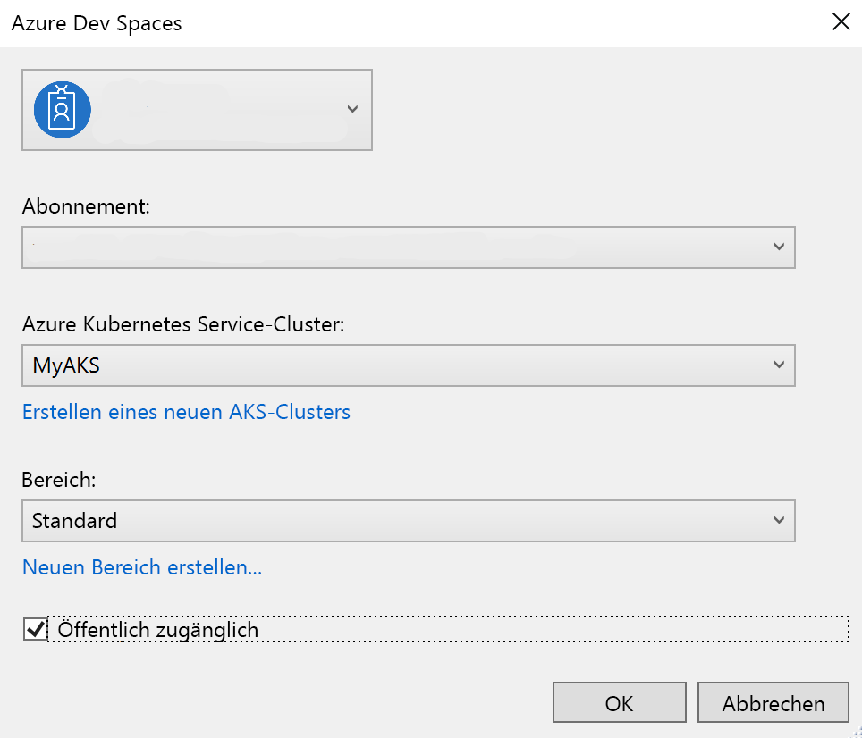

# <a name="create-a-kubernetes-dev-space-visual-studio-and-net-core-with-azure-dev-spaces"></a>Erstellen eines Kubernetes-Entwicklungsbereichs: Visual Studio und .NET Core mit Azure Dev Spaces

In diesem Leitfaden lernen Sie Folgendes:

- Einrichten von Azure Dev Spaces mit einem verwalteten Kubernetes-Cluster in Azure
- Iteratives Entwickeln von Code in Containern mit Visual Studio
- Unabhängiges Entwickeln von zwei separaten Diensten und Verwenden der DNS-Dienstermittlung von Kubernetes, um einen anderen Dienst aufzurufen
- Produktives Entwickeln und Testen Ihres Codes in einer Teamumgebung

> [!NOTE]
> **Sollten Sie einmal nicht weiterkommen**, lesen Sie den Abschnitt [Problembehandlung](troubleshooting.md).

## <a name="install-the-azure-cli"></a>Installieren der Azure CLI
Bei Azure Dev Spaces ist der Einrichtungsaufwand für die lokalen Computer minimal. Der Großteil der Konfiguration Ihres Entwicklungsbereichs wird in der Cloud gespeichert und kann gemeinsam mit anderen Benutzern genutzt werden. Laden Sie zunächst die [Azure-Befehlszeilenschnittstelle](/cli/azure/install-azure-cli?view=azure-cli-latest) (Command-Line Interface, CLI) herunter, und führen Sie sie aus.

### <a name="sign-in-to-azure-cli"></a>Anmelden bei der Azure-Befehlszeilenschnittstelle
Melden Sie sich bei Azure an. Geben Sie in einem Terminalfenster den folgenden Befehl ein:

```azurecli
az login
```

> [!NOTE]
> Falls Sie über kein Azure-Abonnement verfügen, können Sie ein [kostenloses Konto](https://azure.microsoft.com/free) erstellen.

#### <a name="if-you-have-multiple-azure-subscriptions"></a>Falls Sie über mehrere Azure-Abonnements verfügen...
Führen Sie zum Anzeigen Ihrer Abonnements Folgendes aus: 

```azurecli
az account list --output table
```

Suchen Sie nach dem Abonnement, bei dem *True* für *IsDefault* angegeben ist.
Handelt es sich dabei nicht um das Abonnement, das Sie verwenden möchten, können Sie das Standardabonnement wie folgt ändern:

```azurecli
az account set --subscription <subscription ID>
```

## <a name="create-a-kubernetes-cluster-enabled-for-azure-dev-spaces"></a>Erstellen eines Kubernetes-Clusters mit Aktivierung für Azure Dev Spaces

Erstellen Sie an der Eingabeaufforderung die Ressourcengruppe in einer [Region, die Azure Dev Spaces unterstützt][supported-regions].

```azurecli
az group create --name MyResourceGroup --location <region>
```

Erstellen Sie mit dem folgenden Befehl einen Kubernetes-Cluster:

```azurecli
az aks create -g MyResourceGroup -n MyAKS --location <region> --generate-ssh-keys
```

Die Erstellung des Clusters dauert einige Minuten.

### <a name="configure-your-aks-cluster-to-use-azure-dev-spaces"></a>Konfigurieren des AKS-Clusters zur Verwendung von Azure Dev Spaces

Geben Sie den folgenden Azure CLI-Befehl ein. Verwenden Sie dabei die Ressourcengruppe, die Ihren AKS-Cluster enthält, und den Namen des AKS-Clusters. Der Befehl konfiguriert Ihren Cluster mit Unterstützung für Azure Dev Spaces.

   ```azurecli
   az aks use-dev-spaces -g MyResourceGroup -n MyAKS
   ```
   
> [!IMPORTANT]
> Bei der Azure Dev Spaces-Konfiguration wird der Namespace `azds` im Cluster entfernt, sofern er vorhanden ist.

## <a name="get-the-visual-studio-tools"></a>Abrufen der Visual Studio-Tools
Installieren Sie die neueste Version von [Visual Studio 2019](https://www.visualstudio.com/vs/) unter Windows mit der Workload „Azure-Entwicklung“.

## <a name="create-a-web-app-running-in-a-container"></a>Erstellen einer Web-App, die in einem Container ausgeführt wird

In diesem Abschnitt erstellen Sie eine ASP.NET Core-Web-App und bereiten sie für die Ausführung in einem Container in Kubernetes vor.

### <a name="create-an-aspnet-web-app"></a>Erstellen einer ASP.NET-Web-App

Erstellen Sie in Visual Studio ein neues Projekt. Derzeit muss das Projekt eine **ASP.NET Core-Webanwendung** sein. Nennen Sie das Projekt **webfrontend**.


Wählen Sie die Vorlage **Webanwendung (Model-View-Controller)** aus, und legen Sie oben im Dialogfeld in den beiden Dropdownmenüs **.NET Core** und **ASP.NET Core 2.0** fest. Klicken Sie auf **OK**, um das Projekt zu erstellen.


### <a name="enable-dev-spaces-for-an-aks-cluster"></a>Aktivieren von Dev Spaces für einen AKS-Cluster

Wählen Sie für das soeben erstellte Projekt wie nachfolgend gezeigt im Dropdownmenü mit den Starteinstellungen die Option **Azure Dev Spaces**.


Vergewissern Sie sich im nächsten angezeigten Dialogfeld, dass Sie mit dem entsprechenden Konto angemeldet sind, und wählen Sie dann einen vorhandenen Kubernetes-Cluster aus.



Übernehmen Sie für die Dropdownliste **Space** (Bereich) vorerst den Standardwert `default`. Später erfahren Sie mehr über diese Option. Aktivieren Sie das Kontrollkästchen **Publicly Accessible** (Öffentlich zugänglich), damit auf die Web-App über einen öffentlichen Endpunkt zugegriffen werden kann. Diese Einstellung ist nicht erforderlich, ist aber später in dieser exemplarischen Vorgehensweise hilfreich für die Erläuterung einiger Konzepte. Aber keine Sorge: Sie können Ihre Website in beiden Fällen mit Visual Studio debuggen.


Klicken Sie auf **OK**, um den Cluster auszuwählen oder zu erstellen.

Wenn Sie einen Cluster auswählen, der nicht für die Verwendung mit Azure Dev Spaces vorbereitet wurde, wird eine Meldung mit der Frage angezeigt, ob Sie ihn konfigurieren möchten.


Klicken Sie auf **OK**.

> [!IMPORTANT]
> Bei der Azure Dev Spaces-Konfiguration wird der Namespace `azds` im Cluster entfernt, sofern er vorhanden ist.

 Dazu wird eine Hintergrundaufgabe gestartet. Diese nimmt einige Minuten in Anspruch. Um zu überprüfen, ob der Cluster noch erstellt wird, zeigen Sie mit der Maus unten links auf der Statusleiste auf das Symbol **Hintergrundaufgaben**, wie in der folgenden Abbildung gezeigt:


> [!NOTE]
> Sie können die Anwendung erst debuggen, wenn Ihr Entwicklungsbereich erstellt wurde.

### <a name="look-at-the-files-added-to-project"></a>Anzeigen der zum Projekt hinzugefügten Dateien
Während Sie auf die Erstellung des Entwicklungsbereichs warten, sehen Sie sich die Dateien an, die Ihrem Projekt hinzugefügt wurden, als Sie sich für die Verwendung eines Entwicklungsbereichs entschieden haben.

Sie sehen zuerst einen Ordner namens `charts`, der hinzugefügt wurde. In diesem Ordner wurde ein [Helm-Diagramm](https://docs.helm.sh) für Ihre Anwendung erstellt. Diese Dateien werden zum Bereitstellen der Anwendung im Entwicklungsbereich verwendet.

Sie sehen, dass die Datei `Dockerfile` hinzugefügt wurde. Diese Datei enthält Informationen, die zum Packen Ihrer Anwendung im Docker-Standardformat erforderlich sind.

Außerdem wurde die Datei `azds.yaml` hinzugefügt. Sie enthält die Konfiguration der Entwicklungszeit, die für den Entwicklungsbereich erforderlich ist.


## <a name="debug-a-container-in-kubernetes"></a>Debuggen eines Containers in Kubernetes
Wenn der Entwicklungsbereich erstellt wurde, können Sie die Anwendung debuggen. Legen Sie einen Breakpoint im Code fest, etwa in Zeile 20 in der Datei `HomeController.cs`, in der die Variable `Message` festgelegt wird. Drücken Sie **F5**, um das Debuggen zu starten. 

Visual Studio kommuniziert zum Erstellen und Bereitstellen der Anwendung mit dem Entwicklungsbereich und öffnet dann einen Browser mit der ausgeführten Web-App. Es sieht unter Umständen so aus, als würde der Container lokal ausgeführt, tatsächlich wird er jedoch im Entwicklungsbereich in Azure ausgeführt. Die localhost-Adresse wird verwendet, da Azure Dev Spaces einen temporären SSH-Tunnel zu dem in AKS ausgeführten Container erstellt.

Klicken Sie oben auf der Seite auf den Link **Info**, um den Breakpoint auszulösen. Sie besitzen wie bei der lokalen Ausführung des Codes Vollzugriff auf Debuginformationen, etwa Aufrufliste, lokale Variablen, Ausnahmeinformationen usw.

## <a name="iteratively-develop-code"></a>Iteratives Entwickeln von Code

Bei Azure Dev Spaces geht es nicht nur um die Ausführung von Code in Kubernetes: Mit diesem Dienst sollen Codeänderungen in einer Kubernetes-Umgebung in der Cloud schnell und iterativ sichtbar gemacht werden.

### <a name="update-a-content-file"></a>Aktualisieren einer Inhaltsdatei


1. Navigieren Sie zur Datei `./Views/Home/Index.cshtml`, und ändern Sie die HTML. Beispiel: Ändern Sie [Zeile 73 mit dem Inhalt `<h2>Application uses</h2>`](https://github.com/Azure/dev-spaces/blob/master/samples/dotnetcore/getting-started/webfrontend/Views/Home/Index.cshtml#L73) wie folgt: 
  
    ```html
    <h2>Hello k8s in Azure!</h2>`
    ```

2. Speichern Sie die Datei .
3. Aktualisieren Sie die Anzeige im Browser. Daraufhin sollte auf der Webseite die aktualisierte HTML angezeigt werden.

Was ist passiert? Für Änderungen an Inhaltsdateien (z.B. HTML und CSS) ist keine erneute Kompilierung in einer .NET Core-Web-App erforderlich. Eine aktive F5-Sitzung synchronisiert daher automatisch alle geänderten Inhaltsdateien im ausgeführten Container in AKS, sodass alle Inhaltsänderungen direkt angezeigt werden.

### <a name="update-a-code-file"></a>Aktualisieren einer Codedatei
Die Aktualisierung von Codedateien ist etwas aufwendiger, da eine .NET Core-App aktualisierte Anwendungsbinärdateien neu erstellen und generieren muss.

1. Beenden Sie den Debugger in Visual Studio.
1. Öffnen Sie die Codedatei mit dem Namen `Controllers/HomeController.cs`, und bearbeiten Sie die Nachricht, die auf der Seite „Info“ angezeigt wird: `ViewData["Message"] = "Your application description page.";`.
1. Speichern Sie die Datei .
1. Drücken Sie **F5**, um das Debuggen wieder zu starten. 

Das Neuerstellen und erneute Bereitstellen eines neuen Containerimages bei jeder vorgenommenen Codeänderung kann geraume Zeit in Anspruch nehmen. Daher kompiliert Azure Dev Spaces Code im vorhandenen Container inkrementell, um den Bearbeitungs-/Debugging-Kreislauf zu beschleunigen.

Aktualisieren Sie die Web-App im Browser, und wechseln Sie zur Seite „Info“. Daraufhin sollte Ihre benutzerdefinierte Meldung auf der Benutzeroberfläche angezeigt werden.

## <a name="next-steps"></a>Nächste Schritte

> [!div class="nextstepaction"]
> [Informationen zur Entwicklung mit mehreren Diensten](multi-service-netcore-visualstudio.md)


[supported-regions]: https://azure.microsoft.com/global-infrastructure/services/?products=kubernetes-service